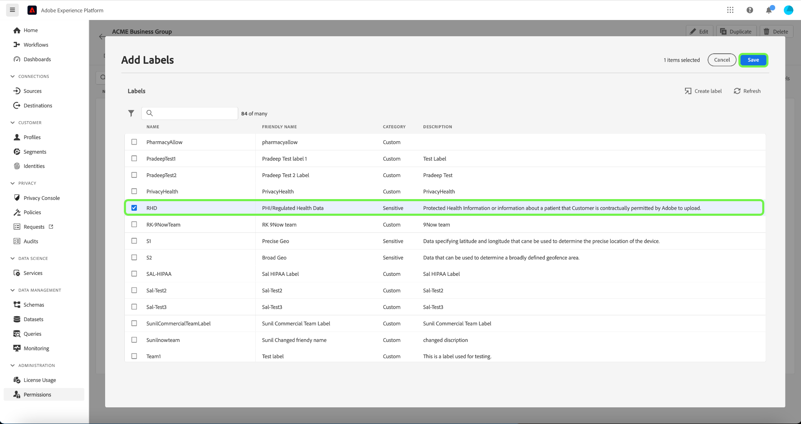

# Attributbaserad åtkomstkontroll från början till slut

Använd attributbaserad åtkomstkontroll på Adobe Experience Platform för att ge dig själv och andra kunder som är medvetna om flervarumärkets integritet större flexibilitet när det gäller att hantera användarnas åtkomst. Åtkomst till enskilda objekt, som schemafält och målgrupper, kan beviljas med profiler som baseras på objektets attribut och roll. Med den här funktionen kan du bevilja eller återkalla åtkomst till enskilda objekt för specifika Experience Platform-användare i organisationen.

Med den här funktionen kan du kategorisera schemafält, målgrupper och så vidare med etiketter som definierar användningsområde för organisation eller data. Du kan använda samma etiketter på resor, erbjudanden och andra objekt i Adobe Journey Optimizer. Samtidigt kan administratörer definiera åtkomstprinciper runt XDM-schemafält (Experience Data Model) och bättre hantera vilka användare och grupper (interna, externa eller externa användare) som har åtkomst till dessa fält.

>[!NOTE]
>
>Det här dokumentet fokuserar på användningen av åtkomstkontrollprinciper. Om du försöker konfigurera principer som styr **användningen** av data i stället för vilka Experience Platform-användare har åtkomst till dem läser du i handboken från början till slut om [datastyrning](../../data-governance/e2e.md) i stället.

## Komma igång

Den här självstudiekursen kräver en fungerande förståelse av följande Experience Platform-komponenter:

* [[!DNL Experience Data Model (XDM)] System](../../xdm/home.md): Det standardiserade ramverk som Experience Platform använder för att ordna kundupplevelsedata.
   * [Grundläggande om schemakomposition](../../xdm/schema/composition.md): Lär dig mer om grundstenarna i XDM-scheman, inklusive nyckelprinciper och bästa metoder för schemakomposition.
   * [Schemaredigeraren, självstudiekurs](../../xdm/tutorials/create-schema-ui.md): Lär dig hur du skapar anpassade scheman med hjälp av gränssnittet för Schemaredigeraren.
* [Adobe Experience Platform segmenteringstjänst](../../segmentation/home.md): Segmenteringsmotorn i [!DNL Experience Platform] som används för att skapa målgruppssegment utifrån kundprofiler utifrån kundbeteenden och attribut.

### Använd ärendeöversikt

Du kommer att gå igenom ett exempel på ett attributbaserat arbetsflöde för åtkomstkontroll där du kan skapa och tilldela roller, etiketter och profiler för att konfigurera om användarna kan eller inte kan komma åt specifika resurser i organisationen. I den här handboken används ett exempel på hur åtkomsten till känsliga data begränsas för att demonstrera arbetsflödet. Det här användningsexemplet beskrivs nedan:

Du är vårdgivare och vill konfigurera åtkomst till resurser i din organisation.

* Ditt interna marknadsföringsteam bör kunna komma åt **[!UICONTROL PHI/ Regulated Health Data]**-data.
* Din externa myndighet bör inte kunna komma åt **[!UICONTROL PHI/ Regulated Health Data]**-data.

För att kunna göra detta måste du konfigurera roller, resurser och principer.

Du kommer att:

* [Ange en etikett för rollerna för dina användare](#label-roles): Använd exemplet med en vårdleverantör (ACME Business Group) vars marknadsföringsgrupp fungerar med externa byråer.
* [Etikettera dina resurser (schemafält och målgrupper)](#label-resources): Tilldela etiketten **[!UICONTROL PHI/ Regulated Health Data]** till schemaresurser och målgrupper.
* [Aktivera principen som länkar ihop dem](#policy): Aktivera standardprincipen för att förhindra åtkomst till schemafält och målgrupper genom att ansluta etiketterna på dina resurser till etiketterna i din roll. Användare med matchande etiketter får sedan tillgång till schemafältet och segmentet i alla sandlådor.

## Behörigheter

[!UICONTROL Permissions] är det område i Experience Cloud där administratörer kan definiera användarroller och profiler för att hantera behörigheter för funktioner och objekt i ett produktprogram.

Genom [!UICONTROL Permissions] kan du skapa och hantera roller och tilldela önskade resursbehörigheter för dessa roller. I [!UICONTROL Permissions] kan du även hantera etiketter, sandlådor och användare som är associerade med en viss roll.

Kontakta systemadministratören för att få åtkomst om du inte har administratörsbehörighet.

När du har administratörsbehörighet går du till [Adobe Experience Cloud](https://experience.adobe.com/) och loggar in med dina Adobe-autentiseringsuppgifter. När du är inloggad visas sidan **[!UICONTROL Overview]** för din organisation som du har administratörsbehörighet för. På den här sidan visas vilka produkter din organisation prenumererar på, tillsammans med andra kontroller för att lägga till användare och administratörer i organisationen. Välj **[!UICONTROL Permissions]** om du vill öppna arbetsytan för din Experience Platform-integrering.

Arbetsytan Behörigheter för Experience Platform-gränssnittet visas och öppnas på sidan **[!UICONTROL Overview]**.

## Använd etiketter för en roll {#label-roles}

>[!CONTEXTUALHELP]
>id="platform_permissions_labels_about"
>title="Vad är etiketter?"
>abstract="Använd etiketter för att kategorisera datauppsättningar och fält utifrån de användnings- och åtkomstprinciper som gäller för dessa data. Adobe Experience Platform tillhandahåller flera Adobe-definierade <strong>core</strong>-etiketter för dataanvändning, som omfattar ett brett urval av vanliga begränsningar för datastyrning. Känsliga <strong>S</strong>-etiketter som RHD (Regulated Health Data) kan till exempel användas för att kategorisera data som refererar till Skyddad hälsoinformation (PHI). Du kan också definiera egna etiketter som passar organisationens behov."
>additional-url="https://experienceleague.adobe.com/docs/experience-platform/data-governance/labels/overview.html?lang=sv-SE#understanding-data-usage-labels" text="Översikt över etiketter för dataanvändning"

Roller är sätt att kategorisera de typer av användare som interagerar med din Experience Platform-instans och är byggstenar i åtkomstkontrollprinciper. En roll har en given uppsättning behörigheter, och medlemmar i organisationen kan tilldelas till en eller flera roller, beroende på vilken typ av åtkomst de behöver.

Om du vill komma igång väljer du **[!UICONTROL Roles]** i den vänstra navigeringen och sedan **[!UICONTROL ACME Business Group]**.

Välj sedan **[!UICONTROL Labels]** och sedan **[!UICONTROL Add Labels]**.

En lista över alla etiketter i organisationen visas. Välj **[!UICONTROL RHD]** om du vill lägga till etiketten för **[!UICONTROL PHI/Regulated Health Data]** och välj sedan **[!UICONTROL Save]**.

>[!NOTE]
>
>När du lägger till en organisationsgrupp i en roll läggs alla användare i gruppen till i rollen. Alla ändringar i organisationsgruppen (användare som har tagits bort eller lagts till) uppdateras automatiskt i rollen.

## Tillämpa etiketter på schemafält {#label-resources}

Nu när du har konfigurerat en användarroll med etiketten [!UICONTROL RHD] är nästa steg att lägga till samma etikett till resurserna som du vill styra för den rollen.

I den övre navigeringen väljer du **programväljaren**, som representeras av ikonen  och sedan **[!UICONTROL Experience Platform]**.

Välj **[!UICONTROL Schemas]** i den vänstra navigeringen och välj sedan **[!UICONTROL ACME Healthcare]** i listan med scheman som visas.

Välj sedan **[!UICONTROL Labels]** om du vill se en lista med de fält som är associerade med ditt schema. Härifrån kan du tilldela etiketter till ett eller flera fält samtidigt. Markera fälten **[!UICONTROL BloodGlucose]** och **[!UICONTROL InsulinLevel]** och välj sedan **[!UICONTROL Apply access and data governance labels]**.

Dialogrutan **[!UICONTROL Edit labels]** visas, där du kan välja etiketter som du vill använda för schemafälten. I det här fallet väljer du etiketten **[!UICONTROL PHI/ Regulated Health Data]** och sedan **[!UICONTROL Save]**.

>[!NOTE]
>
>När en etikett läggs till i ett fält används den etiketten på den överordnade resursen för det fältet (antingen en klass eller en fältgrupp). Om den överordnade klassen eller fältgruppen används av andra scheman ärver dessa scheman samma etikett.

## Tillämpa etiketter på målgrupper

>[!NOTE]
>
>Alla målgrupper som använder ett etiketterat attribut måste också märkas om du vill att samma åtkomstbegränsningar ska gälla för det.

När du har etiketterat schemafälten kan du nu börja märka målgrupperna.

Välj **[!UICONTROL Audiences]** i den vänstra navigeringen under avsnittet **[!UICONTROL Customers]**. En lista över tillgängliga målgrupper i din organisation visas. I det här exemplet ska följande två målgrupper märkas som om de innehåller känsliga hälsodata:

* Blodglukos >100
* Insulin &lt;50

Välj **[!UICONTROL Blood Glucose >100]** (efter målgruppens namn, inte kryssrutan) för att börja märka målgruppen.

Skärmen för segmentet **[!UICONTROL Details]** visas. Välj **[!UICONTROL Manage Access]**.

Dialogrutan **[!UICONTROL Apply access and data governance labels]** visas så att du kan välja vilka etiketter du vill använda för målgruppen. I det här fallet väljer du etiketten **[!UICONTROL PHI/ Regulated Health Data]** och sedan **[!UICONTROL Save]**.

Upprepa stegen ovan med **[!UICONTROL Insulin <50]**.

>[!NOTE]
>
> Tilldela etiketter som skapats på arbetsytan [!UICONTROL Permissions] (till exempel segmentetiketter ovan) till olika objekt i Adobe Journey Optimizer med [Åtkomstkontroll på objektnivå](https://experienceleague.adobe.com/sv/docs/journey-optimizer/using/access-control/object-based-access).&quot;

## Aktivera åtkomstkontrollprincipen {#policy}

Standardprincipen för åtkomstkontroll använder etiketter för att definiera vilka användarroller som har åtkomst till specifika Experience Platform-resurser. I det här exemplet nekas åtkomst till schemafält och målgrupper i alla sandlådor för användare som inte är i en roll som har motsvarande etiketter i schemafältet.

Om du vill aktivera åtkomstkontrollprincipen väljer du [!UICONTROL Permissions] i den vänstra navigeringen och sedan **[!UICONTROL Policies]**.

Därefter markerar du ellipsen (`...`) bredvid **[!UICONTROL Default-Field-Level-Access-Control-Policy]**, och i en listruta visas kontroller för att redigera, aktivera, ta bort eller duplicera rollen. Välj **[!UICONTROL Activate]** i listrutan.

Dialogrutan för aktiveringspolicy visas. Där uppmanas du att bekräfta aktiveringen. Välj **[!UICONTROL Confirm]**.

Bekräftelse av principaktivering har tagits emot och du återgår till sidan [!UICONTROL Policies].

<!-- ## Create an access control policy {#policy}

>[!CONTEXTUALHELP]
>id="platform_permissions_policies_about"
>title="What are policies?"
>abstract="Policies are statements that bring attributes together to establish permissible and impermissible actions. Every organization comes with a default policy that you must activate to define rules for resources like segments and schema fields. Default policies can neither be edited nor deleted. However, default policies can be activated or deactivated."
>additional-url="https://experienceleague.adobe.com/docs/experience-platform/access-control/abac/permissions-ui/policies.html?lang=sv-SE" text="Manage policies"

>[!CONTEXTUALHELP]
>id="platform_permissions_policies_about_create"
>title="Create a policy"
>abstract="Create a policy to define the actions that your users can and cannot take against your segments and schema fields."
>additional-url="https://experienceleague.adobe.com/docs/experience-platform/access-control/abac/permissions-ui/policies.html?lang=sv-SE#create-a-new-policy" text="Create a policy"

>[!CONTEXTUALHELP]
>id="platform_permissions_policies_edit_permitdeny"
>title="Configure permissible and impermissible actions for a policy"
>abstract="A <b>deny access to</b> policy will deny users access when the criteria is met. Combined with <b>The following being false</b> - all users will be denied access unless they meet the matching criteria set. This type of policy allows you to protect a sensitive resource and only allow access to users with matching labels.  A <b>permit access to</b> policy will permit users access when the criteria are met. When combined with <b>The following being true</b> - users will be given access if they meet the matching criteria set. This does not explicitly deny access to users, but adds a permit access. This type of policy allows you to give additional access to resource and in addition to those users who might already have access through role permissions."
>additional-url="https://experienceleague.adobe.com/docs/experience-platform/access-control/abac/permissions-ui/policies.html?lang=sv-SE#edit-a-policy" text="Edit a policy"

>[!CONTEXTUALHELP]
>id="platform_permissions_policies_edit_resource"
>title="Configure permissions for a resource"
>abstract="A resource is the asset or object that a user can or cannot access. Resources can be segments or schemas fields. You can configure write, read, or delete permissions for segments and schema fields."

>[!CONTEXTUALHELP]
>id="platform_permissions_policies_edit_condition"
>title="Edit conditions"
>abstract="Apply conditional statements to your policy to configure user access to certain resources. Select match all to require users to have roles with the same labels as a resource to be permitted access. Select match any to require users to have a role with just one label matching a label on a resource. Labels can either be defined as core or custom labels, with core labels representing labels created and provided by Adobe and custom labels representing labels that you created for your organization."

Access control policies leverage labels to define which user roles have access to specific Experience Platform resources. Policies can either be local or global and can override other policies. In this example, access to schema fields and segments will be denied in all sandboxes for users who don't have the corresponding labels in the schema field.

>[!NOTE]
>
>A "deny policy" is created to grant access to sensitive resources because the role grants permission to the subjects. The written policy in this example **denies** you access if you are missing the required labels.
a
To create an access control policy, select **[!UICONTROL Permissions]** from the left navigation and then select **[!UICONTROL Policies]**. Next, select **[!UICONTROL Create policy]**.

The **[!UICONTROL Create new policy]** dialog appears, prompting you to enter a name and an optional description. Select **[!UICONTROL Confirm]** when finished.

To deny access to the schema fields, use the dropdown arrow and select **[!UICONTROL Deny access to]** and then select **[!UICONTROL No resource selected]**. Next, select **[!UICONTROL Schema Field]** and then select **[!UICONTROL All]**.

The table below shows the conditions available when creating a policy:

| Conditions | Description |
| --- | --- |
| The following being false| When 'Deny access to' is set, access will be restricted if the user does not meet the criteria selected. |
| The following being true| When 'Permit access to' is set, access will be permitted if the user meets the selected criteria. |
| Matches any| The user has a label that matches any label applied to a resource. |
| Matches all| The user has all labels that matches all labels applied to a resource. |
| Core label| A core label is an Adobe-defined label that is available in all Experience Platform instances.|
| Custom label| A custom label is a label that has been created by your organization.|

Select **[!UICONTROL The following being false]** and then select **[!UICONTROL No attribute selected]**. Next, select the user **[!UICONTROL Core label]**, then select **[!UICONTROL Matches all]**. Select the resource **[!UICONTROL Core label]** and finally select **[!UICONTROL Add resource]**.

>[!TIP]
>
>A resource is the asset or object that a subject can or cannot access. Resources can be segments or schemas.

To deny access to the segments, use the dropdown arrow and select **[!UICONTROL Deny access to]** and then select **[!UICONTROL No resource selected]**. Next, select **[!UICONTROL Segment]** and then select **[!UICONTROL All]**.

Select **[!UICONTROL The following being false]** and then select **[!UICONTROL No attribute selected]**. Next, select the user **[!UICONTROL Core label]**, then select **[!UICONTROL Matches all]**. Select the resource **[!UICONTROL Core label]** and finally select **[!UICONTROL Save]**.

Select **[!UICONTROL Activate]** to activate the policy, and a dialog appears which prompts you to confirm activation. Select **[!UICONTROL Confirm]** and then select **[!UICONTROL Close]**.

 -->

## Nästa steg

Du har slutfört användningen av etiketter för en roll, schemafält och målgrupper. Den externa byrå som tilldelats de här rollerna är begränsad från att visa dessa etiketter och deras värden i schemat, datauppsättningen och profilvyn. Dessa fält är också begränsade från att användas i segmentdefinitionen när segmentbyggaren används.

Mer information om attributbaserad åtkomstkontroll finns i [Översikt över attributbaserad åtkomstkontroll](./overview.md).

Följande video är avsedd att ge stöd för din förståelse av attributbaserad åtkomstkontroll och visar hur du konfigurerar roller, resurser och principer.

>[!VIDEO](https://video.tv.adobe.com/v/3451833?learn=on&captions=swe)
