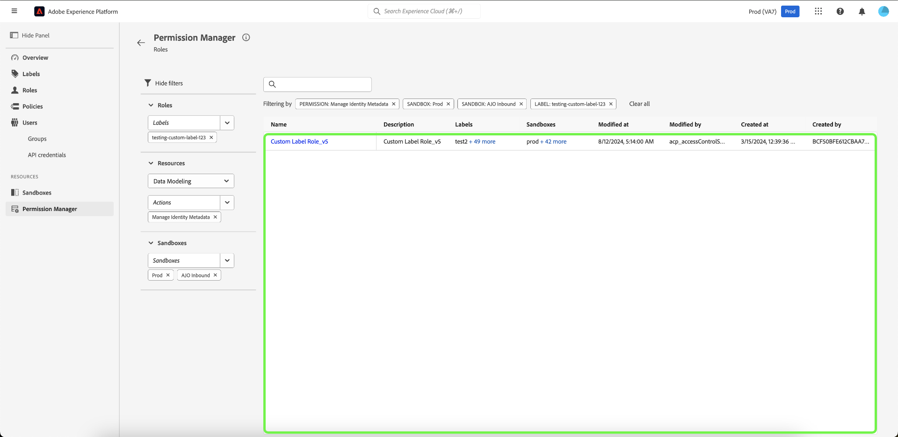

# Behörighetshanteraren

>[!NOTE]
>
>Du måste vara produktadministratör för att få åtkomst till [!UICONTROL Permission Manager]. Om du inte har administratörsbehörighet kontaktar du systemadministratören för att få åtkomst.

Använd enkla frågor i [!UICONTROL Permission Manager] för att skapa koncisa rapporter som hjälper dig att förstå åtkomsthantering och spara tid när du validerar åtkomstbehörigheter i många arbetsflöden och detaljnivåer. Du kan använda [!UICONTROL Permission Manager] för att hitta användare som tillhör en användargrupp och har angivna åtkomstbehörigheter, samt roller som har specifika etiketter.

## Sök efter användare i en angiven användargrupp {#search-users}

>[!CONTEXTUALHELP]
>id="platform_permission_manager"
>title="Behörighetshanteraren"
>abstract="Använd listruteväljarna på sidan för att få åtkomst till nivårapporter med olika granularitetsnivåer för användare och roller."
<!-- >additional-url="https://experienceleague.adobe.com/docs/experience-platform/access-control/abac/permissions-manager/permissions.html" text="Permission manager" -->

Välj attributet **[!UICONTROL Users]** i listrutan.

Välj sedan den **[!UICONTROL User Group]** som du vill söka efter i listrutan.

>[!INFO]
>
>[!UICONTROL User Group] är inte ett obligatoriskt fält. Du kan bara välja en användargrupp för varje rapport.

För en mer detaljerad rapport kan du ange resursen med åtgärder i en viss sandlåda. Markera **[!UICONTROL Resource]**, **[!UICONTROL Actions]** och **[!UICONTROL Sandboxes]** i listrutan och välj sedan **[!UICONTROL Show Results]**.

>[!INFO]
>
>[!UICONTROL Resource], [!UICONTROL Actions] och [!UICONTROL Sandboxes] är inte obligatoriska fält. En åtgärd eller sandlåda kan tas bort när den har lagts till genom att markera **&#39;x&#39;** bredvid den markering du vill ta bort.

En lista över användare och deras e-postadress rapporteras baserat på de valda kriterierna. Använd filtermenyn till vänster för att uppdatera attributen och resultaten. Om du vill ha mer information om en viss användare väljer du användarnamnet i listan.

## Sök efter roller med specifika etiketter {#search-roles}

Välj attributet **[!UICONTROL Roles]** i listrutan.

>[!INFO]
>
>[!UICONTROL Labels] är inte ett obligatoriskt fält. Du kan välja flera etiketter som visas under den här listrutan när du har valt dem. Du kan ta bort en etikett när du väl har lagt till den genom att välja **&#39;x&#39;** bredvid åtgärden.

Välj sedan den **[!UICONTROL Labels]** som du vill söka efter i listrutan.

För en mer detaljerad rapport kan du ange resursen med åtgärder i en viss sandlåda. Markera **[!UICONTROL Resource]**, **[!UICONTROL Actions]** och **[!UICONTROL Sandboxes]** i listrutan och välj sedan **[!UICONTROL Show Results]**.

>[!INFO]
>
>[!UICONTROL Resource], [!UICONTROL Actions] och [!UICONTROL Sandboxes] är inte obligatoriska fält. Endast en [!UICONTROL Resource] kan väljas för varje rapport. En åtgärd eller sandlåda kan tas bort när den har lagts till genom att markera **&#39;x&#39;** bredvid den markering du vill ta bort.

En lista över roller rapporteras baserat på de valda kriterierna. Använd filtermenyn till vänster för att uppdatera attributen och resultaten. Om du vill ha mer information om en viss roll väljer du rollen i listan.

Följande information visas för varje roll som matchar dina villkor:

| Attribut | Beskrivning |
| --- | --- |
| Beskrivning | En kort beskrivning av rollen. |
| Etiketter | En lista med etiketter som är associerade med rollen. |
| Sandlådor | En lista med Sanboxes som innehåller den här rollen. |
| Ändrad den | Datum och tidsstämpel för när rollen senast uppdaterades. |
| Skapad den | Datum och tidsstämpel för när rollen skapades. |
| Skapad av | Information om rollens skapare. |

## Nästa steg

Du har nu lärt dig hur du skapar rapporter för användare och roller. Mer information om attributbaserad åtkomstkontroll finns i [attributbaserad åtkomstkontroll](../overview.md).
