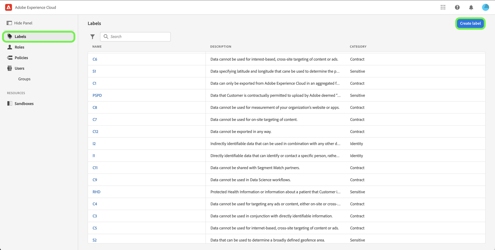

# Hantera etiketter

>[!NOTE]
>
>Om du vill skapa eller visa beräknade attribut med fält som innehåller en viss etikett måste du ha tillgång till den etiketten.

Med etiketter kan du kategorisera datauppsättningar och fält utifrån de användnings- och åtkomstprinciper som gäller för dessa data. Etiketter kan användas när som helst, vilket ger flexibilitet i hur du väljer att styra data. Bästa praxis uppmuntrar till etikettdata så snart de har importerats till Platform, eller så snart data blir tillgängliga för användning i Platform.

## Skapa en ny etikett {#create-new-label}

>[!CONTEXTUALHELP]
>id="platform_abac_labelusage"
>title="Användning av etiketter"
>abstract="Du kan använda anpassade etiketter för att använda datastyrning och åtkomstkontrollskonfigurationer på dina data."

>[!CONTEXTUALHELP]
>id="platform_permissions_labels_about_create"
>title="Skapa ny etikett"
>abstract="Du kan skapa egna etiketter som passar organisationens behov. Anpassade etiketter kan användas för att tillämpa både datastyrning och åtkomstkontrollskonfigurationer på dina data."
>additional-url="https://experienceleague.adobe.com/docs/experience-platform/data-governance/labels/overview.html#manage-labels" text="Hantera anpassade etiketter"

>[!NOTE]
>
>Det finns en enda lista med etiketter för en hel organisation. Om du vill skapa en anpassad etikett måste du ha **[!UICONTROL Manage Usage Labels]** behörigheter i produktionssandlådan. Etikettborttagning stöds för närvarande inte.

Om du vill skapa en ny etikett väljer du fliken **[!UICONTROL Labels]** i sidofältet och väljer **[!UICONTROL Create Label]**.

Dialogrutan **[!UICONTROL Create a new label]** visas och du uppmanas att ange ett namn, ett valfritt eget namn och en valfri beskrivning.

När du är klar väljer du **[!UICONTROL Confirm]**.
