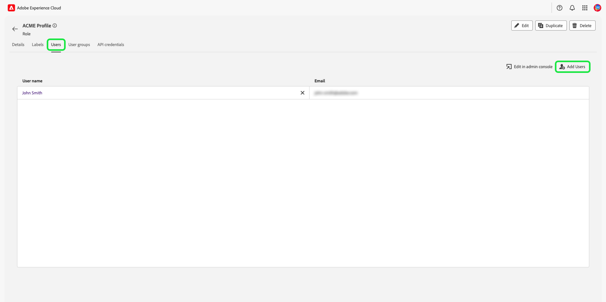
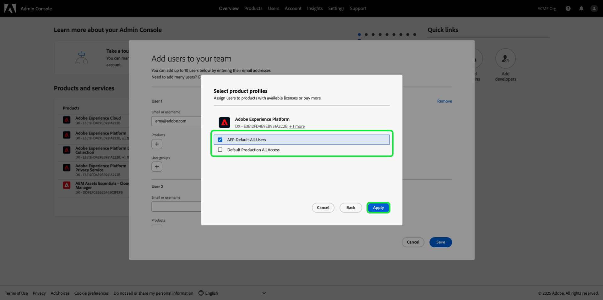
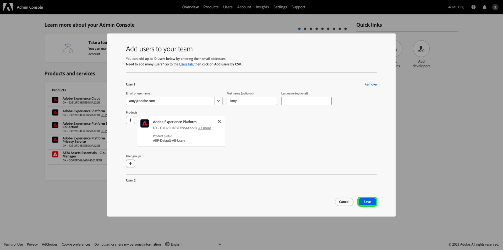

# Hantera behörigheter för en roll

>[!IMPORTANT]
>
>Åtkomstkontrollen använder användar-ID (ett internt unikt ID som tilldelats en användare) för att bevilja behörigheter. När en organisation migreras från Adobe ID till Business ID, kommer alla behörigheter som angetts för dess användare att gå förlorade eftersom användar-ID ändras och åtkomstkontrollen kommer att använda det nyligen genererade användar-ID:t. Om din organisation migreras till ditt företags-ID kontaktar du din Adobe-representant för att migrera ditt användar-ID från Adobe ID till ditt företags-ID.

Behörigheter är det område i Experience Cloud där administratörer kan definiera användarroller och åtkomstprinciper för att hantera åtkomstbehörigheter för funktioner och objekt i ett produktprogram.

Genom Behörigheter kan du skapa och hantera roller samt tilldela önskade resursbehörigheter för dessa roller. Med behörigheter kan du också hantera etiketter, sandlådor och användare som är kopplade till en viss roll.

Omedelbart efter [att du har skapat en ny roll](#create-a-new-role) återgår du till fliken **[!UICONTROL Roles]**. Om du redigerar behörigheter för en befintlig roll väljer du rollen på fliken **[!UICONTROL Roles]**. Du kan också använda filteralternativet för att filtrera resultaten för att hitta en roll.

## Filtrera roller

Markera trattikonen () om du vill visa en lista med filterkontroller för att begränsa resultatet.

Följande filter är tillgängliga för roller i användargränssnittet:

| Filter | Beskrivning |
| --- | --- |
| [!UICONTROL Created between] | Välj ett startdatum och/eller ett slutdatum för att definiera ett datumintervall som resultaten ska filtreras efter. |
| [!UICONTROL Created by] | Filtrera efter rollskapare genom att välja en användare i listrutan. |
| [!UICONTROL Modified between] | Välj ett startdatum och/eller ett slutdatum för att definiera ett datumintervall som resultaten ska filtreras efter. |
| [!UICONTROL Modified by] | Filtrera efter rollmodifierare genom att välja en användare i listrutan. |

Om du vill ta bort ett filter väljer du X på ikonen för piller för filtret i fråga eller väljer **[!UICONTROL Clear all]** om du vill ta bort alla filter.

## Rollinformation

Välj rollen på fliken **[!UICONTROL Roles]** som öppnar rollens [!UICONTROL Details]-kontrollpanel.

Kontrollpanelen [!UICONTROL Details] ger en översikt över rollen. I översikten visas rollnamn, beskrivning, skapare och senaste modifierare samt datum för skapande och ändring. Den visar även behörigheter som är kopplade till rollen och listan över tilldelade sandlådor. Rollnamnet och beskrivningen kan ändras om det behövs.

## Hantera etiketter för en roll

Välj fliken **[!UICONTROL Labels]** för att öppna arbetsytan för rolletiketter och välj sedan **[!UICONTROL Add labels]** för att tilldela etiketter till rollen.

Dialogrutan **[!UICONTROL Apply Access and Data Governance Labels]** visas med en lista över etiketter. I listan visas etikettnamn, eget namn, kategori och beskrivning.

Markera etiketterna i listan som du vill lägga till i rollen och välj sedan **[!UICONTROL Save]**

Tillagda etiketter visas under fliken **[!UICONTROL Labels]**.

Om du vill ta bort en etikett från en roll markerar du etiketten och väljer sedan **[!UICONTROL Remove Labels]**.

## Hantera sandlådor för en roll

Välj fliken **[!UICONTROL Details]** och gå till avsnittet **[!UICONTROL Sandboxes]**. Välj **[!UICONTROL View All]** om du vill visa den fullständiga listan över sandlådor som har lagts till i rollen.

Om du vill lägga till fler sandlådor i en roll väljer du **[!UICONTROL Edit]** i det övre högra hörnet av användargränssnittet.

På nästa skärm får du en uppmaning om att välja vilka sandlåderesurser som ska inkluderas i rollen med hjälp av listrutan. När du är klar väljer du **[!UICONTROL Save]** och sedan **[!UICONTROL Close]**.

## Hantera användare för en roll

Välj fliken **[!UICONTROL Users]** för att öppna arbetsytan för roller [!UICONTROL Users] och välj sedan **[!UICONTROL Add Users]** för att tilldela användare till rollen.

Dialogrutan **[!UICONTROL Add Users]** visas. Välj de användare i listan som du vill lägga till i rollen. Du kan också använda sökfältet för att söka efter användaren genom att ange namn eller e-postadress och sedan välja **[!UICONTROL Save]**

Tillagda användare visas på fliken **[!UICONTROL Users]**.

Om du vill ta bort en användare från en roll väljer du ikonen **X** bredvid användarens namn.

Följande video är tänkt att ge stöd för din förståelse för att skapa en ny roll och hantera användare för den rollen.

>[!VIDEO](https://video.tv.adobe.com/v/336081/?learn=on)

## Hantera API-autentiseringsuppgifter för en roll {#manage-api-credentials-for-role}

>[!IMPORTANT]
>
> Om du vill använda och hantera API-autentiseringsuppgifter i [!UICONTROL Permissions] måste användarna ha systemadministratörsbehörighet.

Om du vill använda Experience Platform API:er som användare eller utvecklare måste en systemadministratör lägga till API-autentiseringsuppgifter utöver en rolls angivna behörighetsuppsättning. En fullständig guide om hur du skapar och tilldelar API-autentiseringsuppgifter samt de behörigheter som behövs finns i den stegvisa självstudiekursen i [autentisera och få åtkomst till Experience Platform API:er](../../../landing/api-authentication.md#generate-credentials).

Välj fliken **[!UICONTROL API credentials]** för att öppna arbetsytan för roller-API-autentiseringsuppgifter och välj sedan **[!UICONTROL Add API credentials]** för att tilldela API-autentiseringsuppgifter till rollen.

Dialogrutan **[!UICONTROL Add API credentials]** visas. Välj API-autentiseringsuppgifter från listan som ska läggas till i rollen och välj sedan **[!UICONTROL Save]**

Tillagda API-autentiseringsuppgifter visas på fliken **[!UICONTROL API credentials]**.

Om du vill ta bort en API-autentiseringsuppgift från en roll väljer du ikonen **X** bredvid API-autentiseringsuppgiftens namn.

Dialogrutan **[!UICONTROL Remove API credentials]** visas och du uppmanas att bekräfta borttagningen. Välj **[!UICONTROL Confirm]** om du vill ta bort de markerade autentiseringsuppgifterna.

Du återgår till fliken **[!UICONTROL API credentials]**.

## Hantera användargrupper för en roll

Användargrupper är flera användare som har grupperats tillsammans och har tillgång till samma funktioner.

Välj fliken **[!UICONTROL User groups]** för att öppna rollens arbetsyta för användargrupper och välj sedan **[!UICONTROL Add Groups]** för att tilldela användargrupper till rollen.

Dialogrutan **[!UICONTROL Add Groups]** visas. Markera användargrupperna i listan som du vill lägga till i rollen. Du kan också använda sökfältet för att söka efter användargruppen genom att ange namnet på gruppen och sedan välja **[!UICONTROL Save]**

Den tillagda användargruppen visas under fliken **[!UICONTROL User groups]**.

Om du vill ta bort en användargrupp från en roll väljer du ikonen **X** bredvid användargruppens namn.

Dialogrutan **[!UICONTROL Remove user group]** visas och du uppmanas att bekräfta borttagningen. Välj **[!UICONTROL Confirm]** om du vill ta bort den valda användargruppen.

Du återgår till fliken **[!UICONTROL User groups]**.

## Lägg till användare i Experience Platform

Som systemadministratör kan du ge utvecklare åtkomst till en användare så att de kan [skapa integreringar](../../../landing/api-authentication.md#generate-credentials) i Adobe Developer Console.

Om du vill lägga till en användare Experience Platform loggar du in på [Admin Console](https://adminconsole.adobe.com) och väljer **[!UICONTROL Add users]**.

Dialogrutan **[!UICONTROL Add users to your team]** visas. Ange användarens e-postadress, förnamn (valfritt) och efternamn (valfritt). Välj sedan **[!UICONTROL Products]**.

Dialogrutan **[!UICONTROL Select products]** visas. Välj **[!UICONTROL Adobe Experience Platform]**.

Dialogrutan **[!UICONTROL Select product profiles]** visas. Välj **[!UICONTROL AEP-Default-All-Users]** och sedan **[!UICONTROL Save]**.

Granska informationen och välj sedan **[!UICONTROL Save]** för att lägga till användaren.

## Nästa steg

Med behörigheter upprättade kan du fortsätta till nästa steg för att [hantera användare](users.md).
