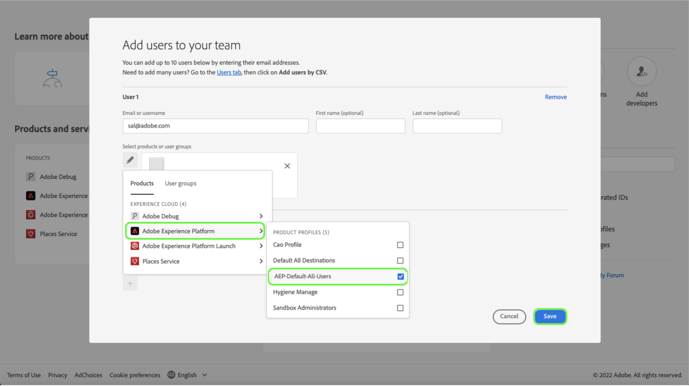

# Hantera behörigheter för en roll

>[!IMPORTANT]
>
>Åtkomstkontrollen använder användar-ID (ett internt unikt ID som tilldelats en användare) för att bevilja behörigheter. När en organisation migreras från Adobe ID till Business ID, kommer alla behörigheter som angetts för dess användare att gå förlorade eftersom användar-ID ändras och åtkomstkontrollen kommer att använda det nyligen genererade användar-ID:t. Om din organisation migreras till ditt företags-ID kontaktar du din Adobe-representant för att migrera ditt användar-ID från Adobe ID till ditt företags-ID.

Behörigheter är det område i Experience Cloud där administratörer kan definiera användarroller och åtkomstprinciper för att hantera åtkomstbehörigheter för funktioner och objekt i ett produktprogram.

Genom Behörigheter kan du skapa och hantera roller samt tilldela önskade resursbehörigheter för dessa roller. Med behörigheter kan du också hantera etiketter, sandlådor och användare som är kopplade till en viss roll.

Omedelbart efter [skapa en ny roll](#create-a-new-role)återgår du till **[!UICONTROL Roles]** -fliken. Om du redigerar behörigheter för en befintlig roll väljer du rollen från **[!UICONTROL Roles]** -fliken. Du kan också använda filteralternativet för att filtrera resultaten för att hitta en roll.

## Filtrera roller

Markera trattecknet () för att visa en lista med filterkontroller för att begränsa resultatet.

Följande filter är tillgängliga för roller i användargränssnittet:

| Filter | Beskrivning |
| --- | --- |
| [!UICONTROL Created between] | Välj ett startdatum och/eller ett slutdatum för att definiera ett datumintervall som resultaten ska filtreras efter. |
| [!UICONTROL Created by] | Filtrera efter rollskapare genom att välja en användare i listrutan. |
| [!UICONTROL Modified between] | Välj ett startdatum och/eller ett slutdatum för att definiera ett datumintervall som resultaten ska filtreras efter. |
| [!UICONTROL Modified by] | Filtrera efter rollmodifierare genom att välja en användare i listrutan. |

Om du vill ta bort ett filter väljer du &quot;X&quot; på ikonen för pilen för filtret i fråga eller väljer **[!UICONTROL Clear all]** om du vill ta bort alla filter.

## Rollinformation

Välj rollen från **[!UICONTROL Roles]** som öppnar rollens informationssida.

Fliken Detaljer innehåller en översikt över rollen. I översikten visas rollnamn, rollbeskrivning, namnet på den användare som skapade och ändrade rollen, när rollen skapades och ändrades samt behörigheter som är kopplade till rollen. Rollnamnet och rollbeskrivningen kan ändras om det behövs.

## Hantera etiketter för en roll

Välj **[!UICONTROL Labels]** för att öppna sidan med rolletiketter och sedan välja **[!UICONTROL Add labels]** om du vill tilldela etiketter till rollen.

Etiketter visas på den här sidan. I listan visas etikettnamn, eget namn, kategori och beskrivning.

Markera etiketterna i listan som du vill lägga till i rollen och välj sedan **[!UICONTROL Save]**

Tillagda etiketter visas under **[!UICONTROL Labels]** -fliken.

Om du vill ta bort en etikett från en roll väljer du **X** -ikonen bredvid etikettens namn.

## Hantera sandlådor för roll

Välj **[!UICONTROL Sandboxes]** för att öppna sidan med rollsandlådor. Här visas en lista med sandlådor som har lagts till i rollen.

Om du vill lägga till fler sandlådor i en roll väljer du **[!UICONTROL Edit]**.

På nästa skärm får du en fråga om du vill välja vilka resursbehörigheter som finns i sandlådor som ska inkluderas i rollen med hjälp av listrutan. När du är klar väljer du **[!UICONTROL Save and exit]**.

## Hantera användare för roll

Välj **[!UICONTROL Users]** för att öppna sidan Roller användare och sedan välja **[!UICONTROL Add Users]** för att tilldela användare till rollen.

Välj de användare i listan som du vill lägga till i rollen. Du kan också använda sökfältet för att söka efter användaren genom att ange användarens namn eller e-postadress och sedan välja **[!UICONTROL Save]**

Tillagda användare visas under **[!UICONTROL Users]** -fliken.

Om du vill ta bort en användare från en roll väljer du **X** -ikonen bredvid användarnamnet.

Följande video är tänkt att ge stöd för din förståelse för att skapa en ny roll och hantera användare för den rollen.

>[!VIDEO](https://video.tv.adobe.com/v/336081/?learn=on)

## Hantera API-autentiseringsuppgifter för roll {#manage-api-credentials-for-role}

Välj **[!UICONTROL API credentials]** för att öppna sidan för roller-API-autentiseringsuppgifter och sedan välja **[!UICONTROL Add API credentials]** för att tilldela API-autentiseringsuppgifter till rollen.

Välj API-autentiseringsuppgifterna i listan som du vill lägga till i rollen och välj sedan **[!UICONTROL Save]**

Tillagda API-autentiseringsuppgifter visas under **[!UICONTROL API credentials]** -fliken.

Om du vill ta bort API-autentiseringsuppgifter från en roll väljer du **X** -ikon bredvid API-autentiseringsuppgiftens namn.

The **[!UICONTROL Remove API credentials]** visas och du uppmanas att bekräfta borttagningen.

Du kommer tillbaka till **[!UICONTROL API credentials]** -fliken.

## Hantera användargrupper för roller

Användargrupper är flera användare som har grupperats tillsammans och har tillgång till samma funktioner.

Välj **[!UICONTROL User groups]** för att öppna sidan med roller användargrupper och sedan välja **[!UICONTROL Add Groups]** för att tilldela användargrupper till rollen.

Markera användargrupperna i listan som du vill lägga till i rollen. Du kan också använda sökfältet för att söka efter användargruppen genom att ange namnet på gruppen och sedan välja **[!UICONTROL Save]**

Tillagd användargrupp visas under **[!UICONTROL User groups]** -fliken.

Om du vill ta bort en användargrupp från en roll väljer du **X** -ikonen bredvid användargruppnamnet.

The **[!UICONTROL Remove user group]** visas och du uppmanas att bekräfta borttagningen.

Du kommer tillbaka till **[!UICONTROL User groups]** -fliken.

## Lägga till användare i Experience Platform via en produktprofil

Om du vill lägga till en användare i en produktprofil loggar du in på Admin Console och väljer **[!UICONTROL Add users]**

The **[!UICONTROL Add users to your team]** visas. Ange användarens e-postadress, förnamn (valfritt) och efternamn (valfritt).

Välj pennikonen för att välja produkter och användargrupper och välj **[!UICONTROL Adobe Experience Platform]** väljer **[!UICONTROL AEP-Default-All-Users]** väljer  **[!UICONTROL Save]**.

## Nästa steg

När behörigheter har fastställts kan du gå vidare till nästa steg i [hantera användare](users.md).
