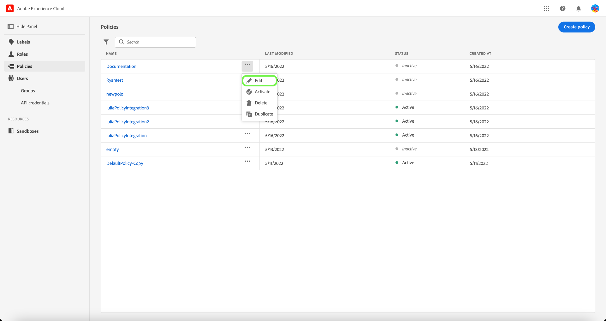

# Hantera åtkomstkontrollprinciper

Åtkomstkontrollprinciper är satser som sammanför attribut för att fastställa tillåtna och otillåtna åtgärder. Åtkomstprinciper kan antingen vara lokala eller globala och kan åsidosätta andra principer. Adobe har en standardpolicy som kan aktiveras omedelbart eller när din organisation är redo att börja styra åtkomsten till specifika objekt baserat på etiketter. Standardprincipen använder etiketter som används på resurser för att neka åtkomst, såvida inte användarna har en roll med en matchande etikett.

>[!IMPORTANT]
>
>Åtkomstprinciper får inte blandas ihop med dataanvändningsprinciper, som styr hur data används i Adobe Experience Platform i stället för vilka användare i organisationen har tillgång till dem. Mer information finns i guiden om att skapa [dataanvändningsprinciper](../../../data-governance/policies/create.md).

<!-- ## Create a new policy

To create a new policy, select the **[!UICONTROL Policies]** tab in the sidebar and select **[!UICONTROL Create Policy]**.

The **[!UICONTROL Create a new policy]** dialog appears, prompting you to enter a name, and an optional description. When finished, select **[!UICONTROL Confirm]**.

Using the dropdown arrow select if you would like to **Permit access to** () a resource or **Deny access to** () a resource.

Next, select the resource that you would like to include in the policy using the dropdown menu and search access type, read or write.

Next, using the dropdown arrow select the condition you would like to apply to this policy, **The following being true** () or **The following being false** ().

Select the plus icon to **Add matches expression** or **Add expression group** for the resource. 

Using the dropdown, select the **Resource**.

Next, using the dropdown select the **Matches**.

Next, using the dropdown, select the type of label (**[!UICONTROL Core label]** or **[!UICONTROL Custom label]**) to match the label assigned to the User in roles.

Finally, select the **Sandbox** that you would like the policy conditions to apply to, using the dropdown menu.

Select **Add resource** to add more resources. Once finished, select **[!UICONTROL Save and exit]**.

The new policy is successfully created, and you are redirected to the **[!UICONTROL Policies]** tab, where you will see the newly created policy appear in the list. 

## Edit a policy

To edit an existing policy, select the policy from the **[!UICONTROL Policies]** tab. Alternatively, use the filter option to filter the results to find the policy you want to edit.

Next, select the ellipsis (`…`) next to the policies name, and a dropdown displays controls to edit, deactivate, delete, or duplicate the role. Select edit from the dropdown.

The policy permissions screen appears. Make the updates then select **[!UICONTROL Save and exit]**.

The policy is successfully updated, and you are redirected to the **[!UICONTROL Policies]** tab.

## Duplicate a policy

To duplicate an existing policy, select the policy from the **[!UICONTROL Policies]** tab. Alternatively, use the filter option to filter the results to find the policy you want to edit.

Next, select the ellipsis (`…`) next to a policies name, and a dropdown displays controls to edit, deactivate, delete, or duplicate the role. Select duplicate from the dropdown.

The **[!UICONTROL Duplicate policy]** dialog appears, prompting you to confirm the duplication. 

The new policy appears in the list as a copy of the original on the **[!UICONTROL Policies]** tab.

## Delete a policy

To delete an existing policy, select the policy from the **[!UICONTROL Policies]** tab. Alternatively, use the filter option to filter the results to find the policy you want to delete.

Next, select the ellipsis (`…`) next to a policies name, and a dropdown displays controls to edit, deactivate, delete, or duplicate the role. Select delete from the dropdown.

The **[!UICONTROL Delete user policy]** dialog appears, prompting you to confirm the deletion. 

You are returned to the **[!UICONTROL policies]** tab and a confirmation of deletion pop over appears.

 -->

## Konfigurera princip för en sandlåda

>[!IMPORTANT]
>
>Som standard är funktionen [!UICONTROL Auto-include] aktiverad för alla kunder, vilket innebär att alla sandlådor läggs till i principen.

>[!NOTE]
>
>Principen **[!UICONTROL Default-Label-Based-Access-Control-Policy]** är för närvarande den enda som är tillgänglig för konfiguration.

Om du vill visa sandlådor som är associerade med en princip väljer du principen på fliken **[!UICONTROL Policies]**.

Välj sedan profilen och sedan fliken **[!UICONTROL Sandboxes]**. En lista över sandlådor som är associerade med profilen visas.

### Lägg till princip i alla sandlådor

Använd växlingsknappen **[!UICONTROL Auto-include]** på fliken **[!UICONTROL Sandboxes]** för att aktivera principen för alla sandlådor.

![Fliken [!UICONTROL Sandboxes] som visar växlingsknappen [!UICONTROL Auto-include].](../../images/flac-ui/abac-policies-auto-include.png)

Dialogrutan **[!UICONTROL Enable Auto-include]** visas och du uppmanas att bekräfta ditt val. Välj **[!UICONTROL Enable]** för att slutföra konfigurationsinställningen.

![Markering av [!UICONTROL Enable] i dialogrutan [!UICONTROL Enable Auto-include].](../../images/flac-ui/abac-policies-auto-include-enable.png)

>[!SUCCESS]
>
>Principen aktiveras för alla befintliga sandlådor och läggs automatiskt till i alla nya sandlådor när de blir tillgängliga.

### Lägg till princip i valda sandlådor

>[!IMPORTANT]
>
>Framtida sandlådor inkluderas inte som standard i principen om växeln [!UICONTROL Auto-include] är inaktiverad. Du måste hantera och lägga till sandlådor manuellt i profilen.

Använd växlingsknappen **[!UICONTROL Auto-include]** på fliken **[!UICONTROL Sandboxes]** för att inaktivera principen för alla sandlådor.

![Fliken [!UICONTROL Sandboxes] som visar växlingsknappen [!UICONTROL Auto-include].](../../images/flac-ui/abac-policies-auto-include.png)

På fliken **[!UICONTROL Sandboxes]** väljer du **[!UICONTROL Add Sandboxes]** för att välja sandlådor som den här principen ska gälla för.

![Fliken [!UICONTROL Sandboxes] som visar en lista med sandlådor som har lagts till i principen.](../../images/flac-ui/abac-policies-sandboxes-tab-add.png)

En lista över sandlådor visas. Markera den sandlåda som du vill lägga till i listan. Du kan också använda sökfältet för att söka efter sandlådan. Välj **[!UICONTROL Save]**.

![Sidan [!UICONTROL Add Sandboxes] med en lista över befintliga sandlådor som är tillgängliga att lägga till i principen.](../../images/flac-ui/abac-policies-sandboxes-list.png)

>[!SUCCESS]
>
>De markerade sandlådorna har lagts till i principen.

### Ta bort sandlådor från en profil

Om du vill ta bort en sandlåda markerar du ikonen **X** bredvid namnet på sandlådan.

![Fliken [!UICONTROL Sandboxes] som visar en lista med sandlådor och markerar [!UICONTROL X] som ska tas bort.](../../images/flac-ui/abac-policies-remove-sandbox-x.png)

Dialogrutan **[!UICONTROL Remove]** visas och du uppmanas att bekräfta ditt val. Välj **[!UICONTROL Confirm]** för att slutföra borttagningen.

![Markering av [!UICONTROL Confirm] i dialogrutan [!UICONTROL Remove].](../../images/flac-ui/abac-policies-remove-sandbox.png)

>[!SUCCESS]
>
>Den valda sandlådan har tagits bort från principen.

## Aktivera en profil {#activate-policy}

>[!CONTEXTUALHELP]
>id="platform_permissions_policies_about"
>title="Vad är policyer?"
>abstract="Profiler är satser som sammanför attribut för att fastställa tillåtna och otillåtna åtgärder. Alla organisationer har en standardprofil som du måste aktivera för att kunna styra åtkomsten till specifika objekt baserat på etiketter. Etiketter som används på resurser nekar åtkomst såvida inte användare tilldelas till en roll med en matchande etikett. Standardprofiler kan inte redigeras eller tas bort, men de kan aktiveras eller inaktiveras."
>additional-url="https://experienceleague.adobe.com/en/docs/experience-platform/access-control/abac/permissions-ui/labels" text="Hantera etiketter"

Om du vill aktivera en befintlig princip väljer du den på fliken **[!UICONTROL Policies]**.

Därefter markerar du ellipsen (`…`) bredvid ett profilnamn, och i en listruta visas kontroller för att redigera, aktivera, ta bort eller duplicera rollen. Välj Aktivera i listrutan.

Dialogrutan **[!UICONTROL Activate policy]** visas och du uppmanas att bekräfta aktiveringen.

Du återgår till fliken **[!UICONTROL policies]** och en bekräftelse på att aktiveringen är aktiverad visas. Policystatusen visas som aktiv.

## Nästa steg

När en profil är aktiverad kan du fortsätta till nästa steg för att [hantera behörigheter för en roll](permissions.md).
