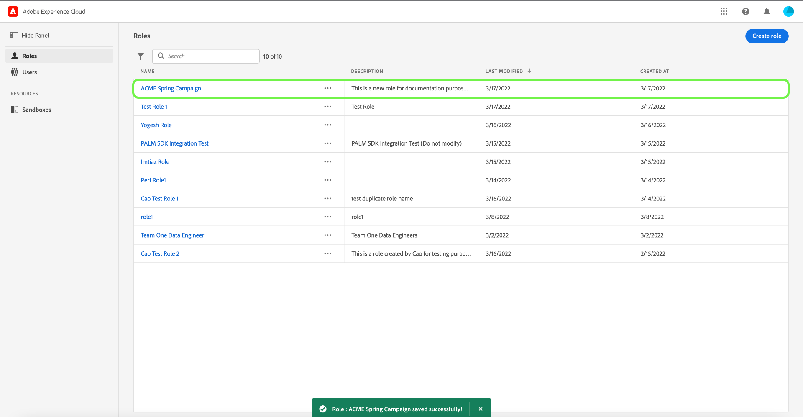
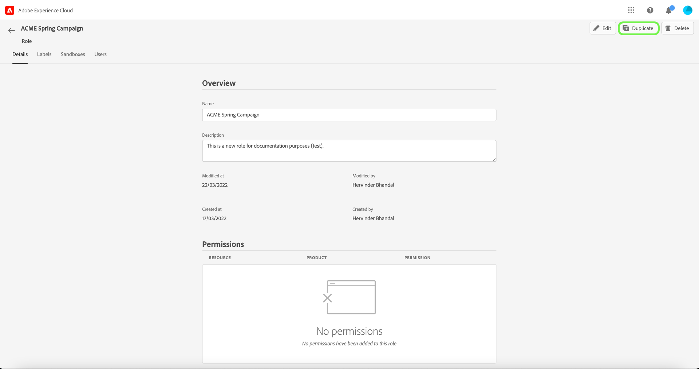
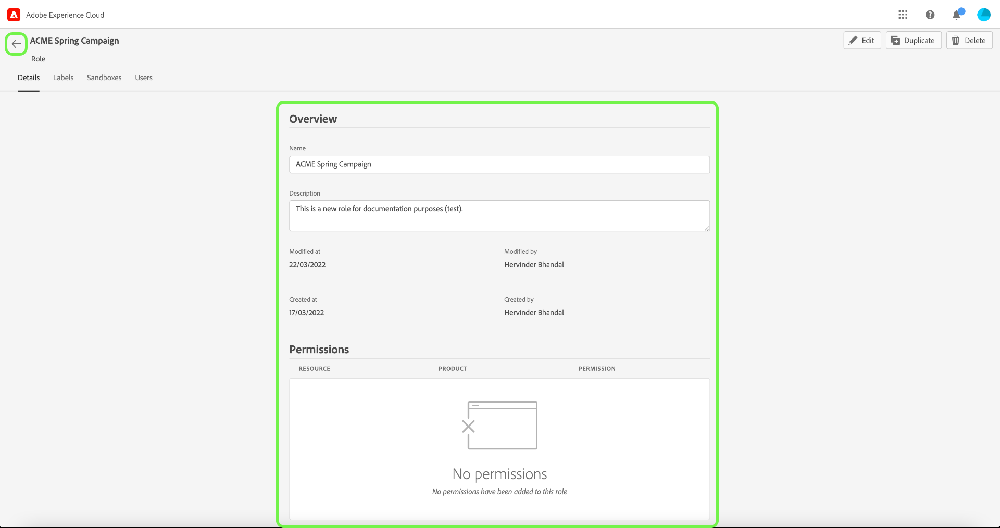

# Hantera roller

Roller definierar åtkomsten som en administratör, en specialist eller en slutanvändare har till resurser i organisationen. I en rollbaserad miljö för åtkomstkontroll är etableringen av användaråtkomst grupperad genom vanliga ansvarsområden och behov. En roll har en given uppsättning behörigheter och medlemmar i organisationen kan tilldelas till en eller flera roller, beroende på vilket synområde eller vilken skrivbehörighet de behöver.

## Skapa en ny roll {#create-new-role}

>[!CONTEXTUALHELP]
>id="platform_permissions_roles_about_create"
>title="Skapa ny roll"
>abstract="Skapa nya roller för att kategorisera användare som interagerar med din Experience Platform-instans bättre. Du kan t.ex. skapa en roll för ett internt marknadsföringsteam och tillämpa etiketten för reglerade hälsodata (RHD) på den rollen, så att ditt interna marknadsföringsteam kan komma åt skyddad hälsoinformation (PHI). Du kan också skapa en roll för en extern byrå och neka rollåtkomst till PHI-data genom att inte använda RHD-etiketten på den rollen."
>additional-url="https://experienceleague.adobe.com/docs/experience-platform/access-control/abac/permissions-ui/roles.html" text="Hantera en roll"
>additional-url="https://experienceleague.adobe.com/en/docs/experience-platform/access-control/abac/end-to-end-guide#label-roles" text="Använd etiketter för en roll"

Om du vill skapa en ny roll väljer du fliken **[!UICONTROL Roles]** i sidofältet och väljer **[!UICONTROL Create Role]**.

Dialogrutan **[!UICONTROL Create a new role]** visas och du uppmanas att ange ett namn och en valfri beskrivning.

När du är klar väljer du **[!UICONTROL Confirm]**.

Välj sedan de resursbehörigheter som du vill inkludera i rollen med hjälp av listrutan.

Om du vill lägga till ytterligare resurser väljer du **[!UICONTROL Adobe Experience Platform]** i den vänstra navigeringspanelen, som visar en lista med resurser. Du kan också ange resursnamnet i sökfältet i den vänstra navigeringspanelen.

Klicka och dra den aktuella resursen och släpp den på huvudpanelen.

Välj de resursbehörigheter som du vill inkludera i rollen med hjälp av listrutan. Upprepa detta för alla resurser som du vill inkludera för rollen. När du är klar väljer du **[!UICONTROL Save and exit]**.

Den nya rollen har skapats och du omdirigeras till sidan **[!UICONTROL Roles]** där du ser den nya rollen i listan.

Mer information om hur du hanterar rollbehörigheter när de har skapats finns i avsnitten [Hantera behörigheter för en roll](#manage-permissions-for-a-role).

Följande video är tänkt att ge stöd för din förståelse för att skapa en ny roll och hantera användare för den rollen.

>[!VIDEO](https://video.tv.adobe.com/v/336081/?learn=on)

## Duplicera en roll

Om du vill duplicera en befintlig roll väljer du rollen på fliken **[!UICONTROL Roles]**. Du kan också använda filteralternativet för att filtrera resultatet och hitta den roll du vill duplicera.

Välj sedan **[!UICONTROL Duplicate]** längst upp till höger på skärmen.

Dialogrutan **[!UICONTROL Duplicate role]** visas och du uppmanas att bekräfta dupliceringen.

Därefter kommer du till rollens detaljsida där du kan ändra rollens namn och behörigheter. Information, etiketter och sandlådor dupliceras från den tidigare rollen. Användare måste läggas till via fliken Användare. Du kan visa [hantera behörigheter för ett rolldokument](permissions.md) om du vill veta mer om hur du lägger till information, etiketter, sandlådor och användare i en roll.

Klicka på vänsterpilen för att återgå till fliken **[!UICONTROL Roles]**.

Den nya rollen visas i listan på sidan **[!UICONTROL Roles]**.

## Ta bort en roll

Markera ellipsen (`…`) bredvid en rolls namn, så visas kontroller för att redigera, ta bort eller duplicera rollen i en listruta. Välj Ta bort i listrutan.

Dialogrutan **[!UICONTROL Delete user role]** visas och du uppmanas att bekräfta borttagningen.

Du återgår till fliken **[!UICONTROL Roles]**.

## Nästa steg

När en ny roll har skapats kan du fortsätta till nästa steg för att [hantera behörigheter för en roll](permissions.md).
