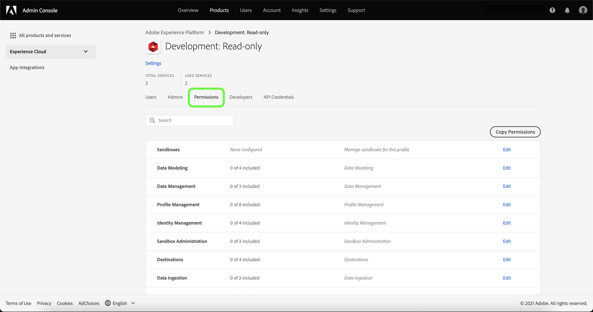

# Översikt över åtkomstkontroll

Åtkomstkontroll för Adobe Experience Platform ges via **[!UICONTROL Permissions]** in [Adobe Experience Cloud](https://experience.adobe.com/). Den här funktionen utnyttjar roller och principer som länkar användare med behörigheter och sandlådor.

## Åtkomststyrningshierarki och arbetsflöde

Om du vill konfigurera åtkomstkontroll för Experience Platform måste du ha system- eller produktadministratörsbehörighet för en organisation som har en Experience Platform-produkt. Minimirollen som kan bevilja eller återkalla behörigheter är en produktadministratör. Andra administratörsroller som kan hantera behörigheter är systemadministratörer (inga begränsningar). Se Adobe Help Center artikel om [administrativa roller](https://helpx.adobe.com/enterprise/using/admin-roles.html) för mer information.

>[!NOTE]
>
>Från och med nu avser alla omnämnanden av&quot;administratör&quot; i det här dokumentet en produktadministratör eller en senare (enligt ovan).

Ett arbetsflöde på hög nivå för att hämta och tilldela åtkomstbehörigheter kan sammanfattas på följande sätt:

- När du har licensierat Adobe Experience Platform, eller en program-/apptjänst som använder Experience Platform, skickas ett e-postmeddelande till administratören som anges under licensieringen.
- Administratören loggar in på [Adobe Admin Console](#adobe-admin-console) och markerar **Adobe Experience Platform** i produktlistan på översiktssidan.
- För att ge Experience Platform åtkomst måste administratören lägga till användare i standardproduktprofilen: `AEP-Default-All-Users`.
- Administratören kan skapa nya roller eller redigera behörigheter och användare för befintliga roller i Experience Platform.
- När administratören skapar eller redigerar en roll lägger administratören till användare i rollen med **[!UICONTROL users]** och ger behörighet till dessa användare (som[!UICONTROL Read Datasets]&quot; eller &quot;[!UICONTROL Manage Schemas]&quot;) genom att redigera rollens behörigheter. På samma sätt kan administratören tilldela åtkomst till sandlådor med samma redigeringsalternativ.
- När användare loggar in i användargränssnittet i Experience Platform styrs deras åtkomst till Experience Platform av de behörigheter som de har fått från föregående steg. Om en användare till exempel inte har [!UICONTROL View Datasets] behörighet, **[!UICONTROL Datasets]** -fliken på sidomenyn visas inte för den användaren.

Mer information om hur du hanterar åtkomstkontroll i Experience Platform finns i [användarhandbok för åtkomstkontroll](./ui/overview.md).

Alla anrop till Experience Platform API:er valideras för behörigheter och returnerar fel om lämpliga behörigheter inte hittas i den aktuella användarkontexten. Elementen döljs eller ändras i användargränssnittet beroende på vilka behörigheter den aktuella användaren har.

## Behörigheter {#platform-permissions}

[!UICONTROL Permissions] tillhandahåller en central plats för hantering av åtkomst till Experience Platform för din organisation. Via [!UICONTROL Permissions]kan du ge användargrupper åtkomstbehörigheter för olika Experience Platform-funktioner, som [!UICONTROL Manage Datasets], [!UICONTROL View Datasets], eller [!UICONTROL Manage Profiles].

### Roller

I [!UICONTROL Roles] används roller. Behörigheter tilldelas användare. Med roller kan du tilldela behörigheter till en eller flera användare, och de kan även innehålla deras åtkomst till omfattningen av de sandlådor som tilldelats dem via roller. Användare kan tilldelas till en eller flera roller som tillhör din organisation.

### Standardroller

Experience Platform har två förkonfigurerade standardroller. Följande tabell visar vad som anges i respektive standardprofil, inklusive vilken sandlåda de beviljar åtkomst till samt de behörigheter de ger inom den sandlådans omfång.

| Roll | Sandlådeåtkomst | Behörigheter |
| --- | --- | --- |
| Standardproduktion, all åtkomst | Produktion | Alla behörigheter som gäller för Experience Platform, förutom sandlådeadministration. |
| Sandlådeadministratörer | Ej tillämpligt | Ger endast åtkomst till sandlådeadministrationsbehörigheter. |

## Sandlådor och behörigheter

Sandlådor som inte är produktionssandlådor är en form av datavirtualisering som gör att du kan isolera data från andra sandlådor och som vanligtvis används för utvecklingsexperiment, testning och testning. En rolls behörigheter ger rollens användare åtkomst till Experience Platform-funktioner i sandlådemiljöer som de har beviljats åtkomst till. En standardlicens för Experience Platform ger dig fem sandlådor (en och fyra icke-produktioner). Du kan lägga till paket med tio icke-produktionssandlådor, upp till totalt högst 75 sandlådor. Kontakta din organisations administratör eller din säljare på Adobe för mer information.

Mer information om sandlådor i Experience Platform finns i [översikt över sandlådor](../sandboxes/home.md).

### Åtkomst till sandlådor

Åtkomst till sandlådor hanteras via roller. Detaljerade steg om hur du aktiverar åtkomst till en sandlåda för en roll finns i [guide för attributbaserade åtkomstkontrollsroller](./abac/ui/roles.md).

Användare kan beviljas åtkomst till en eller flera sandlådor i en roll. Om en användare ingår i två eller flera roller får den användaren åtkomst till alla sandlådor som ingår i de rollerna.

Med behörigheten&quot;Sandlådehantering&quot; kan användare hantera, visa och återställa sandlådor.

### Resursbehörigheter {#permissions}

Resursen [!UICONTROL Permissions] -fliken i en roll visar de sandlådor och behörigheter som är aktiva för den rollen:

Behörigheter som beviljas via resursbehörigheterna sorteras efter kategori, med vissa behörigheter som ger åtkomst till flera lågnivåfunktioner.

I följande tabell visas de behörigheter som är tillgängliga för Experience Platform i rollen, med beskrivningar av de specifika Experience Platform-funktioner som de ger åtkomst till. Detaljerade anvisningar om hur du lägger till behörigheter i en roll finns i [guide för attributbaserade åtkomstkontrollsroller](./abac/ui/roles.md).

| Kategori | Behörighet | Beskrivning |
| --- | --- | --- |
| [!DNL Alerts] | [!UICONTROL View Alerts History] | Skrivskyddad åtkomst för aviseringshistorik. |
| [!DNL Alerts] | [!UICONTROL Resolve Alerts] | Tillgång till att läsa, redigera och ta bort aviseringar. |
| [!DNL Alerts] | [!UICONTROL View Alerts] | Skrivskyddad åtkomst för aviseringar. |
| [!DNL Alerts] | [!UICONTROL Manage Alerts] | Åtkomst för att läsa, skapa, redigera och ta bort varningshistorik. |
| [!DNL Computed Attributes] | [!UICONTROL View Computed attributes] | Skrivskyddad åtkomst för fliken, lagret och informationen för beräknade attribut. |
| [!DNL Computed Attributes] | [!UICONTROL Manage Computed attributes] | Åtkomst för att läsa, skapa, ta bort utkast och inaktivera beräknade attribut. |
| [!DNL Data Hygiene] | [!UICONTROL View Data Hygiene] | Skrivskyddad åtkomst för datahygien. |
| [!DNL Data Hygiene] | [!UICONTROL Manage Data Hygiene] | Åtkomst att läsa, skapa, redigera och ta bort datahygien. |
| [!DNL Data Modeling] | [!UICONTROL Manage Schemas] | Åtkomst för att läsa, skapa, redigera och ta bort scheman och relaterade resurser. |
| [!DNL Data Modeling] | [!UICONTROL View Schemas] | Skrivskyddad åtkomst till scheman och relaterade resurser. |
| [!DNL Data Modeling] | [!UICONTROL Manage Relationships] | Åtkomst för att läsa, skapa, redigera och ta bort schemarelationer. |
| [!DNL Data Modeling] | [!UICONTROL Manage Identity Metadata] | Åtkomst för att läsa, skapa, redigera och ta bort identitetsmetadata för scheman. |
| [!DNL Data Management] | [!UICONTROL Manage Datasets] | Åtkomst för att läsa, skapa, redigera och ta bort datauppsättningar. Skrivskyddad åtkomst för scheman. |
| [!DNL Data Management] | [!UICONTROL View Datasets] | Skrivskyddad åtkomst för datauppsättningar och scheman. |
| [!DNL Data Management] | [!UICONTROL Data Monitoring] | Skrivskyddad åtkomst till övervakning av datauppsättningar och strömmar. |
| [!DNL Profile Management] | [!UICONTROL Manage Profiles] | Åtkomst för att läsa, skapa, redigera och ta bort datauppsättningar som används för kundprofiler. Skrivskyddad åtkomst till tillgängliga profiler. |
| [!DNL Profile Management] | [!UICONTROL View Profiles] | Skrivskyddad åtkomst till tillgängliga profiler. |
| [!DNL Profile Management] | [!UICONTROL Manage Segments] | Åtkomst för att läsa, skapa, redigera och ta bort segment. |
| [!DNL Profile Management] | [!UICONTROL View Segments] | Skrivskyddad åtkomst till tillgängliga segment. |
| [!DNL Profile Management] | [!UICONTROL Manage Merge Policies] | Åtkomst för att läsa, skapa, redigera och ta bort sammanfogningsprinciper. |
| [!DNL Profile Management] | [!UICONTROL View Merge Policies] | Skrivskyddad åtkomst till tillgängliga kopplingsprofiler. |
| [!DNL Profile Management] | [!UICONTROL Export Audience for Segment] | Möjlighet att exportera ett utvärderat målgruppssegment till en datauppsättning. |
| [!DNL Profile Management] | [!UICONTROL Evaluate a Segment to an Audience] | Möjlighet att generera profiler för en viss målgrupp genom att utvärdera en segmentdefinition. |
| [!DNL Profile Management] | [!UICONTROL View B2B AI] | Skrivskyddad åtkomst till inställningar och konfigurationer för alla B2B AI/ML-tjänster. |
| [!DNL Profile Management] | [!UICONTROL Manage B2B AI] | Åtkomst att läsa, skapa, redigera och ta bort inställningar och konfigurationer för alla B2B AI/ML-tjänster. |
| [!DNL Profile Management] | [!UICONTROL View B2B Profile] | Skrivskyddad åtkomst till B2B-entitetsprofiler (som Konto, Möjligheter och så vidare), inställningar och konfigurationer för alla B2B AI/ML-tjänster och B2B-instrumentpanelswidgetar. |
| [!DNL Profile Management] | [!UICONTROL Manage B2B Profile] | Åtkomst för att läsa, skapa, redigera och ta bort B2B-enhetsprofiler (t.ex. konto, säljprojekt). Skrivskyddad åtkomst för inställningar och konfigurationer för alla B2B AI/ML-tjänster och B2B-instrumentpanelswidgetar. |
| [!DNL Identity Management] | [!UICONTROL Manage Identity Namespaces] | Åtkomst för att läsa, skapa, redigera och ta bort identitetsnamnutrymmen. |
| [!DNL Identity Management] | [!UICONTROL View Identity Namespaces] | Skrivskyddad åtkomst för identitetsnamnutrymmen. |
| [!DNL Identity Management] | [!UICONTROL View Identity Graph] | Skrivskyddad åtkomst för identitetsdiagram. |
| [!DNL Sandbox Administration] | [!UICONTROL Manage Sandboxes] | Åtkomst för att läsa, skapa, redigera och ta bort sandlådor. |
| [!DNL Sandbox Administration] | [!UICONTROL View Sandboxes] | Skrivskyddad åtkomst för sandlådor som tillhör din organisation. |
| [!DNL Sandbox Administration] | [!UICONTROL Reset a Sandbox] | Möjlighet att återställa en sandlåda. |
| [!DNL Destinations] | [!UICONTROL Manage Destinations] | Åtkomst att läsa, skapa och ta bort målaktiveringsflöden och destinationskonton. |
| [!DNL Destinations] | [!UICONTROL View Destinations] | Skrivskyddad åtkomst till tillgängliga destinationer i **[!UICONTROL Catalog]** och autentiserade mål på **[!UICONTROL Browse]** -fliken. |
| [!DNL Destinations] | [!UICONTROL Activate Destinations] | Ger användarna möjlighet att aktivera segment för befintliga destinationer. Aktiverar mappningssteget i aktiveringsarbetsflödet. Den här behörigheten kräver antingen [!UICONTROL View Destinations] eller [!UICONTROL Manage Destinations] beviljas den användare som ska aktivera data till destinationer. |
| [!DNL Destinations] | [!UICONTROL Activate Segment without Mapping] | Ger användarna möjlighet att aktivera segment för befintliga mål utan att visa [mappningssteg](../destinations/ui/activate-batch-profile-destinations.md#mapping). Användare kan lägga till och ta bort segment i aktiveringsarbetsflöden, men kan inte lägga till eller ta bort mappade attribut eller identiteter. Denna behörighet kräver [!UICONTROL Activate Destinations] behörighet att beviljas den användare som ska aktivera data till destinationer. |
| [!DNL Destinations] | [!UICONTROL Manage and Activate Dataset Destinations] | Möjlighet att läsa, skapa, redigera och inaktivera datauppsättningsexportflöden. Möjlighet att även aktivera data till aktiva datauppsättningar som har skapats. |
| [!DNL Destinations] | [!UICONTROL Destination Authoring] | Möjlighet att skapa destinationer med [Adobe Experience Platform Destination SDK](../destinations/destination-sdk/overview.md). |
| [!DNL Data Ingestion] | [!UICONTROL Manage Sources] | Tillgång till att läsa, skapa, redigera och inaktivera källor. |
| [!DNL Data Ingestion] | [!UICONTROL View Sources] | Skrivskyddad åtkomst till tillgängliga källor i **[!UICONTROL Catalog]** och autentiserade källor i **[!UICONTROL Browse]** -fliken. |
| [!DNL Data Ingestion] | [!DNL Manage Audience Share Connections] | Tillgång till att skapa, acceptera och avböja partnerhandskakningar för att ansluta två organisationer och aktivera [!DNL Segment Match] flöden. |
| [!DNL Data Ingestion] | [!DNL Manage Audience Share] | Tillgång till att läsa, skapa, redigera och publicera [!DNL Segment Match] flöden med aktiva partners. |
| [!DNL Data Science Workspace] | [!UICONTROL Manage Data Science Workspace] | Åtkomst att läsa, skapa, redigera och ta bort i [!DNL Data Science Workspace]. |
| Datastyrning | [!UICONTROL Apply Data Usage Labels] | Åtkomst att läsa, skapa och ta bort användningsetiketter. |
| Datastyrning | [!UICONTROL Manage Data Usage Policies] | Åtkomst att läsa, skapa, redigera och ta bort dataanvändningsprinciper. |
| Datastyrning | [!UICONTROL View Data Usage Policies] | Skrivskyddad åtkomst till dataanvändningsprinciper som tillhör din organisation. |
| Datastyrning | [!UICONTROL View User Activity Log] | Skrivskyddad åtkomst till inspelad vy [granskningsloggar](../landing/governance-privacy-security/audit-logs/overview.md) av plattformsaktiviteter. |
| [!DNL Dashboards] | [!UICONTROL View License Usage Dashboard] | Skrivskyddad åtkomst för att visa kontrollpanelen för licensanvändning. |
| [!DNL Dashboards] | [!UICONTROL Manage Standard Dashboards] | Lägg till anpassade attribut som ännu inte finns i datalagret. |
| [!DNL Query Service] | [!UICONTROL Manage Queries] | Åtkomst att läsa, skapa, redigera och ta bort strukturerade SQL-frågor för plattformsdata. |
| [!DNL Query Service] | [!UICONTROL Manage Query Service Integration] | Åtkomst för att skapa, uppdatera och ta bort ej förfallande autentiseringsuppgifter för åtkomst till frågetjänsten. |

## Nästa steg

Genom att läsa den här guiden har du lagts till i huvudprinciperna för åtkomstkontroll i Experience Platform. Du kan nu fortsätta till [användarhandbok för attributbaserad åtkomstkontroll](./abac/overview.md) för detaljerade steg om hur du använder Experience Cloud för att skapa roller och tilldela behörigheter till Experience Platform.
