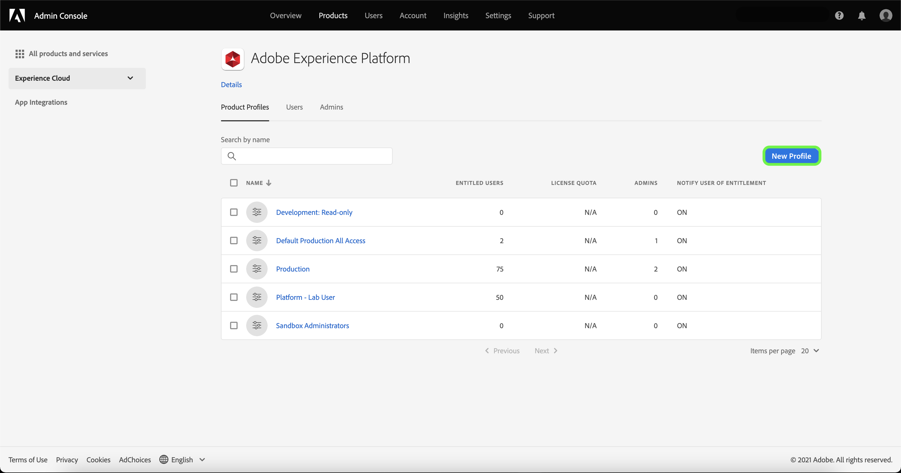

# Skapa en ny produktprofil i Adobe Admin Console

Navigera till **[!UICONTROL Product Profiles]** och markera **[!UICONTROL New Profile]**.

The **[!UICONTROL Create a new product profile]** visas där du uppmanas att ange en profil, ett valfritt visningsnamn och en valfri beskrivning. Under **[!UICONTROL User Notifications]** kan du växla om användare ska meddelas via e-post när de läggs till eller tas bort från profilen.

När du är klar väljer du **[!UICONTROL Next]**.

Nästa skärm uppmanar dig att välja vilka plattformstjänster som ska ingå i profilen. Markera växlingsknappen bredvid en tjänst för att inaktivera den. Om en tjänst är inaktiverad är inte alla funktioner som är kopplade till den tjänsten tillgängliga för användare som är tilldelade den här produktprofilen. När du är klar väljer du **[!UICONTROL Save]**.

Kunder som är berättigade till B2B- eller B2P-versionen har tillgång till B2B-gränssnittet. B2B-gränssnittet kan etableras för användare via [!UICONTROL Enable services menu]. Markera växlingsknappen bredvid [!UICONTROL B2B UI] för att aktivera tjänsten för en viss produktprofil och sedan välja **[!UICONTROL Save]**.

Med användargränssnittet för B2B kan användare visa B2B-arbetsflöden för att hantera konton och affärsmöjligheter samt skapa B2B-relaterade segment. Mer information finns i dokumentationen om [[!DNL Adobe Real-Time Customer Data Platform B2B Edition]](../../rtcdp/b2b-overview.md).

Den nya produktprofilen har skapats och du omdirigeras till profilens [redigera behörighetssida](#edit-permissions). Se avsnitten om [hantera behörigheter](#manage-permissions-for-a-product-profile) och [hantera användare](#manage-users-for-a-product-profile) om du vill ha mer information om hur du hanterar produktprofiler när de har skapats.

## Nästa steg

När du har skapat en ny produktprofil kan du gå vidare till nästa steg i [hantera behörigheter för en produktprofil](permissions.md)
