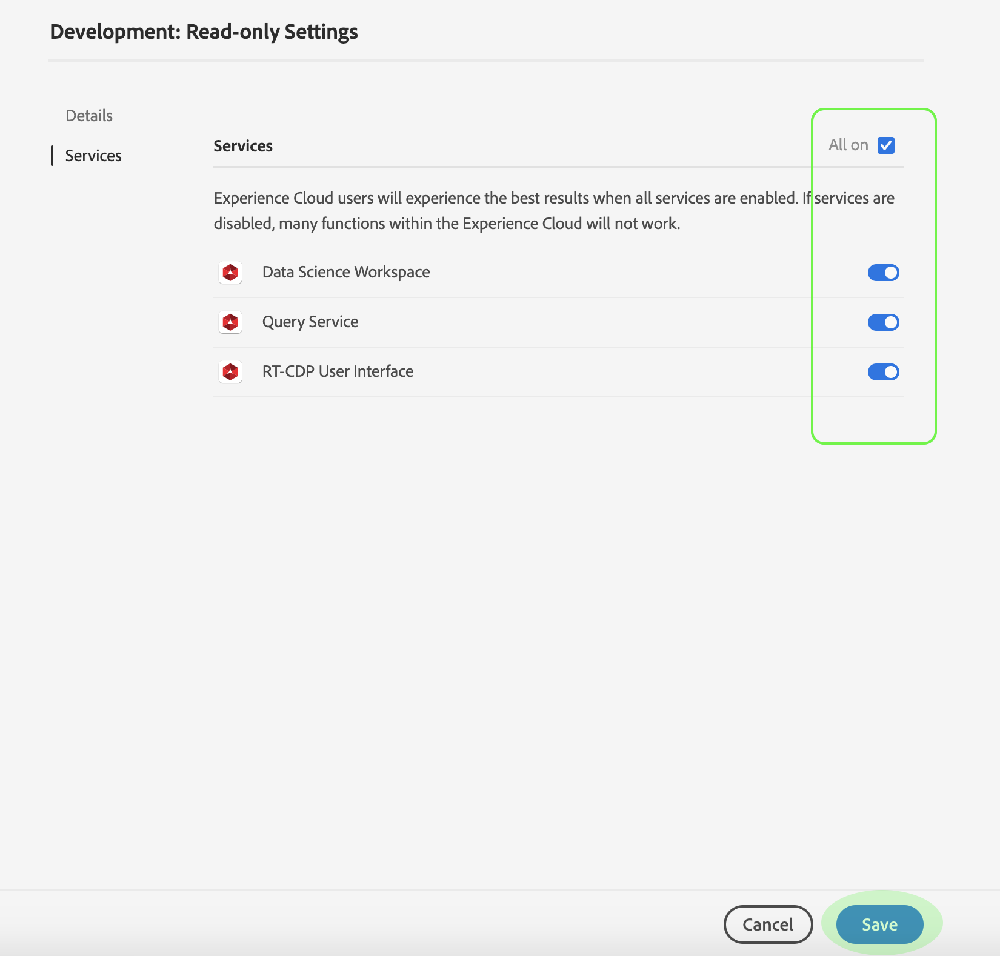

# Hantera information och ytterligare tjänster för en produktprofil

Du kan konfigurera en profils information och åtkomst till ytterligare tjänster på menyn *Profilinställningar* . Du öppnar menyn genom att klicka på **Inställningar** på sidan *Produktprofil* .

Menyn *Profilinställningar* visas med början på fliken *Detaljer* . På den här fliken kan du ange och redigera **profilnamn** och **beskrivning**. Du kan också ändra **visningsnamnet** och e-postmeddelandeinställningarna för ditt konto.

Klicka på **Tjänster** för att öppna sidan *Tjänster* .

På menyn *Tjänster* kan du ändra en profils åtkomst till ytterligare plattformstjänster som ursprungligen konfigurerades när profilen skapades. Beroende på din plattformsprenumeration kan dessa tjänster omfatta:

- Datavetenskapens arbetsyta
- Frågetjänst
- Användargränssnitt för kunddataplattform i realtid (endast för CDP i realtid)

Klicka på växlingsknappen till höger om en viss tjänst för att aktivera eller inaktivera den. Du kan också markera kryssrutan **Alla på** om du vill aktivera eller inaktivera alla listade tjänster.

När du är klar klickar du på **Spara**.

