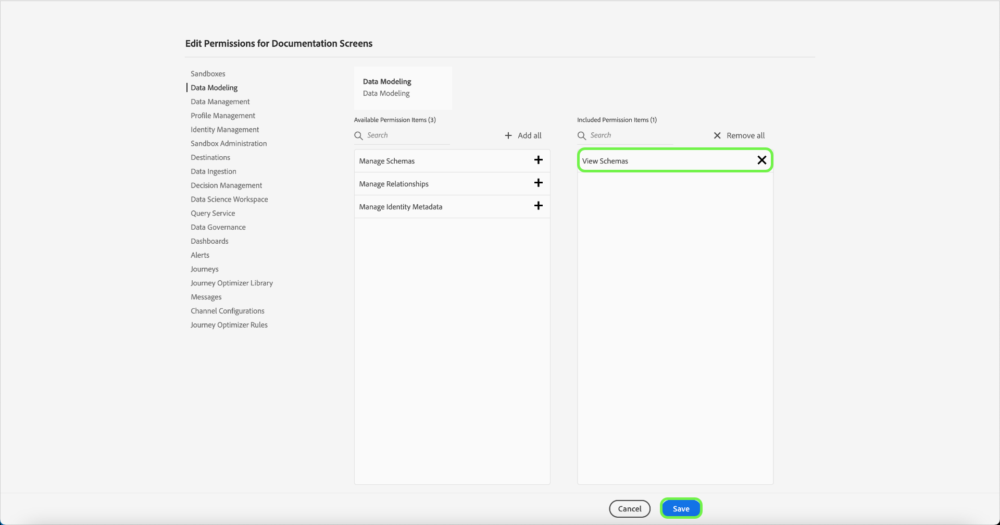

# Hantera behörigheter för en produktprofil

Omedelbart efter [att du har skapat en ny produktprofil](#create-a-new-product-profile) uppmanas du att konfigurera profilens behörigheter. Om du redigerar behörigheter för en befintlig profil markerar du profilen på fliken **[!UICONTROL Product Profiles]** för att öppna profilens informationssida och väljer sedan **[!UICONTROL Permissions]**.

Behörigheterna är uppdelade i kategorier och listade på den här sidan. I listan visas kategorinamnet, antalet behörigheter (och hur många som är aktiva) och dess beskrivning. I tabellen i [Resursbehörigheter](/help/access-control/home.md#permissions) finns en beskrivning av de behörigheter som är tillgängliga för varje roll.

Välj en kategori i listan för att öppna sidan **[!UICONTROL Edit Permissions]**.

Sidan **[!UICONTROL Edit Permissions]** innehåller en arbetsyta där du kan lägga till och ta bort behörigheter från den valda produktprofilen. På skärmens vänstra sida visas en lista med behörighetskategorier. Om du väljer en kategori ändras behörigheterna som visas under **[!UICONTROL Available Permissions Items]**.

Om du till exempel vill uppdatera behörigheter för datamodellering väljer du **[!UICONTROL Data Modeling]**.

Om du vill lägga till en behörighet väljer du plusikonen **(+)** bredvid behörighetens namn. Du kan också välja **[!UICONTROL Add all]** om du vill lägga till alla behörigheter under den aktuella kategorin i profilen. Tillagda behörigheter visas under **[!UICONTROL Included Permission Items]**.

>[!NOTE]
>
>Listan **[!UICONTROL Included Permissions Items]** visar bara tillagda behörigheter från den valda kategorin.

Om du vill ta bort en behörighet markerar du ikonen **X** bredvid behörighetens namn eller väljer **[!UICONTROL Remove all]** om du vill ta bort alla behörigheter i den aktuella kategorin. Borttagna behörigheter visas igen under **[!UICONTROL Available Permission Items]**.

Fortsätt gå igenom de tillgängliga kategorierna och lägg till behörigheter. När du är klar väljer du **[!UICONTROL Save]**.

Fliken **[!UICONTROL Permissions]** för produktprofilen visas igen och visar att de valda behörigheterna nu är aktiva.

## Nästa steg

Med behörigheter upprättade kan du fortsätta till nästa steg för att [hantera information och tjänster för en produktprofil](details-and-services.md)
