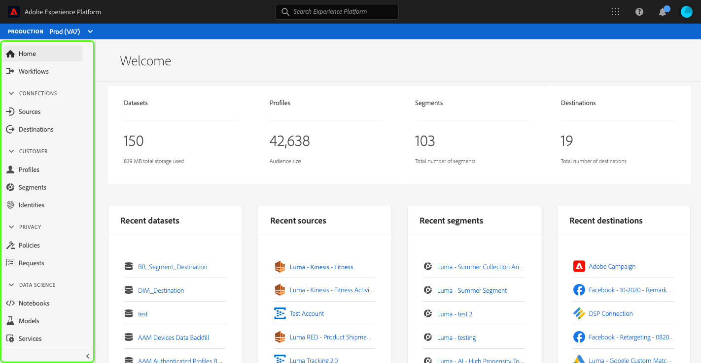
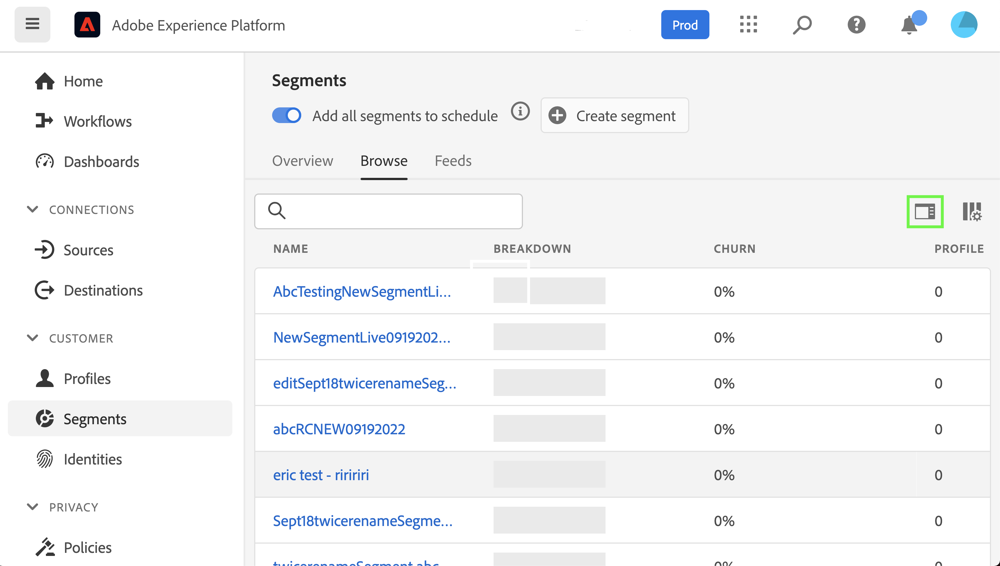

# Anpassade tillgänglighetslösningar för Experience Platform

Adobe Experience Platform har ständigt förbättrats för att tillgodose behoven hos alla typer av användare och följer världsstandarden som omfattar personer med nedsatt syn, hörsel, mobilitet eller andra funktionshinder. I det här dokumentet finns skräddarsydda tillgänglighetslösningar för Experience Platform i användargränssnittet.

## Översikt över startsidan och användargränssnittet

Användargränssnittet i Experience Platform uppfyller de kontrastförhållanden som krävs för normal text, bilder och gränssnittskomponenter. Färgerna i användargränssnittet har också valts för att ge stöd åt tillgänglighet för alla användare, även för dem med visuella funktionshinder.

I Platform kan även gränssnittselement som är klickbara eller kan användas med en pekare aktiveras med ett tangentbord. Detta inkluderar vänster navigering, videospelare, tabeller med mera.

Experience Platform strävar efter att följa internationella tillgänglighetsstandarder, inklusive Web Content Accessibility Guidelines 2.1 Level A och Level AA samt Web Accessibility Initiative - Accessible Rich Internet Applications (WAI-ARIA).

## Vänster navigering

Den vänstra navigeringen i användargränssnittet för Experience Platform är tangentbordsanpassad och ger färgkontrast i normalt läge, hovring- och markeringsläge som uppfyller tillgänglighetsstandarder.

På hemskärmen kan användarna tabba in i den vänstra navigeringen. Markera **Skift+Tabb** returnerar användaren till hemskärmen.

Med vänster navigering i fokus **Tabb** tar användarna till interaktionen Utöka och komprimera. Möjligheten att utöka eller komprimera den vänstra navigeringen aktiveras med **Retur**.

Med den vänstra navigeringen i fokus navigerar upp- och nedpilarna till varje objekt i navigeringen och bläddrar kontinuerligt (med andra ord flyttas inte fokus förrän användaren tabbar bort från den vänstra navigeringen). Fokus visas för navigeringsobjekt när de är markerade. Den aktuella markeringen visas med en högdager och fet text. När du väljer ett vänstra navigeringsobjekt **Retur** öppnar det markerade gränssnittsobjektet på den högra panelen, men fokus ligger kvar i den vänstra navigeringen tills användaren tabbar bort.

Vissa funktioner på plattformen är inte aktiverade för alla användare. Dessa objekt visas i navigeringen men kan inte markeras. När du navigerar med ett tangentbord hoppas dessa objekt över vid pilnavigering och kan inte markeras med **Retur**.

## Dialogrutan Inbäddad video

Videor kan visas i Experience Platform med tangentbordsnavigering för att markera och välja en tillgänglig videolänk. Då öppnas en inbäddad videodialogruta i användargränssnittet för plattformen.

## Tangentbordstillgänglighet i dialogrutan Video

Du kan även navigera i den inbäddade videodialogrutan med hjälp av tangentbordet. I följande tabell visas den fullständiga tangentbordsnavigeringen som är tillgänglig för den inbäddade videodialogrutan.

| Dialogruteelement | Tangentbordstillgänglighet | Beskrivning |
|---|---|---|
| Spela upp och pausa | Tabb Blanksteg | Använd **Tabb** för att ställa in fokus på uppspelningsknappen. **Blanksteg** börjar videouppspelningen och pausar videouppspelningen. |
| Skrubber | Tabb Vänsterpil Högerpil | När videon spelas upp kan du använda **Tabb** för att fokusera navigeringen. Med navigeringslisten i fokus **vänster- och högerpilstangenter** hoppa över videouppspelning framåt respektive bakåt 5 sekunder. |
| Ljud | Tabb Blanksteg | Använd **Tabb** för att fokusera på volymelementet för ljud av. Använd **blanksteg** för att stänga av eller slå på videouppspelning. |
| Volym | Tabb Vänsterpil Högerpil | Använd **Tabb** för att fokusera på volymelementet. **Vänster- och högerpilstangenter** flytta volymen uppåt respektive nedåt. |
| [!UICONTROL Closed Captions] (cc) | Tabb Retur Uppåtpil Nedåtpil | **Tabb** till [!UICONTROL Closed Captions] (&quot;cc&quot;). Använd **Retur** för att öppna menyn, och **upp- och nedpilar** för att välja språk för bildtexter. **Retur** bekräftar ditt val. |
| [!UICONTROL Quality] | Tabb Retur Uppåtpil Nedåtpil | Använd **Tabb** för att fokusera [!UICONTROL Quality] -element. Använd **Retur** för att öppna menyn och **upp- och nedpilar** för att välja videokvalitet. **Retur** bekräftar ditt val. |
| Helskärmsläge | Tabb Blanksteg eller Retur Escape | Använd **Tabb** för att fokusera helskärmselementet. Använd **blanksteg eller Retur** för att aktivera helskärmsläge. **Escape** (&quot;esc&quot;) avslutar helskärmsläget. |
| Stäng | Tabb Blanksteg eller Retur | Använd **Tabb** för att fokusera stängningsknappen. Använd **blanksteg eller Retur** för att stänga videodialogrutan. |

>[!NOTE]
>
>När som helst under uppspelningen kan Esc-tangenten (&quot;esc&quot;) användas för att stänga den inbäddade videodialogrutan.

## Dra och släpp filer

I Experience Platform går det att komma åt alla dra och släpp-zoner för filmarkering via tangentbordet. Använda **Tabb** att markera **[!UICONTROL Choose files]** och använda **Enter eller mellanslagstangent** om du vill markera den anropas operativsystemets filvalsgränssnitt.

När en fil har överförts kan du ta bort den markerade filen med en borttagningsikon och överföra en ny. Användare kan använda **Tabb** för att fokusera på borttagningsikonen och **Enter eller mellanslagstangent** för att markera den. När filen har tagits bort, **[!UICONTROL Choose files]** är automatiskt i fokus och kan markeras.

Om den överförda filen inte har rätt format visas en felikon tillsammans med ett felmeddelande och **[!UICONTROL Choose files]** är i fokus och kan markeras.

Om du använder en mus för att markera dra och släpp-zonen anropas även gränssnittet för filval, eller så kan en musanvändare markera en fil och dra till zonen för att börja överföra den.

## Bläddra i tabeller

Alla tabeller i användargränssnittet i Experience Platform går att komma åt via tangentbordet. Det går att bläddra och interagera med tabellrader och kolumner via en serie kortkommandon:

* I tabellhuvudet använder du **nedpil** för att bläddra i tabellen. Tabellrubriker kan markeras vid navigering via **Tabb** och du kan ändra sorteringsordningen med **blanksteg**.
* **Uppåt- och nedåtpilar** flyttar uppåt och nedåt genom raderna i tabellen.
* När en rad är markerad eller i fokus använder du **Retur** på raden finns information i den högra listen.
* När en rad är markerad eller i fokus använder du **piltangenter** för att flytta genom varje objekt på raden.
* Använd **Retur** om du vill markera ett objekt på raden. Användare med skärmläsare får ett varningsmeddelande om ett nytt fönster måste öppnas.
* När du zoomar till 200 % eller mer visas **rälsinspektör** ikonen när den högra listen komprimeras för att ge mer visningsutrymme för tabellen.

### Bläddra bland tabellens tangentbordstillgänglighet

| Tangentbordstillgänglighet | Beskrivning |
|---|---|
| HOME (Function + vänsterpil) | När raden är i fokus flyttar användare till det första objektet på raden |
| END (Funktion + högerpil) | När raden är i fokus flyttar användare till det sista objektet på raden |
| Page up | Går tio rader uppåt i tabellen (per sida) |
| Sida ned | Går igenom 10 rader nedåt i tabellen (per sida) |
| Ctrl + HOME | Går till första raden i tabellen |
| Ctrl + END | Går till första ordet i tabellen per sida |

## Gränssnittet för schemaredigeraren

Gränssnittet för schemaredigeraren är tillgängligt med följande funktioner:

* Schemaredigeraren har stöd för tangentbordsnavigering, inklusive användning av **Tabb** för navigering i gränssnittselement.
* **Tabb** anger sökfältet och sedan i schematrädet.
* Schematrädet stöder användning av piltangenter för att navigera i schematrädets gränssnitt
   * **Upp- och nedpilar** kan användas för att gå igenom trädet.
   * **Vänster- och högerpilar** kan användas för att expandera och komprimera noder eller flytta mellan infogade åtgärder i schematrädet.
* **Retur** aktiverar enskilda noddetaljer i detaljpanelen till höger.
* The **Startsida** tangenten återgår till trädets övre del.
* The **End** tangenten navigerar längst ned i trädet.
* Schematrädet innehåller även ARIA-etiketter för skärmläsare.

## Segmentbyggargränssnitt

När du använder användargränssnittet i Segment Builder för att skapa, redigera och interagera med segment i Experience Platform förbättras tillgängligheten med följande funktioner:

* Gränssnittet för segmentbyggaren är tillgängligt via tangentbordsnavigering.
* Skärmläsare bör känna igen märkord för rubriker och kan meddela rubriken tillsammans med nivån.
* Andra hjälpmedelstekniker kan ändra den visuella visningen av en sida genom att använda korrekt kodade rubriker för att visa en disposition eller alternativ vy.

Du kan nu komprimera eller utöka vänster och höger radie för segmentbyggarbetsytan för att få mer utrymme på skärmen. Den här funktionen är särskilt användbar eftersom den har full funktionalitet vid 200 % zoomning.

## Frågetjänstredigeraren

Följande tillgänglighetsfunktioner är tillgängliga i frågetjänstens redigerare:

* Färgkontrast i redigeringsgränssnittet för frågetjänsten uppfyller kraven för tillgänglighet.
* Tangentbordsnavigering stöds utanför redigeringsgränssnittet. Redigerarens användargränssnitt är en inbäddad kodspegling.

>[!NOTE]
>
>Frågeredigeraren hanterar inte **Tabb** som standard. Anropa **Tabb** i redigeraren måste du trycka på **Escape** och tryck sedan på **Tabb** direkt efter det. Tryck **Tabb** igen, för att flytta fokus utanför redigeraren.

## Fliken Systemvy i Källor och mål

När du bläddrar **[!UICONTROL System View]** I Källor och Destinationer förbättrar följande funktioner tillgängligheten:

* **Tabb** anger fokus på det första källanslutningskortet
   * **Tabb** igen för att fokusera på knappen i kortet
   * Välj **Retur** för att aktivera knappen för att ringa till åtgärd inuti kortet
* Markera **Retur** på anslutningskortet aktiveras även fler detaljer i den högra listen
   * När den högra listen är aktiverad ställs fokus in på det området. **Tabb** fokuserar på **Stäng** för den högra rutan. Markera **Tabb** flyttar fokus igen genom panelen för den högra listen
   * Om det finns mer än ett källanslutningskort **Tabb** går igenom anslutningarna
   * Använd **piltangenter (upp, ned, vänster och höger)** för att gå igenom listan med källor
   * Välj **Tabb** för att sätta fokus på panelen för höger spår
