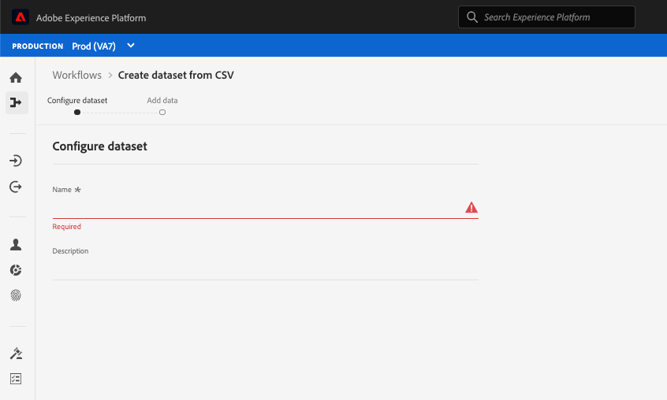

# Tillgänglighetsfunktioner i Experience Platform

Adobe Experience Platform strävar efter att tillhandahålla hjälpmedelsfunktioner för alla, inklusive användare som arbetar med hjälpmedel som taligenkänningsprogram och skärmläsare. I det här dokumentet beskrivs de allmänna tillgänglighetsfunktionerna som stöds av Platform, inklusive tangentbordsnavigering, semantisk struktur, tillräcklig kontrast mellan förgrundselement och bakgrundselement samt stöd för hjälpmedelstekniker.

## Hjälpmedel

Användare med funktionshinder förlitar sig ofta på maskinvara och programvara, så kallade hjälpmedelstekniker, för att få tillgång till digitalt innehåll och för att använda programvaruprodukter. Adobe Experience Platform stöder flera typer av hjälpmedelstekniker (AT), som skärmläsare, zoom och program för röstigenkänning, genom att följa bästa hjälpmedelspraxis, som att använda semantisk kod, textmotsvarigheter, etiketter och ARIA där det behövs. Interaktiva element i användargränssnittet i Experience Platform använder motsvarande etiketter, hjälpmedelsnamn och roller som identifierar både deras syfte och deras aktuella tillstånd. Detta garanterar att hjälpmedelstekniker, som skärmläsare, kan läsa upp etiketter och annan information för användarna så att de enkelt kan interagera med programkontrollerna.

## Tangentbordstillgänglighet

Experience Platform strävar efter att stödja fullständig tangentbordstillgänglighet.

Följande navigeringselement underlättar tillgängligheten:
* Tabbtangenten flyttar mellan gränssnittselement, avsnitt och menygrupper.
* Piltangenterna flyttar inom menygrupper för att ställa in fokus på enskilda aktiva element.
* Skift+Tabb flyttas bakåt i tabbordningen.
* Med Retur (Retur) och blankstegstangenten aktiveras markerade objekt.
* Esc-tangenten fungerar som en Avbryt-knapp för att stänga en dialogruta när den finns.
* Experience Platform visar en blå kantlinje runt ett markerat element för att visa en tydlig indikation på vilket UI-element som är i fokus.

## Färgpaletter och kontrast

Experience Platform strävar efter [WCAG 2.1 AA](https://www.w3.org/TR/WCAG/) överensstämmelse, inklusive krav på färgkontrast. Användargränssnittet i Experience Platform ger tillräckligt med kontrast i programmet för att du ska få en lättillgänglig visningsupplevelse för användare med nedsatt syn eller färgbrister.

## Obligatorisk fältvalidering

När du lägger till data, skapar scheman eller definierar segment visas obligatoriska fält både visuellt, med en asterisk bredvid textetiketten för ett fält och programmatiskt. Dessa fält utlöser validering när du anger ogiltiga data i fält och när de sparas. Om ett obligatoriskt fält inte godkänns vid valideringen visas det i rött med en felikon och en skriftlig beskrivning av problemet som behöver åtgärdas visas också.

