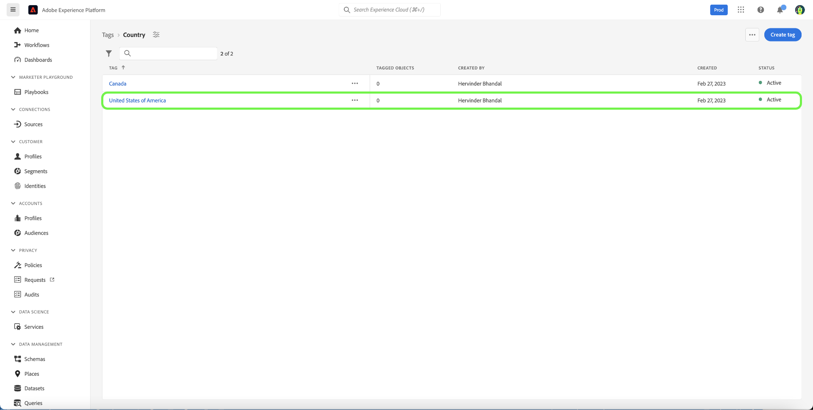

# Hantera taggar, guide

Med taggar kan du hantera metadatataxonomier för att klassificera affärsobjekt så att de blir enklare att identifiera och kategorisera. Taggar kan hjälpa er att identifiera viktiga taxonomiska attribut för de målgrupper era team arbetar med, så att de kan hitta dem snabbare och även gruppera gemensamma målgrupper i en beskrivning. Du bör identifiera vanliga taggkategorier som geografiska regioner, affärsenheter, produktlinjer, projekt, team, tidsintervall (kvartal, månader, år) eller något annat som kan bidra till att ge ditt team en meningsfull och enkel målgruppsidentifiering. 

## Skapa en tagg {#create-tag}

Om du vill skapa en ny tagg väljer du **[!UICONTROL tags]** i den vänstra navigeringen och väljer sedan önskad taggkategori.

Välj **[!UICONTROL Create tag]** om du vill skapa en ny tagg.

Dialogrutan **[!UICONTROL Create tag]** visas och du uppmanas att ange ett unikt taggnamn. När du är klar väljer du **[!UICONTROL Save]**.

Den nya taggen har skapats och du omdirigeras till taggskärmen där du ser den nyligen skapade taggen i listan.

## Redigera en tagg {#edit-tag}

Om du redigerar en tagg blir det lättare att hitta felstavningar, uppdatera namnkonventioner eller uppdatera terminologi. Om du redigerar en tagg behålls taggens koppling till de objekt där de används.

Om du vill redigera en befintlig tagg markerar du ellipsen (`...`) bredvid taggens namn som du vill redigera i listan med taggkategorier. I en listruta visas kontroller för att redigera, flytta eller arkivera taggen. Välj **[!UICONTROL Edit]** i listrutan.

Dialogrutan **[!UICONTROL Edit tag]** visas och du uppmanas att redigera taggnamnet. När du är klar väljer du **[!UICONTROL Save]**.

Taggnamnet har uppdaterats och du omdirigeras till taggskärmen där den uppdaterade taggen visas i listan.

## Flytta en tagg mellan kategorier {#move-tag}

Taggar kan flyttas till andra taggkategorier. Om du flyttar en tagg behålls taggens koppling till de objekt där de används.

Om du vill flytta en befintlig tagg markerar du ellipsen (`...`) bredvid taggens namn som du vill flytta i listan med taggkategorier. I en listruta visas kontroller för att redigera, flytta eller arkivera taggen. Välj **[!UICONTROL Edit]** i listrutan.

Dialogrutan **[!UICONTROL Move tag]** visas och du uppmanas att välja den taggkategori som den markerade taggen ska flyttas till.

Du kan bläddra och välja i listan, eller också kan du använda sökfunktionen för att ange kategorinamnet. När du är klar väljer du **[!UICONTROL Move]**.

Taggen har flyttats och du omdirigeras till taggskärmen där du ser den uppdaterade tagglistan, där taggen inte längre visas.

Taggen visas nu i den tidigare markerade taggkategorin.

## Arkivera en tagg {#archive-tag}

Status för en tagg kan växlas mellan aktiv och arkiverad. Arkiverade taggar tas inte bort från objekt där de redan har tillämpats, men de kan inte längre tillämpas på nya objekt. För varje tagg återspeglas samma status i alla objekt. Detta är särskilt användbart när du vill behålla aktuella taggobjektsassociationer men inte vill att taggen ska användas i framtiden.

Om du vill arkivera en befintlig tagg markerar du ellipsen (`...`) bredvid taggens namn som du vill arkivera i listan över taggkategorier. I en listruta visas kontroller för att redigera, flytta eller arkivera taggen. Välj **[!UICONTROL Archive]** i listrutan.

Dialogrutan **[!UICONTROL Archive tag]** visas och du uppmanas att bekräfta taggarkivet. Välj **[!UICONTROL Archive]**.

Taggen har arkiverats och du omdirigeras till taggskärmen. Den uppdaterade tagglistan visar nu taggens status som `Archived`.

## Återställa en arkiverad tagg {#restore-archived-tag}

Om du vill använda en `Archived`-tagg på nya objekt måste taggen vara i läget `Active`. Om du återställer en arkiverad tagg återgår taggen till läget `Active`.

Om du vill återställa en arkiverad tagg markerar du ellipsen (`...`) bredvid taggens namn i listan med taggkategorier. I en listruta visas kontroller för att återställa eller ta bort taggen. Välj **[!UICONTROL Restore]** i listrutan.

Dialogrutan **[!UICONTROL Restore tag]** visas och du uppmanas att bekräfta återställningen av taggen. Välj **[!UICONTROL Restore]**.

Taggen har återställts och du omdirigeras till taggskärmen. Den uppdaterade tagglistan visar nu taggens status som `Active`.

## Ta bort en tagg {#delete-tag}

>[!NOTE]
>
>Det går bara att ta bort taggar som är i ett `Archived`-läge och som inte är associerade med några objekt.

Om du tar bort en tagg tas den bort helt från systemet.

Om du vill ta bort en arkiverad tagg markerar du ellipsen (`...`) bredvid taggens namn som du vill ta bort i listan över taggkategorier. I en listruta visas kontroller för att återställa eller ta bort taggen. Välj **[!UICONTROL Delete]** i listrutan.

Dialogrutan **[!UICONTROL Delete tag]** visas och du uppmanas att bekräfta borttagningen av taggen. Välj **[!UICONTROL Delete]**.

Taggen har tagits bort och du omdirigeras till taggskärmen. Taggen visas inte längre i listan och har tagits bort helt.

## Visa taggade objekt {#view-tagged}

Varje tagg har en detaljsida som kan nås från tagglagret. På den här sidan visas alla objekt som för närvarande har den taggen, vilket gör att användare kan se relaterade objekt från olika program och funktioner i en enda vy.

Om du vill visa listan med taggade objekt söker du efter taggen i en taggkategori och markerar taggen.

Sidan [!UICONTROL Tagged objects] visas med en inventering av taggade objekt.

## Nästa steg

Du har nu lärt dig hur du hanterar taggar. En översikt över taggar i Experience Platform på hög nivå finns i [översiktsdokumentationen för taggar](../overview.md).
