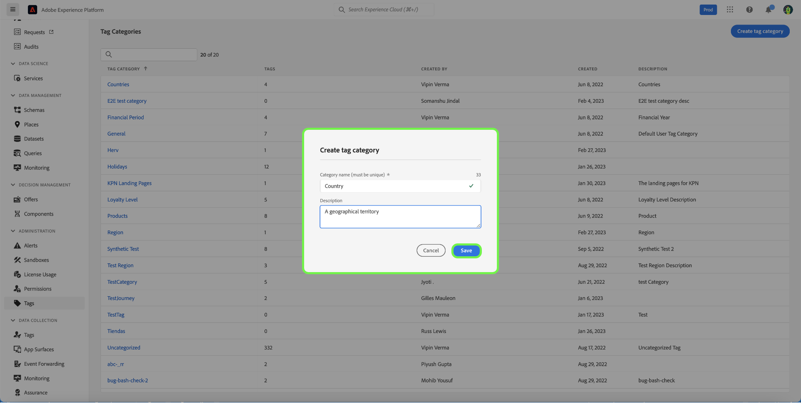

# Stödlinje för taggkategorier

Tagga kategorier grupperar taggar i meningsfulla uppsättningar för att ge mer sammanhang och för att bättre klargöra syftet med taggen. Alla taggar som har en kategori kommer att ha taggnamnet före kategorinamnet och sedan ett kolon.

## Skapa en taggkategori {#create-tag-category}

Om du vill skapa en ny kategori väljer du **[!UICONTROL tags]** i den vänstra navigeringen väljer du [!UICONTROL Create tag category].

The **[!UICONTROL Create tag category]** visas och du uppmanas att ange ett unikt kategorinamn och en valfri beskrivning. När du är klar väljer du **[!UICONTROL Save]**.

Den nya taggkategorin har skapats och du omdirigeras till sidan där du skapar taggar där du kan tilldela nya taggar. Mer information om hur du skapar taggar finns i [hantera taggar](./managing-tags.md#create-a-tag-create-tag) -dokument.

## Redigera taggkategori {#edit-tag-category}

>[!NOTE]
>
>Om du redigerar eller byter namn på en taggkategori behålls taggens koppling till de objekt där de används.

Om du vill redigera en taggkategori väljer du **[!UICONTROL tags]** i den vänstra navigeringen markerar du den taggkategori som du vill redigera.

Markera ellipsen i kategorin Taggar (`...`) bredvid [!UICONTROL Create Tag]. I listrutan visas kontroller för att redigera kategori eller ta bort, markera **[!UICONTROL Edit category]**.

The **[!UICONTROL Edit category]** visas och du uppmanas att uppdatera kategorinamnet och den valfria beskrivningen. När du är klar väljer du **[!UICONTROL Save]**.

Taggkategorin har uppdaterats och du omdirigeras till taggkategorin.

## Ta bort taggkategori {#delete-tag-category}

>[!NOTE]
>
>Innan en taggkategori kan tas bort måste den vara tom och fri från taggar.

Om du vill ta bort en taggkategori väljer du **[!UICONTROL tags]** i den vänstra navigeringen markerar du den taggkategori som du vill ta bort.

Markera ellipsen i kategorin Taggar (`...`) bredvid [!UICONTROL Create Tag]. I listrutan visas kontroller för att redigera kategori eller ta bort, markera **[!UICONTROL Delete category]**.

The **[!UICONTROL Delete category]** visas där du uppmanas att bekräfta borttagning av taggkategori. Välj **[!UICONTROL Delete]** för att bekräfta.

Taggkategorin har tagits bort och du omdirigeras till lagersidan för taggkategorin. Taggkategorin visas inte längre i listan och har tagits bort helt.

## Nästa steg

Du har nu lärt dig hur du hanterar taggkategorier. Du kan fortsätta till nästa steg till [hantera taggar](./managing-tags.md).
