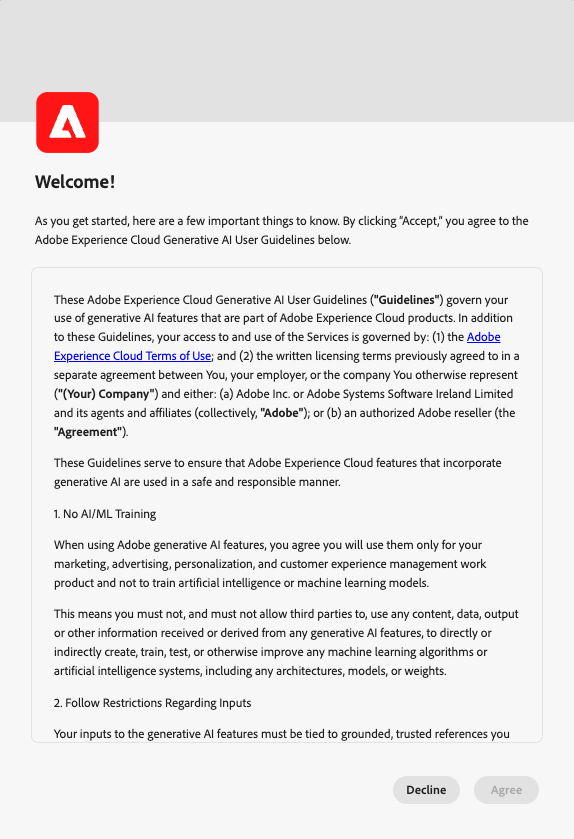

# AI Assistant i Adobe Experience Platform

Följande video är avsedd att ge stöd för din förståelse av AI Assistant.

>[!VIDEO](https://video.tv.adobe.com/v/3429845?learn=on)

Läs det här dokumentet om du vill veta mer om AI Assistant i Adobe Experience Platform.

AI-assistenten i Adobe Experience Platform är en konversationsupplevelse som du kan använda för att påskynda dina arbetsflöden i Adobe-programmen. Du kan använda AI-assistenten för att lära dig mer om produkter, felsöka problem eller söka efter information och få insikter om användningen. AI-assistenten stöder Experience Platform, plattformen för kunddata i realtid, Adobe Journey Optimizer och Customer Journey Analytics.

>[!IMPORTANT]
>
>Du måste godkänna ett [användaravtal](https://www.adobe.com/legal/licenses-terms/adobe-dx-gen-ai-user-guidelines.html) innan du kan använda AI-assistenten. Användaravtalet innehåller även det allmänna betaavtalet. Detta gör att du kan använda ytterligare AI Assistant-funktioner när de lanseras i en betapacitet.

+++Välj för att visa användaravtalsgränssnittet

+++

## Förstå AI-assistenten {#understanding-ai-assistant}

AI Assistant besvarar dina inskickade frågor genom att fråga en databas och sedan omvandla data från databasen till ett läsbart svar.

Den här interna representationen av underliggande data kallas också **[!DNL Knowledge Graph]** - en omfattande webbplats med koncept, data och metadata för ett givet svar.

[!DNL Knowledge Graph] består av deldiagram som refereras till när frågor skickas:

* Kundens operativa insikter.
* Kundens operativa insikter i olika metabutiker.
* Experience League dokumentation.

Det finns två frågeklasser att tänka på innan du frågar AI Assistant:

### Produktkunskap {#product-knowledge}

Produktkännedom avser begrepp och ämnen som anges i Experience League dokumentation. Produktkunskapsfrågor kan specificeras ytterligare i följande undergrupper:

| Produktkunskap | Exempel |
| --- | --- |
| Undervisning | <ul><li>Vad är skillnaden mellan en identitet och en primär eller extern nyckel?</li><li>Vad är lookalike-målgrupper?</li></ul> |
| Öppna identifiering | <ul><li>Hur exporterar jag den här datauppsättningen?</li><li>Finns det scheman för vårdkunder?</li></ul> |
| Felsökning | <ul><li>Varför kan jag inte aktivera ett schema som ägs av Adobe för en profil?</li><li>Varför kan jag inte ta bort ett segment?</li></ul> |

{style="table-layout:auto"}

I följande video finns mer information om produktkännedom för AI Assistant:

>[!VIDEO](https://video.tv.adobe.com/v/3438032/?learn=on)

### Driftsinsikter {#operational-insights}

>[!IMPORTANT]
>
>Svar på frågor om driftsinsikter finns i betaversionen. Alla som har åtkomst till behörigheten **Visa driftsinsikter** har åtkomst till användningsinsikter och svar.

Användningsinsikter hänvisar till svar på AI Assistant genererar om dina metadata-objekt (attribut, målgrupper, dataflöden, datauppsättningar, destinationer, resor, scheman och källor), inklusive antal, sökningar och linjepåverkan. Den tittar inte på några data i sandlådan.

* Hur många datauppsättningar har jag?
* Hur många schemaattribut har aldrig använts?
* Vilka målgrupper har aktiverats?

Du kan ställa frågor till AI Assistant om dina operativa insikter i följande domäner:

| Domän | Metadata som stöds | Metadata som inte stöds |
| --- | --- | --- |
| Attribut | <ul><li>Sök attributnamn</li><li>Attribut - schemarelation</li><li>Attribut - datauppsättningsrelation</li><li>Attribut - målgruppsrelation</li><li>Attribut - målrelation</li></ul> | <ul><li>Klassen Attribute</li><li>Granskning</li><li>Föråldringsstatus</li><li>Etiketter</li><li>Värde lagrat i attribut</li></ul> |
| Målgrupper | <ul><li>Antal målgrupper</li><li>Målgruppstyp (direktuppspelning eller batch)</li><li>Skapande-/ändringsdatum</li><li>Aktiveringsstatus</li><li>Profilantal</li><li>Duplicera målgrupper</li><li>Sök efter målgruppsdefinition</li><li>Målgrupp - målgruppsrelation</li><li>Målgrupp - attributrelation</li><li>Målgrupp - datauppsättningsrelation</li><li>Målgrupp - målrelation</li><li>Namnsökning</li><li>Sök namn och ID | <ul><li>Målgruppsöverlappningar</li><li>Målgruppsaktivering</li><li>Målgrupp - kampanjrelationer</li><li>Granskning</li><li>Skapa/ändra</li><li>Etiketter</li><li>Profilkvalificeringstrender</li></ul> |
| Dataflöden | <ul><li>Antal dataflöden</li><li>Dataflödesstatus</li><li>Dataflöde - Datauppsättningsrelation</li><li>Dataflöd - källrelation</li></ul> | <ul><li>Skapande/ändring</li><li>Dataflödesbatchrelationer</li><li>Antal infogningsprofiler</li></ul> |
| Datauppsättningar | <ul><li>Antal data</li><li>Aktivera profilstatus</li><li>Skapad/ändrad den</li><li>Datauppsättning - schemarelation</li><li>Datauppsättning - målgruppsrelation</li><li>Datauppsättning - attributrelation</li><li>Datauppsättning - dataflödesrelation</li><li>Namnsökning </li><li>Sök namn och ID</li></ul> | <ul><li>Granskning</li><li>Skapad av</li><li>Datauppsättning - batchrelation</li><li>Skapa/ändra datauppsättning</li><li>Datauppsättningsstorlek</li><li>Antal profiler</li><li>Antal rader</li><li>Värdesökning</li></ul> |
| Mål | <ul><li>Konfigurerade destinationsantal</li><li>Mål - målgruppsrelation</li><li>Destinationsattributrelation</li></ul> | <ul><li>Kontoinställning</li><li>Autentiseringsinformation för konto</li><li>Unika profiler har aktiverats</li></ul> |
| Resor | <ul><li>Antal</li><li>Namnsökning</li><li>Sök namn och ID</li><li>Resestatus</li><li>Utlöst status (målgrupp kontra händelse)</li><li>Skapande-/ändringsdatum</li><li>Återkommande frekvens</li></ul> | <ul><li>Attribut - reserelationer</li><li>Granskning</li><li>Skapande/ändring</li><li>Skapad av</li><li>Händelser</li><li>Resa - datauppsättning</li><li>Resa - schema</li><li>Erbjudanden</li><li>Profilkvalificeringstrender</li><li>Steg för händelser</li></ul> |
| Scheman | <ul><li>Antal scheman</li><li>Skapad/ändrad den</li><li>Schema - attributrelation</li><li>Schema - datauppsättningsrelation</li><li>Schema - målgruppsrelation</li><li>Aktivera profilstatus</li><li>Namnsökning</li><li>Sök namn och ID</li></ul> | <ul><li>Granskning</li><li>Skapande/ändring</li><li>Skapad av</li><li>Fältgrupper</li><li>Identiteter</li><li>Identitetsnamnutrymmen</li><li>Etiketter</li><li>Antal profiler</li></ul> |
| Källor | <ul><li>Konton</li><li>Kontostatus</li><li>Aktiva/inaktiva dataflöden för varje konto</li><li>Source-anslutning - dataflödesrelation</li><li>Source-konto - dataflödesrelation</li></ul> | <ul><li>Information om kontoautentiseringsuppgifter</li><li>Kontoinställning</li><li>Mätvärden för dataöverföring</li><li>Antal profiler</li><li>Source - batchrelationer</li></ul> |

{style="table-layout:auto"}

När det gäller frågor om driftsinsikter kanske svaren inte speglar det aktuella läget för användargränssnittet. De data som stödjer dessa frågor uppdateras en gång var 24:e timme. De ändringar som användare gör i Real-Time CDP under dagtid synkroniseras till exempel med datalager på natten och blir sedan tillgängliga för användarfrågor på morgonen. Du måste logga in i en sandlåda för att få veta mer om specifika data som är relaterade till objekt.

### Funktionsomfång {#feature-scope}

För närvarande har AI Assistant följande omfattning:

* [Produktkunskap](./home.md#product-knowledge): AI Assistant kan besvara produktkunskapsfrågor för Experience Platform, Real-time Customer Data Platform och Adobe Journey Optimizer. Du kan också gå in i produktinformationsämnen för Customer Journey Analytics, men bara via användargränssnittet i Customer Journey Analytics.
* [Driftsinsikter](./home.md#operational-insights): Du kan ställa frågor till AI Assistant om driftsinsikter för följande dataobjekt: attribut, målgrupper, dataflöden, datauppsättningar, destinationer, resor, scheman och källor.

## Nästa steg

Nu när du har en allmän förståelse för AI Assistant kan du fortsätta använda AI Assistant under arbetsflödena. Mer information finns i följande dokumentation:

* [Användargränssnittshandbok för AI Assistant](./ui-guide.md)
* [Funktionsåtkomst](./access.md)
* [Frågeguide](./questions.md)
* [Integritet, säkerhet och styrning i AI Assistant](./privacy.md)
* [Vanliga frågor och svar](./faq.md)
