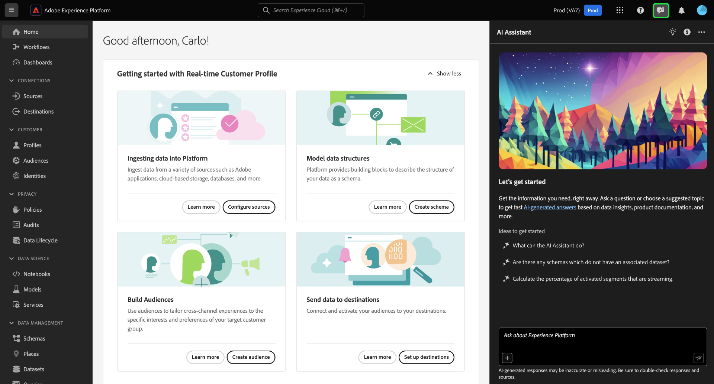
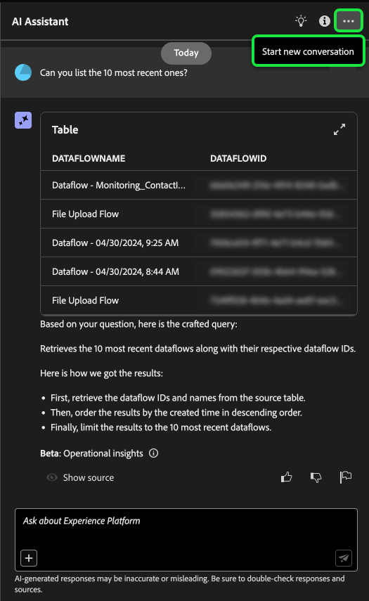

# Användargränssnittshandbok för AI Assistant

Läs den här guiden och lär dig hur du kan använda AI Assistant i Adobe Experience Platform-gränssnittet.

## Åtkomst till AI-assistenten i användargränssnittet i Experience Platform

Om du vill starta AI Assistant väljer du **[!UICONTROL AI Assistant icon]** i Experience Platform-gränssnittets övre sidhuvud.

Gränssnittet för AI Assistant visas och du får information om hur du kommer igång direkt. Du kan använda alternativen under [!UICONTROL Ideas to get started] för att besvara frågor och kommandon som:

* [!UICONTROL Which of my audiences are activated?]
* [!UICONTROL What is a schema?]
* [!UICONTROL Tell me some common use cases for Real-Time CDP]

## Användargränssnittshandbok för AI Assistant

>[!NOTE]
>
>Följande arbetsflöde är ett exempel som använder processen för att skapa händelseschema för att illustrera hur du kan använda AI Assistant när du använder användargränssnittet i Experience Platform.

Tänk på ett användningsfall där du skapar en **enhetshandel i händelseschema**. När händelseschemat för upplevelse skapades, stötte du på fältet `eventType`. &quot;I det här skedet kan du antingen avsluta ditt arbetsflöde och hänvisa till [grunderna i en schemakomposition](../xdm/schema/composition.md) eller använda AI Assistant för att få svar på dina frågor och hitta ytterligare resurser via de dokumentationslänkar som rekommenderas av AI Assistant.&quot;

Börja med att ange din fråga i textrutan. I exemplet nedan anges frågan: **Vad är fältet eventType i ett ExperienceEvent-schema?**?

AI Assistant frågar sedan efter sin kunskapsbas och beräknar ett svar. Efter en stund returnerar AI Assistant ett svar och relaterade förslag som du kan använda som uppföljningsuppmaningar.

När du har fått ett svar från AI Assistant kan du välja bland ett antal alternativ som avgör hur du vill fortsätta.

### AI Assistant-funktioner {#features}

I det här avsnittet beskrivs de olika funktionerna i AI Assistant som du kan använda i dina arbetsflöden på Experience Platform.

### Visa operativa dataobjekt {#view-operational-data-objects}

Beroende på din fråga innehåller AI Assistant ytterligare information om data i din sandlåda. Om du vill visa hur svaret på din fråga gäller för din specifika sandlåda väljer du **[!UICONTROL In your sandbox].**

När du visar data som gäller din sandlåda kan AI Assistant tillhandahålla direktlänkar till specifika UI-sidor som visar dina efterfrågade data.

+++Markera för att visa exempel

I det här exemplet returnerar AI Assistant ytterligare information om befintliga XDM-scheman i sandlådan, inklusive totalt antal och de fem vanligaste fälten.

+++

### Visa citat {#view-citations}

Du kan verifiera svar som AI Assistant skickat till dig genom att granska citat som finns i varje produktinformationssvar.

+++Markera för att visa ett exempel på hur du visar källor

Om du vill visa citat och validera AI Assistants svar väljer du **[!UICONTROL Show sources]**.

AI Assistant uppdaterar gränssnittet och ger dig länkar till dokumentation som bekräftar det ursprungliga svaret. När citat är aktiverat uppdaterar AI Assistant svaret så att det innehåller fotnoter som anger vilka delar av svaret som refererar till den angivna dokumentationen.

Du kan också använda de förslag som AI Assistant ger under **[!UICONTROL Related suggestions]** för att ytterligare utforska ämnen som hör till din ursprungliga fråga.

+++

### Driftsinsikter {#operational-insights}

Du måste vara i en aktiv sandlåda för att AI Assistant ska kunna svara tillräckligt på en fråga om dina operativa insikter.

+++Välj för att visa ett exempel på en fråga om driftsinsikter

I exemplet nedan tillfrågas följande om AI Assistant: **Visa dataflöden som har skapats med Amazon S3-källan**.

AI Assistant svarar sedan med en tabell över dina dataflöden och deras motsvarande ID:n. Om du vill visa hela datatabellen väljer du ikonen Expandera högst upp till höger.

En utökad vy av tabellen visas med en mer omfattande lista över dataflöden baserat på parametrarna för frågan.

När AI Assistant tillfrågas om driftsinsikter kan den förklara hur svaret har beräknats. I exemplet nedan visar AI Assistant de steg som har vidtagits för att identifiera dataflödena som skapades med källan [!DNL Amazon S3].

Du kan även lägga till filter och ändringar i dina frågor och du kan instruera AI Assistant att återge resultatet baserat på de filter som du inkluderar. Du kan till exempel be AI Assistant att visa en trend för antalet segmentdefinitioner i den ordning som de skapades, ta bort segmentdefinitioner med noll som summor och använda namn på månader i stället för heltal när data visas.

**Obs!** Svaren om driftsinsikter finns för närvarande i betaversion. Klicka på verktygstipsikonen i AI Assistant-användargränssnittet för att visa Beta-meddelandet och för en länk till dokumentationen.

+++

### Verifiera svar från operativa insikter {#verify-responses}

Du kan verifiera varje svar som rör frågor om driftsinsikter med hjälp av en SQL-fråga som AI Assistant tillhandahåller.

+++Välj för att visa exempel på verifiering av svar på operativa insikter

När du har fått ett svar på en fråga om driftsinsikter väljer du **[!UICONTROL Show sources]** och sedan **[!UICONTROL View source query]**.

När AI Assistant får en fråga om driftsinsikter kan du använda den för att verifiera processen som tog att beräkna svaret. Den här källfrågan är endast avsedd för verifiering och stöds inte av frågetjänsten.

+++

### Använd automatisk komplettering {#use-auto-complete}

Du kan använda funktionen för automatisk komplettering för att ta emot en lista med dataobjekt som finns i din sandlåda. Rekommendationer som fylls i automatiskt finns tillgängliga för följande domäner: målgrupper, scheman, datamängder, källor och destinationer.

+++Markera för att visa ett exempel på automatisk komplettering

Du kan använda Fyll i automatiskt genom att ta med plustecknet (**`+`**) i frågan. Du kan också välja plustecknet (**`+`**) längst ned i textrutan. Ett fönster visas med en lista över rekommenderade dataobjekt från sandlådan.

+++

### Använda flera omgångar {#use-multi-turn}

Du kan använda AI Assistants multibläddringsfunktioner för att få en mer naturlig konversation under upplevelsen. AI Assistant kan besvara uppföljningsfrågor. det sammanhanget kan härledas från en tidigare interaktion.

+++Markera för att visa ett exempel på flera omgångar

I exemplet nedan ombeds AI Assistant först att ange det totala antalet dataflöden och sedan ombeds att ange en lista över de 10 senaste dataflödena.

+++

### Starta en ny konversation

Du kan ändra ämnen med AI Assistant genom att återställa och starta en ny konversation.

+++Välj för att visa ett exempel på hur du återställer konversationen

Återställ genom att markera ellipserna (**`...`**) i AI Assistant-gränssnittet och sedan välja **[!UICONTROL Start new conversation]**. Detta informerar AI Assistant om att du avser att ändra ämnen och kan vara särskilt användbart vid felsökning av frågor som antingen är felaktiga eller refererar till felaktig information.

+++

### Använd identifiering {#use-discoverability}

Du kan använda AI Assistants identifieringsfunktion för att visa en lista över allmänna ämnen, grupperade i entiteter, som AI Assistant stöder.

+++Markera för att visa exempel på identifierbarhet

Om du vill visa upptäckbarhet väljer du glödlampsikonen i det övre huvudet i AI Assistant-gränssnittet.

Välj sedan en kategori och välj en fråga i listan. Du kan använda den här funktionen för att få en bättre uppfattning om vilka typer av frågor som AI Assistant kan svara på. Du kan även uppdatera befintliga uppmaningar med specifik information som gäller din sandlåda med fritext eller [autofyll](#use-auto-complete).

+++

## Ge feedback {#feedback}

Du kan ge återkoppling om din upplevelse med AI Assistant med hjälp av alternativen i svaret.

Om du vill ge feedback väljer du antingen tummen uppåt, tummen nedåt eller en flagga när du har fått ett svar från AI-assistenten och anger sedan din feedback i textrutan.

+++Markera för att visa fler exempel

>[!BEGINTABS]

>[!TAB Tummen uppåt]

Välj ikonen med tummen uppåt för att ge feedback på vad som gick bra med din upplevelse av AI-assistenten.

>[!TAB Tummen nere]

Välj ikonen med reglaget nedåt för att ge feedback på vad som kan förbättras baserat på din erfarenhet av AI Assistant. Under det här steget kan du även ge specifika kommentarer om din upplevelse. Synpunkter i kommentarerna granskas dagligen.

>[!TAB Flagga]

Välj flaggikonen om du vill visa fler rapporter om din upplevelse med hjälp av AI-assistenten.

>[!ENDTABS]

+++
