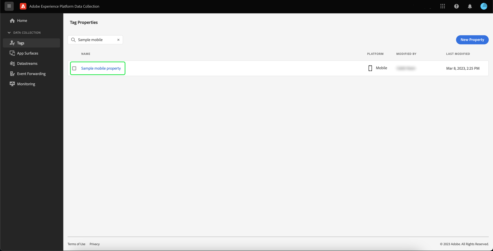

# Implementera Adobe Experience Platform Assurance-tillägget

I den här självstudiekursen beskrivs hur du installerar och implementerar tillägget Experience Platform Assurance i Mobile SDK. Instruktioner om hur du lägger till Assurance-tillägget i ditt program finns i [översikten över Adobe Experience Platform Assurance-tillägget](https://developer.adobe.com/client-sdks/documentation/platform-assurance-sdk/#add-the-aep-assurance-extension-to-your-app).

## Komma igång

För att installera och implementera Assurance-tillägget måste du ha tillgång till följande tjänster:

- Användargränssnittet för [Adobe Experience Platform-datainsamling](https://experience.adobe.com/#/data-collection/)
- [Adobe Experience Platform Assurance](https://experience.adobe.com/assurance)

## Skapa en mobil egenskap

>[!NOTE]
>
>Om du redan har en mobil egenskap kan du gå vidare till nästa steg.

Välj **[!UICONTROL Tags]** i användargränssnittet för datainsamling. En lista över mobil- och webbegenskaper visas med information om egenskaperna som tillhör din organisation. Välj **[!UICONTROL New property]** om du vill skapa en ny egenskap.

Sidan **[!UICONTROL Create Property]** visas. Ange namnet på den nya egenskapen och välj **[!UICONTROL Mobile]** som plattform. När du har infogat dina uppgifter väljer du **[!UICONTROL Save]** för att skapa den mobila egenskapen.

>[!NOTE]
>
>Inställningen **[!UICONTROL Privacy]** för den mobila egenskapen påverkar **inte** Assurance datainsamling.

## Installera Assurance-tillägget

Markera den mobila egenskap i vilken du vill installera Assurance-tillägget.

Sidan **Information om mobil egenskap** visas. Välj **[!UICONTROL Extensions]** om du vill visa en lista över de tillägg som för närvarande är associerade med din mobila egenskap.

Välj **[!UICONTROL Catalog]** om du vill visa en lista över tillägg som du kan lägga till i egenskapen mobile. Leta reda på tillägget **[!UICONTROL AEP Assurance]** med hjälp av filtret och välj **[!UICONTROL Install]**.

## Nästa steg

Nu när du har installerat Assurance-tillägget i din mobila egendom kan du börja använda Assurance i dina program. Läs [Översikt över Adobe Experience Platform Assurance-tillägget](https://developer.adobe.com/client-sdks/documentation/platform-assurance-sdk/#add-the-aep-assurance-extension-to-your-app) om du vill veta hur du lägger till Assurance-tillägget i ditt program. Om du vill lära dig hur du använder Assurance kan du läsa [med hjälp av Assurance guide](./using-assurance.md).
