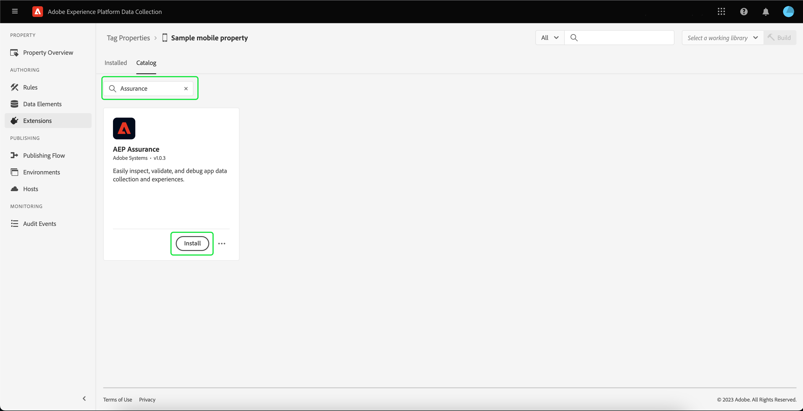

# Implementera Adobe Experience Platform Assurance-tillägget

I den här självstudiekursen beskrivs hur du installerar och implementerar plattformstillägget i Mobile SDK. Instruktioner om hur du lägger till Assurance-tillägget i programmet finns i [Adobe Experience Platform Assurance-tilläggsöversikt](https://developer.adobe.com/client-sdks/documentation/platform-assurance-sdk/#add-the-aep-assurance-extension-to-your-app).

## Komma igång

För att kunna installera och implementera Assurance-tillägget måste du ha tillgång till följande tjänster:

- The [Adobe Experience Platform Data Collection UI](https://experience.adobe.com/#/data-collection/)
- [Adobe Experience Platform Assurance](https://experience.adobe.com/assurance)

## Skapa en mobil egenskap

>[!NOTE]
>
>Om du redan har en mobil egenskap kan du fortsätta till nästa steg.

I användargränssnittet för datainsamling väljer du **[!UICONTROL Tags]**. En lista över mobil- och webbegenskaper visas med information om egenskaperna som tillhör din organisation. Välj **[!UICONTROL New property]** för att skapa en ny egenskap.

The **[!UICONTROL Create Property]** visas. Ange namnet på den nya egenskapen och välj **[!UICONTROL Mobile]** som din plattform. När du har infogat dina uppgifter väljer du **[!UICONTROL Save]** för att skapa egenskapen mobile.

>[!NOTE]
>
>Egenskapens mobile **[!UICONTROL Privacy]** inställningen gör **not** påverka Assurance-datainsamlingen.

## Installera Assurance-tillägget

Välj den mobila egenskap som du vill installera Assurance-tillägget i.

The **information om mobil egenskap** visas. Välj **[!UICONTROL Extensions]** för att visa en lista över de tillägg som för närvarande är kopplade till din mobila egenskap.

Välj **[!UICONTROL Catalog]** om du vill visa en lista med tillägg som du kan lägga till i egenskapen mobile. Använd filtret för att leta reda på **[!UICONTROL AEP Assurance]** och markera **[!UICONTROL Install]**.

## Nästa steg

Nu när du har installerat tillägget Assurance i din mobila egenskap kan du börja använda Assurance i dina program. Läs mer om hur du lägger till tillägget Assurance i programmet i [Adobe Experience Platform Assurance-tilläggsöversikt](https://developer.adobe.com/client-sdks/documentation/platform-assurance-sdk/#add-the-aep-assurance-extension-to-your-app). Läs mer om hur du använder Assurance i [med hjälp av Assurance-guiden](./using-assurance.md).
