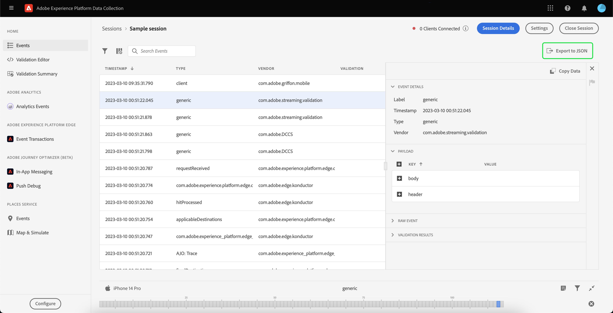

# Använda Adobe Experience Platform Assurance

I den här självstudiekursen beskrivs hur du använder Adobe Experience Platform Assurance. Instruktioner om hur du installerar och implementerar Adobe Experience Platform Assurance-tillägget finns i självstudiekursen om [implementera tillägget Assurance](./implement-assurance.md).

## Skapa sessioner

När du loggat in på [Försäkringsgränssnitt](https://experience.adobe.com/assurance)kan du välja **[!UICONTROL Create Session]** för att börja skapa en session.

The **[!UICONTROL Create New Session]** visas. Läs instruktionerna och fortsätt genom att välja **[!UICONTROL Start]**.

Nu kan du ange ett namn som identifierar sessionen och sedan ange en **[!UICONTROL Base URL]** (djuplänknings-URL för din app). När du har angett dessa uppgifter väljer du **[!UICONTROL Next]**.

>[!INFO]
>
>Bas-URL är rotdefinitionen som används för att starta programmet från en URL. En sessions-URL skapas som du kan använda för att initiera Assurance-sessionen. Ett exempelvärde kan se ut så här: `myapp://default` I **[!UICONTROL Base URL]** anger du programmets grundläggande definition av djuplänken.

## Anslut till en session

När du har skapat en session ser du till att du ser **[!UICONTROL Create New Session]** visas nu en länk, en QR-kod och en PIN-kod.

Om den här dialogrutan visas kan du antingen använda enhetens kameraapp för att skanna QR-koden och öppna din app eller kopiera länken och öppna den i din app. När appen startas bör du se hur skärmen för PIN-koden visas. Skriv PIN-koden från föregående steg och tryck på **[!UICONTROL Connect]**.

Du kan verifiera att din app är ansluten till Assurance när Adobe Experience Platform-ikonen (röd Adobe &quot;A&quot;) visas i din app.

## Exportera en session

Om du vill exportera en Assurance-session väljer du **[!UICONTROL Export to JSON]** i en session:

Exportalternativet respekterar sökfilterresultat och exporterar endast händelser som visas i händelseläget. Om du t.ex. sökte efter &quot;spåra&quot;-händelser och sedan väljer **[!UICONTROL Export to JSON]**, exporteras bara&quot;track&quot;-händelseresultatet&quot;.
