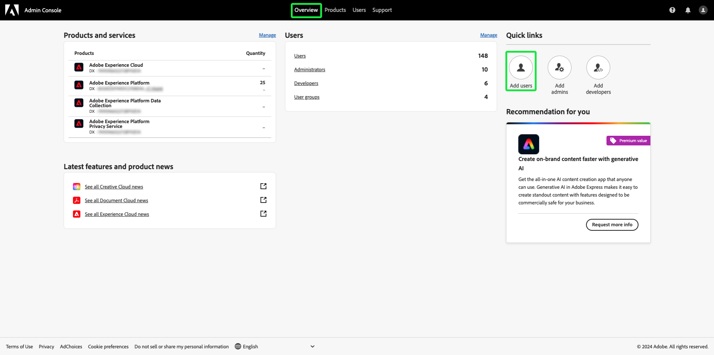

# Användaråtkomst

Ge användare åtkomst till [!UICONTROL Assurance] genom att lägga till dem i en produktprofil i Adobe Experience Platform genom att utföra följande steg i [Adobe Admin Console](https://adminconsole.adobe.com/):

## Lägga till användare i Adobe Experience Platform via en produktprofil {#adding-product-profile}

Om du vill lägga till en användare i en produktprofil loggar du in på [Adobe Admin Console](https://adminconsole.adobe.com/). Välj **[!UICONTROL Add users]** på fliken **[!UICONTROL Overview]** i användargränssnittet för Admin Console.

Dialogrutan **[!UICONTROL Add users to your team]** visas. Ange e-postadressen eller användarnamnet för den person som du vill lägga till och välj sedan **[!UICONTROL Add as a new user]**.

Två textrutor visas för att ange en valfri **[!UICONTROL First name]** och en valfri **[!UICONTROL Last name]**. **[!UICONTROL SSO username]** fylls i automatiskt tillsammans med **[!UICONTROL Country]** inuti listrutan. Kontrollera att båda dessa alternativ är korrekta och gör nödvändiga justeringar. När allt är korrekt väljer du **[!UICONTROL Products]**.

Dialogrutan **[!UICONTROL Select product]** visas. Välj Adobe Experience Platform.

Dialogrutan **[!UICONTROL Select product profiles]** visas med en lista över produktprofiler. Välj en produktprofil och välj sedan **[!UICONTROL Apply]**. Du kan lägga till ytterligare produkter och produktprofiler genom att upprepa dessa steg.

Dubbelkontrollera att allt är rätt för användaren. Härifrån kan du lägga till ytterligare användare eller spara dina ändringar genom att välja **[!UICONTROL Save]**.

