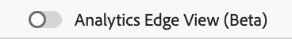

# Analyshändelser 2.0 i Assurance

Med Analytics Events 2.0 får du en bättre bild av SDK-händelser som användare kan felsöka och validera sin Adobe Analytics-implementering. I vyn visas händelser som skickats till Adobe Analytics från [Adobe Experience Platform Edge Network SDK](https://developer.adobe.com/client-sdks/edge/edge-network/) samt [Adobe Experience Platform Mobile SDK](https://developer.adobe.com/client-sdks/solution/adobe-analytics/). Vyn innehåller även en informationspanel, som innehåller en kontext om hur händelsen bearbetades av klient-SDK och av de överordnade tjänsterna efter att den lämnat enheten.

## Komma igång

Om du vill använda den här vyn utför du följande steg:

1. [Konfigurera Adobe Experience Platform Assurance](../tutorials/implement-assurance.md).
2. [Skapa och anslut till en Assurance-session](../tutorials/using-assurance.md).
3. Välj **Analyshändelser 2.0 (Beta)** i kontrollgränssnittet **Hem** till vänster. Om du inte ser det här alternativet väljer du **Konfigurera** längst ned till vänster i fönstret, lägger till **Analyshändelser 2.0 (Beta)** och väljer **Spara**.

## Analytics Edge view

Använd Analytics Edge-vyn om du använder mobiltilläggen **Edge Network** eller **Edge Bridge** . Den här vyn aktiveras när växeln Analytics Edge (Beta) i det övre högra hörnet aktiveras och Analytics-händelserna som skickas via Edge-nätverket visas i den aktuella sessionen. Detta omfattar alla händelser som har utlösts av Lifecycle-tillägget, Edge-tillägget och/eller Edge Bridge-tillägget.

Analytics-vyn i Edge innehåller information om Analytics-relaterade Edge-händelser och Lifecycle-händelser som skickas av klienten. Genom att välja en händelse i listan, visar panelen för händelseinformationsvyn till höger de händelser som har bearbetats av klient-SDK och av den överordnade tjänsten efter att de har lämnat enheten. På så sätt kan du enkelt visa kedjan med händelser som ett anrop har resulterat i.

Händelsen **Efterbearbetade data** i listan bekräftar att data har bearbetats och skickats till Adobe Analytics. Om händelsen eller några bearbetade data saknas kan användarna expandera varje händelse i listan för att visa detaljerad felsökningsinformation.

### Analysera vyn med information om Edge Event

För en Edge request-händelse eller en Analytics track-händelse innehåller den detaljerade vyn följande delar:

* Händelseinformation: En ursprunglig SDK edge-begärandehändelse.
* Edge Bridge Request: An event exclusively for the Edge Bridge Extension workflow.
* Datastream: En händelse som representeras för datastream för den här sessionen.
* Edge Hit Received: Representerar träffen från Edge.
* Edge Träff Bearbetad: Representerar träffen som bearbetats i Edge.
* Analysträff: Representerar träffen som tagits emot från Analytics.
* Analysmappning: Representerar datamappningsstatus i Analytics.
* Responsade analyser: Svarsstatus från Analytics.
* Efterbearbetningsdata: Information om händelsen som innehåller mappningen av revar, evar och props.

### Analytics Edge Validation

Med valideringsvyn i Analytics Edge kan du enkelt se resultaten för valideringsskript som hör till Analytics Edge. Fel som visas av validerare kan innehålla länkar till den plats där de ska korrigeras eller visa händelser som är i feltillstånd.

## Vy för analyshändelser

Använd Analytics-händelseläget om du använder mobiltillägget **Adobe Analytics** . I den här vyn kan du enkelt se Analytics-händelser som skickas från en ansluten klient, inklusive Track Action, Track State och Lifecycle-händelser. Den här vyn är aktiv medan alternativet &quot;Analytics Edge (Beta)&quot; längst upp till höger är inaktiverat.

Genom att välja en av Analytics-händelserna i händelsetabellen kan du visa information om hur händelsen bearbetades på den högra panelen.

### Efterbearbetad status

När SDK har gjort en nätverksbegäran med Adobe Analytics får du veta om Assurance kunde hämta efterbearbetningsinformationen för Adobe Analytics-begäran. Vyn Analyshändelser måste förbli aktiv medan efterbearbetningsstatusen är aktiv efter att begäran har utlösts.

Observera att den inloggade användaren måste ha tillgång till motsvarande rapportserie för att kunna hämta efterbearbetningsinformation.

| Status | Beskrivning |
| :----- | :---------- |
| `Queued` | Nätverksbegäran hämtar efterbearbetningsinformationen. |
| `Processed` | Nätverksbegäran har slutförts och efterbearbetningsinformationen har tagits emot. |
| `Delayed` | Maximalt antal begäranden om hämtning av efterbearbetningsinformation har överskridits. |
| `Error` | Ett fel gjorde att nätverksbegäran misslyckades. Mer information om felet visas i vyn med händelseinformation. |
| `Unauthorized` | Användaren har inte åtkomst till Adobe Analytics rapportserie. |
| `Unavailable` | Adobe Analytics-begäran har ingen motsvarande `AnalyticsResponse`-händelse. |
| `No Debug Flag` | Den aktuella Adobe Analytics- eller Assurance SDK-versionen kanske inte har stöd för analysfelsökningsfunktionen. Mer information finns i [felsökningsguiden](../troubleshooting.md). |
| `Expired` | Händelsen `AnalyticsTrack` eller `LifecycleStart` är äldre än 24 timmar. |

### Vyn Händelseinformation

För en Analytics-spårningshändelse innehåller den detaljerade vyn följande delar:

* En SDK Analytics-begärandehändelse som har sitt ursprung.
* Metadata och kontextdata från begäran, till exempel rapportsviter-ID, SDK-tilläggsversioner och kontextdata.
* Efterbearbetad information om Analytics-händelsen som innehåller mappningen av varv, evar och props.

### Analysvyvalidering

I valideringsvyn kan du enkelt se resultaten för valideringsskript som hör till Analytics (Analyser). Fel som visas av validerare kan innehålla länkar till den plats där de ska korrigeras eller visa händelser som är i feltillstånd.

