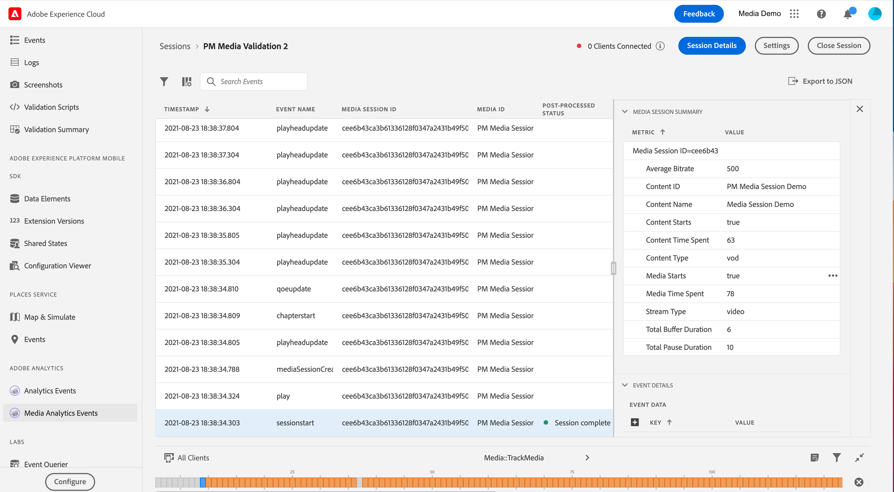

# Adobe Analytics for Streaming Media view in Assurance

Tack vare integrationen mellan Adobe Analytics för direktuppspelningsmedia och Adobe Experience Platform Assurance kan ni nu validera Media Analytics-implementeringen i mobilappen. I mediaanalysvyer visas vad som spåras i mediesessionen, till exempel:

- Starthändelse för session som innehåller allt innehåll, alla standardmetadata och anpassade metadataegenskaper samt händelser för sessionsslut och sessionsslut.
- Start- och Ad Start-händelser för annonsbrytning med alla annonsegenskaper bifogade, samt Skip- och Complete-händelser för båda.
- Kapitelstart med alla egenskaper bifogade, samt kapitelhoppa och kapitelslutförda händelser.
- Alla uppspelningsändringshändelser (uppspelning, paus, buffert, fel, ändring av bithastighet).
- Alla spårningshändelser för spelarlägesändring (start, slut).

När data har bearbetats i Analytics är status och data som efterbearbetats, till exempel hur mycket tid som har ägnats åt media och den totala paustiden, också tillgängliga i händelsedetaljvyn.

## Komma igång

Kontrollera att du har följande tjänster innan du fortsätter:

- The [Adobe Experience Platform Data Collection UI](https://experience.adobe.com/#/data-collection/)
- [Adobe Experience Platform Assurance](https://experience.adobe.com/assurance)

Läs mer om hur du installerar Assurance i programmet i [implementera Assurance-guide](../tutorials/implement-assurance.md).

## Använd Assurance med Adobe Analytics för direktuppspelningsmedia

När du har anslutit och konfigurerat din app för Adobe Analytics kan du konfigurera den för Streaming Media Analytics. Längst ned på den vänstra panelen väljer du **[!UICONTROL Configure]** för att lägga till vyn Medieanalyshändelser och **Spara** den.

När du har lagt till väljer du **[!UICONTROL Media Analytics Events]** visa i **[!UICONTROL Adobe Analytics]** för att verifiera din sessionsspårning.

I **[!UICONTROL Media Analytics Events]** kan du söka och filtrera efter sessions-ID (VSID) för att visa en viss mediesession. Om du vill visa ytterligare händelseinformation väljer du en specifik händelse.

Om du vill få en mer koncis vy över API-anrop kan du även dölja uppdateringshändelserna för spelhuvudet genom att välja **[!UICONTROL Hide Playhead Update events]** filter.

>[!INFO]
>
>SDK-versioner måste användas för att visa efterbearbetade medieanalysdata: Android Media 2.1.2 och iOS AEPMedia 3.0.1 (eller senare)

Om du vill visa efterbearbetade data ska du söka efter sessionens starthändelse och validera i statuskolumnen att sessionen har slutförts. Om du är klar klickar du på händelsen för att visa en sammanfattning av mediesessioner i händelsedetaljvyn. Om du vill ha mer information bläddrar du nedåt för att hitta den efterbearbetade informationen.

