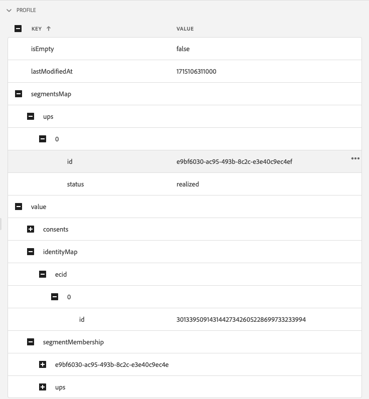

# Edge Delivery View in Assurance

Vyn **[!UICONTROL Edge Delivery]** i **[!UICONTROL Adobe Experience Platform Assurance]** ger möjlighet att inspektera och validera [!UICONTROL AJO Inbound]-kantleverans av meddelanden till dina webb- och mobilappar. Den här vyn är särskilt användbar när du vill felsöka leveransen av [!UICONTROL AJO Inbound] webb- och mobilkampanjer och resor.

## Komma igång

Kontrollera att du har tillgång till följande tjänster innan du fortsätter:

- Användargränssnittet för [Adobe Experience Platform-datainsamling](https://experience.adobe.com/#/data-collection/)
- [Adobe Experience Platform Assurance](https://experience.adobe.com/assurance)

Om du vill lära dig hur du installerar **[!UICONTROL Assurance]** i ditt program kan du läsa [implementeringsguiden](../tutorials/implement-assurance.md).

## Använd försäkring med Edge Delivery

När du har öppnat en **[!UICONTROL Assurance]**-session kan du lägga till vyn **[!UICONTROL Edge Delivery]** i **[!UICONTROL Assurance]**. Längst ned på den vänstra panelen väljer du **[!UICONTROL Configure]** för att lägga till **[!UICONTROL Edge Delivery]**-vyn och **Spara** den.

När du har lagt till den väljer du vyn **[!UICONTROL Edge Delivery]** i avsnittet **[!UICONTROL Adobe Journey Optimizer]** för att validera inkommande kantleverans.

## Lista över förfrågningar

På vys huvudfönster visas en lista med begäranden om kantleverans. I den här listan visas alla [!UICONTROL Inbound AJO] begäranden som gjorts till Experience Edge och som bearbetats av **[!UICONTROL Inbound Delivery Service]**, inklusive begäranden om att hämta personaliseringsbeslut, samt spåra interaktioner för personaliseringsförslag (till exempel visa, klicka, utlösa eller avvisa).

Begäranden beställs med tidsstämpel, med de senaste förfrågningarna överst. Förutom tidsstämpeln innehåller listan även en kolumn för begärande-ID samt typ av begäran, som kan vara något av följande:

- **[!UICONTROL Experience Delivery]**: En begäran om att hämta personaliseringsbeslut
- **[!UICONTROL Experience Interactions]**: En begäran om att spåra interaktioner för personaliseringsförslag
- **[!UICONTROL Experience Delivery & Interactions]**: En begäran om att hämta personaliseringsbeslut inklusive interaktioner för personaliseringsförslag
- **[!UICONTROL Preview Delivery]**: En begäran om att hämta beslut om personalisering av förhandsgranskning

Förfrågningar kan också filtreras genom att du anger en sökterm i sökfältet högst upp i listan. Detta är användbart när du filtrerar efter specifika värden, som ID:n.

## Detaljerade granskningar

När en begäran har valts i huvudvyn visas detaljerad information om den valda begäran till höger. Den här vyn innehåller följande avsnitt:

### Översikt över begäran

I det här avsnittet finns en översikt på hög nivå över den valda begäran, inklusive [!UICONTROL Organization ID], [!UICONTROL Edge cluster], [!UICONTROL Request ID] och [!UICONTROL Request type], [!UICONTROL Sandbox ID], [!UICONTROL Sandbox name], [!UICONTROL Datastream ID], samt en lista över begäranytor vid [!UICONTROL Experience Delivery]-begäranden.

### Profil

I det här avsnittet finns information om profildata som används vid bearbetningen av begäran, inklusive inställningar för identitetskarta, segmentmedlemskap och samtycke.\
Avsnittet [!UICONTROL Profile] är mycket användbart när du felsöker problem som leveransen inte fungerar som förväntat på grund av att segmentmedlemskapet saknas eller är försenat, eller om du avanmäler dig.

### Kvalificerade aktiviteter

I det här avsnittet finns en lista med aktiviteter som är kvalificerade för den valda begäran, inklusive aktivitetstyp, ID, ID-namnutrymme, ytor, schema och målgrupper. Mer detaljerad information om aktiviteten finns i avsnittet [rå körningsspårning](#execution).

### Icke-kvalificerade aktiviteter

I det här avsnittet finns en lista över aktiviteter som har uteslutits från att kvalificeras. Förutom aktivitetstyp, ID:n, identitetsnamnutrymmen, ytor, scheman och målgrupper innehåller det här avsnittet även en lista med orsaker till varför aktiviteten var okvalificerad.

### Meddelandeinformation

I det här avsnittet finns detaljerad information om de meddelanden som levererades för den valda begäran. Den innehåller meddelande-ID, fragment, beslutsprinciper, [!UICONTROL Offer Decisioning]-parametrar samt meddelandets valskontext.

### Interaktioner

I det här avsnittet finns detaljerad information om de interaktioner som spårades i den valda begäran. Den innehåller interaktionstypen (under `propositionEventType`) samt tillhörande förslagsmetadata, till exempel aktivitetsmetadata (under `scopeDetails.activity`) och proposition-händelsetoken (i `scopeDetails.characteristics.eventToken`).

### Raw-spår

I det här avsnittet finns de råa spårningarna för den valda begäran. Den innehåller den fullständiga spårningen av begäran, inklusive den faktiska begäran som togs emot i **[!UICONTROL Inbound Delivery Service]**, körningsspårning och svarsspårning. Detta är användbart för avancerad felsökning, t.ex. leverans som inte fungerar som förväntat på grund av att leveranstjänsten inte är tillgänglig, att data saknas eller är felaktiga, eller för att förstå hela flödet av begärandebearbetning.

#### Begäran

Begäranspårningen innehåller den fullständiga begäran som den togs emot av **[!UICONTROL Inbound Delivery Service]** **[!UICONTROL Konductor]** uppströms. Den innehåller begäranderubriker, brödtext och andra metadata. XDM-nyttolasten för begäran kan till exempel granskas i fältet `event.body.xdm`.

#### Körning

Körningsspårningen innehåller den fullständiga spårningen av begäran när den bearbetades av **[!UICONTROL Inbound Delivery Service]**. Den visar körningskontext, aktivitetskvalificering, meddelandeurval och andra bearbetningssteg. Eventuella fel eller varningar som uppstod under bearbetningen av begäran finns i fälten `context.messages` och `context.exceptions`. Detaljerad information om aktivitetskvalificering finns i fälten `context.qualifiedActivitiesDetailed` och `context.unqualifiedActivitiesDetailed`.

#### Svar

Svarsspårningen innehåller det fullständiga svaret eftersom det returnerades av **[!UICONTROL Inbound Delivery Service]** nedströms till **[!UICONTROL Konductor]**. Den innehåller svarshuvuden, brödtext och andra metadata. Hela svarstexten kan inspekteras genom att meddelandet med ID `1` kopieras till Urklipp med knappen **[!UICONTROL Copy Value]** och klistras in i ett JSON-visningsprogram.

