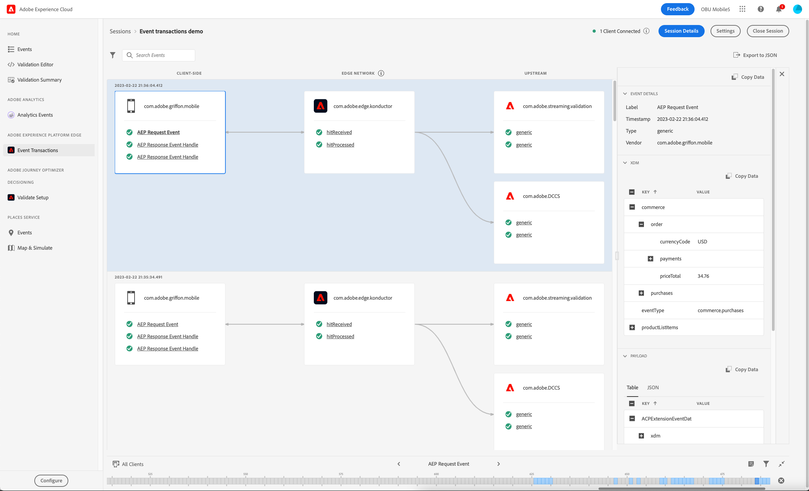

# Vyn Händelsetransaktioner

Med händelsetransaktionsvyn i Adobe Experience Platform Assurance kan du validera och felsöka implementeringen av Edge Network-klienten och se valideringsresultaten i det övre flödet i nära realtid.

## Ställ in Assurance för Edge Network-arbetsflödet

Efter [ställa in Assurance](../tutorials/implement-assurance.md)kontrollerar du att du har implementerat de senaste versionerna av tilläggen Assurance och Edge Network i din app.

Om du vill visa dina händelser väljer du **[!UICONTROL Event Transactions]** under **[!UICONTROL Adobe Experience Platform Edge]** -avsnitt.

Om det här alternativet inte visas väljer du **[!UICONTROL Configure]** i fönstrets nedre vänstra hörn lägger du till **[!UICONTROL Event Transactions]** visa och välja **[!UICONTROL Save]**.

## Kom igång med vyn Händelsetransaktioner

I det här avsnittet får du lära dig att bekanta dig med händelsetransaktionsvyn och lära dig hur du använder den effektivt för validering från början till slut i Edge Network-arbetsflöden.

### Händelsebearbetningsflöde

I vyn Händelsetransaktioner visas tre kolumner i ordningen för händelsebearbetningsflödet:

- **[!UICONTROL Client-side]**: I den här kolumnen visas händelser som har bearbetats eller tagits emot på klientsidan och som är tillgängliga för Mobile SDK. Detta inkluderar händelser som skapats med ett API-anrop, som `Edge.sendEvent`och eventuella referenser till svarshändelser som klienten tar emot från Edge Network-servern. Exempel på händelser på klientsidan:
   - AEP Request Event är den händelse som skickas via Edge-tillägget och innehåller XDM och valfria frihandsdata.
   - AEP Response Event Handle är den händelsereferens som tas emot från Edge Network som svar på en AEP Request-händelse. En request-händelse kan ta emot ingen, en eller flera händelsehanterare för svar.
   - AEP-felsvar kan ses om ett fel uppstår, t.ex. om XDM-nyttolasten inte kunde bearbetas eller om en av de överordnade tjänsterna returnerade ett fel eller en varning.
- **[!UICONTROL Edge Network]**: I den här kolumnen visas händelsen som har tagits emot på servern av Edge Network via en nätverksbegäran och vilka data och metadata händelsen innehåller.
- **[!UICONTROL Upstream]**: I den här kolumnen visas händelser som tagits emot av de konfigurerade överordnade tjänsterna, inklusive detaljerad information om behandlings- och/eller valideringsresultaten för den inkommande händelsen.
Observera att den här kolumnen är dynamisk och kan visa olika typer av information beroende på två huvudfaktorer:
   - Datastream-konfigurationen och de tjänster som är aktiverade på den.
   - Den typ av händelse som skickas till Edge-nätverket.

### Inspect event

De händelser som visas i vyn Händelsetransaktioner innehåller information om format och innehåll för de data som bearbetas vid varje tillstånd, samt detaljerad information om varningar eller fel som påträffas när data bearbetas uppströms. Vyn minskar felsökningsinformationen på händelse-/begärandenivå och identifierar fel tidigt under utvecklingscykeln.

#### Expandera händelseinformationen

Om du vill inspektera en händelse markerar du den i vyn. Den här åtgärden utökar **[!UICONTROL Event Details]** till höger på skärmen.
Kapslade data visas i ett trädformat. Du kan inspektera kapslade nyckelvärden genom att välja **+** (plus) till vänster om tangentnamnet.

#### Inspect-varningar eller fel

Varje händelsenamn har en ikon som anger status på hög nivå för bearbetningen av händelsen:

- Om händelsen har bearbetats utan fel visas en grön bockmarkering.
- Om varningar eller fel har upptäckts visas ett varningstecken. Välj den relaterade händelsen om du vill veta mer om orsaken till varningen eller felet i **[!UICONTROL Event Details]** vy.

### Konfigurationsinställningar

Du kan kontrollera den aktuella datastream-identifieraren genom att välja info-verktygstipset bredvid **[!UICONTROL Edge Network]** kolumnrubrik.

>[!INFO]
>
>När flera klienter ansluter till samma Assurance-session och olika data-ID används, visas alla här. Detta innebär dock inte att den aktuella implementeringen använder flera datastreams. Det är bara det aktuella datastream-ID som anges i taggen (egenskapen mobile) som används av appen som används för att bearbeta nya händelser från den klienten. När du testar mer komplicerade användningsfall med olika konfigurationsinställningar och flera klienter anslutna kan det vara praktiskt att använda separata ASSY-sessioner för att förenkla valideringsprocessen.
