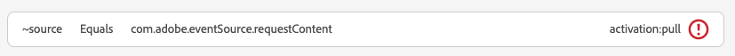

# Vyn Meddelanden i appen i Assurance

Vyn Meddelanden i appen i Adobe Experience Platform Assurance ger möjlighet att validera din app, övervaka meddelanden i appen som skickas till din enhet och simulera meddelanden till din enhet.

## Meddelanden på enheten

Överst på fliken **[!UICONTROL Messages on Device]** finns en **[!UICONTROL Message]**-listruta. Detta inkluderar alla meddelanden som har tagits emot i Assurance-sessionen. Om ett meddelande inte finns med i den här listan betyder det att programmet aldrig har tagit emot det.


Om du väljer ett meddelande visas mycket information om det meddelandet, vilket beskrivs i avsnitten nedan.

### Förhandsgranska meddelande

I den högra panelen finns en **[!UICONTROL Message Preview]**-ruta som visar en förhandsgranskning av meddelandet. Om du väljer **[!UICONTROL Simulate on Device]** skickas meddelandet till alla enheter som är anslutna till sessionen.


### Meddelandebeteende

Under rutan **[!UICONTROL Message Preview]** finns fliken **[!UICONTROL Message Behavior]**. Här finns all information om hur meddelandet visas. Den här informationen innehåller positioneringsinformation, animeringar, svepningsgester och utseendeinställningar.


### Fliken Info

I det vänstra avsnittet finns det fyra flikar som visar information om meddelandet. Fliken **[!UICONTROL Info]** visar information som lästs in från Adobe Journey Optimizer (AJO) om meddelandekampanjen.

Du kan också välja **[!UICONTROL View campaign]** för att öppna meddelandet i AJO för granskning eller redigering.


### Fliken Regler

Fliken **[!UICONTROL Rules]** visar vad som behöver hända för att det här meddelandet ska visas. Detta ger insikt i exakt vad som kommer att utlösa ett meddelande som ska visas. Titta på det här exemplet:


I exemplet visas tre olika villkor för regeln. Om du väljer en händelse (från en händelselista, fliken Analysera eller på tidslinjen) utvärderas händelsen mot dessa regler. Om händelsen matchar ett villkor visas en grön bockmarkering:


Om händelsen inte matchar visas en röd ikon:



Om alla tre villkoren matchar den aktuella händelsen visas meddelandet.

### Fliken Analysera

Fliken **[!UICONTROL Analyze]** ger ytterligare insikter om reglerna. Här filtrerar vi alla händelser i sessionen baserat på hur nära vår meddelanderegel matchar händelsen.


I exemplet i avsnittet **[!UICONTROL Rules Tab]** finns det tre villkor i regeln. På den här fliken visas hur stor procentandel av regeln som varje händelse matchar. De flesta händelser matchar vid 33 % (ett av tre villkor) och resten matchar vid 100 %.

Det innebär att du kan hitta händelser som är nära att matcha men som inte helt matchar regeln.


Med skjutreglaget **[!UICONTROL Match Threshold]** kan du filtrera vilka händelser som ska visas. Detta kan till exempel anges till 50-90 % för att få en lista över händelser som matchar exakt två av de tre villkoren.

### Fliken Interaktioner

Fliken **[!UICONTROL Interactions]** visar en lista med interaktionshändelser som har skickats till Edge för spårningsändamål.


Det finns vanligtvis fyra interaktionshändelser varje gång ett meddelande visas:

```
trigger > display > interact > dismiss
```

Interaktionsinteraktionen har ett ytterligare åtgärdsvärde som är associerat med den. Möjliga värden är &quot;klickat&quot; eller &quot;avbryt&quot;.

Valideringskolumnen visar om interaktionshändelsen togs emot och bearbetades på rätt sätt av Edge.

## Validering

Fliken **[!UICONTROL Validation]** kör valideringar mot din aktuella session och kontrollerar om appen har konfigurerats för meddelanden i appen korrekt:


Om fel hittas kommer detaljerad information om hur du åtgärdar dessa fel.

## Händelselista


Fliken **[!UICONTROL Event List]** ger dig en snabb översikt över alla händelser i Assurance-sessionen som är relaterade till meddelanden i appen. Några av de händelser du kan se här är:

* Begäranden och svar för att hämta meddelanden
* Visa meddelandehändelser
* Interaktionsspårningshändelser

I den här vyn kan du använda många av standardfunktionerna för händelselistor, bland annat använda sökningar, använda filter, lägga till eller ta bort kolumner och exportera data.

Välj en händelse om du vill visa händelsens råinformation på den högra panelen.

På rätt informationspanel kan den valda händelsen flaggas, vilket är praktiskt att markera något som ska granskas av en annan person.
