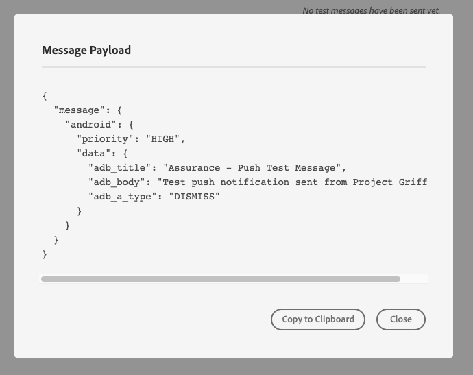

# Push-felsökningsvy

I push-felsökningsvyn i Adobe Experience Platform Assurance kan du validera push-konfigurationen för din app och skicka ett testmeddelande till din enhet.

## Klienter

Klientens listruta innehåller en lista över varje unik klient som har anslutit till denna Assurance-session. En klient är antingen en unik enhet eller en unik programinstallation för en enhet. Om till exempel en Android-enhet och en iOS-enhet har anslutits till sessionen, visas dessa klienter i listrutan Klienter.

När du har installerat om och återanslutit programmet på en enhet visas en annan klient. Om det redan finns en enhet med det namnet lägger den nya listrutan till en siffra 2 till namnet.

Den här vyn är bara aktiverad för en enskild klient, så om du väljer en annan klient ändras informationen på skärmen.

## Validera inställningar

Fliken **[!UICONTROL Validate Setup]** validerar och ger ytterligare information om programmets push-konfiguration. Det finns tre paneler som utför valideringar. De visar en grön bockmarkering om valideringarna lyckas. Om det finns tre gröna bockmarkeringar har appen konfigurerats korrekt för push-meddelanden, skriver push-tokens till användarprofilen och har en associerad kanalkonfiguration konfigurerad.

Om något inte fungerar som väntat visas ett varningsmeddelande med information om hur du åtgärdar problemet:

### Klientinformation

Den här panelen kontrollerar om enheten är korrekt konfigurerad. Detta inkluderar konfiguration av tillägget i användargränssnittet för datainsamling, initiering av tillägget och dess förutsättningar i programmet samt hämtning av push-token från enheten.

Om det är giltigt visas enhetens ECID, push-token, Edge Sandbox-namn och -typ på panelen.

### Profilinformation

När klienten är korrekt konfigurerad kontrollerar den här panelen om enheten skriver till en profil. Den validerar också att push-token i profilen matchar den på enheten.

Om det är giltigt visas enhetens ECID, push-token, programmets program-ID, meddelandeplattformen och om push-token har nekats. Token kan nekas av olika anledningar som att användaren har avinstallerat programmet eller att användaren har inaktiverat push-meddelanden för programmet.

Längst ned på panelen finns en länk som öppnar den här profilen på en ny flik.

### Autentiseringsuppgifter och konfiguration för AppStore

Den här panelen kontrollerar att program-ID:t och meddelandeplattformen som sparades i profilen har en matchande kanalkonfiguration skapad. En kanalkonfiguration är där push-autentiseringsuppgifter för programmet överförs.

Om profilen är giltig visas kanalkonfigurationens namn, program-ID:t och meddelandetjänstens namn.

## Skicka testpush

Fliken **[!UICONTROL Send Test Push]** kan användas för att skicka ett testmeddelande till enheten.

Det finns flera rutor som kan konfigureras för att testa olika push-funktioner i iOS och Android. När du har konfigurerat dig väljer du **[!UICONTROL Send Test Push Notification]** för att skicka meddelandet.

### Meddelande

I rutan **[!UICONTROL Message]** kan du ange en rubrik och brödtext för meddelandet. Funktionen för tyst meddelande kan även aktiveras här.

### Skjut mål

I rutan **[!UICONTROL Push Target]** kan du anpassa vilken push-token och kanalkonfiguration som ska användas när push-meddelandet skickas.

Den här informationen anges som standard om fliken **[!UICONTROL Validate Setup]** visar tre gröna bockmarkeringar. Du kan dock ange en egen push-token och kanalkonfiguration, även om appen inte är helt konfigurerad.

### Klickbeteende

I rutan **[!UICONTROL Click Behavior]** kan du välja vilket beteende som ska vara när användaren klickar på push-meddelandet på enheten. Som standard öppnas programmet, men du kan öppna en länk eller en webbsida.

Om du väljer att använda en depålänk måste apputvecklaren skapa en åt dig.

### Multimedia

I rutan **[!UICONTROL Rich Media]** kan du lägga till extra media i meddelandet, till exempel en bild, en video eller GIF. Apputvecklaren måste lägga till kod i appen för att den här funktionen ska kunna aktiveras.

### Knappar

I rutan **[!UICONTROL Buttons]** kan du lägga till extra knappar i push-meddelandet. Varje knapp kan öppna programmet, öppna en länk till programmet eller öppna en webbsida.

Apputvecklaren måste lägga till kod i appen för att den här funktionen ska kunna aktiveras.

### Anpassade data

I rutan **[!UICONTROL Custom Data]** kan du lägga till anpassade data i push-meddelandet. Varje nyckel/värde-par skickas som metadata tillsammans med meddelandet och kan användas av utvecklare för att skapa kraftfulla upplevelser och lägga till ytterligare spårning.

## Testresultat

När du har skickat ett meddelande tar **[!UICONTROL Test Results]**-avsnittet emot data från push-tjänsterna för meddelandet. Här ser du om meddelandet har skickats till Google/iOS meddelandetjänster:

Om några problem uppstår visas de här:

## Avancerat

### Visa meddelandenyttolast

Bredvid knappen **[!UICONTROL Send Test Push Notification]** finns en uppsättning ellipser med en snabbmeny. Härifrån kan du visa meddelandets nyttolast. På så sätt kan du se exakt vilket meddelande som kommer att skickas till fjärrmeddelandetjänsten. Du kan granska den här nyttolasten eller kopiera och klistra in den i ett push-testverktyg.

