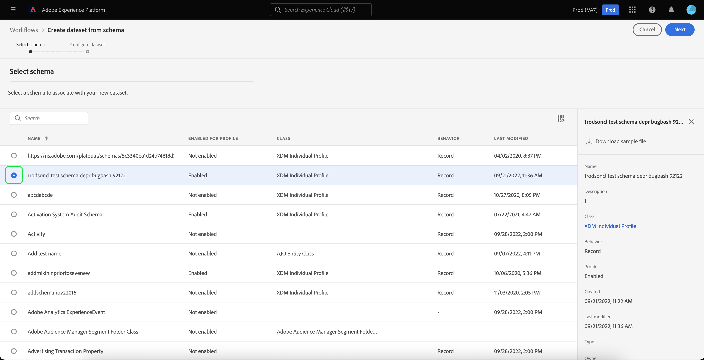
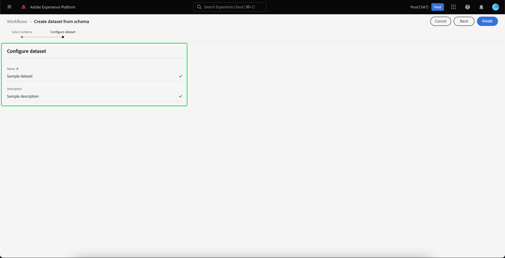

# Användargränssnittshandbok för datauppsättningar

Den här användarhandboken innehåller anvisningar om hur du utför vanliga åtgärder när du arbetar med datauppsättningar i Adobe Experience Platform användargränssnitt.

## Komma igång

Användarhandboken kräver en fungerande förståelse av följande komponenter i Adobe Experience Platform:

* [Datauppsättningar](overview.md): Konstruktionen för lagring och hantering av databeständighet i [!DNL Experience Platform].
* [[!DNL Experience Data Model (XDM) System]](../../xdm/home.md): Det standardiserade ramverk som [!DNL Experience Platform] organiserar kundupplevelsedata.
   * [Grunderna för schemakomposition](../../xdm/schema/composition.md): Lär dig mer om de grundläggande byggstenarna i XDM-scheman, inklusive viktiga principer och bästa praxis när det gäller schemakomposition.
   * [Schemaredigerare](../../xdm/tutorials/create-schema-ui.md): Lär dig hur du skapar egna anpassade XDM-scheman med [!DNL Schema Editor] inom [!DNL Platform] användargränssnitt.
* [[!DNL Real-Time Customer Profile]](../../profile/home.md): Ger en enhetlig konsumentprofil i realtid baserad på aggregerade data från flera källor.
* [[!DNL Adobe Experience Platform Data Governance]](../../data-governance/home.md): Se till att era kunddata är kompatibla med regler, begränsningar och policyer.

## Visa datauppsättningar {#view-datasets}

>[!CONTEXTUALHELP]
>id="platform_datasets_negative_numbers"
>title="Negativa tal i datauppsättningsaktivitet"
>abstract="Negativa tal i importerade poster innebär att en användare har tagit bort vissa batchar i ett valt tidsintervall."
>text="Learn more in documentation"

>[!CONTEXTUALHELP]
>id="platform_datasets_browse_daysRemaining"
>title="Utgångsdatum för datauppsättning"
>abstract="Den här kolumnen anger antalet dagar som måldatauppsättningen har kvar innan den automatiskt upphör att gälla."

I [!DNL Experience Platform] Gränssnitt, välj **[!UICONTROL Datasets]** i den vänstra navigeringen för att öppna **[!UICONTROL Datasets]** kontrollpanel. Kontrollpanelen visar alla tillgängliga datauppsättningar för din organisation. Information visas för varje datamängd som anges, inklusive namn, schema som datauppsättningen följer och status för den senaste importen.

Som standard visas bara de datauppsättningar som du har kapslat in i. Om du vill se de systemgenererade datauppsättningarna aktiverar du **[!UICONTROL Show system datasets]** växla. Systemgenererade datauppsättningar används bara för att bearbeta andra komponenter. Den systemgenererade exportdatamängden för profiler används till exempel för att bearbeta kontrollpanelen för profiler.

Markera namnet på en datauppsättning för att komma åt dess **[!UICONTROL Dataset activity]** och se information om den datauppsättning du valde. Fliken Aktivitet innehåller ett diagram som visar hur många meddelanden som har förbrukats samt en lista över lyckade och misslyckade batchar.

## Förhandsgranska en datauppsättning

Från **[!UICONTROL Dataset activity]** skärm, välja **[!UICONTROL Preview dataset]** i skärmens övre högra hörn om du vill förhandsgranska upp till 100 rader med data. Om datauppsättningen är tom inaktiveras förhandsgranskningslänken och det står i stället att förhandsvisningen inte är tillgänglig.

I förhandsgranskningsfönstret visas den hierarkiska vyn av datasetens schema till höger.

För mer robusta metoder att få tillgång till dina data [!DNL Experience Platform] tillhandahåller tjänster längre fram i kedjan som [!DNL Query Service] och [!DNL JupyterLab] att utforska och analysera data. Mer information finns i följande dokument:

* [Översikt över frågetjänsten](../../query-service/home.md)
* [Användarhandbok för JupyterLab](../../data-science-workspace/jupyterlab/overview.md)

## Skapa en datauppsättning {#create}

Om du vill skapa en ny datauppsättning börjar du med att välja **[!UICONTROL Create dataset]** i **[!UICONTROL Datasets]** kontrollpanel.

På nästa skärm visas följande två alternativ för att skapa en ny datauppsättning:

* [Skapa datauppsättning från schema](#schema)
* [Skapa datauppsättning från CSV-fil](#csv)

### Skapa en datauppsättning med ett befintligt schema {#schema}

I **[!UICONTROL Create dataset]** skärm, välja **[!UICONTROL Create dataset from schema]** för att skapa en ny tom datauppsättning.

The **[!UICONTROL Select schema]** visas. Bläddra i schemalistan och välj det schema som datauppsättningen ska följa innan du väljer **[!UICONTROL Next]**.

The **[!UICONTROL Configure dataset]** visas. Ange ett namn och en valfri beskrivning för datauppsättningen och välj sedan **[!UICONTROL Finish]** för att skapa datauppsättningen.

### Skapa en datauppsättning med en CSV-fil {#csv}

När en datauppsättning skapas med en CSV-fil skapas ett ad hoc-schema som ger datauppsättningen en struktur som matchar den angivna CSV-filen. I **[!UICONTROL Create dataset]** skärm, välja **[!UICONTROL Create dataset from CSV file]**.

The **[!UICONTROL Configure]** visas. Ange ett namn och en valfri beskrivning för datauppsättningen och välj sedan **[!UICONTROL Next]**.

The **[!UICONTROL Add data]** visas. Överför CSV-filen genom att antingen dra och släppa den mitt på skärmen eller välja **[!UICONTROL Browse]** för att utforska din filkatalog. Filen kan vara upp till tio gigabyte stor. När CSV-filen har överförts väljer du **[!UICONTROL Save]** för att skapa datauppsättningen.

>[!NOTE]
>
>CSV-kolumnnamn måste börja med alfanumeriska tecken och får bara innehålla bokstäver, siffror och understreck.

## Aktivera en datauppsättning för kundprofil i realtid {#enable-profile}

Alla datauppsättningar har möjlighet att förbättra kundprofiler med inkapslade data. Det gör du genom att schemat som datauppsättningen följer måste vara kompatibelt för användning i [!DNL Real-Time Customer Profile]. Ett kompatibelt schema uppfyller följande krav:

* Schemat har minst ett attribut angivet som en identitetsegenskap.
* Schemat har en identitetsegenskap definierad som primär identitet.

Mer information om hur du aktiverar ett schema för [!DNL Profile], se [Användarhandbok för Schemaredigeraren](../../xdm/tutorials/create-schema-ui.md).

Om du vill aktivera en datauppsättning för profilen har du åtkomst till dess **[!UICONTROL Dataset activity]** och väljer **[!UICONTROL Profile]** växla i **[!UICONTROL Properties]** kolumn. När den är aktiverad används även data som är inkapslade i datauppsättningen för att fylla i kundprofiler.

>[!NOTE]
>
>Om en datauppsättning redan innehåller data och sedan aktiveras för [!DNL Profile], används befintliga data inte automatiskt av [!DNL Profile]. När en datauppsättning har aktiverats för [!DNL Profile]rekommenderar vi att du återimporterar befintliga data så att de bidrar till kundprofilerna.

## Hantera och tillämpa datastyrning på en datauppsättning {#manage-and-enforce-data-governance}

Dataanvändningsetiketter, som används på schemanivå, gör att du kan kategorisera datamängder och fält enligt de användarprofiler som gäller för dessa data. Se [Datastyrning - översikt](../../data-governance/home.md) om du vill veta mer om etiketter eller se [användarhandbok för dataanvändningsrubriker](../../data-governance/labels/overview.md) för instruktioner om hur du använder etiketter på scheman för spridning till datauppsättningar.

## Ta bort en datauppsättning {#delete}

Du kan ta bort en datauppsättning genom att först komma åt den **[!UICONTROL Dataset activity]** skärm. Välj sedan **[!UICONTROL Delete dataset]** för att ta bort den.

>[!NOTE]
>
>Datauppsättningar som skapas och används av program och tjänster från Adobe (t.ex. Adobe Analytics, Adobe Audience Manager eller [!DNL Offer Decisioning]) kan inte tas bort.

En bekräftelseruta visas. Välj **[!UICONTROL Delete]** för att bekräfta borttagningen av datauppsättningen.

## Ta bort en profilaktiverad datauppsättning

Om en datauppsättning är aktiverad för profil tas den bort från datasjön, identitetstjänsten och profilarkivet inom plattformen om den tas bort via användargränssnittet.

Du kan ta bort en datauppsättning från [!DNL Profile] lagra endast (data lämnas kvar i Data Lake) med hjälp av kundprofils-API:t i realtid. Mer information finns i [API-slutpunktsguide för profilsystemjobb](../../profile/api/profile-system-jobs.md).

## Övervaka datainmatning

I [!DNL Experience Platform] Gränssnitt, välj **[!UICONTROL Monitoring]** i den vänstra navigeringen. The **[!UICONTROL Monitoring]** Med kontrollpanelen kan du visa status för inkommande data från antingen batch- eller direktuppspelningsinmatning. Om du vill visa status för enskilda grupper väljer du antingen **[!UICONTROL Batch end-to-end]** eller **[!UICONTROL Streaming end-to-end]**. På kontrollpanelerna visas alla grupper- eller direktuppspelningsöppningar, inklusive de som har slutförts, misslyckats eller fortfarande pågår. Varje lista innehåller information om batchen, inklusive batch-ID:t, namnet på måldatauppsättningen och antalet poster som har importerats. Om måldatauppsättningen är aktiverad för [!DNL Profile]visas även antalet inkapslade identitets- och profilposter.

Du kan välja en individ **[!UICONTROL Batch ID]** för att komma åt **[!UICONTROL Batch overview]** kontrollpanelen och se information om gruppen, inklusive felloggar om gruppen inte kan importera.

Om du vill ta bort gruppen kan du göra det genom att markera **[!UICONTROL Delete batch]** som finns uppe till höger på kontrollpanelen. Om du gör det tas även posterna bort från den datauppsättning som batchen ursprungligen skapades i.

## Nästa steg

I den här användarhandboken finns anvisningar om hur du utför vanliga åtgärder när du arbetar med datauppsättningar i [!DNL Experience Platform] användargränssnitt. För steg om att utföra vanliga [!DNL Platform] arbetsflöden som innehåller datauppsättningar, se följande självstudiekurser:

* [Skapa en datauppsättning med API:er](create.md)
* [Fråga datauppsättningsdata med API:t för dataåtkomst](../../data-access/home.md)
* [Konfigurera en datauppsättning för kundprofil och identitetstjänst i realtid med API:er](../../profile/tutorials/dataset-configuration.md)
