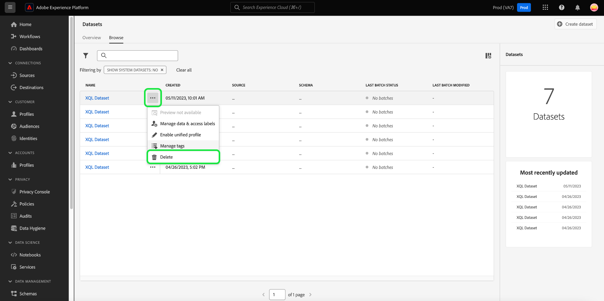

# Användargränssnittshandbok för datauppsättningar

Den här användarhandboken innehåller anvisningar om hur du utför vanliga åtgärder när du arbetar med datauppsättningar i Adobe Experience Platform användargränssnitt.

## Komma igång

Användarhandboken kräver en fungerande förståelse av följande komponenter i Adobe Experience Platform:

* [Datauppsättningar](overview.md): Konstruktionen för lagring och hantering av databeständighet i [!DNL Experience Platform].
* [[!DNL Experience Data Model (XDM) System]](../../xdm/home.md): Det standardiserade ramverk som [!DNL Experience Platform] organiserar kundupplevelsedata.
   * [Grunderna för schemakomposition](../../xdm/schema/composition.md): Lär dig mer om de grundläggande byggstenarna i XDM-scheman, inklusive viktiga principer och bästa praxis när det gäller schemakomposition.
   * [Schemaredigeraren](../../xdm/tutorials/create-schema-ui.md): Lär dig hur du skapar egna anpassade XDM-scheman med [!DNL Schema Editor] inom [!DNL Platform] användargränssnitt.
* [[!DNL Real-Time Customer Profile]](../../profile/home.md): Ger en enhetlig konsumentprofil i realtid baserad på aggregerade data från flera källor.
* [[!DNL Adobe Experience Platform Data Governance]](../../data-governance/home.md): Säkerställ regelefterlevnad, begränsningar och regler för användningen av kunddata.

## Visa datauppsättningar {#view-datasets}

>[!CONTEXTUALHELP]
>id="platform_datasets_negative_numbers"
>title="Negativa tal i datauppsättningsaktivitet"
>abstract="Negativa tal i importerade poster innebär att en användare har tagit bort vissa batchar i ett valt tidsintervall."
>text="Learn more in documentation"

>[!CONTEXTUALHELP]
>id="platform_datasets_browse_daysRemaining"
>title="Utgångsdatum för datauppsättning"
>abstract="Den här kolumnen anger antalet dagar som måldatauppsättningen har kvar innan den automatiskt upphör att gälla."

I [!DNL Experience Platform] Gränssnitt, välj **[!UICONTROL Datasets]** i den vänstra navigeringen för att öppna **[!UICONTROL Datasets]** kontrollpanel. Kontrollpanelen visar alla tillgängliga datauppsättningar för din organisation. Information visas för varje datamängd som anges, inklusive namn, schema som datauppsättningen följer och status för den senaste importen.

Välj namnet på en datauppsättning på menyn [!UICONTROL Browse] flik för att komma åt **[!UICONTROL Dataset activity]** och se information om den datauppsättning du valde. Fliken Aktivitet innehåller ett diagram som visar hur många meddelanden som har förbrukats samt en lista över lyckade och misslyckade batchar.

## Fler åtgärder {#more-actions}

Du kan [!UICONTROL Delete] eller [!UICONTROL Enable a dataset for Profile] från [!UICONTROL Dataset] informationsvy. Om du vill se tillgängliga åtgärder väljer du **[!UICONTROL ... More]** längst upp till höger i användargränssnittet. Listrutan visas.

![Arbetsytan Datauppsättningar med [!UICONTROL ... More] listrutan är markerad.](../images/datasets/user-guide/more-actions.png)

Om du väljer **[!UICONTROL Enable a dataset for Profile]** visas en bekräftelsedialogruta. Välj **[!UICONTROL Enable]** för att bekräfta ditt val.

>[!NOTE]
>
>Om du vill aktivera en datauppsättning för profil måste schemat som datauppsättningen följer vara kompatibelt för användning i kundprofilen i realtid. Se [Aktivera en datauppsättning för profil](#enable-profile) för mer information.

Om du väljer **[!UICONTROL Delete]**, [!UICONTROL Delete dataset] bekräftelsedialogrutan visas. Välj **[!UICONTROL Delete]** för att bekräfta ditt val.

>[!NOTE]
>
>Du kan inte ta bort systemdatauppsättningar.

Du kan också ta bort en datauppsättning eller lägga till en datauppsättning för användning med kundprofilen i realtid från de infogade åtgärderna på [!UICONTROL Browse] -fliken. Se [avsnitt med infogade åtgärder](#inline-actions) för mer information.

## Inline-datauppsättningsåtgärder {#inline-actions}

Användargränssnittet för datauppsättningar erbjuder nu en samling infogade åtgärder för varje tillgänglig datauppsättning. Markera ellipsen (..) för en datauppsättning som du vill hantera för att visa de tillgängliga alternativen på en snabbmeny. De tillgängliga åtgärderna omfattar följande: [[!UICONTROL Preview dataset]](#preview), [[!UICONTROL Manage data and access labels]](#manage-and-enforce-data-governance), [[!UICONTROL Enable unified profile]](#enable-profile), [[!UICONTROL Manage tags]](#add-tags), [[!UICONTROL Move to folders]](#move-to-folders)och [[!UICONTROL Delete]](#delete). Mer information om de här tillgängliga åtgärderna finns i respektive avsnitt.

### Lägg till datauppsättningstaggar {#add-tags}

Lägg till egna taggar för att ordna datauppsättningar och förbättra sök-, filtrerings- och sorteringsfunktionerna. Från [!UICONTROL Browse] -fliken i [!UICONTROL Datasets] väljer du ellipsen för en datauppsättning som du vill hantera följt av **[!UICONTROL Manage tags]** i listrutan.

The [!UICONTROL Manage tags] visas. Ange en kort beskrivning för att skapa en anpassad tagg eller välj från en befintlig tagg för att märka datauppsättningen. Välj **[!UICONTROL Save]** för att bekräfta inställningarna.

The [!UICONTROL Manage tags] kan även ta bort befintliga taggar från en datauppsättning. Markera bara x bredvid taggen som du vill ta bort och markera **[!UICONTROL Save]**.

När en tagg har lagts till i en datauppsättning kan datauppsättningarna filtreras baserat på motsvarande tagg. Se avsnittet om hur du [filtrera datamängder efter taggar](#enable-profile) för mer information.

Mer information om hur du klassificerar affärsobjekt för enklare identifiering och kategorisering finns i handboken [hantera metadatatataxonomier](../../administrative-tags/ui/managing-tags.md). I den här guiden beskrivs hur en användare med lämplig behörighet kan skapa fördefinierade taggar, tilldela kategorier till taggar och utföra alla relaterade CRUD-åtgärder för taggar och taggkategorier i plattformens användargränssnitt.

## Söka efter och filtrera datamängder {#search-and-filter}

Om du vill söka efter eller filtrera listan med tillgängliga datauppsättningar väljer du filterikonen () längst upp till vänster på arbetsytan. En uppsättning filteralternativ i den vänstra listen visas. Det finns flera metoder för att filtrera tillgängliga datauppsättningar. Bland dessa finns: [[!UICONTROL Show System Datasets]](#show-system-datasets), [[!UICONTROL Included in profile]](#filter-profile-enabled-datasets), [[!UICONTROL Tags]](#filter-by-tag), [[!UICONTROL Creation date]](#filter-by-creation-date), [[!UICONTROL Modified date], [!UICONTROL Created by]](#filter-by-creation-date)och [[!UICONTROL Schema]](#filter-by-schema).

Listan med använda filter visas ovanför de filtrerade resultaten.

### Visa systemdatauppsättningar {#show-system-datasets}

Som standard visas bara datauppsättningar som du har inkapslat data i. Om du vill se de systemgenererade datauppsättningarna väljer du **[!UICONTROL Yes]** kryssrutan i [!UICONTROL Show system datasets] -avsnitt. Systemgenererade datauppsättningar används bara för att bearbeta andra komponenter. Den systemgenererade exportdatamängden för profiler används till exempel för att bearbeta kontrollpanelen för profiler.

![Filteralternativen på arbetsytan Datauppsättningar med [!UICONTROL Show system datasets] -avsnittet markerat.](../images/datasets/user-guide/show-system-datasets.png)

### Filterprofilaktiverade datauppsättningar {#filter-profile-enabled-datasets}

De datauppsättningar som har aktiverats för profildata används för att fylla i kundprofiler efter att data har importerats. Se avsnittet om [aktivera datauppsättningar för profil](#enable-profile) om du vill veta mer.

Om du vill filtrera datauppsättningen baserat på om de har aktiverats för profilen väljer du [!UICONTROL Yes] från filteralternativen.

![Filteralternativen på arbetsytan Datauppsättningar med [!UICONTROL Included in Profile] -avsnittet markerat.](../images/datasets/user-guide/included-in-profile.png)

### Filtrera datauppsättningar efter tagg {#filter-by-tag}

Ange ditt egna taggnamn i [!UICONTROL Tags] och sedan markera taggen i listan med tillgängliga alternativ för att söka efter och filtrera datamängder som motsvarar den taggen.

![Filteralternativen på arbetsytan Datauppsättningar med [!UICONTROL Tags] Ikonen för inmatning och filter är markerad.](../images/datasets/user-guide/filter-tags.png)

### Filtrera datauppsättningar efter skapandedatum {#filter-by-creation-date}

Datauppsättningar kan filtreras efter skapandedatum under en anpassad tidsperiod. Detta kan användas för att utesluta historiska data eller för att generera specifika kronologiska datainsikter och rapporter. Välj en [!UICONTROL Start date] och [!UICONTROL End date] genom att välja kalenderikonen för varje fält. Därefter visas bara datauppsättningar som uppfyller det villkoret på fliken Bläddra.

### Filtrera datauppsättningar efter ändringsdatum {#filter-by-modified-date}

På samma sätt som filtret för skapandedatum kan du filtrera dina datauppsättningar baserat på det datum då de senast ändrades. I [!UICONTROL Modified date] avsnitt, välja en [!UICONTROL Start date] och [!UICONTROL End date] genom att välja kalenderikonen för varje fält. Därefter visas bara datauppsättningar som ändrats under den perioden på fliken Bläddra.

### Filtrera efter schema {#filter-by-schema}

Du kan filtrera datauppsättningar baserat på det schema som definierar deras struktur. Välj listruteikonen eller ange schemanamnet i textfältet. En lista över möjliga matchningar visas. Välj lämpligt schema i listan.

## Sortera datauppsättningar efter skapad den {#sort}

Datauppsättningar i [!UICONTROL Browse] kan sorteras efter stigande eller fallande datum. Välj [!UICONTROL Created] eller [!UICONTROL Last updated] kolumnrubriker som växlar mellan stigande och fallande. När du har valt det här alternativet visas det i kolumnen med antingen upp- eller nedpilen till sidan av kolumnrubriken.

## Förhandsgranska en datauppsättning {#preview}

Du kan förhandsgranska exempeldata för datauppsättningen utifrån båda de infogade alternativen i [!UICONTROL Browse] och [!UICONTROL Dataset activity] vy. Från [!UICONTROL Browse] markerar du ellipserna (..) bredvid datauppsättningsnamnet som du vill förhandsgranska. En menylista med alternativ visas. Nästa, välj **[!UICONTROL Preview dataset]** i listan med tillgängliga alternativ. Om datauppsättningen är tom inaktiveras förhandsgranskningslänken och det står i stället att förhandsvisningen inte är tillgänglig.

Då öppnas förhandsgranskningsfönstret, där den hierarkiska vyn av datasetet visas till höger.

Alternativt kan du **[!UICONTROL Dataset activity]** skärm, välja **[!UICONTROL Preview dataset]** i skärmens övre högra hörn om du vill förhandsgranska upp till 100 rader med data.

För mer robusta metoder att få tillgång till dina data [!DNL Experience Platform] tillhandahåller tjänster längre fram i kedjan som [!DNL Query Service] och [!DNL JupyterLab] för att utforska och analysera data. Mer information finns i följande dokument:

* [Översikt över frågetjänsten](../../query-service/home.md)
* [Användarhandbok för JupyterLab](../../data-science-workspace/jupyterlab/overview.md)

## Skapa en datauppsättning {#create}

Om du vill skapa en ny datauppsättning börjar du med att välja **[!UICONTROL Create dataset]** i **[!UICONTROL Datasets]** kontrollpanel.

På nästa skärm visas följande två alternativ för att skapa en ny datauppsättning:

* [Skapa datauppsättning från schema](#schema)
* [Skapa datauppsättning från CSV-fil](#csv)

### Skapa en datauppsättning med ett befintligt schema {#schema}

I **[!UICONTROL Create dataset]** skärm, välja **[!UICONTROL Create dataset from schema]** för att skapa en ny tom datauppsättning.

The **[!UICONTROL Select schema]** visas. Bläddra i schemalistan och välj det schema som datauppsättningen ska följa innan du väljer **[!UICONTROL Next]**.

The **[!UICONTROL Configure dataset]** visas. Ange ett namn och en valfri beskrivning för datauppsättningen och välj sedan **[!UICONTROL Finish]** för att skapa datauppsättningen.

Datauppsättningar kan filtreras från listan med tillgängliga datauppsättningar i användargränssnittet med schemafiltret. Se avsnittet om hur du [filtrera datauppsättningar efter schema](#filter-by-schema) för mer information.

### Skapa en datauppsättning med en CSV-fil {#csv}

När en datauppsättning skapas med hjälp av en CSV-fil skapas ett ad hoc-schema som ger datauppsättningen en struktur som matchar den angivna CSV-filen. I **[!UICONTROL Create dataset]** skärm, välja **[!UICONTROL Create dataset from CSV file]**.

The **[!UICONTROL Configure]** visas. Ange ett namn och en valfri beskrivning för datauppsättningen och välj sedan **[!UICONTROL Next]**.

The **[!UICONTROL Add data]** visas. Överför CSV-filen genom att antingen dra och släppa den mitt på skärmen eller välja **[!UICONTROL Browse]** för att utforska din filkatalog. Filen kan vara upp till tio gigabyte stor. När CSV-filen har överförts väljer du **[!UICONTROL Save]** för att skapa datauppsättningen.

>[!NOTE]
>
>CSV-kolumnnamn måste börja med alfanumeriska tecken och får bara innehålla bokstäver, siffror och understreck.

## Aktivera en datauppsättning för kundprofil i realtid {#enable-profile}

Alla datauppsättningar har möjlighet att förbättra kundprofiler med inkapslade data. Det gör du genom att schemat som datauppsättningen följer måste vara kompatibelt för användning i [!DNL Real-Time Customer Profile]. Ett kompatibelt schema uppfyller följande krav:

* Schemat har minst ett attribut angivet som en identitetsegenskap.
* Schemat har en identitetsegenskap definierad som primär identitet.

Mer information om hur du aktiverar ett schema för [!DNL Profile], se [Användarhandbok för Schemaredigeraren](../../xdm/tutorials/create-schema-ui.md).

Du kan aktivera en datauppsättning för profil från båda de infogade alternativen i [!UICONTROL Browse] och [!UICONTROL Dataset activity] vy. Från [!UICONTROL Browse] -fliken i [!UICONTROL Datasets] markerar du ellipsen för en datauppsättning som du vill aktivera för profil. En menylista med alternativ visas. Nästa, välj **[!UICONTROL Enable unified profile]** i listan med tillgängliga alternativ.

Du kan även välja från datauppsättningens **[!UICONTROL Dataset activity]** väljer du **[!UICONTROL Profile]** växla i **[!UICONTROL Properties]** kolumn. När den är aktiverad används även data som är inkapslade i datauppsättningen för att fylla i kundprofiler.

>[!NOTE]
>
>Om en datauppsättning redan innehåller data och sedan aktiveras för [!DNL Profile], används befintliga data inte automatiskt av [!DNL Profile]. När en datauppsättning har aktiverats för [!DNL Profile]rekommenderar vi att du återimporterar befintliga data så att de bidrar till kundprofilerna.

Datauppsättningar som har aktiverats för profilen kan också filtreras enligt det här villkoret. Se avsnittet om hur du [filterprofilaktiverade datauppsättningar](#filter-profile-enabled-datasets) för mer information.

## Hantera och tillämpa datastyrning på en datauppsättning {#manage-and-enforce-data-governance}

Du kan hantera etiketter för datastyrning för en datauppsättning genom att välja de infogade alternativen i [!UICONTROL Browse] -fliken. Markera ellipserna (..) bredvid datauppsättningsnamnet som du vill hantera, följt av **[!UICONTROL Manage data and access labels]** i listrutan.

Dataanvändningsetiketter, som används på schemanivå, gör att du kan kategorisera datamängder och fält enligt de användarprofiler som gäller för dessa data. Se [Datastyrning - översikt](../../data-governance/home.md) om du vill veta mer om etiketter eller se [användarhandbok för dataanvändningsrubriker](../../data-governance/labels/overview.md) för instruktioner om hur du använder etiketter på scheman för spridning till datauppsättningar.

## Flytta till mappar {#move-to-folders}

Du kan placera datauppsättningar i mappar för bättre hantering av datauppsättningar. Om du vill flytta en datauppsättning till en mapp markerar du ellipserna (...) bredvid datauppsättningsnamnet som du vill hantera, följt av **[!UICONTROL Move to folder]** i listrutan.

![The [!UICONTROL Datasets] kontrollpanelen med ellipserna och [!UICONTROL Move to folder] markerad.](../images/datasets/user-guide/move-to-folder.png)

The [!UICONTROL Move] Dialogrutan för datauppsättning till mapp visas. Markera mappen som du vill flytta målgruppen till och välj sedan **[!UICONTROL Move]**. Ett popup-meddelande informerar dig om att datauppsättningsflyttningen har slutförts.

![The [!UICONTROL Move] datauppsättningsdialogruta med [!UICONTROL Move] markerad.](../images/datasets/user-guide/move-dialog.png)

>[!TIP]
>
>Du kan också skapa mappar direkt från dialogrutan Flytta datauppsättning. Om du vill skapa en mapp väljer du ikonen Skapa mapp () i dialogrutans övre högra hörn.
>
>![The [!UICONTROL Move] Datauppsättningsdialogrutan med ikonen för att skapa mapp markerad.](/help/catalog/images/datasets/user-guide/create-folder.png)

När datauppsättningen finns i en mapp kan du välja att bara visa datauppsättningar som tillhör en viss mapp. Om du vill öppna mappstrukturen väljer du ikonen Visa mappar (). Välj sedan den valda mappen för att se alla associerade datauppsättningar.

![The [!UICONTROL Datasets] Kontrollpaneler där mappstrukturen för datauppsättningar visas, ikonen för att visa mappar och en markerad mapp visas.](../images/datasets/user-guide/folder-structure.png)

## Ta bort en datauppsättning {#delete}

Du kan ta bort en datauppsättning från någon av datauppsättningens infogade åtgärder i [!UICONTROL Browse] eller längst upp till höger på fliken [!UICONTROL Dataset activity] vy. Från [!UICONTROL Browse] markerar du ellipserna (..) bredvid datauppsättningsnamnet som du vill ta bort. En menylista med alternativ visas. Nästa, välj **[!UICONTROL Delete]** i listrutan.

En bekräftelsedialogruta visas. Välj **[!UICONTROL Delete]** för att bekräfta.

Du kan också välja **[!UICONTROL Delete dataset]** från **[!UICONTROL Dataset activity]** skärm.

>[!NOTE]
>
>Datauppsättningar som skapas och används av program och tjänster från Adobe (t.ex. Adobe Analytics, Adobe Audience Manager eller [!DNL Offer Decisioning]) kan inte tas bort.

En bekräftelseruta visas. Välj **[!UICONTROL Delete]** för att bekräfta borttagningen av datauppsättningen.

## Ta bort en profilaktiverad datauppsättning

Om en datauppsättning är aktiverad för profil tas den bort från datasjön, identitetstjänsten och profilarkivet inom plattformen om den tas bort via användargränssnittet.

Du kan ta bort en datauppsättning från [!DNL Profile] lagra endast (data lämnas kvar i Data Lake) med hjälp av kundprofils-API:t i realtid. Mer information finns i [API-slutpunktsguide för profilsystemjobb](../../profile/api/profile-system-jobs.md).

## Övervaka datainmatning

I [!DNL Experience Platform] Gränssnitt, välj **[!UICONTROL Monitoring]** i den vänstra navigeringen. The **[!UICONTROL Monitoring]** Med kontrollpanelen kan du visa status för inkommande data från antingen batch- eller direktuppspelningsinmatning. Om du vill visa status för enskilda grupper väljer du antingen **[!UICONTROL Batch end-to-end]** eller **[!UICONTROL Streaming end-to-end]**. På kontrollpanelerna visas alla grupper- eller direktuppspelningsöppningar, inklusive de som har slutförts, misslyckats eller fortfarande pågår. Varje lista innehåller information om batchen, inklusive batch-ID:t, namnet på måldatauppsättningen och antalet poster som har importerats. Om måldatauppsättningen är aktiverad för [!DNL Profile]visas även antalet inkapslade identitets- och profilposter.

Du kan välja en individ **[!UICONTROL Batch ID]** för att komma åt **[!UICONTROL Batch overview]** kontrollpanelen och se information om gruppen, inklusive felloggar om gruppen inte kan importera.

Om du vill ta bort gruppen väljer du **[!UICONTROL Delete batch]** i den övre högra delen av instrumentpanelen. När du tar bort en batch tas även posterna bort från den datauppsättning som gruppen ursprungligen skapades i bort.

>[!NOTE]
>
>Om inkapslade data har aktiverats för profil och bearbetats tas inte data bort från profilarkivet om du tar bort en batch.

## Nästa steg

I den här användarhandboken finns anvisningar om hur du utför vanliga åtgärder när du arbetar med datauppsättningar i [!DNL Experience Platform] användargränssnitt. För steg om att utföra vanliga [!DNL Platform] arbetsflöden som innehåller datauppsättningar, se följande självstudiekurser:

* [Skapa en datauppsättning med API:er](create.md)
* [Fråga datauppsättningsdata med API:t för dataåtkomst](../../data-access/home.md)
* [Konfigurera en datauppsättning för kundprofil och identitetstjänst i realtid med API:er](../../profile/tutorials/dataset-configuration.md)
