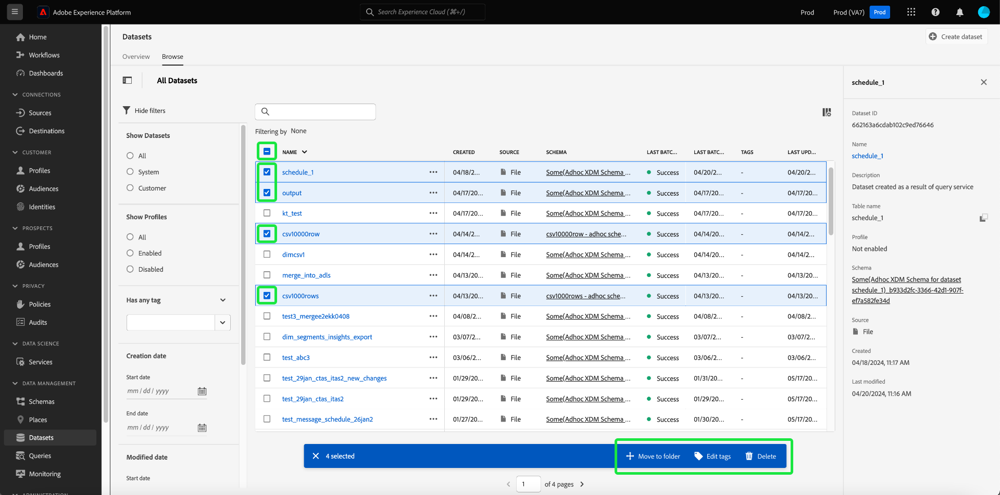

# Användargränssnittshandbok för datauppsättningar

Den här användarhandboken innehåller anvisningar om hur du utför vanliga åtgärder när du arbetar med datauppsättningar i Adobe Experience Platform användargränssnitt.

## Komma igång

Användarhandboken kräver en fungerande förståelse av följande komponenter i Adobe Experience Platform:

* [Datauppsättningar](overview.md): Konstruktionen för lagring och hantering av databeständighet i [!DNL Experience Platform].
* [[!DNL Experience Data Model (XDM) System]](../../xdm/home.md): Det standardiserade ramverket som [!DNL Experience Platform] organiserar kundupplevelsedata med.
   * [Grundläggande om schemakomposition](../../xdm/schema/composition.md): Lär dig mer om grundstenarna i XDM-scheman, inklusive nyckelprinciper och bästa metoder för schemakomposition.
   * [Schemaredigeraren](../../xdm/tutorials/create-schema-ui.md): Lär dig hur du skapar egna anpassade XDM-scheman med [!DNL Schema Editor] i [!DNL Platform]-användargränssnittet.
* [[!DNL Real-Time Customer Profile]](../../profile/home.md): Tillhandahåller en enhetlig konsumentprofil i realtid baserad på aggregerade data från flera källor.
* [[!DNL Adobe Experience Platform Data Governance]](../../data-governance/home.md): Se till att kunddata är kompatibla med regler, begränsningar och principer.

## Visa datauppsättningar {#view-datasets}

>[!CONTEXTUALHELP]
>id="platform_datasets_negative_numbers"
>title="Negativa tal i datauppsättningsaktivitet"
>abstract="Negativa tal i importerade poster innebär att en användare har tagit bort vissa batchar i ett valt tidsintervall."
>text="Learn more in documentation"

>[!CONTEXTUALHELP]
>id="platform_datasets_browse_daysRemaining"
>title="Utgångsdatum för datauppsättning"
>abstract="Den här kolumnen anger antalet dagar som måldatauppsättningen har kvar innan den automatiskt upphör att gälla."

I användargränssnittet för [!DNL Experience Platform] väljer du **[!UICONTROL Datasets]** i den vänstra navigeringen för att öppna kontrollpanelen för **[!UICONTROL Datasets]**. Kontrollpanelen visar alla tillgängliga datauppsättningar för din organisation. Information visas för varje datamängd som anges, inklusive namn, schema som datauppsättningen följer och status för den senaste importen.

Markera namnet på en datauppsättning på fliken [!UICONTROL Browse] för att komma åt dess **[!UICONTROL Dataset activity]**-skärm och se information om den datauppsättning du valde. Fliken Aktivitet innehåller ett diagram som visar hur många meddelanden som har förbrukats samt en lista över lyckade och misslyckade batchar.

## Fler åtgärder {#more-actions}

Du kan [!UICONTROL Delete] eller [!UICONTROL Enable a dataset for Profile] från informationsvyn i [!UICONTROL Dataset]. Om du vill visa tillgängliga åtgärder väljer du **[!UICONTROL ... More]** i det övre högra hörnet av användargränssnittet. Listrutan visas.

![Arbetsytan Datauppsättningar med listrutan [!UICONTROL ... More] markerad.](../images/datasets/user-guide/more-actions.png)

Om du väljer **[!UICONTROL Enable a dataset for Profile]** visas en bekräftelsedialogruta. Välj **[!UICONTROL Enable]** för att bekräfta ditt val.

>[!NOTE]
>
>Om du vill aktivera en datauppsättning för profil måste schemat som datauppsättningen följer vara kompatibelt för användning i kundprofilen i realtid. Mer information finns i avsnittet [Aktivera en datauppsättning för profilen](#enable-profile).

Om du väljer **[!UICONTROL Delete]** visas bekräftelsedialogrutan [!UICONTROL Delete dataset]. Välj **[!UICONTROL Delete]** för att bekräfta ditt val.

>[!NOTE]
>
>Du kan inte ta bort systemdatauppsättningar.

Du kan också ta bort en datauppsättning eller lägga till en datauppsättning som ska användas med kundprofilen i realtid från de infogade åtgärderna på fliken [!UICONTROL Browse]. Mer information finns i avsnittet [Textbundna åtgärder](#inline-actions).

## Inline-datauppsättningsåtgärder {#inline-actions}

Användargränssnittet för datauppsättningar erbjuder nu en samling infogade åtgärder för varje tillgänglig datauppsättning. Markera ellipsen (..) för en datauppsättning som du vill hantera för att visa de tillgängliga alternativen på en snabbmeny. De tillgängliga åtgärderna omfattar följande:

* [[!UICONTROL Preview dataset]](#preview),
* [[!UICONTROL Manage data and access labels]](#manage-and-enforce-data-governance)
* [[!UICONTROL Enable unified profile]](#enable-profile)
* [[!UICONTROL Manage tags]](#manage-tags)
* [[!UICONTROL Move to folders]](#move-to-folders)
* [[!UICONTROL Delete]](#delete).

Mer information om de här tillgängliga åtgärderna finns i respektive avsnitt. Mer information om hur du hanterar ett stort antal datauppsättningar samtidigt finns i avsnittet [massåtgärder](#bulk-actions).

### Förhandsgranska en datauppsättning {#preview}

Du kan förhandsgranska datauppsättningsexempeldata både från de infogade alternativen på fliken [!UICONTROL Browse] och från vyn [!UICONTROL Dataset activity]. På fliken [!UICONTROL Browse] väljer du ellipserna (..) bredvid datauppsättningsnamnet som du vill förhandsgranska. En menylista med alternativ visas. Välj sedan **[!UICONTROL Preview dataset]** i listan med tillgängliga alternativ. Om datauppsättningen är tom inaktiveras förhandsgranskningslänken och det står i stället att förhandsvisningen inte är tillgänglig.

Då öppnas förhandsgranskningsfönstret, där den hierarkiska vyn av datasetet visas till höger.

Du kan också välja **[!UICONTROL Preview dataset]** i det övre högra hörnet av skärmen **[!UICONTROL Dataset activity]** om du vill förhandsgranska upp till 100 rader med data.

För mer robusta metoder för att komma åt dina data tillhandahåller [!DNL Experience Platform] tjänster längre fram i kedjan, till exempel [!DNL Query Service] och [!DNL JupyterLab], för att utforska och analysera data. Mer information finns i följande dokument:

* [Översikt över frågetjänsten](../../query-service/home.md)
* [Användarhandbok för JupyterLab](../../data-science-workspace/jupyterlab/overview.md)

### Hantera och tillämpa datastyrning på en datauppsättning {#manage-and-enforce-data-governance}

Du kan hantera etiketter för datastyrning för en datauppsättning genom att välja de infogade alternativen på fliken [!UICONTROL Browse]. Markera ellipserna (..) bredvid datauppsättningsnamnet som du vill hantera, följt av **[!UICONTROL Manage data and access labels]** i listrutan.

Dataanvändningsetiketter, som används på schemanivå, gör att du kan kategorisera datamängder och fält enligt de användarprofiler som gäller för dessa data. Mer information om etiketter finns i [översikten över datastyrning](../../data-governance/home.md), eller i användarhandboken för [etiketter för dataanvändning](../../data-governance/labels/overview.md) finns instruktioner om hur du använder etiketter på scheman för spridning till datauppsättningar.

## Aktivera en datauppsättning för kundprofil i realtid {#enable-profile}

Alla datauppsättningar har möjlighet att förbättra kundprofiler med inkapslade data. Det gör du genom att schemat som datauppsättningen följer måste vara kompatibelt för användning i [!DNL Real-Time Customer Profile]. Ett kompatibelt schema uppfyller följande krav:

* Schemat har minst ett attribut angivet som en identitetsegenskap.
* Schemat har en identitetsegenskap definierad som primär identitet.

Mer information om hur du aktiverar ett schema för [!DNL Profile] finns i användarhandboken för [Schemaredigeraren](../../xdm/tutorials/create-schema-ui.md).

Du kan aktivera en datauppsättning för profil både från de infogade alternativen på fliken [!UICONTROL Browse] och från vyn [!UICONTROL Dataset activity]. På fliken [!UICONTROL Browse] på arbetsytan [!UICONTROL Datasets] väljer du ellipsen för en datauppsättning som du vill aktivera för profil. En menylista med alternativ visas. Välj sedan **[!UICONTROL Enable unified profile]** i listan med tillgängliga alternativ.

Du kan också välja alternativet **[!UICONTROL Profile]** i kolumnen **[!UICONTROL Properties]** på datamängdens **[!UICONTROL Dataset activity]**-skärm. När den är aktiverad används även data som är inkapslade i datauppsättningen för att fylla i kundprofiler.

>[!NOTE]
>
>Om en datauppsättning redan innehåller data och sedan aktiveras för [!DNL Profile], förbrukas inte befintliga data automatiskt av [!DNL Profile]. När en datauppsättning har aktiverats för [!DNL Profile] rekommenderar vi att du återimporterar alla befintliga data så att de kan bidra till kundprofiler.

Datauppsättningar som har aktiverats för profilen kan också filtreras enligt det här villkoret. Mer information finns i avsnittet [Filtrera profilaktiverade datauppsättningar](#filter-profile-enabled-datasets).

### Hantera datauppsättningstaggar {#manage-tags}

Lägg till egna taggar för att ordna datauppsättningar och förbättra sök-, filtrerings- och sorteringsfunktionerna. På fliken [!UICONTROL Browse] på arbetsytan [!UICONTROL Datasets] väljer du ellipsen för en datauppsättning som du vill hantera följt av **[!UICONTROL Manage tags]** i listrutan.

Dialogrutan [!UICONTROL Manage tags] visas. Ange en kort beskrivning för att skapa en anpassad tagg eller välj från en befintlig tagg för att märka datauppsättningen. Välj **[!UICONTROL Save]** för att bekräfta dina inställningar.

Dialogrutan [!UICONTROL Manage tags] kan även ta bort befintliga taggar från en datauppsättning. Markera bara x bredvid taggen som du vill ta bort och välj **[!UICONTROL Save]**.

När en tagg har lagts till i en datauppsättning kan datauppsättningarna filtreras baserat på motsvarande tagg. Mer information finns i avsnittet om att [filtrera datauppsättningar efter taggar](#enable-profile).

Mer information om hur du klassificerar affärsobjekt för enklare identifiering och kategorisering finns i handboken [Hantera metadatataxonomier](../../administrative-tags/ui/managing-tags.md). I den här guiden beskrivs hur en användare med lämplig behörighet kan skapa fördefinierade taggar, tilldela kategorier till taggar och utföra alla relaterade CRUD-åtgärder för taggar och taggkategorier i plattformens användargränssnitt.

### Flytta till mappar {#move-to-folders}

Du kan placera datauppsättningar i mappar för bättre hantering av datauppsättningar. Om du vill flytta en datauppsättning till en mapp markerar du ellipserna (...) bredvid datauppsättningsnamnet som du vill hantera, följt av **[!UICONTROL Move to folder]** på den nedrullningsbara menyn.

![Kontrollpanelen [!UICONTROL Datasets] med ellipserna och [!UICONTROL Move to folder] markerade.](../images/datasets/user-guide/move-to-folder.png)

Dialogrutan [!UICONTROL Move]-datauppsättning till mapp visas. Markera mappen som du vill flytta målgruppen till och välj sedan **[!UICONTROL Move]**. Ett popup-meddelande informerar dig om att datauppsättningsflyttningen har slutförts.

![Dialogrutan [!UICONTROL Move] med datauppsättningen [!UICONTROL Move] markerad.](../images/datasets/user-guide/move-dialog.png)

>[!TIP]
>
>Du kan också skapa mappar direkt från dialogrutan Flytta datauppsättning. Om du vill skapa en mapp väljer du ikonen Skapa mapp () längst upp till höger i dialogrutan.
>
>![Dialogrutan [!UICONTROL Move] med ikonen för att skapa mapp markerad.](/help/catalog/images/datasets/user-guide/create-folder.png)

När datauppsättningen finns i en mapp kan du välja att bara visa datauppsättningar som tillhör en viss mapp. Om du vill öppna mappstrukturen väljer du ikonen för att visa mappar (). Välj sedan den valda mappen för att se alla associerade datauppsättningar.

![Kontrollpanelerna [!UICONTROL Datasets] med mappstrukturen för datauppsättningar visas, ikonen för att visa mappar och en markerad mapp visas.](../images/datasets/user-guide/folder-structure.png)

### Ta bort en datauppsättning {#delete}

Du kan ta bort en datauppsättning antingen från datauppsättningens textbundna åtgärder på fliken [!UICONTROL Browse] eller i det övre högra hörnet av vyn [!UICONTROL Dataset activity]. I vyn [!UICONTROL Browse] väljer du ellipserna (..) bredvid datauppsättningsnamnet som du vill ta bort. En menylista med alternativ visas. Välj sedan **[!UICONTROL Delete]** i listrutan.

En bekräftelsedialogruta visas. Bekräfta genom att välja **[!UICONTROL Delete]**.

Du kan också välja **[!UICONTROL Delete dataset]** på skärmen **[!UICONTROL Dataset activity]**.

>[!NOTE]
>
>Det går inte att ta bort datauppsättningar som har skapats och använts av program och tjänster från Adobe (till exempel Adobe Analytics, Adobe Audience Manager eller [!DNL Offer Decisioning]).

En bekräftelseruta visas. Välj **[!UICONTROL Delete]** för att bekräfta borttagningen av datauppsättningen.

### Ta bort en profilaktiverad datauppsättning

Om en datauppsättning är aktiverad för Profil tas den bort från datasjön, identitetstjänsten och alla profildata som är associerade med datauppsättningen i profilarkivet om du tar bort datauppsättningen via användargränssnittet.

Du kan ta bort profildata som är kopplade till en datauppsättning från [!DNL Profile]-butiken (lämna data i datasjön) med hjälp av API:t för kundprofil i realtid. Mer information finns i [API-slutpunktshandboken för profilsystemjobb](../../profile/api/profile-system-jobs.md).

## Söka efter och filtrera datamängder {#search-and-filter}

Om du vill söka efter eller filtrera listan med tillgängliga datauppsättningar väljer du filterikonen () längst upp till vänster på arbetsytan. En uppsättning filteralternativ i den vänstra listen visas. Det finns flera metoder för att filtrera tillgängliga datauppsättningar. Dessa omfattar: [[!UICONTROL Show System Datasets]](#show-system-datasets), [[!UICONTROL Included in profile]](#filter-profile-enabled-datasets), [[!UICONTROL Tags]](#filter-by-tag), [[!UICONTROL Creation date]](#filter-by-creation-date), [[!UICONTROL Modified date], [!UICONTROL Created by]](#filter-by-creation-date) och [[!UICONTROL Schema]](#filter-by-schema).

Listan med använda filter visas ovanför de filtrerade resultaten.

### Visa systemdatauppsättningar {#show-system-datasets}

Som standard visas bara datauppsättningar som du har inkapslat data i. Om du vill se de systemgenererade datauppsättningarna markerar du kryssrutan **[!UICONTROL Yes]** i avsnittet [!UICONTROL Show system datasets]. Systemgenererade datauppsättningar används bara för att bearbeta andra komponenter. Den systemgenererade exportdatamängden för profiler används till exempel för att bearbeta kontrollpanelen för profiler.

![Filteralternativen på arbetsytan Datauppsättningar med avsnittet [!UICONTROL Show system datasets] markerat.](../images/datasets/user-guide/show-system-datasets.png)

### Filterprofilaktiverade datauppsättningar {#filter-profile-enabled-datasets}

De datauppsättningar som har aktiverats för profildata används för att fylla i kundprofiler efter att data har importerats. Mer information finns i avsnittet [Aktivera datauppsättningar för profilen](#enable-profile).

Om du vill filtrera datauppsättningen baserat på om de har aktiverats för profilen markerar du kryssrutan [!UICONTROL Yes] bland filteralternativen.

![Filteralternativen på arbetsytan Datauppsättningar med avsnittet [!UICONTROL Included in Profile] markerat.](../images/datasets/user-guide/included-in-profile.png)

### Filtrera datauppsättningar efter tagg {#filter-by-tag}

Ange ditt anpassade taggnamn i [!UICONTROL Tags]-indata och markera sedan taggen i listan med tillgängliga alternativ för att söka efter och filtrera datamängder som motsvarar den taggen.

![Filteralternativen på arbetsytan Datauppsättningar med ikonen för indata och filter [!UICONTROL Tags] markerad.](../images/datasets/user-guide/filter-tags.png)

### Filtrera datauppsättningar efter skapandedatum {#filter-by-creation-date}

Datauppsättningar kan filtreras efter skapandedatum under en anpassad tidsperiod. Detta kan användas för att utesluta historiska data eller för att generera specifika kronologiska datainsikter och rapporter. Välj en [!UICONTROL Start date] och en [!UICONTROL End date] genom att välja kalenderikonen för varje fält. Därefter visas bara datauppsättningar som uppfyller det villkoret på fliken Bläddra.

### Filtrera datauppsättningar efter ändringsdatum {#filter-by-modified-date}

På samma sätt som filtret för skapandedatum kan du filtrera dina datauppsättningar baserat på det datum då de senast ändrades. I avsnittet [!UICONTROL Modified date] väljer du en [!UICONTROL Start date] och en [!UICONTROL End date] genom att markera kalenderikonen för varje fält. Därefter visas bara datauppsättningar som ändrats under den perioden på fliken Bläddra.

### Filtrera efter schema {#filter-by-schema}

Du kan filtrera datauppsättningar baserat på det schema som definierar deras struktur. Välj listruteikonen eller ange schemanamnet i textfältet. En lista över möjliga matchningar visas. Välj lämpligt schema i listan.

## Massåtgärder {#bulk-actions}

Använd gruppåtgärder för att förbättra effektiviteten och utföra flera åtgärder samtidigt på flera datauppsättningar. Du kan spara tid och underhålla en strukturerad datastruktur med gruppåtgärder som [Flytta till mappen](#move-to-folders), [Redigera taggar](#manage-tags) och [Ta bort](#delete) datauppsättningar.

Om du vill agera på mer än en datauppsättning i taget markerar du enskilda datauppsättningar med kryssrutan för varje rad, eller markerar en hel sida med kryssrutan för kolumnrubriken. När du har valt gruppåtgärdsfältet visas det.

När du tillämpar gruppåtgärder på datauppsättningar gäller följande villkor:

* Du kan välja datauppsättningar från olika sidor i användargränssnittet.
* Om du väljer ett filter återställs de markerade datauppsättningarna.

## Sortera datauppsättningar efter skapad den {#sort}

Datauppsättningar på fliken [!UICONTROL Browse] kan sorteras efter stigande eller fallande datum. Markera de [!UICONTROL Created] eller [!UICONTROL Last updated] kolumnrubriker som ska växlas mellan stigande och fallande. När du har valt det här alternativet visas det i kolumnen med antingen upp- eller nedpilen till sidan av kolumnrubriken.

## Skapa en datauppsättning {#create}

Om du vill skapa en ny datauppsättning börjar du med att välja **[!UICONTROL Create dataset]** på kontrollpanelen **[!UICONTROL Datasets]**.

På nästa skärm visas följande två alternativ för att skapa en ny datauppsättning:

* [Skapa datauppsättning från schema](#schema)
* [Skapa datauppsättning från CSV-fil](#csv)

### Skapa en datauppsättning med ett befintligt schema {#schema}

På skärmen **[!UICONTROL Create dataset]** väljer du **[!UICONTROL Create dataset from schema]** för att skapa en ny tom datauppsättning.

**[!UICONTROL Select schema]**-steget visas. Bläddra i schemalistan och välj det schema som datauppsättningen ska följa innan du väljer **[!UICONTROL Next]**.

**[!UICONTROL Configure dataset]**-steget visas. Ange ett namn och en valfri beskrivning för datauppsättningen och välj sedan **[!UICONTROL Finish]** för att skapa datauppsättningen.

Datauppsättningar kan filtreras från listan med tillgängliga datauppsättningar i användargränssnittet med schemafiltret. Mer information finns i avsnittet om att [filtrera datauppsättningar efter schema](#filter-by-schema).

### Skapa en datauppsättning med en CSV-fil {#csv}

När en datauppsättning skapas med hjälp av en CSV-fil skapas ett ad hoc-schema som ger datauppsättningen en struktur som matchar den angivna CSV-filen. Välj **[!UICONTROL Create dataset from CSV file]** på skärmen **[!UICONTROL Create dataset]**.

**[!UICONTROL Configure]**-steget visas. Ange ett namn och en valfri beskrivning för datauppsättningen och välj sedan **[!UICONTROL Next]**.

**[!UICONTROL Add data]**-steget visas. Överför CSV-filen genom att antingen dra och släppa den mitt på skärmen eller genom att välja **[!UICONTROL Browse]** för att utforska din filkatalog. Filen kan vara upp till tio gigabyte stor. När CSV-filen har överförts väljer du **[!UICONTROL Save]** för att skapa datauppsättningen.

>[!NOTE]
>
>CSV-kolumnnamn måste börja med alfanumeriska tecken och får bara innehålla bokstäver, siffror och understreck.

## Övervaka datainmatning

I [!DNL Experience Platform]-gränssnittet väljer du **[!UICONTROL Monitoring]** i den vänstra navigeringen. På kontrollpanelen **[!UICONTROL Monitoring]** kan du visa status för inkommande data från antingen batch- eller direktuppspelningsinmatning. Om du vill visa status för enskilda grupper väljer du antingen **[!UICONTROL Batch end-to-end]** eller **[!UICONTROL Streaming end-to-end]**. På kontrollpanelerna visas alla grupper- eller direktuppspelningsöppningar, inklusive de som har slutförts, misslyckats eller fortfarande pågår. Varje lista innehåller information om batchen, inklusive batch-ID:t, namnet på måldatauppsättningen och antalet poster som har importerats. Om måldatauppsättningen är aktiverad för [!DNL Profile] visas även antalet inkapslade identitets- och profilposter.

Du kan välja att en enskild **[!UICONTROL Batch ID]** ska få åtkomst till kontrollpanelen **[!UICONTROL Batch overview]** och se information om gruppen, inklusive felloggar om gruppen inte kan importeras.

Om du vill ta bort gruppen väljer du **[!UICONTROL Delete batch]** uppe till höger på kontrollpanelen. När du tar bort en batch tas även posterna bort från den datauppsättning som gruppen ursprungligen skapades i bort.

>[!NOTE]
>
>Om inkapslade data har aktiverats för profil och bearbetats tas inte data bort från profilarkivet om du tar bort en batch.

## Nästa steg

Den här användarhandboken innehåller anvisningar om hur du utför vanliga åtgärder när du arbetar med datauppsättningar i användargränssnittet för [!DNL Experience Platform]. Anvisningar om hur du utför vanliga [!DNL Platform]-arbetsflöden med datauppsättningar finns i följande självstudier:

* [Skapa en datauppsättning med API:er](create.md)
* [Fråga datauppsättningsdata med API:t för dataåtkomst](../../data-access/home.md)
* [Konfigurera en datauppsättning för kundprofil och identitetstjänst i realtid med API:er](../../profile/tutorials/dataset-configuration.md)
