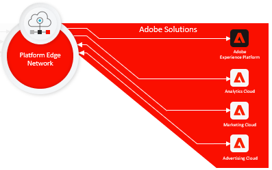

# Översikt över datainsamling

Adobe Experience Platform erbjuder en serie tekniker som gör att ni kan samla in kundupplevelsedata från källor på klientsidan och skicka dem till Adobe Experience Platform Edge Network där de kan berikas, omformas och distribueras till Adobe eller andra mål på några sekunder.

Datainsamling stöds för följande källor på klientsidan:

* Webbaserade program
* Inbyggda mobilappar
* OTT-program (Over-the-top)

De datainsamlingstekniker som tillhandahålls av Experience Platform fokuserar på identifierbarheten och tillgängligheten för kapslade datamängder. Dessa tekniker omfattar följande:

* [Adobe Experience Platform Edge Network](https://experienceleague.adobe.com/docs/web-sdk-learn/tutorials/introduction-to-web-sdk-and-edge-network.html)
* [Adobe Experience Platform Launch](https://adobe.com/go/launch_help_en)
* [Webb-SDK för Adobe Experience Platform](../edge/home.md)
* [Experience Data Model (XDM)](../xdm/home.md)

## Enklare implementeringar, snabbare prestanda på klientsidan

Adobe Experience Platform SDK för webb och mobiler komprimerar och komprimerar alla produktbibliotek i Adobe till ett enda utvecklingsverktyg för webb- och mobilplattformar. Komprimering av dessa bibliotek snabbar upp datainsamlingen och konsoliderar operationer till en enda ström från klientenheter till Adobe Experience Platform Edge Network.

## Växlingsprocess för att driftsätta Adobe-teknik

Platform Edge Network är ett globalt, snabbt och tillförlitligt nätverk av servrar som kan ta emot och bearbeta data i otrolig skala. Med Platform launch kan du konfigurera [edge-konfigurationer](../edge/fundamentals/edge-configuration.md) för produkter som Adobe Target, Adobe Audience Manager och Adobe Analytics, så att du kan aktivera dessa produkter på serversidan utan att ändra klientkoden.

## Omvandla, berika och skicka data snabbt och säkert

[Adobe Experience Platform Launch Server ](https://experienceleague.adobe.com/docs/launch/using/server-side-info/server-side-overview.html) Sidecan utnyttja alla plattformsdataströmmar. Du kan omvandla, berika och skicka data till andra mål än Adobe med extremt låg latens utan att lägga till någon kod från tredje part till klientenheten, vilket ger snabbare och säkrare datainsamling och distribution.

