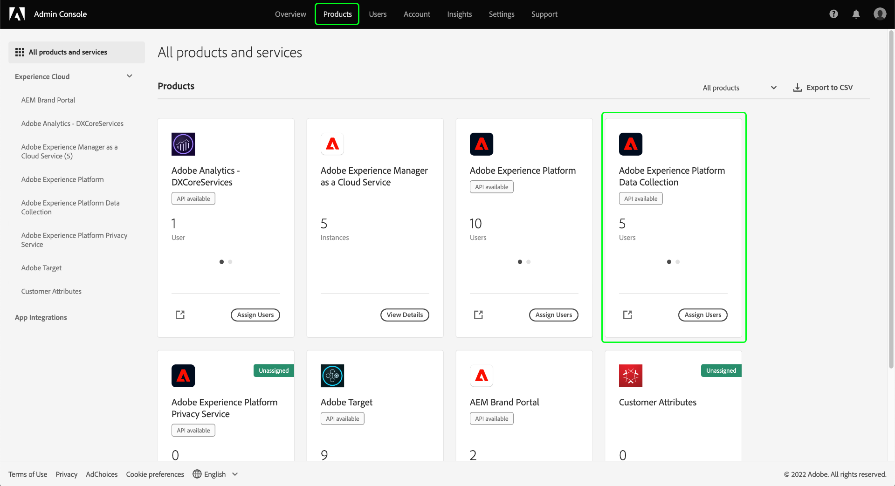

# Behörighetshantering för datainsamling i Experience Platform

[Datainsamling i Adobe Experience Platform](./home.md) består av flera olika tekniker som samarbetar för att samla in och överföra data. Åtkomsten till dessa tekniker regleras genom detaljerade rollbaserade behörigheter i Adobe Admin Console.

I den här handboken visas hur du hanterar behörigheter för datainsamlingsfunktioner.

## Komma igång

Om du vill konfigurera åtkomstkontroll för datainsamling måste du ha administratörsbehörighet för en organisation som har en produktintegrering med Adobe Experience Platform Data Collection. Den minsta rollen som kan bevilja eller återkalla behörigheter är en administratör för produktprofilen. Andra administratörsroller som kan hantera behörigheter är produktadministratörer (kan hantera alla profiler i en produkt) och systemadministratörer (utan begränsningar). Läs artikeln om [administrativa roller](https://helpx.adobe.com/enterprise/using/admin-roles.html) i administrationshandboken för Adobe Enterprise om du vill ha mer information.

I den här handboken förutsätts det att du är bekant med grundläggande produktkoncept som produktprofiler och hur du tilldelar produktbehörigheter till enskilda användare och grupper. Mer information finns i [Användarhandbok för Admin Console](https://helpx.adobe.com/enterprise/using/admin-console.html).

## Tillgängliga behörigheter

Tillstånd för datainsamling ges via två produktbeteckningar i Admin Console: **Adobe Experience Platform** och **Adobe Experience Platform Data Collection**. I avsnitten nedan beskrivs de behörigheter som ges för respektive produkt tillsammans med beskrivningar av de specifika funktioner som de ger tillgång till.

### Adobe Experience Platform permissions

Behörigheter under Adobe Experience Platform innefattar åtkomst till datastreams, identiteter, scheman och sandlådor. Anvisningar om hur du konfigurerar Adobe Experience Platform-behörigheter finns i [användarhandbok för åtkomstkontroll](../access-control/ui/overview.md).

| Kategori | Behörighet | Beskrivning |
| --- | --- | --- |
| Sandlådor | (Ej tillämpligt) | Beroende på [sandlådor](../sandboxes/home.md) som har skapats under din organisation kan du styra åtkomsten till var och en av dem genom den här behörighetskategorin i Admin Console. |
| Datamodellering | Hantera scheman | Ger möjlighet att visa, skapa och redigera [XDM-scheman (Experience Data Model)](../xdm/home.md). |
| Datamodellering | Visa scheman | Ger skrivskyddad åtkomst till scheman. |
| Identity Management | Hantera identitetsnamnutrymmen | Ger möjlighet att visa, skapa och redigera [identitetsnamnutrymmen](../identity-service/namespaces.md). |
| Identity Management | Visa identitetsnamnutrymmen | Ger skrivskyddad åtkomst till identitetsnamnutrymmen. |
| Datainsamling | Hantera datastreams | Ger möjlighet att visa, skapa och redigera [datastreams](../edge/datastreams/overview.md). |
| Datainsamling | Visa datastreams | Ger skrivskyddad åtkomst till datastreams. |

{style=&quot;table-layout:auto&quot;}

<!-- (Feature not yet available?)
| Dashboards | Manage Custom Dashboards | |
| Dashboards | View Custom Dashboards | |
-->

### Behörigheter för Adobe Experience Platform Data Collection

Behörigheter under Adobe Experience Platform Data Collection styr åtkomsten till taggar och funktioner för vidarebefordran av händelser, inklusive egenskaper, tillägg och miljöer. Anvisningar om hur du konfigurerar behörigheter för Adobe Experience Platform Data Collection finns i [avsnitt nedan](#manage).

| Kategori | Behörighet | Beskrivning |
| --- | --- | --- |
| Plattformar | Webb | Ger åtkomst till [webbegenskaper](../tags/ui/administration/companies-and-properties.md) i kombination med andra egenskapsrättigheter. |
| Plattformar | Mobil | Ger åtkomst till [mobila egenskaper](../tags/ui/administration/companies-and-properties.md) i kombination med andra egenskapsrättigheter. |
| Egenskaper | (Ej tillämpligt) | Beroende på vilka egenskaper som har skapats under din organisation kan du styra åtkomsten till var och en av dem via den här behörighetskategorin i Admin Console.  En användares tilldelade egenskapsrättigheter gäller bara för de egenskaper som de har beviljats åtkomst till via den här behörighetskategorin. |
| Egendomsrättigheter | Godkänn | Ger möjlighet att godkänna ett biblioteksbygge som en del av [publiceringsflöde](../tags/ui/publishing/publishing-flow.md). |
| Egendomsrättigheter | Utveckla | Ger möjlighet att utveckla ett bibliotek som en del av [publiceringsflöde](../tags/ui/publishing/publishing-flow.md). |
| Egendomsrättigheter | Redigera egenskap | Ger möjlighet att redigera den grundläggande konfigurationen för de egenskaper som en användare har åtkomst till. |
| Egendomsrättigheter | Hantera miljöer | Ger möjlighet att hantera [miljöer](../tags/ui/publishing/environments.md) för de egenskaper som en användare har åtkomst till. |
| Egendomsrättigheter | Hantera tillägg | Ger möjlighet att hantera [tillägg](../tags/ui/managing-resources/extensions/overview.md) för de egenskaper som en användare har åtkomst till. |
| Egendomsrättigheter | Publicera | Ger möjlighet att publicera ett biblioteksbygge som en del av [publiceringsflöde](../tags/ui/publishing/publishing-flow.md). |
| Företagsrättigheter | Utveckla tillägg | Ger möjlighet att skapa och ändra tilläggspaket som ägs av organisationen, inklusive privata releaser och förfrågningar om allmän spridning. |
| Företagsrättigheter | Hantera tillägg | Detta tillstånd gäller endast om du har en licens för Adobe Journey Optimizer eller en annan lösning som ger åtkomst till mobilmeddelanden i appen och push-meddelanden. På så sätt kan du hantera de appar som Adobe Experience Cloud känner till tillsammans med de push-autentiseringsuppgifter som krävs för att kommunicera med meddelandetjänsten i Firebase Cloud och Apple Push Notification-tjänsten. |

{style=&quot;table-layout:auto&quot;}

>[!NOTE]
>
>Mer information om hur dessa behörigheter påverkar funktioner i taggar, inklusive administrationsstrategier för vanliga scenarier, finns i taggdokumentationen för [användarbehörigheter](../tags/ui/administration/user-permissions.md).

## Hantera behörigheter {#manage}

Som framgår av föregående avsnitt hanteras behörigheter för datainsamling genom två produktbeteckningar i Admin Console: **Adobe Experience Platform** och **Adobe Experience Platform Data Collection**.

Logga in på [Admin Console](https://adminconsole.adobe.com/) och markera **[!UICONTROL Products]** i den övre navigeringen. Här väljer du produktkort för de behörigheter du vill konfigurera. Se underavsnitten nedan för steg om hur du hanterar behörigheter för respektive produkt i Admin Console:

* [Adobe Experience Platform permissions](#manage-platform)
* [Behörigheter för Adobe Experience Platform Data Collection](#manage-collection)

### Hantera behörigheter i Adobe Experience Platform {#manage-platform}

Från **[!UICONTROL Products]** visa i Admin Console, markera **[!UICONTROL Adobe Experience Platform Data Collection]**. Välj den produktprofil som du vill redigera behörigheter för och navigera sedan till **[!UICONTROL Permissions]** -fliken.

För att få åtkomst till datainsamlingsfunktionerna måste du aktivera alla behörigheter i **[!UICONTROL Sandboxes]**, **[!UICONTROL Data Modeling]**, **[!UICONTROL Identity Management]** och **[!UICONTROL Data Collection]** kategorier.

Se [gränssnittsguide för åtkomstkontroll](../access-control/ui/overview.md) om du vill ha detaljerade anvisningar om hur du hanterar plattformsbehörigheter.

>[!NOTE]
>
>Beroende på vilka SKU:er din organisation har tillgång till kanske du inte har alla plattformsbehörigheter.

### Hantera behörigheter i Adobe Experience Platform Data Collection {#manage-collection}

Från **[!UICONTROL Products]** visa i Admin Console, markera **[!UICONTROL Adobe Experience Platform Data Collection]**.

#### Välj eller skapa en produktprofil

På nästa skärm visas en lista med tillgängliga produktprofiler för datainsamling i din organisation. Standardprofilen är **[!DNL Default Data Collection All Access]**. Du kan välja att redigera standardproduktprofilen om du vill, eller välja att **[!UICONTROL New Profile]** för att skapa en. Om du har flera roller eller användargrupper i organisationen som kräver olika åtkomstnivåer bör du skapa en separat produktprofil för var och en av dem.

När du har valt eller skapat en produktprofil kan du använda **[!UICONTROL Edit]** ikoner att starta [redigera behörigheter](#edit-permissions) för profilen eller välj **[!UICONTROL Users]** flik att starta [tilldela användare](#assign-users) till profilen.

#### Redigera behörigheter för produktprofilen {#edit-permissions}

När du redigerar behörigheter för en profil visas tillgängliga behörigheter i den vänstra kolumnen medan de som ingår i profilen visas i den högra kolumnen. Välj de angivna behörigheterna för att flytta dem mellan någon av kolumnerna.

Behörigheter är ordnade i kategorier. Om du vill växla mellan kategorier väljer du önskad kategori i den vänstra navigeringen.

Välj **[!UICONTROL Save]** när du är klar med konfigurationen av behörigheter.

Produktprofilvyn visas igen med de tillagda behörigheterna.

#### Tilldela användare till produktprofilen {#assign-users}

Om du vill tilldela användare till produktprofilen (och ge dem profilens konfigurerade behörigheter) väljer du **[!UICONTROL Users]** tabbtecken, följt av **[!UICONTROL Add user]**.

Mer information om hur du hanterar användare för en produktprofil finns i [Admin Console dokumentation](https://helpx.adobe.com/enterprise/using/manage-product-profiles.html).

## Nästa steg

I den här guiden beskrivs de tillgängliga behörigheterna för användargränssnittet för datainsamling och hur du hanterar dem via Admin Console. Mer information om hur du hanterar behörigheter för andra Adobe Experience Platform-funktioner finns i [dokumentation om åtkomstkontroll](../access-control/home.md).
