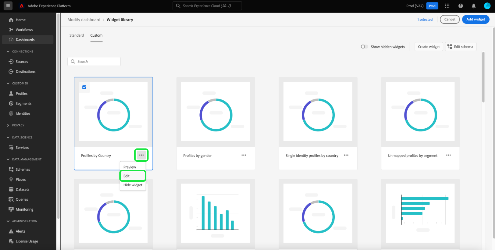

# Skapa anpassade widgetar för instrumentpaneler

I Adobe Experience Platform kan du visa och interagera med organisationens data via flera kontrollpaneler. Du kan även uppdatera vissa instrumentpaneler genom att lägga till nya widgetar i instrumentpanelsvyn. Förutom standardwidgetarna från Adobe kan du även skapa anpassade widgetar och dela dem i hela organisationen.

Den här guiden innehåller stegvisa instruktioner för att skapa och lägga till anpassade widgetar i kontrollpanelerna [!UICONTROL Profiles], [!UICONTROL Segments] och [!UICONTROL Destinations] i plattformsgränssnittet.

Mer information om standardwidgetar finns i guiden för [hur du lägger till standardwidgetar till dina instrumentpaneler](standard-widgets.md).

>[!NOTE]
>
>Widgetarna som visas på kontrollpanelen [!UICONTROL License usage] kan inte anpassas. Om du vill veta mer om den här unika kontrollpanelen läser du dokumentationen till kontrollpanelen för licensanvändning](../guides/license-usage.md).[

## Widget-bibliotek {#widget-library}

Den här guiden kräver åtkomst till [!UICONTROL Widget library] i Experience Platform. Om du vill veta mer om widgetbiblioteket och hur du kommer åt det i användargränssnittet kan du börja med att läsa översikten [widgetbiblioteket](widget-library.md).

## Komma igång med anpassade widgetar

I widgetbiblioteket kan du på fliken **[!UICONTROL Custom]** skapa widgetar och dela dem med andra användare i organisationen för att anpassa utseendet på dina instrumentpaneler.

>[!IMPORTANT]
>
>Din organisation kan skapa maximalt 20 anpassade widgetar i widgetbiblioteket.

Välj fliken **[!UICONTROL Custom]** för att börja skapa anpassade widgetar eller för att visa anpassade widgetar som din organisation redan har skapat.

## Skapa en anpassad widget

Om du vill skapa en anpassad widget väljer du **[!UICONTROL Create widget]** i det övre högra hörnet av widgetbiblioteket eller, om det är din organisations första anpassade widget, väljer du **[!UICONTROL Create]** mitt i widgetbiblioteket.

I dialogrutan **[!UICONTROL Create widget]** anger du en rubrik och beskrivning för den nya widgeten och väljer det attribut som du vill att widgeten ska visa.

>[!NOTE]
>
>Listan med tillgängliga attribut beror på vilket schema som har konfigurerats för din organisation. Om du vill veta mer om attributval och schemakonfiguration läser du guiden [redigera schemat för att skapa anpassade widgetar](edit-schema.md).

Om du vill välja ett attribut markerar du alternativknappen bredvid attributet som du vill lägga till.

>[!NOTE]
>
>Endast ett attribut kan markeras per widget och endast en widget kan skapas per attribut. Om en widget redan har skapats för ett attribut visas attributet nedtonat.

## Välj en visualisering

När du har valt ett attribut visas en förhandsvisning av den nya widgeten i dialogrutan. Artificiell intelligens används för att automatiskt välja ut en visualisering som bäst passar in i attributdata och för att tillhandahålla ytterligare visualiseringsalternativ som du kan välja manuellt.

Beroende på attributet rekommenderar AI olika visualiseringsalternativ. Den fullständiga listan med visualiseringar innehåller:

* Vågrätt stapeldiagram: Vågräta linjer används för att representera värden.
* Lodrätt stapeldiagram: Lodräta linjer används för att representera värden.
* Diagram: På samma sätt som ett cirkeldiagram visas värdena som delar eller delar av en helhet.
* Scatterplot: En vågrät och lodrät axel används för att ange värden.
* Linjediagram: Värden visas med en rad för att visa ändringar över en tidsperiod.
* Nummerkort: Visar ett sammanfattningsnummer som representerar ett nyckelvärde.
* Datatabell: Värden visas som rader i en tabell.

>[!NOTE]
>
>Det enda mätvärde som för närvarande stöds för alla attribut är antalet profiler.
>
>Data som visas i exempelwidgeten är endast avsedda som illustrationer. Förhandsgranskningen visar inte faktiska data från din organisation.

Om du vill spara din nya widget och gå tillbaka till fliken [!UICONTROL Custom] väljer du **[!UICONTROL Create]**.

Din nya widget är nu tillgänglig för att läggas till på en instrumentpanel genom att välja widgeten i biblioteket och välja **[!UICONTROL Add widget]**.

## Dölja en anpassad widget

När en widget har lagts till i biblioteket kan du dölja den genom att markera ellipserna (`...`) på widgetkortet och sedan välja **[!UICONTROL Hide widget]**. Du kan också förhandsgranska och redigera widgeten från samma listruta.

Om du vill visa dolda widgetar väljer du **[!UICONTROL Show hidden widgets]** längst upp till höger i widgetbiblioteket.

>[!WARNING]
>
>När du döljer en widget i biblioteket tas inte widgeten bort från enskilda användares instrumentpaneler. Om en widget inte längre ska användas i din organisation måste du informera alla plattformsanvändare om detta eftersom de måste ta bort widgeten från sina instrumentpaneler.

## Redigera en anpassad widget

Du kan redigera anpassade widgetar i widgetbiblioteket genom att markera ellipserna (`...`) på widgetkortet och sedan välja **[!UICONTROL Edit]** i listrutan.

I dialogrutan **[!UICONTROL Edit widget]** kan du redigera titeln och beskrivningen för widgeten samt förhandsgranska och välja olika visualiseringar. När du har redigerat väljer du **[!UICONTROL Save]** för att spara ändringarna och återgå till fliken för anpassade widgetar.

>[!WARNING]
>
>När du redigerar en widget i biblioteket uppdateras inte widgeten för enskilda användare. Om en widget har uppdaterats ser du till att du kommunicerar detta direkt till alla plattformsanvändare eftersom de måste ta bort den inaktuella widgeten från sina instrumentpaneler och sedan välja och lägga till den uppdaterade widgeten från widgetbiblioteket.

## Nästa steg

När du har läst det här dokumentet kan du komma åt widgetbiblioteket och använda det för att skapa och lägga till anpassade widgetar för organisationen. Om du vill ändra storlek och plats för widgetar som visas på kontrollpanelen läser du [Ändra instrumentpanelsguiden](modify.md).
