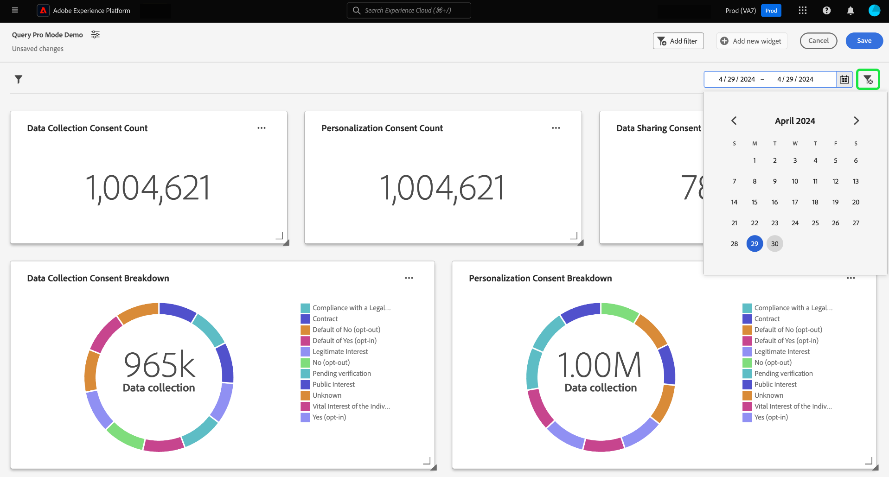

# Skapa ett datumfilter {#create-date-filter}

Om du vill filtrera dina insikter efter datum måste du lägga till parametrar i dina SQL-frågor som kan acceptera datumbegränsningar. Detta görs som en del av arbetsflödet för att skapa insikter för proffsläget. Se [dokumentation för frågeproffsläge](#query-pro-mode) om du vill lära dig hur du anger SQL för dina insikter.

Frågeparametrar gör att du kan arbeta med dynamiska data när de fungerar som platshållare för de värden du lägger till vid körning. Dessa platshållarvärden kan uppdateras via användargränssnittet och ger mindre tekniska användare möjlighet att uppdatera insikterna baserat på datumintervall.

Om du inte känner till frågeparametrarna läser du i dokumentationen för [riktlinjer för hur du implementerar parametriserade frågor](../../../../query-service/ui/parameterized-queries.md).

## Använd ett datumfilter på instrumentpanelen {#apply-date-filter}

Om du vill använda ett datumfilter väljer du **[!UICONTROL Add filter]** sedan **[!UICONTROL Date Filter]** i listrutan i vyn Kontrollpanel.


## Redigera din SQL för att inkludera datumfrågeparametrar {#include-date-parameters}

Se sedan till att SQL innehåller frågeparametrar som tillåter ett datumintervall. Om du ännu inte har införlivat frågeparametrar i din SQL-databas kan du redigera dina insikter och inkludera dessa parametrar. I dokumentationen finns instruktioner om hur du [redigera insikter](../query-pro-mode.md#edit).

>[!TIP]
>
>Du rekommenderas att lägga till `$START_DATE` och `$END_DATE` parametrar till SQL-satsen i alla diagram som du vill aktivera datumfilter för.

>[!NOTE]
>
>Datumfilter stöder inte tidsbegränsningar. Filtret gäller endast datumintervall. Det innebär att om du har flera rapporter inom en 24-timmarsperiod kan du inte skilja mellan olika timmar inom samma dag. Därför rekommenderar vi att du konverterar tidskomponenten som ett datum.

Om datamodellen eller tabellerna som du analyserar har en tidskomponent kan du gruppera data efter datum och sedan använda datumfiltren.

SQL-satsen nedan visar hur du inkluderar `$START_DATE` och `$END_DATE` parametrar och använder `cast` om du vill bildruta tidskomponenten som ett datum.

```sql
SELECT Sum(personalization_consent_count) AS Personalization,
       Sum(datacollection_consent_count)  AS Datacollection,
       Sum(datasharing_consent_count)     AS Datasharing
FROM   fact_daily_consent_aggregates f
       INNER JOIN dim_consent_valued
               ON f.consent_value_id = d.consent_value_id
WHERE  f.date BETWEEN Upper(Coalesce(Cast('$START_DATE' AS date), '')) AND Upper
                      (
                             Coalesce(Cast('$END_DATE' AS date), ''))
       AND ( ( Upper(Coalesce($consent_value_filter, '')) IN ( '', 'NULL' ) )
              OR ( f.consent_value_id IN ( $consent_value_filter ) ) )
LIMIT  0; 
```

Skärmbilden nedan visar datumbegränsningarna som ingår i SQL-satsen och nyckelvärdepar för frågeparametern.

>[!NOTE]
>
>När du komponerar en sats i frågeproffsläge måste du ange exempelvärden för varje parameter för att kunna köra SQL-satsen och skapa diagrammet. De exempelvärden som du anger när du komponerar programsatsen ersätts med de faktiska värden som du väljer för datumfiltret (eller det globala filtret) vid körning.

![The [!UICONTROL Enter SQL] med datumparametrarna markerade i SQL.](../../../images/customizable-insights/sql-date-parameters.png)

## Aktivera datumparametrar i alla insikter {#enable-date-parameters}

När du har implementerat rätt parametrar i din insikts SQL-databas kan `Start_date` och `End_date` variabler är nu tillgängliga som växlar i widgetens disposition. Se [fråga om populationssektion för proffswidget](#populate-widget) om du vill ha information om hur du redigerar en insikt.

I widgetens disposition väljer du att aktivera `Start_date` och `End_date` parametrar.


Välj sedan lämpliga frågeparametrar i listrutorna.


Äntligen väljer du **[!UICONTROL Save and close]** för att gå tillbaka till kontrollpanelen. Datumfilter är nu aktiverade för alla insikter som har start- och slutdatumparametrar.

## Använda datumfiltret

Om du vill använda ett anpassat datumfilter markerar du kalenderikonen och väljer ett start- och slutdatum i kalendervyn.

>[!IMPORTANT]
>
>Bara att lägga till ett datumfilter ändras inte diagrammen. Du måste redigera alla insikter för att inkludera det start- och slutdatum du valt.


När du har valt ett datumintervall på instrumentpanelen, kommer insikter med datumparametrar i deras SQL att visa datumfilteralternativen i widgetens disposition.

>[!NOTE]
>
>När du väljer ett datumintervall på instrumentpanelen visas växlingarna för datumfilter som en del av arbetsflödet för att skapa insikter.

## Ta bort ett datumfilter {#delete-date-filter}

Om du vill ta bort datumfiltret markerar du ikonen för att ta bort filtret ().


