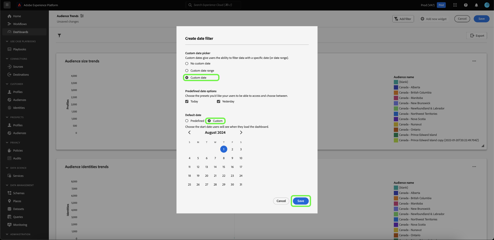
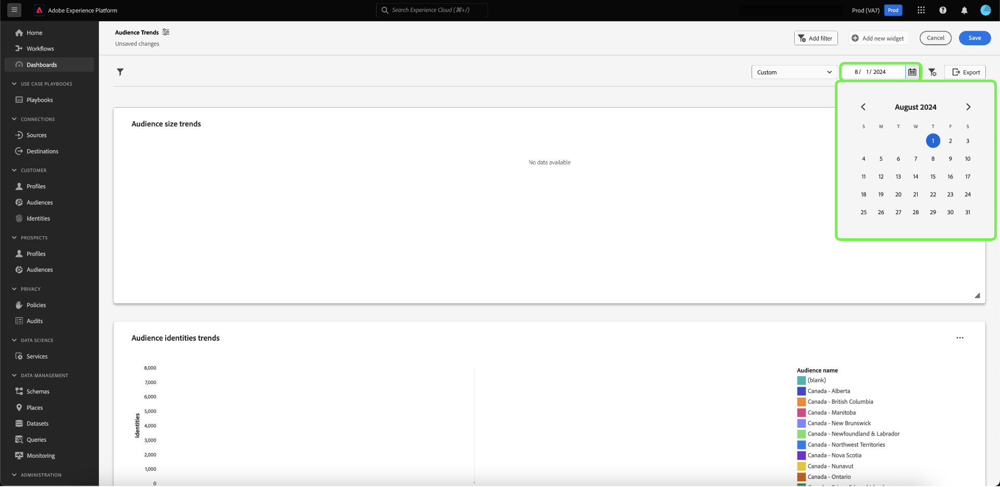

# Skapa ett datumfilter {#create-date-filter}

Om du vill filtrera dina insikter efter datum måste du lägga till parametrar i dina SQL-frågor som kan acceptera datumbegränsningar. Detta görs som en del av arbetsflödet för att skapa insikter för proffsläget. Läs [frågedokumentationen för proffsläget](#query-pro-mode) om du vill veta hur du anger SQL för dina insikter.

Frågeparametrar gör att du kan arbeta med dynamiska data när de fungerar som platshållare för de värden du lägger till vid körning. Dessa platshållarvärden kan uppdateras via användargränssnittet och ger mindre tekniska användare möjlighet att uppdatera insikterna baserat på datumintervall.

Om du inte känner till frågeparametrar kan du läsa dokumentationen för [vägledning om hur du implementerar parametriserade frågor](../../../../query-service/ui/parameterized-queries.md).

## Använd ett datumfilter på instrumentpanelen {#apply-date-filter}

Om du vill använda ett datumfilter väljer du **[!UICONTROL Add filter]** och sedan **[!UICONTROL Date Filter]** på den nedrullningsbara menyn i instrumentpanelsvyn.


Följande datumfiltreringsalternativ visas.

| Filter | Beskrivning |
| --- | --- |
| Inget anpassat datum | Välj ett eller flera anpassade datum från flera förinställda värden. |
| Anpassat datumintervall | Välj ett eller flera anpassade datum från flera förinställda värden eller ange ett anpassat datumintervall. |
| Anpassat datum | Välj bland de förinställda värdena eller ange startdatumet för instrumentpanelen. |


### Skapa ett eget datumfilter

Om du vill använda ett fördefinierat datumfilter väljer du **[!UICONTROL No custom date]** och väljer sedan de fördefinierade datumalternativ som du vill inkludera. Använd sedan listrutan för att välja standarddatumintervall och välj **[!UICONTROL Save]**.


Du återgår till kontrollpanelen, som visar det standarddatumintervall som du valde tidigare. Använd listrutan för att välja ett annat förinställt datumintervall.


### Skapa ett anpassat datumintervallfilter

Om du vill använda ett anpassat datumintervallfilter väljer du **[!UICONTROL Custom date range]** och väljer sedan de fördefinierade datumalternativ som du vill inkludera. Välj slutligen **[!UICONTROL Custom]** för att ange standarddatumintervall. Ange ett datumintervall i kalendern och välj sedan **[!UICONTROL Save]**.

>[!NOTE]
>
>Du behöver inte välja fördefinierade datumalternativ.


Du återgår till kontrollpanelen som visar det anpassade dataområde som du tidigare angav. Använd listrutan för att välja ett annat förinställt datumintervall.


### Skapa ett anpassat datumfilter

Om du vill använda ett anpassat datumfilter väljer du **[!UICONTROL Custom date]** och markerar de fördefinierade datumalternativ som du vill inkludera. Välj slutligen **[!UICONTROL Custom]** och använd sedan kalendern för att välja ett startdatum. Välj slutligen **[!UICONTROL Save]**.

>[!NOTE]
>
>Du behöver inte välja fördefinierade datumalternativ.



Du kommer nu tillbaka till kontrollpanelen där de anpassade data som du har angett tidigare visas. Använd listrutan för att välja ett annat datum.



## Ta bort ett datumfilter {#delete-date-filter}

Om du vill ta bort datumfiltret väljer du ikonen Ta bort filter ().


## Redigera din SQL för att inkludera datumfrågeparametrar {#include-date-parameters}

Se sedan till att SQL innehåller frågeparametrar som tillåter ett datumintervall. Om du ännu inte har införlivat frågeparametrar i din SQL-databas kan du redigera dina insikter och inkludera dessa parametrar. I dokumentationen finns instruktioner om hur du [redigerar en insikt](../overview.md#edit).

>[!TIP]
>
>Du rekommenderas att lägga till `$START_DATE`- och `$END_DATE`-parametrar i SQL-satsen i alla diagram som du vill aktivera datumfilter för.

>[!NOTE]
>
>Datumfilter stöder inte tidsbegränsningar. Filtret gäller endast datumintervall. Det innebär att om du har flera rapporter inom en 24-timmarsperiod kan du inte skilja mellan olika timmar inom samma dag. Därför rekommenderar vi att du konverterar tidskomponenten som ett datum.

Om datamodellen eller tabellerna som du analyserar har en tidskomponent kan du gruppera data efter datum och sedan använda datumfiltren.

Exemplet på SQL-satsen nedan visar hur du inkluderar parametrarna `$START_DATE` och `$END_DATE` och använder `cast` för att rama in tidskomponenten som ett datum.

```sql
SELECT Sum(personalization_consent_count) AS Personalization,
       Sum(datacollection_consent_count)  AS Datacollection,
       Sum(datasharing_consent_count)     AS Datasharing
FROM   fact_daily_consent_aggregates f
       INNER JOIN dim_consent_valued
               ON f.consent_value_id = d.consent_value_id
WHERE  f.date BETWEEN Upper(Coalesce(Cast('$START_DATE' AS date), '')) AND Upper
                      (
                             Coalesce(Cast('$END_DATE' AS date), ''))
       AND ( ( Upper(Coalesce($consent_value_filter, '')) IN ( '', 'NULL' ) )
              OR ( f.consent_value_id IN ( $consent_value_filter ) ) )
LIMIT  0; 
```

Skärmbilden nedan visar datumbegränsningarna som ingår i SQL-satsen och nyckelvärdepar för frågeparametern.

>[!NOTE]
>
>När du komponerar en sats i frågeproffsläge måste du ange exempelvärden för varje parameter för att kunna köra SQL-satsen och skapa diagrammet. De exempelvärden som du anger när du komponerar programsatsen ersätts med de faktiska värden som du väljer för datumfiltret (eller det globala filtret) vid körning.

![Dialogrutan [!UICONTROL Enter SQL] med datumparametrar markerade i SQL.](../../../images/sql-insights/sql-date-parameters.png)

## Aktivera datumparametrar i alla insikter {#enable-date-parameters}

När du har införlivat de lämpliga parametrarna i dina insikter i SQL är variablerna `Start_date` och `End_date` nu tillgängliga som växlar i widgetens disposition. Se avsnittet [fråga efter populationssiffra för professionellt läge](#populate-widget) för mer information om hur du redigerar en insikt.

I widgetens disposition väljer du för att aktivera parametrarna `Start_date` och `End_date`.


Välj sedan lämpliga frågeparametrar i listrutorna.


Välj slutligen **[!UICONTROL Save and close]** om du vill gå tillbaka till instrumentpanelen. Datumfilter är nu aktiverade för alla insikter som har start- och slutdatumparametrar.
