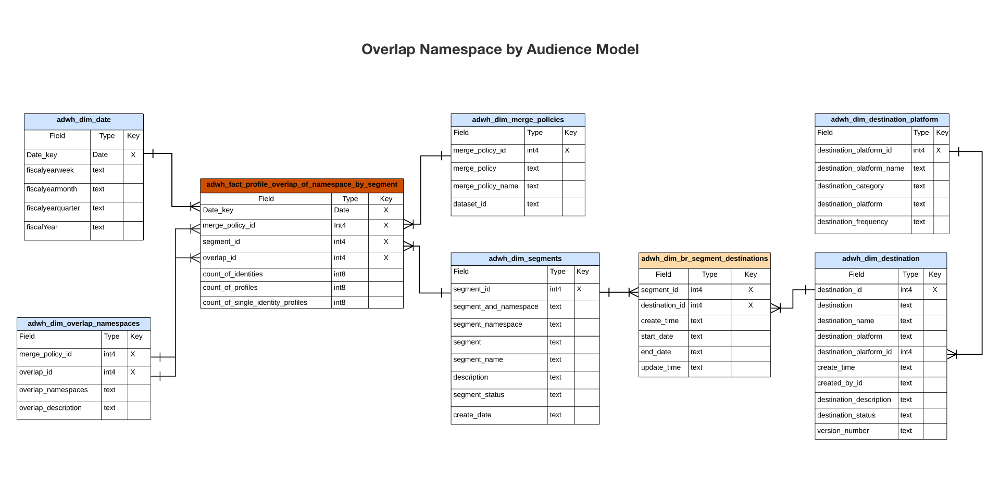

# Real-time Customer Data Platform Insights, datamodell B2C Edition

Real-time Customer Data Platform Insights datamodell för [B2C Edition](../../rtcdp/overview.md#rtcdp-b2c) visar de datamodeller och SQL som används för insikter för olika profil-, mål- och segmenteringswidgetar. Du kan anpassa dessa SQL-frågemallar för att skapa Real-Time CDP-rapporter för dina KPI-fall (Marketing and Key Performance Indicator). Dessa insikter kan sedan användas som anpassade widgetar för dina användardefinierade instrumentpaneler. Läs mer i dokumentationen om rapporter om snabbare arkiv om du vill veta mer [hur man bygger en datamodell med rapportinsikter med hjälp av frågetjänsten för användning med accelererade lagringsdata och användardefinierade instrumentpaneler](../../query-service/data-distiller/customizable-insights/reporting-insights-data-model.md).

>[!NOTE]
>
>Termen segment har uppdaterats till målgrupp i alla Adobe Experience Platform-system. Vissa referenser till segment används fortfarande för filsökvägar och namnkonventioner för datauppsättningar.

## Förutsättningar

Den här guiden kräver en fungerande förståelse av [användardefinierad panelfunktion](../user-defined-dashboards.md). Läs dokumentationen innan du fortsätter med den här guiden.

## Real-Time CDP insiktsrapporter och användningsexempel

Real-Time CDP rapportering ger insikter i era profildata och dess relation till målgrupper och destinationer. Olika stjärnschemamodeller utvecklades för att besvara en rad vanliga användningsfall för marknadsföring, och varje datamodell kan stödja flera användningsfall.

>[!IMPORTANT]
>
>De data som används för Real-Time CDP-rapportering är korrekta för en vald sammanfogningsprincip och från den senaste ögonblicksbilden.

### Profilmodell {#profile-model}

Profilmodellen består av tre datauppsättningar:

- `adwh_dim_date`
- `adwh_fact_profile`
- `adwh_dim_merge_policies`

Bilden nedan innehåller de relevanta datafälten i varje datauppsättning.


#### Användningsfall för antal profiler {#profile-count}

Den logik som används för [!UICONTROL Profile count] returnerar det totala antalet sammanfogade profiler i profilarkivet när ögonblicksbilden togs. Se [[!UICONTROL Profile count] widgetdokumentation](../guides/profiles.md#profile-count) för mer information.

Den SQL som genererar [!UICONTROL Profile count] visas i det infällbara avsnittet nedan.

+++SQL-fråga

```sql
SELECT qsaccel.profile_agg.adwh_dim_merge_policies.merge_policy_name,
       sum(qsaccel.profile_agg.adwh_fact_profile.count_of_profiles) CNT
  FROM qsaccel.profile_agg.adwh_fact_profile
  LEFT OUTER JOIN qsaccel.profile_agg.adwh_dim_merge_policies ON qsaccel.profile_agg.adwh_dim_merge_policies.merge_policy_id=adwh_fact_profile.merge_policy_id
  WHERE qsaccel.profile_agg.adwh_fact_profile.date_key='2024-01-10'
    AND qsaccel.profile_agg.adwh_fact_profile.merge_policy_id = 2027892989
  GROUP BY qsaccel.profile_agg.adwh_dim_merge_policies.merge_policy_name;
```

+++

#### Enstaka identitetsprofiler använder sig av gemener/VERSALER {#single-identity-profiles}

Den logik som används för [!UICONTROL Single identity profiles] widgeten innehåller ett antal profiler för din organisation som bara har en typ av ID-typ som skapar deras identitet. Se [[!UICONTROL Single identity profiles] widgetdokumentation](../guides/profiles.md#single-identity-profiles) för mer information.

Den SQL som genererar [!UICONTROL Single identity profiles] visas i det infällbara avsnittet nedan.

+++SQL-fråga

```sql
SELECT qsaccel.profile_agg.adwh_dim_merge_policies.merge_policy_name,
       sum(qsaccel.profile_agg.adwh_fact_profile.count_of_Single_Identity_profiles) CNT
  FROM qsaccel.profile_agg.adwh_fact_profile
  LEFT OUTER JOIN qsaccel.profile_agg.adwh_dim_merge_policies ON qsaccel.profile_agg.adwh_dim_merge_policies.merge_policy_id=adwh_fact_profile.merge_policy_id
  WHERE qsaccel.profile_agg.adwh_fact_profile.date_key='2024-01-10'
    AND qsaccel.profile_agg.adwh_fact_profile.merge_policy_id = 2027892989
  GROUP BY qsaccel.profile_agg.adwh_dim_merge_policies.merge_policy_name;
```

+++

### Namnområdesmodell {#namespace-model}

Namnområdesmodellen består av följande datamängder:

- `adwh_dim_date`
- `adwh_fact_profile_by_namespace`
- `adwh_dim_merge_policies`
- `adwh_dim_namespaces`

Bilden nedan innehåller de relevanta datafälten i varje datauppsättning.


#### Profiler efter användningsfall för identitet {#profiles-by-identity}

The [!UICONTROL Profiles by identity] widgeten visar en beskrivning av identiteterna för alla sammanfogade profiler i din profilbutik. Se [[!UICONTROL Profiles by identity] widgetdokumentation](../guides/profiles.md#profiles-by-identity) för mer information.

Den SQL som genererar [!UICONTROL Profiles by identity] visas i det infällbara avsnittet nedan.

+++SQL-fråga

```sql
SELECT qsaccel.profile_agg.adwh_dim_namespaces.namespace_description,
        sum(qsaccel.profile_agg.adwh_fact_profile_by_namespace_trendlines.count_of_profiles) count_of_profiles
  FROM qsaccel.profile_agg.adwh_fact_profile_by_namespace_trendlines
  LEFT OUTER JOIN qsaccel.profile_agg.adwh_dim_namespaces ON qsaccel.profile_agg.adwh_fact_profile_by_namespace_trendlines.namespace_id = qsaccel.profile_agg.adwh_dim_namespaces.namespace_id
  AND qsaccel.profile_agg.adwh_fact_profile_by_namespace_trendlines.merge_policy_id = qsaccel.profile_agg.adwh_dim_namespaces.merge_policy_id
  WHERE qsaccel.profile_agg.adwh_fact_profile_by_namespace_trendlines.merge_policy_id = 2027892989
    AND qsaccel.profile_agg.adwh_fact_profile_by_namespace_trendlines.date_key = '2024-01-10'
  GROUP BY qsaccel.profile_agg.adwh_fact_profile_by_namespace_trendlines.date_key,
          qsaccel.profile_agg.adwh_fact_profile_by_namespace_trendlines.merge_policy_id,
          qsaccel.profile_agg.adwh_dim_namespaces.namespace_description
  ORDER BY count_of_profiles DESC;
```

+++

#### Enstaka identitetsprofiler efter användningsfall för identitet {#single-identity-profiles-by-identity}

Den logik som används för [!UICONTROL Single identity profiles by identity] visar det totala antalet profiler som identifieras med endast en unik identifierare. Se [Dokumentation för en identitetsprofil per identitetswidget](../guides/profiles.md#single-identity-profiles-by-identity) för mer information.

Den SQL som genererar [!UICONTROL Single identity profiles by identity] visas i det infällbara avsnittet nedan.

+++SQL-fråga

```sql
SELECT qsaccel.profile_agg.adwh_dim_namespaces.namespace_description,
        sum(qsaccel.profile_agg.adwh_fact_profile_by_namespace_trendlines.count_of_Single_Identity_profiles) count_of_Single_Identity_profiles
  FROM qsaccel.profile_agg.adwh_fact_profile_by_namespace_trendlines
  LEFT OUTER JOIN qsaccel.profile_agg.adwh_dim_namespaces ON qsaccel.profile_agg.adwh_fact_profile_by_namespace_trendlines.namespace_id = qsaccel.profile_agg.adwh_dim_namespaces.namespace_id
  AND qsaccel.profile_agg.adwh_fact_profile_by_namespace_trendlines.merge_policy_id = qsaccel.profile_agg.adwh_dim_namespaces.merge_policy_id
  WHERE qsaccel.profile_agg.adwh_fact_profile_by_namespace_trendlines.merge_policy_id = 2027892989
    AND qsaccel.profile_agg.adwh_fact_profile_by_namespace_trendlines.date_key = '2024-01-10'
  GROUP BY qsaccel.profile_agg.adwh_fact_profile_by_namespace_trendlines.date_key,
          qsaccel.profile_agg.adwh_fact_profile_by_namespace_trendlines.merge_policy_id,
          qsaccel.profile_agg.adwh_dim_namespaces.namespace_description;
```

+++

### Målgruppsmodell {#audience-model}

Målgruppsmodellen består av följande datauppsättningar:

- `adwh_dim_date`
- `adwh_fact_profile_by_segment`
- `adwh_dim_merge_policies`
- `adwh_dim_segments`
- `adwh_dim_br_segment_destinations`
- `adwh_dim_destination`
- `adwh_dim_destination_platform`

Bilden nedan innehåller de relevanta datafälten i varje datauppsättning.


#### Målgruppsstorlek - skiftläge {#audience-size}

Den logik som används för [!UICONTROL Audience size] returnerar det totala antalet sammanfogade profiler inom den valda målgruppen vid tidpunkten för den senaste ögonblicksbilden. Se [[!UICONTROL Audience size] widgetdokumentation](../guides/audiences.md#audience-size) för mer information.

Den SQL som genererar [!UICONTROL Audience size] visas i det infällbara avsnittet nedan.

+++SQL-fråga

```sql
SELECT
  sum(
    qsaccel.profile_agg.adwh_fact_profile_by_segment_trendlines.count_of_profiles
  ) count_of_profiles
FROM
  qsaccel.profile_agg.adwh_fact_profile_by_segment_trendlines
  LEFT OUTER JOIN qsaccel.profile_agg.adwh_dim_segments ON qsaccel.profile_agg.adwh_fact_profile_by_segment_trendlines.segment_id = qsaccel.profile_agg.adwh_dim_segments.segment_id
WHERE
  qsaccel.profile_agg.adwh_fact_profile_by_segment_trendlines.segment_id = -1323307941
  AND qsaccel.profile_agg.adwh_fact_profile_by_segment_trendlines.merge_policy_id = 1914917902
  AND qsaccel.profile_agg.adwh_fact_profile_by_segment_trendlines.date_key = '2024-01-12';
```

+++

#### Trend för ändring av målgruppsstorlek - skiftläge {#audience-size-change-trend}

Den logik som används för [!UICONTROL Audience size change trend] innehåller en graf som illustrerar skillnaden i det totala antalet profiler som är kvalificerade för en viss målgrupp mellan de senaste ögonblicksbilderna. Se [[!UICONTROL Audience size change trend] widgetdokumentation](../guides/audiences.md#audience-size-change-trend) för mer information.

Den SQL som genererar [!UICONTROL Audience size change trend] visas i det infällbara avsnittet nedan.

+++SQL-fråga

```sql
SELECT date_key,
      Profiles_added
  FROM
    (SELECT rn_num,
            date_key,
            (count_of_profiles-lag(count_of_profiles, 1, 0) over(
                                                                ORDER BY date_key))Profiles_added
    FROM
      (SELECT date_key,
              sum(x.count_of_profiles)count_of_profiles,
              row_number() OVER (
                                  ORDER BY date_key) rn_num
        FROM qsaccel.profile_agg.adwh_fact_profile_by_segment_trendlines x
        INNER JOIN
          (SELECT MAX(process_date) last_process_date,
                  merge_policy_id
          FROM qsaccel.profile_agg.adwh_lkup_process_delta_log
          WHERE process_name = 'FACT_TABLES_PROCESSING'
            AND process_status = 'SUCCESSFUL'
          GROUP BY merge_policy_id) y ON x.merge_policy_id = y.merge_policy_id
        WHERE segment_id = 1333234510
          AND x.date_key >= dateadd(DAY, -30 -1, y.last_process_date)
        GROUP BY x.date_key) a)b
  WHERE rn_num > 1;
```

+++

#### De flesta destinationer använder versaler {#most-used-destinations}

Den logik som används i [!UICONTROL Most used destinations] widgeten visar organisationens mest använda destinationer utifrån det antal målgrupper som mappats till dem. Denna rankning ger insikt i vilka destinationer som används samtidigt som de som kan vara underutnyttjade också kan visas. Läs dokumentationen på [[!UICONTROL Most used destinations] widget](../guides/destinations.md#most-used-destinations) för mer information.

Den SQL som genererar [!UICONTROL Most used destinations] visas i det infällbara avsnittet nedan.

+++SQL-fråga

```sql
SELECT qsaccel.profile_agg.adwh_dim_destination.destination_name,
       qsaccel.profile_agg.adwh_dim_destination.destination_id,
       qsaccel.profile_agg.adwh_dim_destination.destination,
       count(DISTINCT qsaccel.profile_agg.adwh_dim_br_segment_destinations.segment_id) segment_count
  FROM qsaccel.profile_agg.adwh_dim_destination
  JOIN qsaccel.profile_agg.adwh_dim_br_segment_destinations ON qsaccel.profile_agg.adwh_dim_destination.destination_id = qsaccel.profile_agg.adwh_dim_br_segment_destinations.destination_id
  WHERE qsaccel.profile_agg.adwh_dim_destination.destination_name IS NOT NULL
  GROUP BY qsaccel.profile_agg.adwh_dim_destination.destination_name,
           qsaccel.profile_agg.adwh_dim_destination.destination,
           qsaccel.profile_agg.adwh_dim_destination.destination_id
  ORDER BY segment_count DESC
  LIMIT 20;
```

+++

#### Nyligen aktiverade målgrupper - användningsfall {#recently-activated-audiences}

Logiken i [!UICONTROL Recently activated audiences] widgeten innehåller en lista över de målgrupper som senast har mappats till ett mål. Den här listan innehåller en ögonblicksbild av de målgrupper och mål som används aktivt i systemet och kan hjälpa till att felsöka felaktiga mappningar. Se [[!UICONTROL Recently activated audiences] widgetdokumentation](../guides/destinations.md#recently-activated-audiences) för mer information.

Den SQL som genererar [!UICONTROL Recently activated audiences] visas i det infällbara avsnittet nedan.

+++SQL-fråga

```sql
SELECT
  segment_name,
  segment,
  destination_name,
  a.create_time create_time
FROM
  qsaccel.profile_agg.adwh_dim_br_segment_destinations a
  INNER JOIN qsaccel.profile_agg.adwh_dim_segments b ON a.segment_id = b.segment_id
  INNER JOIN qsaccel.profile_agg.adwh_dim_destination c ON a.destination_id = c.destination_id
ORDER BY
  create_time DESC,
  segment
LIMIT
  20;
```

+++

### Namnområdes-målgruppsmodell {#namespace-audience-model}

Namnutrymmes-målgruppsmodellen består av följande datamängder:

- `adwh_dim_date`
- `adwh_dim_namespaces`
- `adwh_fact_profile_by_segment_and_namespace`
- `adwh_dim_merge_policies`
- `adwh_dim_segments`
- `adwh_dim_br_segment_destinations`
- `adwh_dim_destination`
- `adwh_dim_destination_platform`

Bilden nedan innehåller de relevanta datafälten i varje datauppsättning.


#### Profiler per identitet för ett målgruppsärende {#audience-profiles-by-identity}

Den logik som används i [!UICONTROL Profiles by identity] widgeten innehåller en beskrivning av identiteterna för alla sammanfogade profiler i din profilbutik för en viss målgrupp. Se [[!UICONTROL Profiles by identity] widgetdokumentation](../guides/audiences.md#profiles-by-identity) för mer information.

Den SQL som genererar [!UICONTROL Profiles by identity] visas i det infällbara avsnittet nedan.

+++SQL-fråga

```sql
SELECT qsaccel.profile_agg.adwh_dim_namespaces.namespace_description,
        sum(qsaccel.profile_agg.adwh_fact_profile_by_segment_and_namespace_trendlines.count_of_profiles) count_of_profiles
  FROM qsaccel.profile_agg.adwh_fact_profile_by_segment_and_namespace_trendlines
  LEFT OUTER JOIN qsaccel.profile_agg.adwh_dim_namespaces ON qsaccel.profile_agg.adwh_fact_profile_by_segment_and_namespace_trendlines.namespace_id = qsaccel.profile_agg.adwh_dim_namespaces.namespace_id
  AND qsaccel.profile_agg.adwh_fact_profile_by_segment_and_namespace_trendlines.merge_policy_id = qsaccel.profile_agg.adwh_dim_namespaces.merge_policy_id
  WHERE qsaccel.profile_agg.adwh_fact_profile_by_segment_and_namespace_trendlines.segment_id = 1333234510
    AND qsaccel.profile_agg.adwh_fact_profile_by_segment_and_namespace_trendlines.merge_policy_id = 1709997014
    AND qsaccel.profile_agg.adwh_fact_profile_by_segment_and_namespace_trendlines.date_key = '2024-01-10'
  GROUP BY qsaccel.profile_agg.adwh_dim_namespaces.namespace_description
  ORDER BY count_of_profiles DESC;
```

+++

### Överlappa namnutrymmesmodell

Den överlappande namnområdesmodellen består av följande datamängder:

- `adwh_dim_date`
- `adwh_dim_overlap_namespaces`
- `adwh_fact_profile_overlap_of_namespace`
- `adwh_dim_merge_policies`

Bilden nedan innehåller de relevanta datafälten i varje datauppsättning.


#### Användningsfall för identitetsöverlappning (profiler) {#profiles-identity-overlap}

Den logik som används i [!UICONTROL Identity overlap] widgeten visar överlappningen av profiler i **Profilarkiv** som innehåller de två markerade identiteterna. Mer information finns i [[!UICONTROL Identity overlap] widgetavsnitt i [!UICONTROL Profiles] dokumentation för kontrollpanelen](../guides/profiles.md#identity-overlap).

Den SQL som genererar [!UICONTROL Identity overlap] visas i det infällbara avsnittet nedan.

+++SQL-fråga

```sql
SELECT Sum(overlap_col1) overlap_col1,
        Sum(overlap_col2) overlap_col2,
        coalesce(Sum(overlap_count), 0) overlap_count
  FROM
    (SELECT 0 overlap_col1,
            0 overlap_col2,
            Sum(count_of_profiles) overlap_count
    FROM qsaccel.profile_agg.adwh_fact_profile_overlap_of_namespace
    WHERE qsaccel.profile_agg.adwh_fact_profile_overlap_of_namespace.merge_policy_id = 2027892989
      AND qsaccel.profile_agg.adwh_fact_profile_overlap_of_namespace.date_key = '2024-01-10'
      AND qsaccel.profile_agg.adwh_fact_profile_overlap_of_namespace.overlap_id IN
        (SELECT a.overlap_id
          FROM
            (SELECT qsaccel.profile_agg.adwh_dim_overlap_namespaces.overlap_id overlap_id,
                    count(*) cnt_num
            FROM qsaccel.profile_agg.adwh_dim_overlap_namespaces
            WHERE qsaccel.profile_agg.adwh_dim_overlap_namespaces.merge_policy_id = 2027892989
              AND qsaccel.profile_agg.adwh_dim_overlap_namespaces.overlap_namespaces in ('avid',
                                                                                          'crmid')
            GROUP BY qsaccel.profile_agg.adwh_dim_overlap_namespaces.overlap_id)a
          WHERE a.cnt_num>1 )
    UNION ALL SELECT count_of_profiles overlap_col1,
                      0 overlap_col2,
                      0 overlap_count
    FROM qsaccel.profile_agg.adwh_fact_profile_by_namespace_trendlines
    JOIN qsaccel.profile_agg.adwh_dim_namespaces ON qsaccel.profile_agg.adwh_fact_profile_by_namespace_trendlines.namespace_id = qsaccel.profile_agg.adwh_dim_namespaces.namespace_id
    AND qsaccel.profile_agg.adwh_fact_profile_by_namespace_trendlines.merge_policy_id = qsaccel.profile_agg.adwh_dim_namespaces.merge_policy_id
    WHERE qsaccel.profile_agg.adwh_fact_profile_by_namespace_trendlines.merge_policy_id = 2027892989
      AND qsaccel.profile_agg.adwh_fact_profile_by_namespace_trendlines.date_key = '2024-01-10'
      AND qsaccel.profile_agg.adwh_dim_namespaces.namespace_description = 'avid'
    UNION ALL SELECT 0 overlap_col1,
                      count_of_profiles overlap_col2,
                      0 Overlap_count
    FROM qsaccel.profile_agg.adwh_fact_profile_by_namespace_trendlines
    JOIN qsaccel.profile_agg.adwh_dim_namespaces ON qsaccel.profile_agg.adwh_fact_profile_by_namespace_trendlines.namespace_id = qsaccel.profile_agg.adwh_dim_namespaces.namespace_id
    AND qsaccel.profile_agg.adwh_fact_profile_by_namespace_trendlines.merge_policy_id = qsaccel.profile_agg.adwh_dim_namespaces.merge_policy_id
    WHERE qsaccel.profile_agg.adwh_fact_profile_by_namespace_trendlines.merge_policy_id = 2027892989
      AND qsaccel.profile_agg.adwh_fact_profile_by_namespace_trendlines.date_key = '2024-01-10'
      AND qsaccel.profile_agg.adwh_dim_namespaces.namespace_description = 'crmid' )a;
```

+++

### Överlappa namnutrymme efter målgruppsmodell {#overlap-namespace-by-audience-model}

Namnutrymmet för överlappning efter målgruppsmodell består av följande datamängder:

- `adwh_dim_date`
- `adwh_dim_overlap_namespaces`
- `adwh_fact_profile_overlap_of_namespace_by_segment`
- `adwh_dim_merge_policies`
- `adwh_dim_segments`
- `adwh_dim_br_segment_destinations`
- `adwh_dim_destination`
- `adwh_dim_destination_platform`

Bilden nedan innehåller de relevanta datafälten i varje datauppsättning.



#### Användningsfall för identitetsöverlappning (målgrupper) {#audiences-identity-overlap}

Den logik som används i [!UICONTROL Audiences] kontrollpanel [!UICONTROL Identity overlap] widgeten visar överlappningen av profiler som innehåller de två valda identiteterna för en viss målgrupp. Mer information finns i [[!UICONTROL Identity overlap] widgetavsnitt i [!UICONTROL Audiences] dokumentation för kontrollpanelen](../guides/audiences.md#identity-overlap).

Den SQL som genererar [!UICONTROL Identity overlap] visas i det infällbara avsnittet nedan.

+++SQL-fråga

```sql
SELECT Sum(overlap_col1) overlap_col1,
        Sum(overlap_col2) overlap_col2,
        Sum(overlap_count) Overlap_count
  FROM
    (SELECT 0 overlap_col1,
            0 overlap_col2,
            Sum(count_of_profiles) Overlap_count
    FROM qsaccel.profile_agg.adwh_fact_profile_overlap_of_namespace_by_segment
    WHERE qsaccel.profile_agg.adwh_fact_profile_overlap_of_namespace_by_segment.segment_id = 1333234510
      AND qsaccel.profile_agg.adwh_fact_profile_overlap_of_namespace_by_segment.merge_policy_id = 1709997014
      AND qsaccel.profile_agg.adwh_fact_profile_overlap_of_namespace_by_segment.date_key = '2024-01-10'
      AND qsaccel.profile_agg.adwh_fact_profile_overlap_of_namespace_by_segment.overlap_id IN
        (SELECT a.overlap_id
          FROM
            (SELECT qsaccel.profile_agg.adwh_dim_overlap_namespaces.overlap_id overlap_id,
                    count(*) cnt_num
            FROM qsaccel.profile_agg.adwh_dim_overlap_namespaces
            WHERE qsaccel.profile_agg.adwh_dim_overlap_namespaces.merge_policy_id = 1709997014
              AND qsaccel.profile_agg.adwh_dim_overlap_namespaces.overlap_namespaces in ('crmid',
                                                                                          'email')
            GROUP BY qsaccel.profile_agg.adwh_dim_overlap_namespaces.overlap_id)a
          WHERE a.cnt_num>1 )
    UNION ALL SELECT count_of_profiles overlap_col1,
                      0 overlap_col2,
                      0 Overlap_count
    FROM qsaccel.profile_agg.adwh_fact_profile_by_segment_and_namespace_trendlines
    LEFT OUTER JOIN qsaccel.profile_agg.adwh_dim_namespaces ON qsaccel.profile_agg.adwh_fact_profile_by_segment_and_namespace_trendlines.namespace_id = qsaccel.profile_agg.adwh_dim_namespaces.namespace_id
    AND qsaccel.profile_agg.adwh_fact_profile_by_segment_and_namespace_trendlines.merge_policy_id = qsaccel.profile_agg.adwh_dim_namespaces.merge_policy_id
    WHERE qsaccel.profile_agg.adwh_dim_namespaces.namespace_description = 'crmid'
      AND qsaccel.profile_agg.adwh_fact_profile_by_segment_and_namespace_trendlines.segment_id = 1333234510
      AND qsaccel.profile_agg.adwh_fact_profile_by_segment_and_namespace_trendlines.merge_policy_id = 1709997014
      AND qsaccel.profile_agg.adwh_fact_profile_by_segment_and_namespace_trendlines.date_key = '2024-01-10'
    UNION ALL SELECT 0 overlap_col1,
                      count_of_profiles overlap_col2,
                      0 Overlap_count
    FROM qsaccel.profile_agg.adwh_fact_profile_by_segment_and_namespace_trendlines
    LEFT OUTER JOIN qsaccel.profile_agg.adwh_dim_namespaces ON qsaccel.profile_agg.adwh_fact_profile_by_segment_and_namespace_trendlines.namespace_id = qsaccel.profile_agg.adwh_dim_namespaces.namespace_id
    AND qsaccel.profile_agg.adwh_fact_profile_by_segment_and_namespace_trendlines.merge_policy_id = qsaccel.profile_agg.adwh_dim_namespaces.merge_policy_id
    WHERE qsaccel.profile_agg.adwh_dim_namespaces.namespace_description = 'email'
      AND qsaccel.profile_agg.adwh_fact_profile_by_segment_and_namespace_trendlines.segment_id = 1333234510
      AND qsaccel.profile_agg.adwh_fact_profile_by_segment_and_namespace_trendlines.merge_policy_id = 1709997014
      AND qsaccel.profile_agg.adwh_fact_profile_by_segment_and_namespace_trendlines.date_key = '2024-01-10' ) a;
```

+++

<!-- Commented out as Anil wanted to add something but did not provide information yet:
### Overlap Namespace-Audience model {#overlap-namespace-audience-model}

The overlap namespace-audience model is comprised of the following datasets: 

- `adwh_fact_profile_overlap_by_namespace_and_segment`
- `adwh_dim_date`
- `adwh_dim_namespace`
- `adwh_dim_overlap_namespaces`
- `adwh_dim_merge_policies`
- `adwh_dim_segments`
- `adwh_dim_br_segment_destinations`
- `adwh_dim_destination`
- `adwh_dim_destination_platform`

 -->

<!-- What insights are gathered from this particular data model? -->

<!-- Commented out as Anil wanted to add something but did not provide information yet:
### AI model {#ai-model}

The AI model is comprised of the following datasets: 

- `adwh_fact_profile_ai_models`
- `adwh_dim_date`
- `adwh_dim_merge_policies`
- `adwh_dim_ai_models`

 -->

<!-- What insights are gathered from this particular data model? -->

