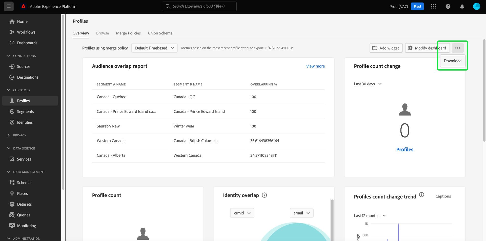

# Hämta instrumentpaneler till PDF

Kontrollpaneler i Adobe Experience Platform kan laddas ned till PDF från användargränssnittet för att underlätta informationsutbytet med medlemmar i organisationen.

Det här dokumentet innehåller en sammanfattning av hur du hämtar instrumentpaneler med hjälp av plattformsgränssnittet och sparar instrumentpanelen i PDF med webbläsarens standardutskriftsmeny.

>[!WARNING]
>
>Informationen som finns på kontrollpanelerna kan innehålla personligt identifierbar information (PII) om dina kunder eller känsliga data relaterade till din organisation. Instrumentpanelsdata som sparats på PDF ska hanteras på rätt sätt i enlighet med organisationens riktlinjer för datasekretess.

## Hämta instrumentpanel

Om du vill börja hämta en instrumentpanel går du till den instrumentpanel som du vill hämta (till exempel kontrollpanelen [!UICONTROL Profiles]) och väljer menyn med fler alternativ (**`...`**) i det övre högra hörnet av instrumentpanelen. Välj sedan **[!UICONTROL Download]**.

## Förhandsgranska PDF

När du har valt **[!UICONTROL Download]** öppnas standardutskriftsmenyn för webbläsaren. I det här exemplet visas utskriftsmenyn i Google Chrome.

På utskriftsmenyn kan du förhandsgranska PDF som ska sparas. PDF är en sann representation av instrumentpanelswidgetarna så som de visas i plattformsgränssnittet och storleken på PDF justeras automatiskt så att alla instrumentpanelswidgetar som visas för tillfället visas på en enda sida visas.

PDF innehåller ett automatiskt genererat huvud som innehåller Experience Platform-logotypen, namnet på kontrollpanelen, ditt namn samt datum och tid då kontrollpanelen hämtades. Informationen är skrivskyddad och kan inte redigeras i PDF.

## Spara som PDF

När du har förhandsgranskat PDF väljer du **Spara** för att välja den plats där du vill spara PDF.

>[!NOTE]
>
>Om det behövs kan du använda listrutan **Mål** och välja **Spara som PDF** om det alternativet inte väljs automatiskt.

## Anpassa PDF för kontrollpanel

PDF som genereras matchar den instrumentpanel som du kan se i användargränssnittet och innehåller bara de widgetar som för närvarande visas på din instrumentpanel. Vissa instrumentpaneler kan anpassas för att ändra storlek och plats för widgetar eller för att lägga till och ta bort widgetar från vyn. När du anpassar utseendet på kontrollpanelen i användargränssnittet för plattformen ändras även utseendet på PDF som genereras.

Du kan till exempel ändra utseendet på din profilkontrollpanel så att den innehåller flera widgetar med full bredd som är staplade över tre standardwidgetar.

Om du väljer att hämta den uppdaterade kontrollpanelen får du en ny förhandsvisning i PDF som matchar utseendet på den anpassade profilkontrollpanelen. Det justerar också automatiskt storleken på PDF för att säkerställa att alla synliga widgetar inkluderas i en enkelsidig PDF.

Om du vill veta mer om hur du anpassar kontrollpaneler börjar du med att läsa [översikten över anpassning av kontrollpanelen](customize/overview.md).

## Nästa steg

Nu när du har hämtat din kontrollpanel och sparat den som PDF kan du upprepa de här stegen för att hämta ytterligare kontrollpaneler eller dela PDF med medlemmar i organisationen.
