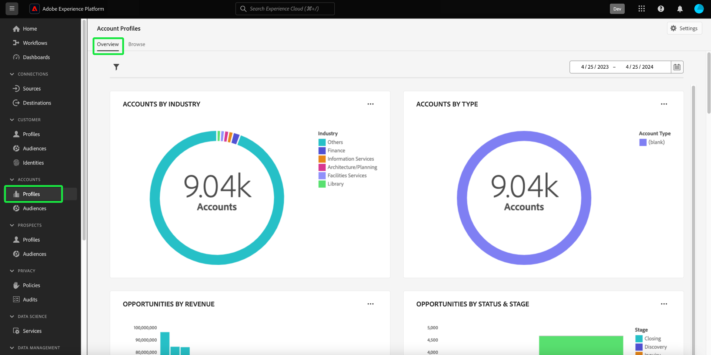

# [!UICONTROL Account Profiles] kontrollpanel

Adobe Experience Platform användargränssnitt (UI) är en kontrollpanel där du kan visa viktig information om dina kontoprofiler, som de tagits under en daglig ögonblicksbild. I den här handboken beskrivs hur du kommer åt och arbetar med [!UICONTROL Account Profiles] kontrollpanelen i användargränssnittet och ger mer information om de visualiseringar som visas på kontrollpanelen.

En översikt över alla funktioner i användargränssnittet för kontoprofilen finns på [gränssnittshandbok för kontoprofil](../../rtcdp/accounts/account-profile-ui-guide.md).

## Komma igång

Du måste ha rätt till [Real-time Customer Data Platform B2B Edition](../../rtcdp/b2b-overview.md) för att få tillgång till B2B [!UICONTROL Account Profiles] kontrollpanel.

## Kontoprofildata

The [!UICONTROL Account Profiles] På kontrollpanelen visas en ögonblicksbild av enhetlig kontoinformation från olika källor över alla era marknadsföringskanaler och de olika system som organisationen för närvarande använder för att lagra kundkontoinformation.

Profildata i ögonblicksbilden visar data exakt som de visas vid den specifika tidpunkten när ögonblicksbilden togs. Med andra ord är ögonblicksbilden inte en uppskattning eller ett urval av data, och [!UICONTROL Account Profiles] Kontrollpanelen uppdateras inte i realtid.

>[!NOTE]
>
>Ändringar eller uppdateringar som gjorts i data sedan ögonblicksbilden togs kommer inte att visas på kontrollpanelen förrän nästa ögonblicksbild tas.

## Utforska [!UICONTROL Account Profiles] kontrollpanel

Navigera till [!UICONTROL Account Profiles] kontrollpanelen i plattformsgränssnittet väljer du **[!UICONTROL Profiles]** under [!UICONTROL Accounts] i den vänstra navigeringspanelen.

Från [!UICONTROL Account Profiles] kontrollpanel kan du antingen [bläddra bland de kontoprofiler som är inkapslade i din organisation](#browse-account-profiles), eller [visa alla dina kontouppgifter i en översikt med hjälp av widgetar](#standard-widgets) som visualiserar olika aspekter av data.

## Bläddra bland kontoprofiler {#browse-account-profiles}

The [!UICONTROL Browse] Med -fliken kan du söka efter och visa de skrivskyddade kontoprofiler som har hämtats till din organisation med ett konto-ID från en ansluten företagskälla eller genom att ange källinformation direkt. Härifrån kan du se viktig information som hör till kontoprofilen, bland annat namn, bransch, intäkter och segment.

Välj [!UICONTROL Profile ID] från resultaten som visas på [!UICONTROL Browse] för att öppna [!UICONTROL Details] för kontoprofilen.

Kontoprofilinformationen som visas på [!UICONTROL Details] har sammanfogats från flera profilfragment till en enda vy av det enskilda kontot. Läs dokumentationen om [surfkontoprofiler i Real-time Customer Data Platform](../../rtcdp/accounts/account-profile-ui-guide.md#browse-account-profiles) om du vill veta mer om visningsfunktioner för kontoprofiler i användargränssnittet för plattformen.

## The [!UICONTROL Account Profiles] [!UICONTROL Overview] {#overview}

The [!UICONTROL Overview] -fliken består av widgetar som tillhandahåller skrivskyddade mått för att förmedla viktig information om dina kontoprofiler. Välj **[!UICONTROL Modify dashboard]** för att ändra utseendet på [!UICONTROL Overview] genom att flytta och ändra storlek på widgetar.

Se dokumentet på [ändra kontrollpaneler](../customize/modify.md) och [Översikt över widgetbiblioteket](../customize/widget-library.md) om du vill veta mer.

## Standardwidgetar {#standard-widgets}

Adobe tillhandahåller standardwidgetar som du kan använda för att visualisera olika mätvärden för dina kontoprofiler.

Om du vill veta mer om de tillgängliga standardwidgetarna väljer du namnet på en widget i följande lista:

* [Totalt antal konton per bransch](#total-accounts-by-industry)
* [Kontoprofiler har lagts till](#account-profiles-added)

### Totalt antal konton per bransch {#total-accounts-by-industry}

Den här widgeten visar det totala antalet konton i ett enskilt mätresultat och använder ett dondiagram för att illustrera de proportionella räkningsstorlekarna för de branscher som utgör det totala antalet. Nyckeln ger färgkodningsinformation för de olika branscherna som donationsdiagrammet består av.

Individuella värden för de olika branscherna visas i en dialogruta när markören hålls över respektive avsnitt i mundiagrammet.

### Kontoprofiler har lagts till {#account-profiles-added}

Den här widgeten använder ett färgkodat stapeldiagram för att illustrera antalet profiler som lagts till i ett konto under en viss tidsperiod och andelen olika branscher som utgör de tillagda profilerna. Branscherna är färgkodade och en nyckel innehåller färgkodningsinformation för de olika branscherna som stapeldiagrammet består av. Analysperioden väljs i widgetens listruta. Du kan visualisera stapeldiagrammet över en 30-dagars, 90-dagars och en 12-månadersperiod.

>[!NOTE]
>
>Eftersom profiler bara läggs till i ett konto och aldrig tas bort är det lägsta möjliga antalet profiler som läggs till under en tidsperiod noll.

## Nästa steg

Om du följer det här dokumentet bör du nu kunna hitta [!UICONTROL Account Profiles] kontrollpanel. Du bör också förstå mätvärdena som visas i de tillgängliga widgetarna. Mer information om hur du arbetar med kontoprofiler som en del av dina B2B-data i användargränssnittet för Experience Platform finns i [kontoprofilöversikt](../../rtcdp/accounts/account-profile-overview.md) för Adobe Real-Time CDP, B2B Edition.
