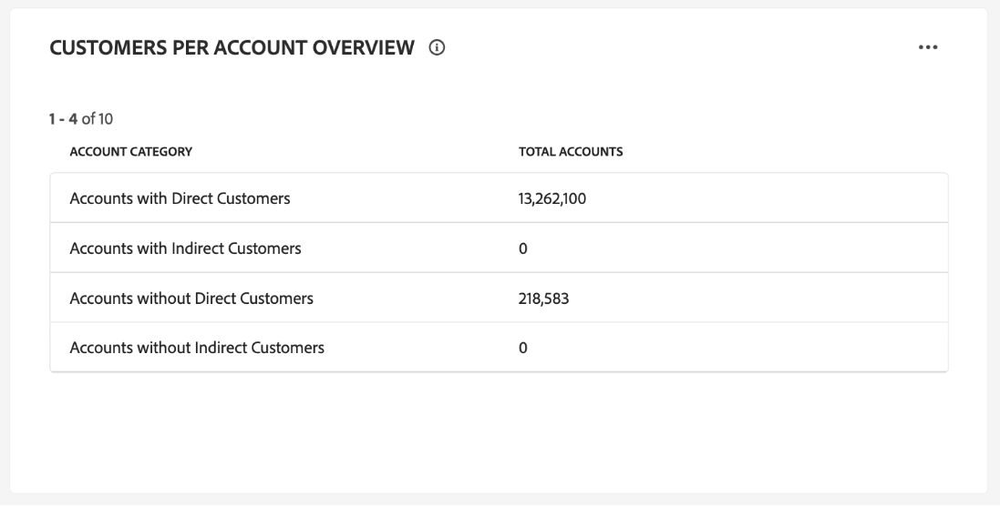

# Kontrollpanel för kontoprofiler

Adobe Experience Platform användargränssnitt (UI) är en kontrollpanel där du kan visa viktig information om dina kontoprofiler, som de tagits under en daglig ögonblicksbild. I den här handboken beskrivs hur du kommer åt och arbetar med kontrollpanelen [!UICONTROL Account Profiles] i användargränssnittet och den innehåller mer information om de visualiseringar som visas på kontrollpanelen.

Det här dokumentet innehåller en översikt över funktionerna på kontrollpanelen [!UICONTROL Account Profiles] och information om tillgängliga standardinsikter. Mer information om de tillgängliga funktionerna finns i [[!UICONTROL Account Profiles]-gränssnittshandboken ](../../rtcdp/accounts/account-profile-ui-guide.md).

## Komma igång

Du måste ha behörighet till [Adobe Real-time Customer Data Platform B2B edition](../../rtcdp/b2b-overview.md) för åtkomst till B2B [!UICONTROL Account Profiles]-instrumentpanelen.

## Data för kontoprofiler {#data}

Kontrollpanelen [!UICONTROL Account Profiles] visar en ögonblicksbild av din enhetliga kontoinformation. Den här kontoinformationen kommer från olika källor över alla era marknadsföringskanaler och från de olika system som organisationen för närvarande använder för att lagra kundkontoinformation.

Profildata i ögonblicksbilden visar data exakt som de visas vid den specifika tidpunkten när ögonblicksbilden togs. Ögonblicksbilden är alltså inte en uppskattning eller ett exempel av data och kontrollpanelen [!UICONTROL Account Profiles] uppdateras inte i realtid.

>[!NOTE]
>
>Ändringar eller uppdateringar som gjorts i data sedan ögonblicksbilden togs kommer inte att visas på kontrollpanelen förrän nästa ögonblicksbild tas.

## Utforska instrumentpanelen [!UICONTROL Account Profiles] {#explore}

Om du vill navigera till kontrollpanelen [!UICONTROL Account Profiles] i plattformsgränssnittet väljer du **[!UICONTROL Profiles]** under [!UICONTROL Accounts] i den vänstra navigeringspanelen.

Från kontrollpanelen [!UICONTROL Account Profiles] kan du antingen [bläddra bland de kontoprofiler som är inkapslade i din organisation](#browse-account-profiles) eller [visa alla dina kontoprofildata i en översikt med widgetar](#standard-widgets).

### Datumfilter {#date-filter}

Fliken [!UICONTROL Overview] består av widgetar som tillhandahåller skrivskyddade mått för att förmedla viktig information om dina kontoprofiler. Markera kalenderikonen eller datumen för att ändra det globala datumfiltret för dina widgetar.

>[!IMPORTANT]
>
>Datumintervallet som du väljer i listrutekalendern påverkar alla insikter förutom de två widgetarna för prediktiv poängsättning ([distribution](#predictive-scoring-distribution) och [de viktigaste inflytelserika faktorerna](#predictive-scoring-top-influential-factors)).

### Konfigurera lead till kontomatchningstjänsten {#lead-to-account-matching-service}

Välj **[!UICONTROL Settings]** om du vill konfigurera lead-till-kontomatchningstjänsten från dialogrutan [!UICONTROL Account settings]. Mer information om hur du konfigurerar din lead till kontomatchning finns i [gränssnittshandboken](../../rtcdp/accounts/account-profile-ui-guide.md#configure-lead-to-account-matching). Mer information om lead-till-konto-matchning finns i [lead to account matching i Real-Time CDP B2B-dokumentationen](../../rtcdp/b2b-ai-ml-services/lead-to-account-matching.md).

## Bläddra bland kontoprofiler {#browse-account-profiles}

På fliken [!UICONTROL Browse] kan du söka efter och visa de skrivskyddade kontoprofiler som är inkapslade i din organisation. Använd ett konto-ID från en ansluten företagskälla eller ange källinformation direkt. Från den här arbetsytan kan du se viktig information som tillhör kontoprofilen, bland annat namn, bransch, intäkter och målgrupp.

Välj [!UICONTROL Profile ID] bland resultaten som visas på fliken [!UICONTROL Browse] för att öppna fliken [!UICONTROL Details] för kontoprofilen.

Kontoprofilinformationen som visas på fliken [!UICONTROL Details] har sammanfogats från flera profilfragment till en enda vy av det enskilda kontot. Läs dokumentationen om [att bläddra bland kontoprofiler i Adobe Real-time Customer Data Platform](../../rtcdp/accounts/account-profile-ui-guide.md#browse-account-profiles) om du vill veta mer om visningsfunktioner för kontoprofiler i användargränssnittet för plattformen.

## Standardwidgetar {#standard-widgets}

>[!CONTEXTUALHELP]
>id="platform_dashboards_accountprofiles_customersperaccountoverview"
>title="Översikt över kunder per konto"
>abstract="Denna fördjupningswidget ger insikter i B2B-datastrukturen. Det hjälper dig att identifiera hur många kontoprofiler som inte har några kopplade kundprofiler eller som har en eller flera kundprofiler kopplade till sig.<ul><li>Direktkunder: är kundprofiler som är direkt kopplade till ett konto via vägen `personComponents`.</li><li>Indirekta kunder: är kundprofiler som är länkade till ett konto via vägen `Account-Person`.</li></ul>"

Adobe tillhandahåller standardwidgetar som du kan använda för att visualisera olika mätvärden för dina kontoprofiler.

>[!IMPORTANT]
>
>Om du inte anger något datumfilter analyserar standardbeteendet för insikter data som lagts till från föregående år fram till idag.

Om du vill veta mer om de tillgängliga standardwidgetarna väljer du namnet på en widget i följande lista:

* [Kontoprofiler har lagts till](#account-profiles-added)
* [Översikt över kunder per konto](#customers-per-account-overview)
   * [Affärsmöjligheter per konto - översikt](#opportunities-per-account-overview)
   * [Affärsmöjligheter per kontoinformation](#opportunities-per-account-detail)
   * [Kunder per konto - information](#customers-per-account-detail)
* [Nya konton efter bransch](#accounts-by-industry)
* [Nya konton efter typ](#accounts-by-type)
* [Nya möjligheter per personroll](#opportunities-by-person-role)
* [Nya möjligheter per intäkt](#opportunities-by-revenue)
* [Nya möjligheter per status och fas](#opportunities-by-status-&-stage)
* [Nya möjligheter](#opportunities-won)
* [Möjligheter har lagts till](#opportunities-added)
* [Förutsägbar poängfördelning](#predictive-scoring-distribution)
* [Prediktiv bedömning av viktiga faktorer](#predictive-scoring-top-influential-factors)

### Kontoprofiler har lagts till {#account-profiles-added}

Widgeten [!UICONTROL Account profiles added] använder ett linjediagram för att visa antalet kontoprofiler som läggs till varje dag under en tidsperiod. Använd det globala datumfiltret längst upp på kontrollpanelen för att fastställa analysperioden. Om inget datumfilter anges visas de kontoprofiler som lagts till för året före idag i standardbeteendet. Resultatet kan användas för att skapa en trend i antalet kontoprofiler som läggs till.

### Översikt över kunder per konto {#customers-per-account-overview}

>[!NOTE]
>
>[!UICONTROL Customers per account overview]-insikten och dess detaljerade diagram ([!UICONTROL Customers per account detail], [!UICONTROL Opportunities per account overview], [!UICONTROL Opportunities per account detail]) påverkas inte av globala datumfilter som du har angett.

Diagrammet [!UICONTROL Customers per account overview] innehåller en sammanfattning av konton baserat på deras kundtyper. Den visar en tabell med fyra rader som kategoriserar konton som antingen direkta eller indirekta kunder, eller som inte har det. Här anges det totala antalet konton för varje kategori. Diagrammet hjälper till att identifiera fördelningen av konton som har direkta eller indirekta kunder.

Direktkunder är kundprofiler som är direkt kopplade till ett konto via vägen `personComponents`. Den här relationen är mer okomplicerad och innefattar en direkt, explicit koppling mellan kunden och kontot.

Indirekta kunder är kundprofiler som är länkade till ett konto via vägen `Account-Person`. Den här relationen är mindre enkel och innefattar en mellanliggande enhet eller en mer komplex koppling mellan kunden och kontot, vanligtvis via andra konton eller relationer.

Om du vill få mer detaljerade insikter väljer du ellipsen (**...**) i [!UICONTROL Customers per account overview]-diagrammet och väljer **[!UICONTROL Drill through]** i listrutan.

Detaljvyn visas. Utforska sedan de tillgängliga detaljdiagrammen för att få en djupare förståelse för strukturen hos era B2B-data. Du kan använda dessa detaljerade diagram för att identifiera hur många kontoprofiler som inte har några kopplade kundprofiler eller som har en eller flera kopplade kundprofiler. Du kan också använda dem för att identifiera hur många direkta eller indirekta kunder som är kopplade till dina konton.

* [[!UICONTROL Customers per account detail]](#customers-per-account-detail)
* [[!UICONTROL Accounts per opportunity overview]](#accounts-per-opportunity-overview)
* [[!UICONTROL Opportunities per account detail]](#accounts-per-opportunity-detail)

### [!UICONTROL Navigate between dashboard views] {#dashboard-view-navigation}

Välj mappikonen () följt av rätt vy i listrutan.

Om du vill veta mer om genomgång i plattformsgränssnittet läser du [Detaljguiden](../sql-insights-query-pro-mode/drill-through.md).

#### [!UICONTROL Customers per account detail] {#customers-per-account-detail}

Diagrammet [!UICONTROL Customers per account detail] innehåller mer detaljerad information om antalet konton som är associerade med olika kundtyper. Den visar en tabell med tre kolumner, med information om antalet konton per kundtyp (direkt eller indirekt) och det kundintervall som är associerat med dem. I det här diagrammet får du hjälp att förstå hur kunderna fördelas mellan olika kundkategorier och det totala antalet konton som är kopplade till varje kund.

#### [!UICONTROL Opportunities per account overview] {#opportunities-per-account-overview}

Diagrammet [!UICONTROL Opportunities per account overview] innehåller en sammanfattning av konton som antingen har eller inte har affärsmöjligheter. Den här tvåradiga tabellen hjälper till att snabbt fastställa antalet konton som är kopplade till affärsmöjligheter, vilket ger en ögonblicksbild av hur många affärstillfällen som har aktiverats mellan olika konton.

#### [!UICONTROL Opportunities per account detail] {#opportunities-per-account-detail}

Diagrammet [!UICONTROL Opportunities per account detail] ger en mer detaljerad uppdelning av konton baserat på antalet affärsmöjligheter de har. Tabellen visar antalet konton grupperade efter intervall för antal affärstillfällen, t.ex. 1-10 affärsmöjligheter eller 100+ affärsmöjligheter. I det här diagrammet kan du identifiera hur konton distribueras utifrån antalet affärsmöjligheter som de hanterar.

### Nya konton efter bransch {#accounts-by-industry}

Widgeten [!UICONTROL New accounts by industry] visar det totala antalet konton i ett enskilt mått i ett dondiagram. Nötdiagram illustrerar den relativa sammansättningen av olika branscher som utgör denna summa. En färgkodad nyckel ger en beskrivning av alla inkluderade branscher. Individuella värden för varje bransch visas i en dialog när markören förs över respektive avsnitt i donatabellen.

### Nya konton efter typ {#accounts-by-type}

Widgeten [!UICONTROL New accounts by type] visar det totala antalet konton i ett enskilt mått i ett dondiagram. I donutdiagrammet visas den relativa strukturen av olika kontotyper som utgör denna summa. En färgkodad nyckel ger en beskrivning av alla inkluderade kontotyper. Individuella antal för varje typ av konto visas i en dialogruta när markören förs över respektive avsnitt i donatabellen.

### Nya möjligheter per personroll {#opportunities-by-person-role}

Widgeten [!UICONTROL New opportunities by person role] visar det totala antalet affärsmöjligheter i ett enda mätresultat i ett dondiagram. I donutdiagrammet illustreras den relativa strukturen av roller som utgör det totala antalet möjligheter. En färgkodad nyckel ger en beskrivning av alla inkluderade roller. Enskilda värden för varje roll visas i en dialogruta när markören hålls över respektive avsnitt i donatabellen.

>[!NOTE]
>
>Felet [!UICONTROL No data found] eller [!UICONTROL Unable to load] orsakas när bryggan Opportunity-Person inte används i ditt schema. Om dina insikter visar något av dessa fel bör du kontrollera ditt unionsschema och se till att fältgruppen &#39;Opportunity-Person&#39; samlar in data.

### Nya möjligheter per intäkt {#opportunities-by-revenue}

Widgeten [!UICONTROL New opportunities by revenue] använder ett stapeldiagram för att illustrera den totala beräknade intäkten som dina affärsmöjligheter genererar. Widgeten har stöd för upp till sex möjligheter.

Om du vill visa en dialogruta som innehåller den specifika intäktssumman för en affärsmöjlighet, håller du pekaren över enskilda fält.

### Nya möjligheter efter status och fas {#opportunities-by-status-&-stage}

Den här widgeten använder ett stapeldiagram för att illustrera antalet möjligheter som antingen är öppna eller stängda i alla stadier av marknadsförings-/säljprocessen. Widgeten använder färger för att särskilja affärsmöjligheterna. En färgkodad nyckel anger tillgängliga stadier för affärsmöjligheter.

### Nya möjligheter {#opportunities-won}

Widgeten [!UICONTROL New opportunities won] visar det totala antalet affärsmöjligheter som har slutförts i ett enda mätresultat i ett donatchdiagram. I donutdiagrammet visas den relativa strukturen av möjligheter som antingen vunnits eller inte. En färgkodad nyckel skiljer mellan vunna och ej vunna affärsmöjligheter. Enskilda värden för varje roll visas i en dialogruta när markören hålls över respektive avsnitt i donatabellen.

### Möjligheter har lagts till {#opportunities-added}

Widgeten [!UICONTROL Opportunities added] använder ett linjediagram för att visa antalet möjligheter som läggs till varje dag under en tidsperiod. Använd det globala datumfiltret längst upp på kontrollpanelen för att fastställa analysperioden. Om inget datumfilter anges listas de möjligheter som lagts till för året före i standardbeteendet. Resultatet kan användas för att skapa en trend i antalet tillagda möjligheter.

<!-- Link to date filter documentation from Annamalai -->

### Förutsägbar poängfördelning {#predictive-scoring-distribution}

Widgeten [!UICONTROL Predictive scoring distribution] visar poängfördelningen för alla kontoprofiler så att du snabbt kan förstå hur din säljpipeline mår. Poängdata förmedlas via ett mundiagram och ett kolumndiagram.

I donutdiagrammet visas andelen av dina totala kontoprofiler i var och en av de stora, medelstora och låga benägenheterna att köpa bucklar. Nyckeln ger mer information om de färgkodade avsnitten, inklusive poängintervallen och antalet kontoprofiler i intervallet.

Kolumndiagrammet ger en mer detaljerad resultatfördelning. Varje kolumn visar antalet kontoprofiler i var och en av de 20 fempunktsökningsgrupperna.

I listrutan i widgeten kan du välja kontobedömningsmodellen.

>[!NOTE]
>
>Globala datumintervallfilter gäller inte för prediktiva poängsättningsinsikter. Prediktiva bedömningswidgetar analyserar data baserat på den kontobedömningsmodell som valts i listrutan.

### Prediktiv bedömning av viktiga faktorer {#predictive-scoring-top-influential-factors}

Widgeten [!UICONTROL Predictive scoring top influential factors] hjälper dig att förstå de viktigaste faktorerna som driver poängen för varje benägenhetspyts.

Den här widgeten visar de viktigaste inflytelserika faktorerna för de stora, medelstora och låga benägenhetsintervallen. En stapel för varje inflytelserik faktor anger den procentandel av kontoprofilerna i den benägenhetspytsen som innehåller den specifika inflytelserika faktorn.

I listrutan i widgeten kan du välja kontobedömningsmodellen.

>[!NOTE]
>
>Globala datumintervallfilter gäller inte för prediktiva poängsättningsinsikter. Prediktiva bedömningswidgetar analyserar data baserat på den kontobedömningsmodell som valts i listrutan.

## Det gick inte att läsa in datafel {#errors}

Om en widget visar *[!UICONTROL Unable to load. Try again.]* beror det på att det inte finns några tillgängliga data för B2B-entiteten. Widgeten som visas under [!UICONTROL New opportunities by person role] visar till exempel meddelandet [!UICONTROL Unable to load. Try again.] eftersom den här sandlådan inte har tillgängliga affärsmöjlighetsdata.

För att lösa problemet måste du importera B2B-entitetsdata, till exempel *affärsmöjlighetsdata*, till sandlådan. Efter 48 timmar visas data i widgetarna.

## Nästa steg

Genom att följa det här dokumentet bör du nu veta hur du hittar kontrollpanelen [!UICONTROL Account Profiles] och även förstå de mått som visas i de tillgängliga widgetarna. Mer information om hur du arbetar med kontoprofiler som en del av dina B2B-data i användargränssnittet för Experience Platform finns i [kontoprofilöversikten](../../rtcdp/accounts/account-profile-overview.md) för Adobe Real-Time CDP, B2B edition.
