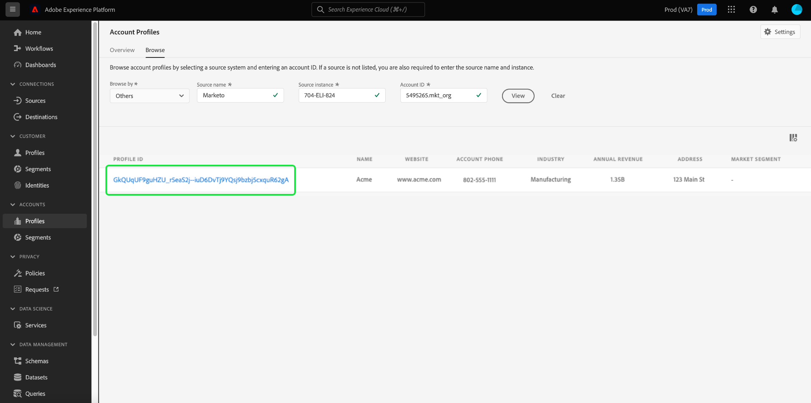

# [!UICONTROL Account Profiles] kontrollpanel

Adobe Experience Platform användargränssnitt (UI) är en kontrollpanel där du kan visa viktig information om dina kontoprofiler, som de tagits under en daglig ögonblicksbild. I den här handboken beskrivs hur du kommer åt och arbetar med [!UICONTROL Account Profiles] kontrollpanelen i användargränssnittet och ger mer information om de visualiseringar som visas på kontrollpanelen.

Det här dokumentet innehåller en översikt över funktionerna i [!UICONTROL Account Profiles] Instrumentpanel och information om tillgängliga standardinsikter. Se [[!UICONTROL Account Profiles] Användargränssnittsguide](../../rtcdp/accounts/account-profile-ui-guide.md) om du vill ha omfattande information om dess tillgängliga funktioner.

## Komma igång

Du måste ha rätt till [Adobe Real-time Customer Data Platform B2B Edition](../../rtcdp/b2b-overview.md) för att få tillgång till B2B [!UICONTROL Account Profiles] kontrollpanel.

## Data för kontoprofiler {#data}

The [!UICONTROL Account Profiles] På kontrollpanelen visas en ögonblicksbild av din enhetliga kontoinformation. Den här kontoinformationen kommer från olika källor över alla era marknadsföringskanaler och från de olika system som organisationen för närvarande använder för att lagra kundkontoinformation.

Profildata i ögonblicksbilden visar data exakt som de visas vid den specifika tidpunkten när ögonblicksbilden togs. Med andra ord är ögonblicksbilden inte en uppskattning eller ett urval av data, och [!UICONTROL Account Profiles] Kontrollpanelen uppdateras inte i realtid.

>[!NOTE]
>
>Ändringar eller uppdateringar som gjorts i data sedan ögonblicksbilden togs kommer inte att visas på kontrollpanelen förrän nästa ögonblicksbild tas.

## Utforska [!UICONTROL Account Profiles] kontrollpanel {#explore}

Navigera till [!UICONTROL Account Profiles] kontrollpanelen i plattformsgränssnittet väljer du **[!UICONTROL Profiles]** under [!UICONTROL Accounts] i den vänstra navigeringspanelen.

Från [!UICONTROL Account Profiles] dashboard kan du antingen [bläddra bland de kontoprofiler som är insamlade i din organisation](#browse-account-profiles), eller [visa alla dina kontouppgifter i en översikt med widgetar](#standard-widgets).

### Datumfilter {#date-filter}

The [!UICONTROL Overview] -fliken består av widgetar som tillhandahåller skrivskyddade mätvärden för att förmedla viktig information om dina kontoprofiler. Markera kalenderikonen eller datumen för att ändra det globala datumfiltret för dina widgetar.

>[!IMPORTANT]
>
>Datumintervallet som du väljer i listrutekalendern påverkar alla insikter förutom de två widgetarna för prediktiv bedömning ([distribution](#predictive-scoring-distribution) och [de viktigaste inflytelserika faktorerna](#predictive-scoring-top-influential-factors)).

### Konfigurera lead till kontomatchningstjänsten {#lead-to-account-matching-service}

Välj **[!UICONTROL Settings]** för att konfigurera lead-to-account matching-tjänsten från [!UICONTROL Account settings] -dialogrutan. Mer information om hur du konfigurerar din lead till kontomatchning finns i [Användargränssnittsguide](../../rtcdp/accounts/account-profile-ui-guide.md#configure-lead-to-account-matching). Mer information om lead-till-konto-matchning finns i [leda till kontomatchning i Real-Time CDP B2B-dokumentation](../../rtcdp/b2b-ai-ml-services/lead-to-account-matching.md).

## Bläddra bland kontoprofiler {#browse-account-profiles}

Från [!UICONTROL Browse] kan du söka efter och visa de skrivskyddade kontoprofiler som är inkapslade i din organisation. Använd ett konto-ID från en ansluten företagskälla eller ange källinformation direkt. Från den här arbetsytan kan du se viktig information som tillhör kontoprofilen, bland annat namn, bransch, intäkter och målgrupp.

Välj [!UICONTROL Profile ID] från resultaten som visas på [!UICONTROL Browse] för att öppna [!UICONTROL Details] för kontoprofilen.

Kontoprofilinformationen som visas på [!UICONTROL Details] har sammanfogats från flera profilfragment till en enda vy av det enskilda kontot. Läs dokumentationen om [surfkontoprofiler i Adobe Real-time Customer Data Platform](../../rtcdp/accounts/account-profile-ui-guide.md#browse-account-profiles) om du vill veta mer om visningsfunktioner för kontoprofiler i användargränssnittet för plattformen.

## Standardwidgetar {#standard-widgets}

Adobe tillhandahåller standardwidgetar som du kan använda för att visualisera olika mätvärden för dina kontoprofiler.

Om du vill veta mer om de tillgängliga standardwidgetarna väljer du namnet på en widget i följande lista:

* [Kontoprofiler har lagts till](#account-profiles-added)
* [Konton per bransch](#accounts-by-industry)
* [Konton efter typ](#accounts-by-type)
* [Möjligheter har lagts till](#opportunities-added)
* [Affärsmöjligheter per personroll](#opportunities-by-person-role)
* [Affärsmöjligheter efter intäkt](#opportunities-by-revenue)
* [Affärsmöjligheter efter status och fas](#opportunities-by-status-&-stage)
* [Vunna affärsmöjligheter](#opportunities-won)
* [Förutsägbar poängfördelning](#predictive-scoring-distribution)
* [Prediktiv bedömning av viktiga faktorer](#predictive-scoring-top-influential-factors)
* [Totalt antal konton per bransch](#total-accounts-by-industry)

### Kontoprofiler har lagts till {#account-profiles-added}

The [!UICONTROL Account profiles added] används ett linjediagram för att visa antalet kontoprofiler som läggs till varje dag under en tidsperiod. Använd det globala datumfiltret längst upp på kontrollpanelen för att fastställa analysperioden. Om inget datumfilter anges visas de kontoprofiler som lagts till för året före idag i standardbeteendet. Resultatet kan användas för att skapa en trend i antalet kontoprofiler som läggs till.

### Konton per bransch {#accounts-by-industry}

The [!UICONTROL Accounts by industry] widgeten visar det totala antalet konton i ett enskilt mätresultat i ett dondiagram. Nötdiagram illustrerar den relativa sammansättningen av olika branscher som utgör denna summa. En färgkodad nyckel ger en beskrivning av alla inkluderade branscher. Individuella värden för varje bransch visas i en dialog när markören förs över respektive avsnitt i donatabellen.

### Konton efter typ {#accounts-by-type}

The [!UICONTROL Accounts by type] widgeten visar det totala antalet konton i ett enskilt mätresultat i ett dondiagram. I donutdiagrammet visas den relativa strukturen av olika kontotyper som utgör denna summa. En färgkodad nyckel ger en beskrivning av alla inkluderade kontotyper. Individuella antal för varje typ av konto visas i en dialogruta när markören förs över respektive avsnitt i donatabellen.

### Möjligheter har lagts till {#opportunities-added}

The [!UICONTROL Opportunities added] widgeten använder ett linjediagram för att visa antalet möjligheter som läggs till varje dag under en tidsperiod. Använd det globala datumfiltret längst upp på kontrollpanelen för att fastställa analysperioden. Om inget datumfilter anges listas de möjligheter som lagts till för året före i standardbeteendet. Resultatet kan användas för att skapa en trend i antalet tillagda möjligheter.

<!-- Link to date filter documentation from Annamalai -->

### Affärsmöjligheter per personroll {#opportunities-by-person-role}

The [!UICONTROL Opportunities by person role] visar det totala antalet affärsmöjligheter i ett enda mätresultat i ett mundiagram. I donutdiagrammet illustreras den relativa strukturen av roller som utgör det totala antalet möjligheter. En färgkodad nyckel ger en beskrivning av alla inkluderade roller. Enskilda värden för varje roll visas i en dialogruta när markören hålls över respektive avsnitt i donatabellen.

>[!NOTE]
>
>The [!UICONTROL No data found] eller [!UICONTROL Unable to load] felet orsakas när bryggan säljprojekt-person inte används i ditt schema. Om dina insikter visar något av dessa fel bör du kontrollera ditt unionsschema och se till att fältgruppen &#39;Opportunity-Person&#39; samlar in data.

### Affärsmöjligheter efter intäkt {#opportunities-by-revenue}

The [!UICONTROL Opportunities by revenue] widgeten använder ett stapeldiagram för att illustrera den totala beräknade intäkten som dina affärsmöjligheter genererar. Widgeten har stöd för upp till sex möjligheter.

Om du vill visa en dialogruta som innehåller den specifika intäktssumman för en affärsmöjlighet, håller du pekaren över enskilda fält.

### Affärsmöjligheter efter status och fas {#opportunities-by-status-&-stage}

Den här widgeten använder ett stapeldiagram för att illustrera antalet möjligheter som antingen är öppna eller stängda i alla stadier av marknadsförings-/säljprocessen. Widgeten använder färger för att särskilja affärsmöjligheterna. En färgkodad nyckel anger tillgängliga stadier för affärsmöjligheter.

### Vunna affärsmöjligheter {#opportunities-won}

The [!UICONTROL Opportunities won] widgeten visar det totala antalet affärsmöjligheter som har slutförts i ett enda mätresultat i ett mundiagram. I donutdiagrammet visas den relativa strukturen av möjligheter som antingen vunnits eller inte. En färgkodad nyckel skiljer mellan vunna och ej vunna affärsmöjligheter. Enskilda värden för varje roll visas i en dialogruta när markören hålls över respektive avsnitt i donatabellen.

### Förutsägbar poängfördelning {#predictive-scoring-distribution}

The [!UICONTROL Predictive scoring distribution] widgeten visar poängdistributionen för alla kontoprofiler så att du snabbt kan förstå hur din säljpipeline mår. Poängdata förmedlas via ett mundiagram och ett kolumndiagram.

I donutdiagrammet visas andelen av dina totala kontoprofiler i var och en av de stora, medelstora och låga benägenheterna att köpa bucklar. Nyckeln ger mer information om de färgkodade avsnitten, inklusive poängintervallen och antalet kontoprofiler i intervallet.

Kolumndiagrammet ger en mer detaljerad resultatfördelning. Varje kolumn visar antalet kontoprofiler i var och en av de 20 fempunktsökningsgrupperna.

I listrutan i widgeten kan du välja kontobedömningsmodellen.

>[!NOTE]
>
>Globala datumintervallfilter gäller inte för prediktiva poängsättningsinsikter. Prediktiva bedömningswidgetar analyserar data baserat på den kontobedömningsmodell som valts i listrutan.

### Prediktiv bedömning av viktiga faktorer {#predictive-scoring-top-influential-factors}

The [!UICONTROL Predictive scoring top influential factors] widgeten hjälper dig att förstå de viktigaste faktorerna som driver poängen för varje benägenhetspyts.

Den här widgeten visar de viktigaste inflytelserika faktorerna för de stora, medelstora och låga benägenhetsintervallen. En stapel för varje inflytelserik faktor anger den procentandel av kontoprofilerna i den benägenhetspytsen som innehåller den specifika inflytelserika faktorn.

I listrutan i widgeten kan du välja kontobedömningsmodellen.

>[!NOTE]
>
>Globala datumintervallfilter gäller inte för prediktiva poängsättningsinsikter. Prediktiva bedömningswidgetar analyserar data baserat på den kontobedömningsmodell som valts i listrutan.

### Totalt antal konton per bransch {#total-accounts-by-industry}

Den här widgeten visar det totala antalet konton i ett enskilt mätresultat och använder ett dondiagram för att illustrera de proportionella räkningsstorlekarna för de branscher som utgör det totala antalet. Nyckeln ger färgkodningsinformation för de olika branscherna som donationsdiagrammet består av.

Individuella värden för de olika branscherna visas i en dialogruta när markören hålls över respektive avsnitt i mundiagrammet.

## Nästa steg

Om du följer det här dokumentet bör du nu veta hur du hittar [!UICONTROL Account Profiles] och även förstå mätvärdena som visas i de tillgängliga widgetarna. Mer information om hur du arbetar med kontoprofiler som en del av dina B2B-data i användargränssnittet för Experience Platform finns i [kontoprofilöversikt](../../rtcdp/accounts/account-profile-overview.md) för Adobe Real-Time CDP, B2B Edition.
