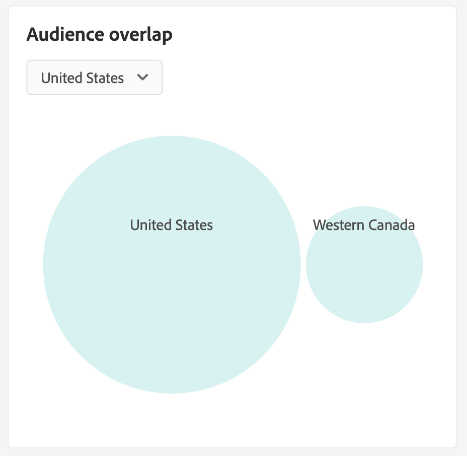

# Kontrollpanel för [!UICONTROL Audiences] {#audiences-dashboard}

Adobe Experience Platform användargränssnitt (UI) är en kontrollpanel där du kan visa viktig information om dina målgrupper, som du har tagit med en daglig ögonblicksbild. I den här handboken beskrivs hur du kommer åt och arbetar med kontrollpanelen [!UICONTROL Audiences] i användargränssnittet och den innehåller mer information om de visualiseringar som visas på kontrollpanelen.

En översikt över alla Adobe Experience Platform segmenteringstjänstfunktioner i användargränssnittet för plattformen finns i [gränssnittshandboken för segmenteringstjänsten](../../segmentation/ui/overview.md).

## [!UICONTROL Audiences] instrumentpanelsdata

Kontrollpanelen [!UICONTROL Audiences] visar en ögonblicksbild av attributdata (postdata) som din organisation har i profilarkivet i Experience Platform. Ögonblicksbilden innehåller inga händelsedata (tidsserier).

Attributdata i ögonblicksbilden visar data exakt som de visas vid den specifika tidpunkten när ögonblicksbilden togs. Ögonblicksbilden är alltså inte en uppskattning eller ett exempel av data och instrumentpanelen [!UICONTROL Audiences] uppdateras inte i realtid.

>[!NOTE]
>
>Ändringar eller uppdateringar som gjorts i data sedan ögonblicksbilden togs kommer inte att visas på kontrollpanelen förrän nästa ögonblicksbild tas.

## Utforska instrumentpanelen [!UICONTROL Audiences] {#explore}

Om du vill navigera till kontrollpanelen [!UICONTROL Audiences] i plattformsgränssnittet väljer du **[!UICONTROL Audiences]** i den vänstra listen och sedan fliken **[!UICONTROL Overview]** för att visa kontrollpanelen.

>[!NOTE]
>
>Om din organisation är ny på Platform och ännu inte har aktiva profildatauppsättningar eller sammanslagningsprinciper skapade, visas inte instrumentpanelen [!UICONTROL Audiences]. Istället visar fliken [!UICONTROL Overview] länkar och dokumentation som hjälper dig att komma igång med segmentering.

![Fliken [!UICONTROL Audiences] Dashboard [!UICONTROL Overview] med [!UICONTROL Audiences] och [!UICONTROL Overview] markerade.](../images/audiences/dashboard-overview.png)

### Ändra kontrollpanelen [!UICONTROL Audiences] {#modify}

Du kan ändra utseendet på kontrollpanelen [!UICONTROL Audiences] genom att välja **[!UICONTROL Modify dashboard]**. Detta gör att du kan flytta, lägga till och ta bort widgetar från instrumentpanelen samt få tillgång till **[!UICONTROL Widget library]** för att utforska tillgängliga widgetar och skapa anpassade widgetar för din organisation.

Mer information finns i dokumentationen om [att ändra kontrollpaneler](../customize/modify.md) och [översikt över widgetbiblioteket](../customize/widget-library.md).

### Lägg till widgetar {#add-widget}

Välj **[!UICONTROL Add widget]** om du vill navigera till widgetbiblioteket och visa en lista över tillgängliga widgetar att lägga till på din instrumentpanel.

![Kontrollpanelsöversikten [!UICONTROL Audiences] med [!UICONTROL Add widget] markerad.](../images/audiences/audiences-overview-add-widget.png)

I widgetbiblioteket kan du bläddra bland alla standardwidgetar och anpassade widgetar. Mer information om hur du lägger till widgetar finns i dokumentationen för widgetbiblioteket om hur du [lägger till en widget](../customize/widget-library.md#add-widgets).

### Visa SQL {#view-sql}

Du kan visa den SQL som genererar de insikter som visualiserats på din instrumentpanel med en växlingsknapp på arbetsytan för [!UICONTROL Overview]. Ni kan få inspiration från SQL:s av era befintliga insikter för att skapa nya frågor som bygger på unika insikter från plattformsdata baserat på era affärsbehov. Mer information om den här funktionen finns i [Visa gränssnittshandboken för SQL](../view-sql.md).

## Välj en målgrupp {#select-audience}

Kontrollpanelen väljer automatiskt vilken målgrupp som ska visas. Du kan dock ändra målgruppen med hjälp av listrutan eller målgruppsväljaren.

Om du vill välja en annan målgrupp väljer du listrutan bredvid målgruppens namn eller använder målgruppsväljaren för att öppna dialogrutan för målgruppsval.

>[!IMPORTANT]
>
>Endast målgrupper med ett profilantal över noll visas i listan över valda målgrupper.

![Dialogrutan [!UICONTROL Select audience] som visar alla tillgängliga målgrupper.](../images/audiences/select-audience-dialog.png)

## Widgetar och mätvärden {#widgets-and-metrics}

Kontrollpanelen [!UICONTROL Audiences] består av widgetar, som är skrivskyddade mått som ger viktig information om den valda målgruppen.

Datum och tid för den senaste ögonblicksbilden visas högst upp på fliken [!UICONTROL Overview] bredvid listrutan över målgrupper. Alla widgetdata är korrekta från och med det datumet och den tidpunkten. Tidsstämpeln för ögonblicksbilden anges i UTC. Den finns inte i tidszonen för den enskilda användaren eller organisationen.

## Standardwidgetar {#default-widgets}

En standardinläsning av widgetar tillhandahålls för alla nya instanser av Adobe Experience Platform som visar de senaste tillgängliga insikterna från dina data. Följande widgetar är förkonfigurerade i segmentvyn från början. Mer information om widgetarnas syfte och funktion finns i respektive avsnitt.

* [[!UICONTROL Audience size]](#audience-size)
* [[!UICONTROL Audience size change trend]](#audience-size-change-trend)
* [[!UICONTROL Identity overlap]](#identity-overlap)
* [[!UICONTROL Profiles by identity]](#profiles-by-identity)

>[!NOTE]
>
>Från och med den 26 juli 2023 har kontrollpanelerna [!UICONTROL Profiles], [!UICONTROL Audiences] och [!UICONTROL Destinations] Översikt återställts till en ny standardwidget för inläsning för alla användare som inte ändrade sina vyer under de senaste sex månaderna.
>Mer information om vilka widgetar som ingår som en del av standardwidgeten finns i dokumentationen för [Profiler](./profiles.md#default-widgets) och [Destinationer](./destinations.md#default-widgets) -standardwidgeten. Du kan fortsätta att anpassa dina instrumentpanelswidgetar som tidigare.

## AI-widgetar för kunder {#customer-ai-audiences-widgets}

Kund-AI används för att generera anpassade benägenhetspoäng som omsättning och konvertering för enskilda profiler i stor skala. Kunds-AI gör detta genom att analysera befintliga kundupplevelsedata för att förutsäga **bortfall eller konverteringsbenägenhetspoäng**. Dessa högkvalitativa kundbenägenhetsmodeller möjliggör mer exakt segmentering och målinriktning. Distributionen [av poängen](#customer-ai-distribution-of-scores) och [poängsammanfattningen](#customer-ai-scoring-summary) visar hur er målgrupp är uppdelad. Panelerna sätter fokus på vilka profiler som är de höga/låga/medelstora och hur de fördelas över dina profilantal.

* [[!UICONTROL Customer AI scoring summary]](#customer-ai-scoring-summary)
* [[!UICONTROL Customer AI distribution of scores]](#customer-ai-distribution-of-scores)

### [!UICONTROL Customer AI distribution of scores] {#customer-ai-distribution-of-scores}

>[!CONTEXTUALHELP]
>id="platform_dashboards_segments_distributionOfScores"
>title="Fördelning av poäng"
>abstract="Den här widgeten visar fördelningen av det totala antalet profiler utifrån deras benägenhetspoäng i steg om fem procent. Distributionen av profilantalet bestäms av AI-modellen och den valda sammanfogningsprincipen. Du kan ändra AI-modellen i listrutan under widgettiteln."

Widgeten [!UICONTROL Customer AI distribution of scores] kategoriserar det totala antalet profiler utifrån deras benägenhetspoäng. Fördelningen av profilantalet bestäms av AI-modellen och den valda sammanfogningspolicyn och visualiseras sedan i steg om fem procent som anger deras benägenhet. Antalet profiler anges längs Y-axeln och benägenhetspoängen anges längs X-axeln.

>[!NOTE]
>
>Om visualiseringen är en konverteringsbenägenhetspoäng visas de höga poängen i grönt och de låga poängen i rött. Om du förutser kurvbenägenheten att detta vänds är de höga poängen röda och de låga poängen gröna. Mediefiltret förblir gult oavsett vilken typ av benägenhet du väljer.

Den AI-modell som avgör graden av benägenhet väljs i listruteväljaren under widgetens titel. Listrutan innehåller en lista över alla konfigurerade AI-modeller för kunder. Välj lämplig AI-modell för analysen i listan över tillgängliga modeller. Om det inte finns någon AI-modell för kunden instruerar ett meddelande i widgeten dig att konfigurera minst en AI-modell för kunden och tillhandahåller en hyperlänk till konfigurationssidan för kundens AI-modell. I dokumentationen finns instruktioner om [hur du konfigurerar en AI-instans för kunder](../../intelligent-services/customer-ai/user-guide/configure.md).

>[!NOTE]
>
>Välj listrutan direkt under fliken Översikt om du vill ändra den sammanfogningsprincip som avgör vilka profiler som tas med i analysen. Mer information finns i avsnittet [sammanfogningsprinciper](#merge-policies) om du vill ha en kort beskrivning eller i översikten för [sammanfogningsprincipen](../../profile/merge-policies/overview.md).

Om du vill navigera till sidan med detaljerad information för den valda kundens AI-modell väljer du **[!UICONTROL View model details]**.

![Kontrollpanelen Experience Platform Publiker med widgeten [!UICONTROL Customer AI distribution of scores] och [!UICONTROL View model details] markerad.](../images/segments/customer-ai-distribution-of-scores.png)

Sidan med detaljerad modellinformation visas.

Mer information om kunds-AI finns i [gränssnittsguiden för upptäckt](../../intelligent-services/customer-ai/user-guide/discover-insights.md).

### [!UICONTROL Customer AI scoring summary] {#customer-ai-scoring-summary}

>[!CONTEXTUALHELP]
>id="platform_dashboards_segments_scoringSummary"
>title="Sammanfattning av poäng"
>abstract="Den här widgeten visar det totala antalet poängsatta profiler och kategoriserar dem i grupper som innehåller hög, medelhög och låg benägenhet. Nutdiagrammet visar den proportionella sammansättningen av de totala profilerna över hög, medel och låg benägenhet."

Den här widgeten visar det totala antalet profiler som har poängterats och kategoriserar dem i grupper som innehåller hög, medelhög och låg benägenhet som grön, gul respektive röd. Ett mundiagram används för att illustrera den proportionella kompositionen av de totala profilerna mellan hög-, medel- och låg-egenskaper som grönt, gult respektive rött. En profil ger hög benägenhet vid över 75, medelhög intensitet mellan 25 och 74 och låg benägenhet under 24. En teckenförklaring anger färgkoden och egenskapernas tröskelvärden. Profilantal för de höga, medelstora och låga egenskaperna visas i en dialogruta när markören hålls över respektive avsnitt i mundiagrammet.

>[!NOTE]
>
>Om visualiseringen är en konverteringsbenägenhetspoäng visas de höga poängen i grönt och de låga poängen i rött. Om du förutser kurvbenägenheten att detta vänds är de höga poängen röda och de låga poängen gröna. Mediefiltret förblir gult oavsett vilken typ av benägenhet du väljer.

I listrutan under widgetens rubrik finns en lista med alla konfigurerade AI-modeller för kunder. Välj lämplig AI-modell för analysen i listan över tillgängliga modeller. Om det inte finns någon AI-modell för kunden instruerar ett meddelande i widgeten dig att konfigurera minst en AI-modell för kunden och tillhandahåller en hyperlänk till konfigurationssidan för kundens AI-modell. Mer information finns i dokumentationen om [hur du konfigurerar en AI-instans](../../intelligent-services/customer-ai/user-guide/configure.md) för kunder.

>[!NOTE]
>
>Det totala antalet beräknade profiler beror på den valda sammanfogningsprincipen. Om du vill ändra den sammanfogningsprincip som används väljer du listrutan direkt under fliken Översikt. Mer information finns i avsnittet [sammanfogningsprinciper](#merge-policies) om du vill ha en kort beskrivning eller i översikten för [sammanfogningsprincipen](../../profile/merge-policies/overview.md).

Välj **[!UICONTROL View model details]** om du vill navigera till sidan med detaljerade insikter för den valda kundens AI-modell. Mer information om kunds-AI finns i [gränssnittsguiden för upptäckt](../../intelligent-services/customer-ai/user-guide/discover-insights.md).

## Standardwidgetar {#standard-widgets}

Adobe tillhandahåller flera standardwidgetar som du kan använda för att visualisera olika mätvärden som relaterar till dina målgrupper. Du kan också skapa anpassade widgetar som ska delas med din organisation med [!UICONTROL Widget library]. Om du vill veta mer om hur du skapar anpassade widgetar börjar du med att läsa översikten över [widgetbiblioteket](../customize/widget-library.md).

Om du vill veta mer om de tillgängliga standardwidgetarna väljer du namnet på en widget i följande lista:

* [[!UICONTROL Audience size]](#audience-size)
* [[!UICONTROL Audience activation order]](#audience-activation-order)
* [[!UICONTROL Audience size trend]](#audience-size-trend)
* [[!UICONTROL Audience size change trend]](#audience-size-change-trend)
* [[!UICONTROL Audience size trend by identity]](#audience-size-trend-by-identity)
* [[!UICONTROL Audience overlap]](#audience-overlap)
* [[!UICONTROL Audience overlap report]](#audience-overlap-report)
* [[!UICONTROL Identity overlap]](#identity-overlap)
* [[!UICONTROL Profiles by identity]](#profiles-by-identity)
* [[!UICONTROL Scheduled activations]](#scheduled-activations)

### [!UICONTROL Audience size] {#audience-size}

>[!CONTEXTUALHELP]
>id="platform_dashboards_segments_audiencesize"
>title="Målgruppsstorlek"
>abstract="Den här widgeten visar det totala antalet sammanfogade profiler inom den valda målgruppen. Det här numret beror på den sammanfogningsprincip som används för dina data och är korrekt vid tidpunkten för den senaste ögonblicksbilden."

Widgeten **[!UICONTROL Audience size]** visar det totala antalet sammanfogade profiler inom den valda målgruppen när ögonblicksbilden togs. Det här numret är resultatet av att tillämpa målgruppssammanfogningsprincipen på dina profildata för att sammanfoga profilfragment och skapa en enda profil för varje enskild person i målgruppen.

Mer information om fragment och sammanfogade profiler finns i [Kundprofilöversikt i realtid](../../profile/home.md).

![Kontrollpanelsöversikten [!UICONTROL Audiences] med widgeten [!UICONTROL Audience size] markerad.](../images/audiences/audience-size.png)

### [!UICONTROL Audience size trend] {#audience-size-trend}

>[!CONTEXTUALHELP]
>id="platform_dashboards_segments_audiencesizetrend"
>title="Trend för målgruppsstorlek"
>abstract="Den här widgeten innehåller information om det totala antalet profiler som uppfyller villkoren för segmentdefinitionen **any**, som tagits under den dagliga ögonblicksbilden, under de senaste 30 dagarna, 90 dagar eller 12 månaderna."

Widgeten **[!UICONTROL Audience size trend]** innehåller en illustration av linjediagram för det totala antalet profiler som är kvalificerade för **valfri** målgrupp under en viss tidsperiod. Trenden för målgruppens storlek kan visas under 30 dagar, 90 dagar och 12 månader. Tidsperioden väljs i en listruta i widgeten. Publiken visas på y-axeln och tiden på x-axeln.

Den här widgeten innehåller även den automatiska funktionen [!UICONTROL Captions] där en maskininlärningsmodell analyserar diagram- och målgruppsdata och automatiskt genererar bildtexter som beskriver viktiga trender och viktiga händelser. Välj **[!UICONTROL Captions]** för att öppna dialogrutan med automatiska bildtexter.

![I översikten [!UICONTROL Audiences] visas widgeten för målgruppsstorlekstrend.](../images/audiences/audience-size-trend-captions.png)

Dialogrutan med automatiska bildtexter öppnas och innehåller information om dina data.

Mer information om hur du utvärderar målgrupper och hur profiler kvalificerar sig och lämnar målgrupper finns i [dokumentationen för segmenteringstjänsten](../../segmentation/home.md).

### [!UICONTROL Audience size change trend] {#audience-size-change-trend}

Den här widgeten innehåller ett linjediagram som illustrerar skillnaden i det totala antalet profiler som är kvalificerade för en viss målgrupp mellan de senaste ögonblicksbilderna. Den valda målgruppen för analys väljs i listrutan över. Perioden för trendanalys kan visualiseras under 30 dagar, 90 dagar och 12 månader. Tidsperioden väljs i en listruta i widgeten. Publiken visas på y-axeln och tiden på x-axeln.

### [!UICONTROL Audience size trend by identity] {#audience-size-trend-by-identity}

Den här widgeten illustrerar målgruppens storlekstrend för en viss målgrupp baserat på den identitetstyp som valts i widgetens listruta. Den målgrupp som används för analys väljs i listrutan Översikt. Perioden för trendanalys kan visualiseras under 30 dagar, 90 dagar och 12 månader. Tidsperioden väljs i en listruta i widgeten.

### [!UICONTROL Audience activation order] {#audience-activation-order}

Widgeten [!UICONTROL Audience activation order] innehåller en tabell med tre kolumner som visar målnamnet, plattformen och aktiveringsdatumet för målgruppen. Listan ordnas från hög till låg enligt senaste och kan innehålla upp till 10 rader.

### [!UICONTROL Audience overlap] {#audience-overlap}

Den här widgeten använder ett Venndiagram för att visualisera antalet personer som matchar kriterierna för båda målgrupperna. De målgrupper som används för jämförelsen väljs i listrutan för widgetar. Det totala antalet profiler i den relevanta segmentdefinitionen kan ses genom att du håller markören över en cirkel eller skärningspunkten i Venndiagrammet.

Med den här widgeten kan du optimera din segmenteringsstrategi genom att visualisera likheterna i resultaten av segmentdefinitionerna.

### [!UICONTROL Audience overlap report] {#audience-overlap-report}

Den här widgeten tabellariserar profilens överlappningsdata för en viss målgrupp. En lista med fem målgrupper som rangordnas mellan de högsta och de lägsta procentsatserna för överlappning finns för den målgrupp som valts i listrutan högst upp på skärmen. För tydlighetens skull anges den valda målgruppen i kolumnen [!UICONTROL AUDIENCE A NAME]. Analys av publiköverlappning tillhandahålls för den andra målgruppen i kolumnen [!UICONTROL AUDIENCE B NAME]. Procentöverlappningen anges i den tredje kolumnen med 12 decimaler.

Rapporten om publiköverlappning hjälper er att skapa nya högpresterande målgrupper. Genom att observera hög procentuell överlappning kan ni hindra målgrupper och förhindra att samma målgrupp skickas till olika destinationer. De hjälper er också att identifiera dolda insikter som kan bidra till bättre segmentering. Låg procentuell överlappning hjälper till att hitta unika profiler som ska eftersökas.

Välj **[!UICONTROL View more]** om du vill öppna en dialogruta i helskärmsläge som innehåller fler data om publiköverlappning.

Dialogrutan [!UICONTROL Audience overlap report] visas. Den här dialogrutan kan innehålla upp till 50 rader med målgrupper som överlappar analyser uppdelade i sex kolumner. Välj inställningsikonen () om du vill ta bort eller lägga till kolumner från tabellen.

>[!NOTE]
>
>Välj kolumnrubriken **[!UICONTROL Overlapping]** om du vill ändra resultatrankningen mellan högsta och lägsta respektive högsta.

Om du vill hämta hela rapporten i PDF-format väljer du Alternativ-menyn (**`...`**) följt av **[!UICONTROL Download]**.

Välj en rad i rapporten för att öppna ett Venndiagram över överlappningsanalysen. Håll pekaren över ett avsnitt i Venndiagrammet för att visa antalet profiler i en dialogruta.

Välj **[!UICONTROL Close]** om du vill gå tillbaka till kontrollpanelen [!UICONTROL Audiences].

### [!UICONTROL Identity overlap] {#identity-overlap}

>[!CONTEXTUALHELP]
>id="platform_dashboards_segments_identityoverlap"
>title="Identitetsöverlappning"
>abstract="Den här widgeten visar överlappningen av profiler i målgruppen som innehåller båda valda identiteter. Cirklarna visar den relativa storleken för varje identitet. Antalet profiler som innehåller båda namnutrymmena representeras av överlappningen mellan cirklarna."

Widgeten **[!UICONTROL Identity overlap]** visar ett Venndiagram, eller ett uppsättningsdiagram, som visar överlappningen av profiler i din målgrupp som innehåller flera identiteter.

Använd listrutemenyerna i widgeten för att välja de identiteter som du vill jämföra. Cirklarna visar den relativa storleken för varje vald identitet, där antalet profiler som innehåller båda namnutrymmena representeras av storleken på överlappningen mellan cirklarna.

Om en kund interagerar med ert varumärke i mer än en kanal kopplas flera identiteter till den enskilda kunden. Detta gör det sannolikt att din organisation kommer att ha flera profiler som innehåller fragment från mer än en identitet.

Mer information om identiteter finns i [identitetstjänstens dokumentation](../../identity-service/home.md).

![Kontrollpanelsöversikten [!UICONTROL Audiences] med widgeten Identitetsöverlappning markerad.](../images/audiences/identity-overlap.png)

### [!UICONTROL Profiles by identity] {#profiles-by-identity}

>[!CONTEXTUALHELP]
>id="platform_dashboards_segments_profilesbyidentity"
>title="Profiler efter identitet"
>abstract="Den här widgeten visar hur identiteterna är fördelade på alla sammanfogade profiler hos den valda målgruppen."

Widgeten **[!UICONTROL Profiles by identity]** visar uppdelningen av identiteter i alla sammanfogade profiler i den valda målgruppen. Det totala antalet profiler efter identitet kan vara högre än det totala antalet profiler i målgruppen eftersom en profil kan ha flera associerade identiteter. Med andra ord kan de värden som visas för varje identitet sammanfogas med mer än den totala målgruppsstorleken. Detta beror på att om en kund interagerar med ert varumärke i mer än en kanal kan flera identiteter kopplas till den enskilda kunden.

Välj **[!UICONTROL Captions]** för att öppna dialogrutan med automatiska bildtexter.

![Kontrollpanelsöversikten [!UICONTROL Audiences] med alternativet Profiler efter identitetswidget och Bildtexter markerat.](../images/audiences/profiles-by-identity.png)

En maskininlärningsmodell genererar automatiskt datainsikter genom att analysera den övergripande fördelningen och de viktigaste dimensionerna av data.

Mer information om identiteter finns i [identitetstjänstens dokumentation](../../identity-service/home.md).

### Schemalagda aktiveringar {#scheduled-activations}

Widgeten [!UICONTROL Scheduled activations] innehåller en tabellvy över de senast aktiverade målplatserna. Tabellen innehåller målplattformen, namnet på aktiveringsflödet till den här destinationen samt start- och slutdatumet för aktiveringen för den valda målgruppen. Om det inte finns något slutdatum för aktiveringen visas det som [!UICONTROL Ongoing]. Den målgrupp som ska analyseras väljs i listrutan högst upp på sidan.

Med widgeten kan du snabbt identifiera var och när målgruppen aktiveras och göra duplicerade eller onödiga aktiveringar mer transparenta. Den samlade informationen visar också var aktiveringar har utelämnats.

## Nästa steg

Genom att följa det här dokumentet bör du nu kunna hitta kontrollpanelen [!UICONTROL Audiences] och välja en målgrupp att visa. Du bör också förstå mätvärdena som visas i de tillgängliga widgetarna. Mer information om hur du arbetar med målgrupper i användargränssnittet för Experience Platform finns i [gränssnittshandboken för segmenteringstjänsten](../../segmentation/ui/overview.md).
