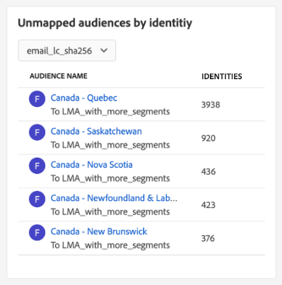

# Kontrollpanel för [!UICONTROL Destinations]

Adobe Experience Platform användargränssnitt (UI) är en kontrollpanel där du kan visa viktig information om din organisations aktiva mål, som den tagits under en ögonblicksbild. I den här handboken beskrivs hur du får åtkomst till och arbetar med kontrollpanelen för mål i användargränssnittet, och den innehåller mer information om mätvärdena som visas på kontrollpanelen.

En översikt över destinationer och en katalog över alla tillgängliga destinationer inom Experience Platform finns i [måldokumentationen](../../destinations/home.md).

## [!UICONTROL Destinations] instrumentpanelsdata {#destinations-dashboard-data}

På kontrollpanelen Destinationer visas en ögonblicksbild av de mål som din organisation har aktiverat i Experience Platform. Data i ögonblicksbilden visar data exakt som de visas vid den specifika tidpunkten när ögonblicksbilden togs. Ögonblicksbilden är alltså inte en uppskattning eller ett urval av data och kontrollpanelen för destinationer uppdateras inte i realtid.

>[!NOTE]
>
>Ändringar eller uppdateringar som gjorts i data sedan ögonblicksbilden togs kommer inte att visas på kontrollpanelen förrän nästa ögonblicksbild tas.

## Utforska instrumentpanelen [!UICONTROL Destinations] {#explore}

Om du vill navigera till målkontrollpanelen i Experience Platform-gränssnittet väljer du **[!UICONTROL Destinations]** i den vänstra listen och sedan fliken **[!UICONTROL Overview]** för att visa kontrollpanelen.

Datum och tid för den senaste ögonblicksbilden visas högst upp i [!UICONTROL Overview] bredvid mållistrutan. Alla widgetdata är korrekta från och med det datumet och den tidpunkten. Tidsstämpeln för ögonblicksbilden anges i UTC. Den finns inte i tidszonen för den enskilda användaren eller organisationen.

>[!NOTE]
>
>Om din organisation är ny för Experience Platform och ännu inte har aktiva mål visas inte kontrollpanelen Destinationer och fliken [!UICONTROL Overview]. Om du i stället väljer [!UICONTROL Destinations] i den vänstra navigeringen visas fliken [!UICONTROL Catalog]. Mer information om fliken [!UICONTROL Catalog] finns i handboken om [[!UICONTROL Destinations]-arbetsytan ](../../destinations/ui/destinations-workspace.md).

### Ändra kontrollpanelen [!UICONTROL Destinations] {#modify}

Välj **[!UICONTROL Modify dashboard]** om du vill ändra utseendet på målinstrumentpanelen. Ändringar i kontrollpanelen görs per användare och inte för hela organisationen. Du kan flytta, lägga till, ändra storlek på och ta bort widgetar från instrumentpanelen och komma åt widgetbiblioteket för att anpassa din instrumentpanel. Från widgetbiblioteket kan du utforska de tillgängliga widgetarna och skapa anpassade widgetar för din organisation.

Mer information finns i [ändringsdokumentationen för instrumentpaneler](../customize/modify.md) och [widgetbiblioteket i översikt](../customize/widget-library.md).

### Lägg till widgetar {#add-widget}

Välj **[!UICONTROL Add widget]** om du vill navigera till widgetbiblioteket och visa en lista över tillgängliga widgetar att lägga till på din instrumentpanel.

I widgetbiblioteket kan du bläddra bland alla standardwidgetar och anpassade widgetar. Mer information om hur du lägger till widgetar finns i dokumentationen för widgetbiblioteket om hur du [lägger till en widget](../customize/widget-library.md#add-widgets).

### Visa SQL {#view-sql}

Du kan visa den SQL som genererar de insikter som visualiserats på din instrumentpanel med en växlingsknapp på arbetsytan för [!UICONTROL Overview]. Ni kan hämta inspiration från SQL:s befintliga insikter för att skapa nya frågor som bygger på unika insikter från Experience Platform-data utifrån era affärsbehov. Mer information om den här funktionen finns i [Visa gränssnittshandboken för SQL](../view-sql.md).

## Standardwidgetar {#default-widgets}

En standardinläsning av widgetar tillhandahålls för alla nya instanser av Adobe Experience Platform som visar de senaste tillgängliga insikterna från dina data. Följande widgetar är förkonfigurerade i segmentvyn från början. Mer information om widgetarnas syfte och funktion finns nedan.

* [[!UICONTROL Most used destinations]](#most-used-destinations)
* [[!UICONTROL Recently created destinations]](#recently-created-destinations)
* [[!UICONTROL Recently activated segments]](#recently-activated-segments)

>[!NOTE]
>
>Från och med den 26 juli 2023 har kontrollpanelerna [!UICONTROL Profiles], [!UICONTROL Audiences] och [!UICONTROL Destinations] Översikt återställts till en ny standardwidget för inläsning för alla användare som inte ändrade sina vyer under de senaste sex månaderna.
>Mer information om vilka widgetar som ingår i standardwidgeten finns i dokumentationen för [Profiler](./profiles.md#default-widgets) och [Publiker](./audiences.md#default-widgets) . Du kan fortsätta att anpassa dina instrumentpanelswidgetar som tidigare.

## Standardwidgetar {#standard-widgets}

Adobe tillhandahåller flera standardwidgetar som du kan använda för att visualisera olika mätvärden som relaterar till dina destinationer och utvärdera hur fullständiga målgrupperna är för din dataanalys. Du kan också skapa anpassade widgetar som ska delas med din organisation med [!UICONTROL Widget library]. Om du vill veta mer om hur du skapar anpassade widgetar börjar du med att läsa översikten över [widgetbiblioteket](../customize/widget-library.md).

### Förhandskrav {#prerequisites}

Innan du fortsätter med beskrivningarna av standardwidgetar bör du kontrollera att du är bekant med definitionerna av följande nyckeltermer som används i hela dokumentationen:

* **Segmentdefinition:** En segmentdefinition är en **uppsättning regler** som används för att beskriva nyckelegenskaper eller beteenden hos en målpublik. Dessa regler innehåller attribut och händelsedata som kvalificerar profilerna som en del av en målgrupp.
* **Målgrupp**: En uppsättning personer, konton, hushåll eller andra enheter som delar gemensamma egenskaper och beteenden.
* **Mappad/Mappning**: Datamappning är processen att mappa källdatafält till relaterade målfält i ett mål.
* **Identitet**: En identitet är en identifierare som unikt representerar en enskild kund, till exempel ett cookie-ID, enhets-ID eller e-post-ID.
* **Aktivera**: Aktivera är den åtgärd som en användare vidtar för att mappa en målgrupp eller profiler till ett mål som Oracle Eloqua, Google eller Salesforce Marketing Cloud.

Om du vill veta mer om de tillgängliga standardwidgetarna väljer du namnet på en widget i följande lista:

* [[!UICONTROL Most used destinations]](#most-used-destinations)
* [[!UICONTROL Recently created destinations]](#recently-created-destinations)
* [[!UICONTROL Recently activated audiences]](#recently-activated-audiences)
* [[!UICONTROL Recently activated audiences by destination]](#recently-activated-audiences-by-destination)
* [[!UICONTROL Audience size trend]](#audience-size-trend)
* [[!UICONTROL Unmapped audiences by identity]](#unmapped-audiences-by-identity)
* [[!UICONTROL Mapped audiences by identity]](#mapped-audiences-by-identity)
* [[!UICONTROL Common audiences]](#common-audiences)
* [[!UICONTROL Mapped audiences]](#mapped-audiences)
* [[!UICONTROL Mapped audience health]](#mapped-audience-health)
* [[!UICONTROL Destinations count]](#destinations-count)
* [[!UICONTROL Destination status]](#destination-status)
* [[!UICONTROL Active destinations by destination platform]](#active-destinations-by-destination-platform)
* [[!UICONTROL Activated audiences across all destinations]](#activated-audiences-across-all-destinations)
* [[!UICONTROL Activated audiences]](#activated-audiences)

### [!UICONTROL Most used destinations] {#most-used-destinations}

>[!CONTEXTUALHELP]
>id="platform_dashboards_destinations_mostuseddestinations"
>title="Mest använda destinationer"
>abstract="Den här widgeten visar organisationens mest aktiva mål utifrån antalet mappade målgrupper. Siffrorna är korrekta vid tidpunkten för den senaste ögonblicksbilden. Den här rankningen ger insikt i vilka destinationer som för närvarande används samtidigt som de som kan vara underutnyttjade markeras."

Widgeten **[!UICONTROL Most used destinations]** visar organisationens främsta destinationer efter antalet mappade målgrupper, vid den senaste ögonblicksbilden. Denna rankning ger insikt i vilka destinationer som används samtidigt som de som kan vara underutnyttjade också kan visas.

Om du till exempel konfigurerade ett mål i går men inte har mappat några målgrupper till det, kan du se att målet för närvarande är underutnyttjat.

Antalet mappade målgrupper som visas i kolumnen [!UICONTROL Audience count] är korrekt från och med den senaste ögonblicksbilden. När en ny målgrupp mappas till målet uppdateras inte antalet förrän nästa ögonblicksbild tas.

Välj namnet på ett mål i listan som visas på widgeten för att navigera till målinformationen för det aktuella målet. Du kan också välja **[!UICONTROL View All]** för att navigera till fliken **[!UICONTROL Browse]** och sedan markera namnet på ett mål för att visa information om det.

### [!UICONTROL Recently created destinations] {#recently-created-destinations}

>[!CONTEXTUALHELP]
>id="platform_dashboards_destinations_recentlycreateddestinations"
>title="Nyligen skapade mål"
>abstract="Den här widgeten visar en lista över de senast konfigurerade målplatserna i din organisation."

Med widgeten **[!UICONTROL Recently created destinations]** kan du visa en lista över organisationens senast konfigurerade mål.

Det datum som visas motsvarar den senaste ögonblicksbilden. Det innebär att om du skapar ett nytt mål kommer det inte att visas i listan förrän nästa ögonblicksbild har tagits.

Om du väljer namnet på ett mål i den lista som visas på widgeten kommer du till målinformationen som länkad från fliken **[!UICONTROL Browse]**. Du kan också välja **[!UICONTROL View All]** för att navigera till fliken **[!UICONTROL Browse]** och sedan markera namnet på ett mål för att visa information om det.

Mer information om hur du konfigurerar särskilda typer av destinationer finns i [måldokumentationen](../../destinations/home.md).

### [!UICONTROL Recently activated audiences] {#recently-activated-audiences}

>[!CONTEXTUALHELP]
>id="platform_dashboards_destinations_recentlyactivatedsegments"
>title="Nyligen aktiverade målgrupper"
>abstract="Den här widgeten innehåller en lista över de målgrupper som senast har mappats till ett mål. Den här listan innehåller en ögonblicksbild av de målgrupper och mål som används aktivt i systemet och kan hjälpa till att felsöka felaktiga mappningar."

Widgeten **[!UICONTROL Recently activated audiences]** innehåller en lista över de målgrupper som senast har mappats till ett mål. Den här listan innehåller en ögonblicksbild av de målgrupper och mål som används aktivt i systemet och kan hjälpa till att felsöka felaktiga mappningar.

Det [!UICONTROL Updated]-datum som visas visar den senaste gången målgruppen aktiverades till målet och är exakt som den senaste ögonblicksbilden. Det innebär att om du aktiverar en målgrupp till målet kommer det uppdaterade datumet inte att ändras förrän nästa ögonblicksbild har tagits.

Om du väljer namnet på en målgrupp i listan som visas på widgeten kommer du till målgruppsinformationen. Du kan också välja **[!UICONTROL View All]** för att navigera till fliken [!UICONTROL Audiences] [!UICONTROL Browse] och sedan markera namnet på en målgrupp för att visa informationen.

Mer information om hur du arbetar med målgrupper i Experience Platform finns i [Översikt över segmenteringstjänsten](../../segmentation/home.md).

### [!UICONTROL Recently activated audiences by destination] {#recently-activated-audiences-by-destination}

>[!CONTEXTUALHELP]
>id="platform_dashboards_destinations_recentlyactivatedsegmentsbydestination"
>title="Nyligen aktiverade målgrupper efter mål"
>abstract="Den här widgeten visar de fem senast aktiverade målgrupperna i fallande ordning enligt det mål som valts i listrutan Översikt."

Widgeten **[!UICONTROL Recently activated audiences by destination]** visar de fem senast aktiverade målgrupperna i fallande ordning enligt det mål som valts i listrutan Översikt. Det liknar widgeten [!UICONTROL Recently activated audiences], men de data som visas **only** gäller för det valda målet.

Den här widgeten innehåller två mätvärden: målgruppsnamnet och det datum då målgrupperna senast aktiverades till målet. De data som visas är korrekta vid den senaste ögonblicksbilden.

Du kan visa information om en viss målgrupp genom att välja målgruppens namn i den lista som visas.

Se avsnittet med förutsättningar för [definitioner av termer som används](#prerequisites) i den här beskrivningen.

### [!UICONTROL Audience size trend] {#audience-size-trend}

>[!CONTEXTUALHELP]
>id="platform_dashboards_destinations_audiencesizetrend"
>title="Trend för målgruppsstorlek"
>abstract="Den här widgeten visar antalet profiler i målgruppen som skickas till målkontot dagligen. Den första listrutan justerar tidsperioden för målgruppstrenden. Den andra widgetens listruta väljer målgrupp för analys. Målet väljs i listrutan Översikt."

Widgeten **[!UICONTROL Audience size trend]** visar relationen för antalet profiler under en tidsperiod för en målgrupp som har mappats till det målkontot. Widgeten använder ett linjediagram för att illustrera antalet profiler i målgruppen som skickas till målkontot dagligen.

En tidsperiod för målgruppstrenden under de senaste 30 dagarna, 90 dagar eller 12 månaderna kan justeras med den första listrutan.

I den andra listrutan visas alla tillgängliga målgrupper som kan skickas till det målkonto som valts högst upp på kontrollpanelen.

Widgeten **[!UICONTROL Audience size trend]** innehåller en [!UICONTROL Captions]-knapp i widgetens övre högra hörn. Välj **[!UICONTROL Captions]** för att öppna dialogrutan med automatiska bildtexter. En maskininlärningsmodell genererar automatiskt bildtexter som beskriver viktiga trender och viktiga händelser genom att analysera diagram- och målgruppsdata.

### [!UICONTROL Unmapped audiences by identity] {#unmapped-audiences-by-identity}

>[!CONTEXTUALHELP]
>id="platform_dashboards_destinations_unmappedsegmentsbyidentity"
>title="Omappade målgrupper efter identitet"
>abstract="Den här widgeten visar de fem **omappade** målgrupperna rangordnade efter fallande identitetsantal för ett visst mål och en viss identitet. De filter-ID:n som visas i widgetens listruta ändras beroende på vilket målkonto som är markerat högst upp på översiktssidan."

Widgeten **[!UICONTROL Unmapped audiences by identity]** visar de fem populäraste **omappade** målgrupperna, rankade efter fallande identitetsantal för ett visst mål och en viss identitet. Det markerar målgrupper som är mest fördelaktiga att mappa till det valda målkontot baserat på det valda ID:t.

Listrutan Mål-ID filtrerar de tillgängliga målgrupperna. Filtrerings-ID:n som visas i listrutan ändras beroende på vilket målkonto som är markerat högst upp på översiktssidan.

Kolumnen Identiteter räknar antalet käll-ID:n inom målgruppen som kan mappas till det ID som valts i listrutan för widget-ID.

Se avsnittet med förutsättningar för [definitioner av termer som används](#prerequisites) i den här beskrivningen.

### [!UICONTROL Mapped audiences by identity] {#mapped-audiences-by-identity}

>[!CONTEXTUALHELP]
>id="platform_dashboards_destinations_mappedsegmentsbyidentity"
>title="Mappade målgrupper efter identitet"
>abstract="Den här widgeten innehåller de fem främsta listerna med **mappade** målgrupper. Listan ordnas från hög till låg enligt antalet käll-ID:n som finns inom målgrupperna. Det mål-ID som ska räknas väljs i listrutan under widgetens rubrik. Mål-ID:n som är tillgängliga i widgetens listruta beror på vilket mål som valts högst upp på översiktspanelen."

Den här widgeten innehåller de fem främsta listerna med **mappade** målgrupper. Listan ordnas från hög till låg enligt antalet käll-ID:n som finns inom målgrupperna. Det mål-ID som ska räknas väljs i listrutan under widgetens rubrik. Mål-ID:n som är tillgängliga i listrutan i widgeten ändras enligt det målkontofilter som valts högst upp på översiktspanelen.

Widgeten **[!UICONTROL Mapped audiences by identity]** visar i korthet sannolikheten för att målprofilmöjligheter för en kampanj inom det valda målet kan målas. En effektiv riktad kampanj beror inte på antalet profiler som skickas till målet, utan snarare på antalet käll-ID:n som troligen matchas med mål-ID:n för att ge användbara och användbara data.

### Gemensamma målgrupper {#common-audiences}

>[!CONTEXTUALHELP]
>id="platform_dashboards_destinations_commonaudiences"
>title="Gemensamma målgrupper"
>abstract="Den här widgeten innehåller en lista över de fem populäraste målgrupperna som är aktiverade över det målkonto som valts längst upp på sidan och det mål som är markerat i widgetens listruta. Listan över målgrupper ordnas efter hur nyligen de har aktiverats. Den senast aktiverade publiken visas överst."

Widgeten **[!UICONTROL Common audiences]** innehåller en lista med de fem populäraste målgrupperna som är aktiverade över det målkonto som valts högst upp på sidan och det mål som är markerat i widgetens listruta. Listan över målgrupper ordnas efter hur nyligen de har aktiverats. Den senast aktiverade publiken visas överst.

Kolumnen [!UICONTROL AUDIENCE SIZE] innehåller det totala antalet profiler för varje angiven målgrupp.

### Mappade målgrupper {#mapped-audiences}

Widgeten [!UICONTROL Mapped audiences] visar det totala antalet mappade målgrupper som kan aktiveras för det valda målet högst upp på sidan.

Välj **[!UICONTROL Audiences]** om du vill navigera till fliken [!UICONTROL Browse] på Publikkontrollpanelen. På den här arbetsytan visas en lista med alla segmentdefinitioner för din organisation.

### Hälsa för mappade målgrupper {#mapped-audience-health}

>[!CONTEXTUALHELP]
>id="platform_dashboards_destinations_mappedaudiencehealth"
>title="Hälsa för mappade målgrupper"
>abstract="Den här widgeten innehåller en lista med upp till 20 mappade målgrupper vars totala antal profiler avviker med en faktor på minst en standardavvikelse från de 30 dagarnas genomsnittliga målgruppsstorlek som mappas till det målet. Den ger ett beräknat mått för spridning av målgruppsstorlekar från medelvärdet under de senaste 30 dagarna. Publiken sorteras från hög till låg."

Widgeten innehåller en lista med upp till 20 mappade målgrupper vars totala antal profiler, per den senaste ögonblicksbilden, avviker med en faktor på minst en standardavvikelse från de 30 dagarnas genomsnittliga målgruppsstorlek som mappas till det målet.

Sammanfattningsvis ger det ett beräknat mått för spridning av målgruppsstorlekar från medelvärdet under de senaste 30 dagarna. Den jämför om dagens målgruppsstorlek ligger utanför den historiska standardavvikelse som har setts i data under de senaste 30 dagarna.

Alla målgruppsstorlekar i systemet sorteras från hög till låg målgruppsstorlek, vilket anges i kolumnen [!UICONTROL LATEST SIZE].

Om antalet mappade målgruppsprofiler ligger utanför en standardavvikelse från den genomsnittliga mappade profilstorleken under de senaste 30 dagarna, indikerar detta en avvikelse i systemet och bör undersökas.

Om en målgrupp inom widgeten [!UICONTROL Mapped audience health] avviker med en bred marginal bör du referera till trenddiagrammet för målgruppsstorlek och hitta den avvikande målgruppen. Trenden kan ge ytterligare insikter om er målgrupps hälsa.

>[!NOTE]
>
>Standardstorleken för den mappade publikens hälsowidget kan förhindra tabellinformationen. Ändra storleken på widgeten för att förbättra läsbarheten för mappade målgruppsnamn och kolumnrubriker. Mer information om [hur du ändrar storlek på en widget](../customize/modify.md) finns i dokumentationen om att ändra instrumentpaneler.

### [!UICONTROL Destinations count] {#destinations-count}

>[!CONTEXTUALHELP]
>id="platform_dashboards_destinations_destinationscount"
>title="Antal destinationer"
>abstract="Den här widgeten visar totalt antal tillgängliga slutpunkter där en målgrupp kan aktiveras och levereras inom systemet. Detta nummer inkluderar både aktiva och inaktiva mål."

Widgeten [!UICONTROL Destinations count] innehåller det totala antalet tillgängliga slutpunkter där en målgrupp kan aktiveras och levereras inom systemet. Detta nummer inkluderar både aktiva och inaktiva mål.

Under det totala antalet väljer du **[!UICONTROL Destinations]** för att navigera till målfliken. På den här sidan visas en lista över alla mål som du har upprättat en anslutning till den aktuella.

### [!UICONTROL Destination status] {#destination-status}

Widgeten [!UICONTROL Destination status] visar det totala antalet aktiverade destinationer som ett enda mått och använder ett donutdiagram för att illustrera den proportionella skillnaden mellan aktiverade och inaktiverade destinationer.

Individuella antal för antingen aktiverade eller inaktiverade mål visas i en dialogruta när markören hålls över respektive avsnitt i mundiagrammet.

### [!UICONTROL Active destinations by destination platform] {#active-destinations-by-destination-platform}

Widgeten innehåller en tabell med två kolumner som visar en lista över aktiva målplattformar och det totala antalet aktiva destinationer för varje målplattform. Listan över målplattformar ordnas från hög till låg.

### [!UICONTROL Activated audiences across all destinations] {#activated-audiences-across-all-destinations}

Widgeten [!UICONTROL Activated audiences across all destinations] visar det totala antalet målgrupper som har aktiverats för alla mål i ett enda mätvärde. Den här siffran motsvarar den senaste ögonblicksbilden.

Välj **[!UICONTROL Audiences]** för att navigera till fliken [!UICONTROL Browse] för mål. Den här sidan innehåller en lista över alla aktiverade destinationer och en mängd relevanta mått. Mer information om fliken [[!UICONTROL Browse] ](../../destinations/ui/destinations-workspace.md#browse) finns i dokumentationen.

Se avsnittet med förutsättningar för [definitioner av termer som används](#prerequisites) i den här beskrivningen.

### [!UICONTROL Activated audiences] {#activated-audiences}

Den här widgeten ger ett enda mått för det totala antalet målgrupper som aktiveras för ett mål.

Välj **[!UICONTROL Audiences]** om du vill navigera till informationssidan på kontrollpanelen för mål. Fliken [!UICONTROL Activation data] visar en lista över målgrupper som har mappats till målet, inklusive startdatum och slutdatum (om tillämpligt) samt annan relevant information för dataexporten, till exempel exporttyp, schema och frekvens. Om du vill visa information om en viss målgrupp väljer du namnet i kolumnen [!UICONTROL Audience Name].

Den här widgeten hjälper dig att förstå värdet av dina destinationer baserat på det antal målgrupper som har aktiverats snabbt. Den ger också enkel tillgång till mer detaljerad information för ytterligare analys.

Se avsnittet med förutsättningar för [definitioner av termer som används](#prerequisites) i den här beskrivningen.

## Nästa steg

Genom att följa det här dokumentet bör du nu kunna hitta kontrollpanelen för destinationer och förstå mätvärdena som visas i de tillgängliga widgetarna. Mer information om hur du arbetar med mål i Experience Platform finns i [måldokumentationen](../../destinations/home.md).
