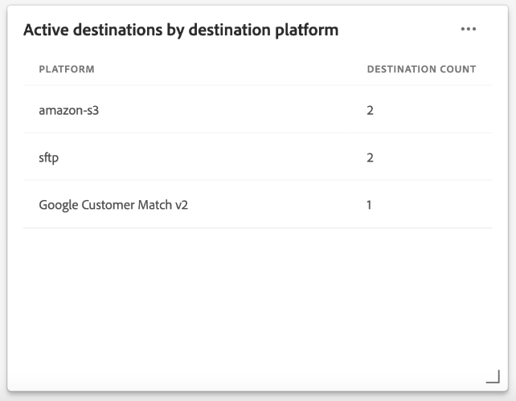

# [!UICONTROL Destinations] kontrollpanel

Adobe Experience Platform användargränssnitt (UI) är en kontrollpanel där du kan visa viktig information om din organisations aktiva mål, som den fångats in under en daglig ögonblicksbild. I den här handboken beskrivs hur du får åtkomst till och arbetar med kontrollpanelen för mål i användargränssnittet, och den innehåller mer information om mätvärdena som visas på kontrollpanelen.

En översikt över destinationer samt en katalog över alla tillgängliga destinationer i Experience Platform finns på [destinationsdokumentation](../../destinations/home.md).

## [!UICONTROL Destinations] instrumentpanelsdata {#destinations-dashboard-data}

The [!UICONTROL Destinations] På kontrollpanelen visas en ögonblicksbild av de mål som din organisation har aktiverat i Experience Platform. Data i ögonblicksbilden visar data exakt som de visas vid den specifika tidpunkten när ögonblicksbilden togs. Ögonblicksbilden är alltså inte en uppskattning eller ett urval av data och kontrollpanelen för destinationer uppdateras inte i realtid.

>[!NOTE]
>
>Ändringar eller uppdateringar som gjorts i data sedan ögonblicksbilden togs kommer inte att visas på kontrollpanelen förrän nästa ögonblicksbild tas.

## Utforska kontrollpanelen för destinationer

Om du vill navigera till kontrollpanelen för mål i plattformsgränssnittet väljer du **[!UICONTROL Destinations]** i den vänstra listen väljer du **[!UICONTROL Overview]** för att visa kontrollpanelen.

>[!NOTE]
>
>Om din organisation är ny i Experience Platform och ännu inte har några aktiva destinationer är [!UICONTROL Destinations] kontrollpanel och [!UICONTROL Overview] -fliken visas inte. Välj i stället [!UICONTROL Destinations] från vänster navigering visas [!UICONTROL Catalog] -fliken. Läs mer om [!UICONTROL Catalog] -fliken, se [[!UICONTROL Destinations] arbetsytans guide](../../destinations/ui/destinations-workspace.md).

### Ändra kontrollpanelen för destinationer

Du kan ändra utseendet på kontrollpanelen för mål genom att välja **[!UICONTROL Modify dashboard]**. Detta gör att du kan flytta, lägga till och ta bort widgetar från kontrollpanelen samt få tillgång till **[!UICONTROL Widget library]** för att utforska tillgängliga widgetar och skapa anpassade widgetar för din organisation.

Se [ändra kontrollpaneler](../customize/modify.md) och [Översikt över widgetbiblioteket](../customize/widget-library.md) dokumentation som lär dig mer.

## Standardwidgetar

Adobe tillhandahåller flera standardwidgetar som du kan använda för att visualisera olika mätvärden som relaterar till dina destinationer och utvärdera om segmenten som är tillgängliga för din dataanalys är fullständiga. Du kan också skapa anpassade widgetar som ska delas med din organisation med hjälp av [!UICONTROL Widget library]. Om du vill veta mer om hur du skapar anpassade widgetar börjar du med att läsa [Översikt över widgetbiblioteket](../customize/widget-library.md).

Om du vill veta mer om de tillgängliga standardwidgetarna väljer du namnet på en widget i följande lista:

* [[!UICONTROL Most used destinations]](#most-used-destinations)
* [[!UICONTROL Recently created destinations]](#recently-created-destinations)
* [[!UICONTROL Recently activated segments]](#recently-activated-segments)
* [[!UICONTROL Recently activated segments by destination]](#recently-activated-segments-by-destination)
* [[!UICONTROL Audience size trend]](#audience-size-trend)
* [[!UICONTROL Unmapped segments by identity]](#unmapped-segments-by-identity)
* [[!UICONTROL Mapped segments by identity]](#mapped-segments-by-identity)
* [[!UICONTROL Common audiences]](#common-audiences)
* [[!UICONTROL Destinations count]](#destinations-count)
* [[!UICONTROL Destination status]](#destination-status)
* [[!UICONTROL Active destinations by destination platform]](#active-destinations-by-destination-platform)
* [[!UICONTROL Activated audiences across all destinations]](#activated-audiences-across-all-destinations)

### [!UICONTROL Most used destinations] {#most-used-destinations}

The **[!UICONTROL Most used destinations]** -widgeten visar organisationens främsta destinationer med antalet segment som mappas vid den senaste ögonblicksbilden. Denna rankning ger insikt i vilka destinationer som används samtidigt som de som kan vara underutnyttjade också kan visas.

Om du till exempel konfigurerade ett mål i går men inte har mappat några segment till det, kan du se att målet för närvarande är underutnyttjat.

Antalet mappade segment som visas i kolumnen Antal segment är exakt som i den senaste ögonblicksbilden. Om du mappar ett nytt segment till målet uppdateras inte antalet förrän nästa ögonblicksbild tas.

Om du väljer namnet på ett mål i den lista som visas på widgeten kommer du till målinformationen som länkad från **[!UICONTROL Browse]** -fliken. Du kan också välja **[!UICONTROL View All]** för att navigera till **[!UICONTROL Browse]** och sedan markera namnet på ett mål för att visa information om det.

### [!UICONTROL Recently created destinations] {#recently-created-destinations}

The **[!UICONTROL Recently created destinations]** kan du visa en lista över organisationens senast konfigurerade mål.

Det datum som visas motsvarar den senaste ögonblicksbilden. Om du skapar ett nytt mål kommer det alltså inte att visas i listan förrän nästa ögonblicksbild har tagits.

Om du väljer namnet på ett mål i den lista som visas på widgeten kommer du till målinformationen som länkad från **[!UICONTROL Browse]** -fliken. Du kan också välja **[!UICONTROL View All]** för att navigera till **[!UICONTROL Browse]** och sedan markera namnet på ett mål för att visa information om det.

Mer information om hur du konfigurerar särskilda typer av destinationer finns på [destinationsdokumentation](../../destinations/home.md).

### [!UICONTROL Recently activated segments] {#recently-activated-segments}

The **[!UICONTROL Recently activated segments]** widgeten innehåller en lista med de segment som senast har mappats till ett mål. Den här listan innehåller en ögonblicksbild av vilka segment och mål som används aktivt i systemet och kan hjälpa till att felsöka felaktiga mappningar.

Det uppdaterade datum som visas visar den senaste gången segmentet aktiverades till målet och är exakt som den senaste ögonblicksbilden. Det innebär att om du aktiverar ett segment till målet kommer det uppdaterade datumet inte att ändras förrän nästa fixering har tagits.

Om du väljer namnet på ett segment i listan som visas på widgeten kommer du till segmentinformationen. Du kan också välja **[!UICONTROL View All]** för att navigera till fliken för segmentbläddring och sedan markera namnet på ett segment för att visa information om det.

Mer information om hur du arbetar med segment i Experience Platform finns i [Översikt över segmenteringstjänsten](../../segmentation/home.md).

### [!UICONTROL Recently activated segments by destination] {#recently-activated-segments-by-destination}

The **[!UICONTROL Recently activated segments by destination]** visar de fem senast aktiverade segmenten i fallande ordning enligt det mål som valts i listrutan Översikt. Det liknar [!UICONTROL Recently activated segments] widget, men data visas **endast** används för det valda målet.

Den här widgeten innehåller två mätvärden: segmentnamnet och datumet då segmentet senast aktiverades för målet. De data som visas är korrekta vid den senaste ögonblicksbilden.

Du kan visa information om ett segment genom att välja namnet på ett segment i listan som visas.

### [!UICONTROL Audience size trend] {#audience-size-trend}

The **[!UICONTROL Audience size trend]** widgeten visar förhållandet mellan antalet profiler under en tidsperiod för ett segment som har mappats till det målkontot. Widgeten använder ett linjediagram för att illustrera antalet profiler i segmentet som skickas till målkontot dagligen.

En tidsperiod för målgruppstrenden under de senaste 30 dagarna, 90 dagar eller 12 månaderna kan justeras med den första listrutan.

I den andra listrutan visas alla tillgängliga segment som kan skickas till det målkonto som valts högst upp på kontrollpanelen.

The **[!UICONTROL Audience size trend]** widgeten innehåller en [!UICONTROL Captions] i widgetens övre högra hörn. Välj **[!UICONTROL Captions]** för att öppna dialogrutan med automatiska bildtexter. En maskininlärningsmodell genererar automatiskt bildtexter som beskriver de viktigaste trenderna och viktiga händelser genom att analysera diagram- och segmentdata.

### [!UICONTROL Unmapped segments by identity] {#unmapped-segments-by-identity}

The **[!UICONTROL Unmapped segments by identity]** widgeten listar de fem populäraste **omappad** segment rangordnas efter fallande identitetsantal för ett visst mål och en viss identitet. Det markerar segment som är mest fördelaktiga att mappa till det valda målkontot baserat på det valda ID:t.

De tillgängliga segmenten filtreras i listrutan Mål-ID. Filtrerings-ID:n som visas i listrutan ändras beroende på vilket målkonto som är markerat högst upp på översiktssidan.

Kolumnen Identiteter räknar antalet käll-ID:n i segmentet som kan mappas till det ID som valts i listrutan för widget-ID.

### [!UICONTROL Mapped segments by identity] {#mapped-segments-by-identity}

Den här widgeten innehåller de fem främsta listorna med **mappad** segment. Listan ordnas från hög till låg enligt antalet käll-ID som finns i segmenten. Det mål-ID som ska räknas väljs i listrutan under widgetens rubrik. Mål-ID:n som är tillgängliga i listrutan i widgeten ändras enligt det målkontofilter som valts högst upp på översiktspanelen.

The **[!UICONTROL Mapped segments by identity]** widgetens högdagrar snabbt sannolikheten för att lyckas rikta in profilmöjligheter för en kampanj inom det valda målet. En effektiv riktad kampanj beror inte på antalet profiler som skickas till målet, utan snarare på antalet käll-ID:n som troligen matchas med mål-ID:n för att ge användbara och användbara data.

### Gemensamma målgrupper

The **[!UICONTROL Common audiences]** widgeten innehåller en lista över de fem vanligaste segment som är aktiverade över målkontot, som är valt längst upp på sidan, och det mål som är markerat i widgetens listruta. Listan över segment ordnas efter hur nyligen de har aktiverats. Det senast aktiverade segmentet visas högst upp.

The [!UICONTROL AUDIENCE SIZE] kolumn innehåller det totala antalet profiler för varje listat segment.

### Hälsa för mappade målgrupper

Widgeten innehåller en lista med upp till 20 mappade segment vars totala antal profiler, per den senaste ögonblicksbilden, avviker med en faktor på minst en standardavvikelse från de 30 dagarnas genomsnittliga målgruppsstorlek som mappas till det målet.

Sammanfattningsvis ger det ett beräknat mått för spridning av målgruppsstorlekar från medelvärdet under de senaste 30 dagarna. Jämför om dagens målgruppsstorlek ligger utanför den historiska standardavvikelse som har setts i data under de senaste 30 dagarna.

Alla målgruppsstorlekar i systemet sorteras från hög till låg målgruppsstorlek, vilket visas i [!UICONTROL LATEST SIZE] kolumn.

Om antalet segmentmappade profiler ligger utanför en standardavvikelse från den genomsnittliga mappade profilstorleken under de senaste 30 dagarna, indikerar detta en avvikelse i systemet och bör undersökas.

Om ett segment inom [!UICONTROL Mapped audience health] widgeten avviker med en bred marginal bör du referera till trenddiagrammet för målgruppsstorlek och leta reda på det avvikande segmentet. Trenden kan ge ytterligare insikter i segmentets hälsa.

### [!UICONTROL Destinations count] {#destinations-count}

The [!UICONTROL Destinations count] widgeten anger det totala antalet tillgängliga slutpunkter där en målgrupp kan aktiveras och levereras inom systemet. Detta nummer inkluderar både aktiva och inaktiva mål.

Under det totala antalet väljer du **[!UICONTROL Destinations]** för att navigera till målfliken. På den här sidan visas en lista över alla mål som du har upprättat en anslutning till den aktuella.

### [!UICONTROL Destination status] {#destination-status}

The [!UICONTROL Destination status] visar det totala antalet aktiverade destinationer som ett enda mått och visar den proportionella skillnaden mellan aktiverade och inaktiverade destinationer med hjälp av ett mundiagram.

Individuella antal för antingen aktiverade eller inaktiverade mål visas i en dialogruta när markören hålls över respektive avsnitt i mundiagrammet.

### [!UICONTROL Active destinations by destination platform] {#active-destinations-by-destination-platform}

Widgeten innehåller en tabell med två kolumner som visar en lista över aktiva målplattformar och det totala antalet aktiva destinationer för varje målplattform. Listan över målplattformar ordnas från hög till låg.

### [!UICONTROL Activated audiences across all destinations] {#activated-audiences-across-all-destinations}

The [!UICONTROL Activated audiences across all destinations] widgeten visar det totala antalet målgrupper som har aktiverats för alla destinationer i ett enda mätresultat. Den här siffran motsvarar den senaste ögonblicksbilden.

Välj **[!UICONTROL Audiences]** för att navigera till destinationerna [!UICONTROL Browse] -fliken. Den här sidan innehåller en lista över alla aktiverade destinationer och en mängd relevanta mått. Läs dokumentationen för [mer information om [!UICONTROL Browse] tab](../../destinations/ui/destinations-workspace.md#browse).

## Nästa steg

Genom att följa det här dokumentet bör du nu kunna hitta kontrollpanelen för destinationer och förstå mätvärdena som visas i de tillgängliga widgetarna. Mer information om att arbeta med destinationer i Experience Platform finns i [destinationsdokumentation](../../destinations/home.md).
