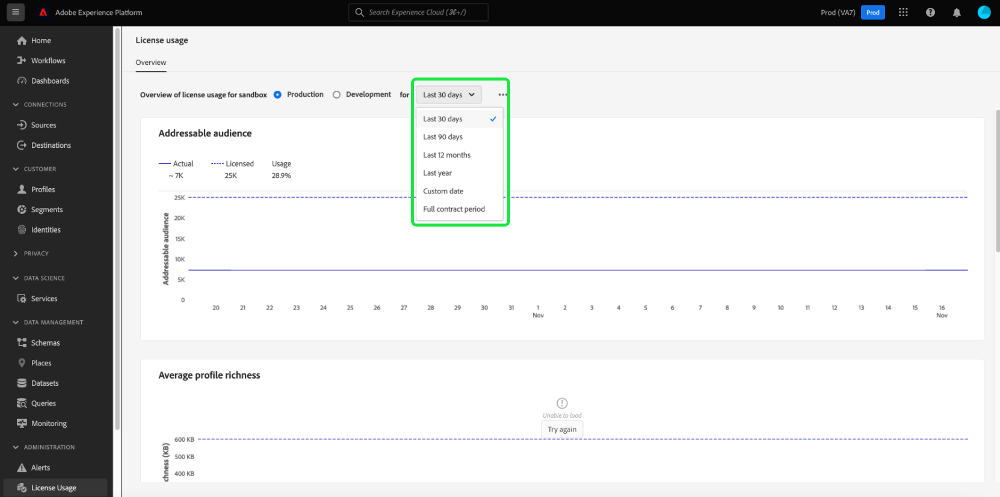
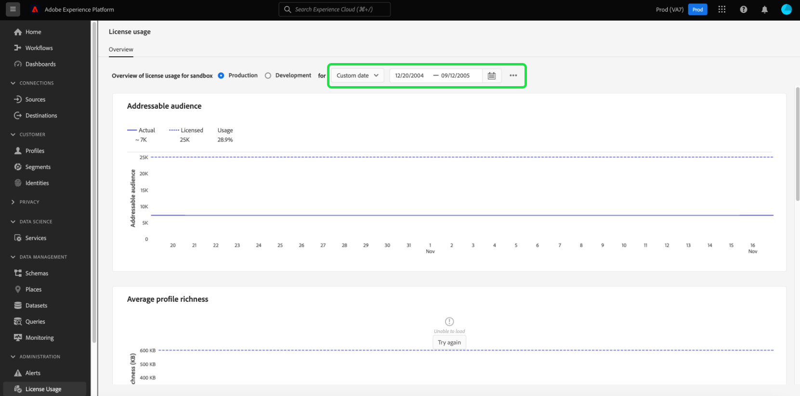

# Kontrollpanel för licensanvändning {#license-usage-dashboard}

Adobe Experience Platform användargränssnitt (UI) är en kontrollpanel där du kan visa viktig information om din organisations licensanvändning, som den fångats in under en daglig ögonblicksbild. I den här handboken beskrivs hur du får åtkomst till och arbetar med kontrollpanelen för licensanvändning i användargränssnittet och den innehåller mer information om de visualiseringar som visas på kontrollpanelen.

En allmän översikt över användargränssnittet för plattformen finns på [Användargränssnittsguide för Experience Platform](../../landing/ui-guide.md).

## Kontrollpanelsdata för licensanvändning

På kontrollpanelen för licensanvändning visas en ögonblicksbild av din organisations licensrelaterade data för Experience Platform. Informationen i kontrollpanelen visas exakt som den visas vid den specifika tidpunkt då ögonblicksbilden togs. Ögonblicksbilden är alltså inte en uppskattning eller ett urval av data och instrumentpanelen uppdateras inte i realtid.

>[!NOTE]
>
>Ändringar eller uppdateringar som gjorts i data sedan ögonblicksbilden togs kommer inte att visas på kontrollpanelen förrän nästa ögonblicksbild tas.

## Utforska kontrollpanelen för licensanvändning

Om du vill navigera till kontrollpanelen för licensanvändning i plattformsgränssnittet väljer du **[!UICONTROL License usage]** till vänster. Då öppnas **[!UICONTROL Overview]** -fliken som visar kontrollpanelen.

>[!NOTE]
>
>Kontrollpanelen för licensanvändning är inte aktiverad som standard. Användarna måste beviljas behörigheten &quot;Visa kontrollpanel för licensanvändning&quot; för att kunna visa kontrollpanelen. Anvisningar om hur du beviljar åtkomstbehörigheter för att visa kontrollpanelen för licensanvändning finns i [behörighetsguide för instrumentpanel](../permissions.md).

### Markera en sandlåda

Om du vill välja en sandlåda att visa på kontrollpanelen väljer du antingen [!UICONTROL Production] eller [!UICONTROL Development]. Den markerade sandlådan indikeras av alternativknappen bredvid namnet på sandlådan.

Konsumtionsrapportering för sandlådor är kumulativ för alla sandlådor av samma typ. med andra ord, markera [!UICONTROL Production] eller [!UICONTROL Development] innehåller förbrukningsrapporter för alla produktions- respektive utvecklingssandlådor.

>[!WARNING]
>
>Behörighet att visa kontrollpanelen för licensanvändning måste anges på sandlådenivå. Det innebär att behörighet att visa kontrollpanelen måste läggas till i varje enskild sandlåda. Denna begränsning kommer att åtgärdas i en framtida version. Under tiden finns följande lösning:
>
>1. Skapa en produktprofil i Adobe Admin Console.
>2. Under Behörighet i kategorin Sandbox lägger du till alla sandlådor som du vill visa på kontrollpanelen för licensanvändning.
>3. Lägg till behörigheten Visa kontrollpanel för licensanvändning under Behörighetskategorin för användarinstrumentpanelen.

### Välj ett datumintervall

När du har valt en sandlåda kan du använda listrutan för datumintervall för att välja vilken tidsperiod som ska visas på instrumentpanelen. Det finns flera tillgängliga alternativ, bland annat standardvärdet för de senaste 30 dagarna.

Du kan också välja **[!UICONTROL Custom date]** för att välja den tidsperiod som visas.

## Widgetar

Kontrollpanelen för licensanvändning består av widgetar som visar skrivskyddade mått med viktig information om organisationens licensanvändning. Vilka mätvärden som visas beror på organisationens specifika licensiering (se [tillgängliga mätvärden](#available-metrics) för mer information).

Varje widget visar en graf som jämför det faktiska antalet för din organisation med det totala antalet som är tillgängligt med din organisations licensiering och som anger en procentandel av den totala användningen.

## Tillgängliga mått

Kontrollpanelen för licensanvändning rapporterar fyra viktiga mätvärden, med fler mätvärden som läggs till i efterföljande versioner. Tillgängliga mätvärden är:

* [!UICONTROL Addressable Audience]
* [!UICONTROL Average profile richness]
* [!UICONTROL Data scanned per segmentation ratio]
* [!UICONTROL Total consumed storage]

Vilka mätvärden som är tillgängliga och vilken definition som finns för varje mätvärde varierar beroende på vilken licensiering din organisation har köpt. Detaljerade definitioner av mätvärdena finns i produktbeskrivningsdokumentationen:

| Licens | Produktbeskrivning |
|---|---|
| <ul><li>ADOBE EXPERIENCE PLATFORM:OD LITE</li><li>ADOBE EXPERIENCE PLATFORM:OD STANDARD</li><li>ADOBE EXPERIENCE PLATFORM:OD HEAVY</li></ul> | [Adobe Experience Platform](https://helpx.adobe.com/legal/product-descriptions/adobe-experience-platform.html) |
| <ul><li>ADOBE EXPERIENCE PLATFORM:OD</li></ul> | [Experience Platform, App Services och Intelligent Services](https://helpx.adobe.com/legal/product-descriptions/exp-platform-app-svcs.html) |
| <ul><li>RT KUNDDATAPLATTFORM:OD</li><li>RT KUNDDATAPLATTFORM:OD PRFL TILL 10 MB</li><li>RT KUNDDATAPLATTFORM:OD PRFL TO 50M</li></ul> | [Adobe Real-time Customer Data Platform](https://helpx.adobe.com/legal/product-descriptions/real-time-customer-data-platform.html) |
| <ul><li>AEP:OD-AKTIVERING</li><li>AEP:OD ACTIVATION PRFL TO 10M</li><li>AEP:OD ACTIVATION PRFL UPP TILL 50 MB</li></ul> | [Adobe Experience Platform Activation](https://helpx.adobe.com/legal/product-descriptions/adobe-experience-platform0.html) |
| <ul><li>AEP:OD INTELLIGENCE</li></ul> | [Adobe Experience Platform Intelligence](https://helpx.adobe.com/legal/product-descriptions/adobe-experience-platform-intelligence---product-description.html) |
| <ul><li>JOURNEY OPTIMIZER SELECT:OD</li><li>JOURNEY OPTIMIZER PRIME:OD</li><li>JOURNEY OPTIMIZER ULTIMATE:OD</li><li>UNP AJO PRIME STARTER:OD</li><li>UNP AJO ULTIMATE STARTER:OD</li><li>UNP Real-Time CDP:ORDNING AV OD-PROFIL</li></ul> | [Adobe Journey Optimizer](https://helpx.adobe.com/legal/product-descriptions/adobe-journey-optimizer.html) |

>[!WARNING]
>
>Kontrollpanelen för licensanvändning rapporterar bara den senaste licensen som har etablerats för din organisation. Om den senaste licensen för din organisation inte visas i tabellen ovan kanske kontrollpanelen för licensanvändning inte visas korrekt. Stöd för ytterligare licenser och flera licenser i en och samma organisation planeras för en framtida release.

## Nästa steg

När du har läst det här dokumentet kan du hitta kontrollpanelen för licensanvändning och välja en sandlåda att visa. Du kan även hitta mer information om tillgängliga mätvärden för din organisation, baserat på den licensiering din organisation har köpt.

Mer information om andra funktioner i användargränssnittet i Experience Platform finns i [Användargränssnittshandbok för plattformen](../../landing/ui-guide.md).
