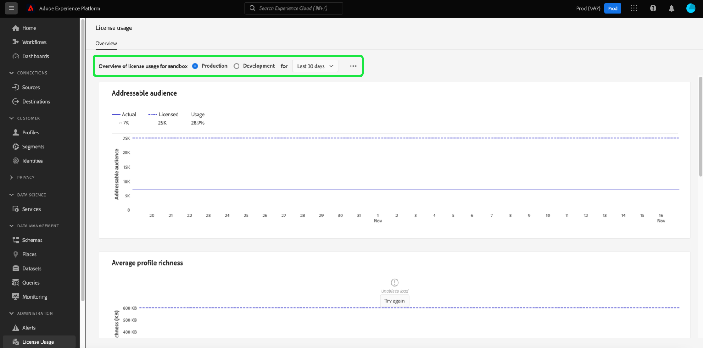

# (Beta) Kontrollpanel för licensanvändning {#license-usage-dashboard}

>[!IMPORTANT]
>
>Instrumentpanelsfunktionerna som beskrivs i det här dokumentet är för närvarande i betaversion och är inte tillgängliga för alla användare. Dokumentationen och funktionaliteten kan komma att ändras.

Adobe Experience Platform användargränssnitt (UI) är en kontrollpanel där du kan visa viktig information om din organisations licensanvändning, som den fångats in under en daglig ögonblicksbild. I den här handboken beskrivs hur du får åtkomst till och arbetar med kontrollpanelen för licensanvändning i användargränssnittet och den innehåller mer information om de visualiseringar som visas på kontrollpanelen.

En allmän översikt över användargränssnittet för plattformen finns i [användargränssnittsguiden för Experience Platform](../../landing/ui-guide.md).

## Kontrollpanelsdata för licensanvändning

På kontrollpanelen för licensanvändning visas en ögonblicksbild av din organisations licensrelaterade data för Experience Platform. Informationen i kontrollpanelen visas exakt som den visas vid den specifika tidpunkt då ögonblicksbilden togs. Ögonblicksbilden är alltså inte en uppskattning eller ett urval av data och instrumentpanelen uppdateras inte i realtid.

>[!NOTE]
>
>Ändringar eller uppdateringar som gjorts i data sedan ögonblicksbilden togs kommer inte att visas på kontrollpanelen förrän nästa ögonblicksbild tas.

## Utforska kontrollpanelen för licensanvändning

Om du vill navigera till kontrollpanelen för licensanvändning i plattformsgränssnittet väljer du **[!UICONTROL License usage]** i den vänstra listen. Detta öppnas med fliken **[!UICONTROL Overview]** som visar kontrollpanelen.

### Markera en sandlåda

Välj antingen [!UICONTROL Production] eller [!UICONTROL Development] om du vill välja en sandlåda att visa på kontrollpanelen. Den markerade sandlådan indikeras av alternativknappen bredvid namnet på sandlådan.

>[!NOTE]
>
>Konsumtionsrapportering för sandlådor är kumulativ för alla sandlådor av samma typ. Om du väljer [!UICONTROL Production] eller [!UICONTROL Development] får du med andra ord förbrukningsrapporter för alla produktions- respektive utvecklingssandlådor.

### Välj ett datumintervall

När du har valt en sandlåda kan du använda listrutan för datumintervall för att välja vilken tidsperiod som ska visas på instrumentpanelen. Det finns tre tillgängliga alternativ: [!UICONTROL Last 30 days], [!UICONTROL Last 90 days] och [!UICONTROL Last 12 months]. De senaste 30 dagarna markeras som standard.

## Widgetar

Kontrollpanelen för licensanvändning består av widgetar som visar skrivskyddade mått med viktig information om organisationens licensanvändning. Vilka mätvärden som visas beror på organisationens specifika licensiering (mer information finns i avsnittet [tillgängliga mätvärden](#available-metrics)).

Varje widget visar en graf som jämför det faktiska antalet för din organisation med det totala antalet som är tillgängligt med din organisations licensiering och som anger en procentandel av den totala användningen.

## Tillgängliga mått

Det finns för närvarande fyra mätvärden på kontrollpanelen för licensanvändning:

* [!UICONTROL Addressable Audience] (mätt som antal profiler)
* [!UICONTROL Average profile richness]
* [!UICONTROL Total consumed storage]
* [!UICONTROL Data scanned per segmentation ratio]

Definitionen av varje mätvärde varierar beroende på vilken licensiering din organisation har köpt. Detaljerade definitioner av mätvärdena finns i produktbeskrivningsdokumentationen:

| Licens | Produktbeskrivning |
|---|---|
| <ul><li>Adobe Experience Platform:OD LITE</li><li>Adobe Experience Platform:OD STANDARD</li><li>Adobe Experience Platform:OD HEAVY</li></ul> | [Adobe Experience Platform](https://helpx.adobe.com/legal/product-descriptions/adobe-experience-platform.html) |
| <ul><li>Adobe Experience Platform:OD</li></ul> | [Experience Platform, App Services och Intelligent Services](https://helpx.adobe.com/legal/product-descriptions/exp-platform-app-svcs.html) |
| <ul><li>RT KUNDDATAPLATTFORM:OD</li><li>RT KUNDDATAPLATTFORM:OD PRFL TILL 10 MB</li><li>RT KUNDDATAPLATTFORM:OD PRFL TO 50M</li></ul> | [Kunddataplattform i realtid](https://helpx.adobe.com/legal/product-descriptions/real-time-customer-data-platform.html) |
| <ul><li>AEP:OD-AKTIVERING</li><li>AEP:OD ACTIVATION PRFL TO 10M</li><li>AEP:OD ACTIVATION PRFL UPP TILL 50 MB</li></ul> | [Adobe Experience Platform Activation](https://helpx.adobe.com/legal/product-descriptions/adobe-experience-platform0.html) |
| <ul><li>AEP:OD INTELLIGENCE</li></ul> | [Adobe Experience Platform Intelligence](https://helpx.adobe.com/legal/product-descriptions/adobe-experience-platform-intelligence---product-description.html) |

## Nästa steg

När du har läst det här dokumentet kan du hitta kontrollpanelen för licensanvändning och välja en sandlåda att visa. Du kan även hitta mer information om tillgängliga mätvärden för din organisation, baserat på den licensiering din organisation har köpt.

Mer information om andra funktioner i användargränssnittet för Experience Platform finns i [användargränssnittshandboken för plattformen](../../landing/ui-guide.md).