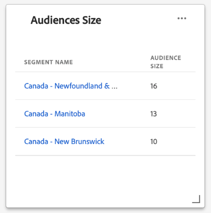

# (Beta) [!UICONTROL Profiles] kontrollpanel

>[!IMPORTANT]
>
>Instrumentpanelsfunktionerna som beskrivs i det här dokumentet är för närvarande i betaversion och är inte tillgängliga för alla användare. Dokumentationen och funktionaliteten kan komma att ändras.

I Adobe Experience Platform användargränssnitt (UI) finns en kontrollpanel där du kan visa viktig information om dina [!DNL Real-time Customer Profile]-data, som de fångats in under en daglig ögonblicksbild. I den här handboken beskrivs hur du kommer åt och arbetar med kontrollpanelen [!UICONTROL Profiles] i användargränssnittet och den innehåller information om de mått som visas på kontrollpanelen.

En översikt över alla profilfunktioner i användargränssnittet i Experience Platform finns i [Användargränssnittshandboken för kundprofiler i realtid](../../profile/ui/user-guide.md).

## Data för kontrollpanel för profil

Kontrollpanelen [!UICONTROL Profiles] visar en ögonblicksbild av attributdata (post) som din organisation har i profilarkivet i Experience Platform. Ögonblicksbilden innehåller inga händelsedata (tidsserier).

Attributdata i ögonblicksbilden visar data exakt som de visas vid den specifika tidpunkten när ögonblicksbilden togs. Ögonblicksbilden är alltså inte en uppskattning eller ett urval av data och kontrollpanelen för profiler uppdateras inte i realtid.

>[!NOTE]
>
>Ändringar eller uppdateringar som gjorts i data sedan ögonblicksbilden togs kommer inte att visas på kontrollpanelen förrän nästa ögonblicksbild tas.

## Utforska kontrollpanelen [!UICONTROL Profiles]

Om du vill navigera till kontrollpanelen [!UICONTROL Profiles] i plattformsgränssnittet väljer du **[!UICONTROL Profiles]** i den vänstra listen och sedan fliken **[!UICONTROL Overview]** för att visa kontrollpanelen.

### Välja sammanfogningsprinciper

De mätvärden som visas på kontrollpanelen [!UICONTROL Profiles] baseras på sammanslagningsprinciper som tillämpas på dina kundprofildata i realtid. När data samlas in från flera olika källor är det möjligt att data innehåller motstridiga värden (en datauppsättning kan till exempel lista en kund som&quot;enkel&quot; medan en annan datauppsättning kan lista kunden som&quot;gift&quot;) och det är den uppgift som sammanfogningspolicyn ska fastställa vilka data som ska prioriteras och visas som en del av profilen.

Kontrollpanelen väljer automatiskt vilken sammanfogningsprincip som ska visas, men du kan ändra den sammanfogningsprincip som väljs med hjälp av den nedrullningsbara menyn. Om du vill välja en annan sammanfogningsprincip markerar du listrutan bredvid sammanfogningsprincipnamnet och väljer sedan den sammanfogningsprincip som du vill visa.

>[!NOTE]
>
>I listrutan visas endast sammanfogningsprinciper som är relaterade till den enskilda klassen för XDM-profiler, men om din organisation har skapat flera sammanfogningsprinciper kan det innebära att du måste rulla för att kunna visa den fullständiga listan över tillgängliga sammanfogningsprinciper.

Mer information om kopplingsprofiler, inklusive hur du skapar, redigerar och deklarerar en standardkopplingsprofil för din organisation, finns i [användargränssnittshandboken för kopplingsprofiler](../../profile/ui/merge-policies.md).

### Widgetar och mätvärden

Kontrollpanelen består av widgetar, som är skrivskyddade mått som ger viktig information om dina profildata. Datum och tid för den senaste uppdateringen av en widget visar när den senaste ögonblicksbilden av data togs.

## Tillgängliga widgetar

Experience Platform tillhandahåller flera widgetar som du kan använda för att visualisera olika mått som relaterar till dina profildata. Välj namnet på en widget nedan om du vill veta mer:

* [[!UICONTROL Audience size]](#audience-size)
* [[!UICONTROL Profiles added]](#profiles-added)
* [[!UICONTROL Profiles added over time]](#profiles-added-over-time)
* [[!UICONTROL Profiles by namespace]](#profiles-by-namespace)
* [[!UICONTROL Namespace overlap]](#namespace-overlap)

### [!UICONTROL Audience size] {#audience-size}

Widgeten **[!UICONTROL Audience size]** visar det totala antalet sammanfogade profiler i profildatalagret när ögonblicksbilden togs. Det här numret är resultatet av att den valda sammanfogningsprincipen tillämpas på dina profildata för att sammanfoga profilfragment till en enda profil för varje enskild person.

Mer information om fragment och sammanfogade profiler får du om du börjar med att läsa *profilfragment jämfört med sammanfogade profiler* i [Kundprofilöversikt i realtid](../../profile/home.md).

>[!NOTE]
>
>Sammanslagningsprincipen som används för att beräkna det här måttet är inte densamma som den systemgenererade sammanfogningsprincipen som används för att beräkna [!UICONTROL Addressable audiences] på kontrollpanelen [!UICONTROL License usage], och därför är det inte troligt att målgruppsantalet i kontrollpanelerna [!UICONTROL Profiles] och [!UICONTROL License usage] är exakt likadana.

### [!UICONTROL Profiles added] {#profiles-added}

Widgeten **[!UICONTROL Profiles added]** visar det totala antalet sammanfogade profiler som har lagts till i datalagret Profil sedan den senaste ögonblicksbilden togs. Det här numret är resultatet av att den valda sammanfogningsprincipen tillämpas på dina profildata för att sammanfoga profilfragment till en enda profil för varje enskild person.

### [!UICONTROL Profiles added over time] {#profiles-added-over-time}

Widgeten **[!UICONTROL Profiles added over time]** visar det totala antalet sammanfogade profiler som har lagts till i datalagret Profil dagligen under de senaste 30 dagarna. Detta nummer uppdateras varje dag som ögonblicksbilden tas, och om du vill importera profiler till Platform kommer antalet profiler inte att visas förrän nästa ögonblicksbild tas.

Antalet tillagda profiler är resultatet av att den valda sammanfogningsprincipen tillämpas på dina profildata för att sammanfoga profilfragment till en enda profil för varje enskild person.

### [!UICONTROL Profiles by namespace] {#profiles-by-namespace}

Widgeten **[!UICONTROL Profiles by namespace]** visar uppdelningen av identitetsnamnutrymmen i alla sammanfogade profiler i din profilbutik. Det totala antalet profiler med [!UICONTROL ID namespace] (d.v.s. om du lägger ihop värdena som visas för varje namnutrymme) kan vara högre än det totala antalet sammanfogade profiler, eftersom en profil kan ha flera namnutrymmen kopplade till sig. Om en kund till exempel interagerar med varumärket i mer än en kanal kommer flera namnutrymmen att kopplas till den enskilda kunden.

Mer information om identitetsnamnutrymmen finns i [dokumentationen för Adobe Experience Platform Identity Service](../../identity-service/home.md).

### [!UICONTROL Namespace overlap] {#namespace-overlap}

Widgeten **[!UICONTROL Namespace overlap]** visar ett Venndiagram, eller ett uppsättningsdiagram, som visar överlappningen av profiler i din profilbutik som innehåller flera identitetsnamnutrymmen.

När du har använt listrutemenyerna i widgeten för att välja de identitetsnamnutrymmen som du vill jämföra, visas cirklar med den relativa storleken på varje namnutrymme, där antalet profiler som innehåller båda namnutrymmena representeras av storleken på överlappningen mellan cirklarna.

Om en kund interagerar med ert varumärke i mer än en kanal kommer flera namnutrymmen att kopplas till den enskilda kunden, och det är därför troligt att din organisation kommer att ha flera profiler som innehåller fragment från mer än ett ID-namnområde.

Mer information om identitetsnamnutrymmen finns i [dokumentationen för Adobe Experience Platform Identity Service](../../identity-service/home.md).

## Nästa steg

Genom att följa det här dokumentet bör du nu kunna hitta kontrollpanelen Profiler och förstå mätvärdena som visas i de tillgängliga widgetarna. Mer information om hur du arbetar med [!DNL Profile]-data i användargränssnittet för Experience Platform finns i användargränssnittshandboken för [kundprofiler i realtid](../../profile/ui/user-guide.md).