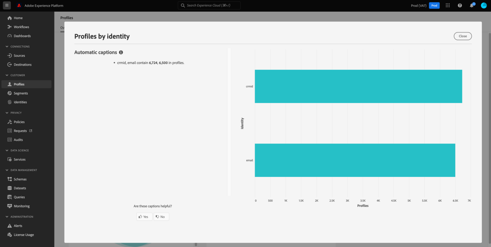
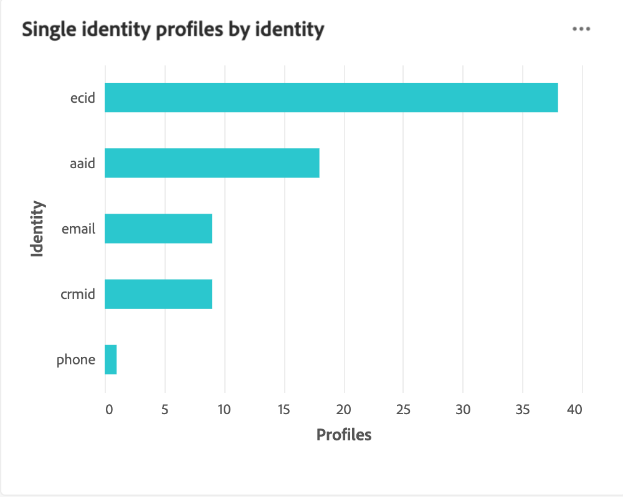

# [!UICONTROL Profiles] kontrollpanel

I Adobe Experience Platform användargränssnitt finns en kontrollpanel där du kan visa viktig information om ditt [!DNL Real-time Customer Profile] data, enligt vad som tagits under en daglig ögonblicksbild. I den här handboken beskrivs hur du kommer åt och arbetar med [!UICONTROL Profiles] kontrollpanelen i användargränssnittet och ger information om de mått som visas på kontrollpanelen.

En översikt över alla profilfunktioner i användargränssnittet i Experience Platform finns på [Användargränssnittsguide för kundprofiler i realtid](../../profile/ui/user-guide.md).

## Data för kontrollpanel för profil

The [!UICONTROL Profiles] På kontrollpanelen visas en ögonblicksbild av de attributdata (postdata) som din organisation har i profilarkivet i Experience Platform. Ögonblicksbilden innehåller inga händelsedata (tidsserier).

Attributdata i ögonblicksbilden visar data exakt som de visas vid den specifika tidpunkten när ögonblicksbilden togs. Ögonblicksbilden är alltså inte en uppskattning eller ett urval av data och kontrollpanelen för profiler uppdateras inte i realtid.

>[!NOTE]
>
>Ändringar eller uppdateringar som gjorts i data sedan ögonblicksbilden togs kommer inte att visas på kontrollpanelen förrän nästa ögonblicksbild tas.

## Utforska [!UICONTROL Profiles] kontrollpanel

Navigera till [!UICONTROL Profiles] kontrollpanelen i plattformsgränssnittet väljer du **[!UICONTROL Profiles]** i den vänstra listen väljer du **[!UICONTROL Overview]** för att visa kontrollpanelen.

>[!NOTE]
>
>Om din organisation inte har använt Platform tidigare och ännu inte har några aktiva profildatauppsättningar eller sammanfogningsprinciper har skapats kan [!UICONTROL Profiles] Kontrollpanelen visas inte. I stället [!UICONTROL Overview] På fliken visas länkar och dokumentation som hjälper dig att komma igång med kundprofilen i realtid.

### Ändra [!UICONTROL Profiles] kontrollpanel

Du kan ändra utseendet på [!UICONTROL Profiles] kontrollpanel genom att välja **[!UICONTROL Modify dashboard]**. Detta gör att du kan flytta, lägga till och ta bort widgetar från kontrollpanelen samt få tillgång till **[!UICONTROL Widget library]** för att utforska tillgängliga widgetar och skapa anpassade widgetar för din organisation.

Se [ändra kontrollpaneler](../customize/modify.md) och [Översikt över widgetbiblioteket](../customize/widget-library.md) dokumentation som lär dig mer.

## (Beta) Profileffektivitetsinsikter {#profile-efficacy-insights}

>[!IMPORTANT]
>
>Profilens insiktsfunktion finns för närvarande i betaversion och är inte tillgänglig för alla användare. Dokumentationen och funktionaliteten kan komma att ändras.

The [!UICONTROL Efficacy] på fliken finns mått på kvaliteten och fullständigheten hos dina profildata med hjälp av profileffektswidgetar. De här widgetarna visar i korthet hur profilerna är uppbyggda, trender för fullständighet över tiden och bedömningar av kvaliteten på profildata.

Se [profileffektwidgetar](#profile-efficacy-widgets) om du vill ha mer information om de widgetar som är tillgängliga just nu.

Layouten på den här instrumentpanelen kan även anpassas genom att välja [**[!UICONTROL Modify dashboard]**](../customize/modify.md) från [!UICONTROL Overview] -fliken.

## Bläddra bland profiler {#browse-profiles}

The [!UICONTROL Browse] Med -fliken kan du söka efter och visa de skrivskyddade profiler som är inkapslade i din organisation. Härifrån kan du se viktig information som hör till profilen om deras inställningar, tidigare händelser, interaktioner och segment

Mer information om profilvisningsfunktionerna i plattformsgränssnittet finns i dokumentationen om [webbläsarprofiler i Real-time Customer Data Platform](../../rtcdp/profile/profile-browse.md).

## Sammanfoga profiler {#merge-policies}

De mått som visas i [!UICONTROL Profiles] Instrumentpanelen baseras på sammanslagningsprinciper som tillämpas på dina kundprofildata i realtid. När data samlas in från flera källor för att skapa kundprofilen kan data innehålla värden som är i konflikt. En datauppsättning kan till exempel visa en kund som&quot;enkel&quot; medan en annan datauppsättning kan visa kunden som&quot;gift&quot;. Det är huvudsyftet med sammanfogningsprincipen att avgöra vilka data som ska prioriteras och visas som en del av profilen.

Mer information om kopplingsprofiler, inklusive hur du skapar, redigerar och deklarerar en standardkopplingsprofil för din organisation, får du genom att läsa [sammanfogningsprinciper - översikt](../../profile/merge-policies/overview.md).

Kontrollpanelen väljer automatiskt vilken sammanfogningsprincip som ska användas. Den tillämpade sammanfogningsprincipen kan ändras med hjälp av listrutan bredvid sammanfogningsprincipens namn.

>[!NOTE]
>
>I listrutan visas endast sammanfogningsprinciper som är relaterade till den enskilda klassen för XDM-profiler. Om din organisation har skapat flera sammanfogningsprinciper kan det dock innebära att du måste rulla för att kunna visa den fullständiga listan över tillgängliga sammanfogningsprinciper.

## Unionens system

The [!UICONTROL Union Schema] På kontrollpanelen visas unionsschemat för en viss XDM-klass. Genom att välja **[!UICONTROL Class]** kan du visa föreningsscheman för olika XDM-klasser.

Unionsscheman består av flera scheman som delar samma klass och har aktiverats för profilen. Med dem kan du i en enda vy se en sammanslagning av alla fält i varje schema som delar samma klass.

Läs användargränssnittsguiden för unionsschemat om du vill veta mer om [visa fackscheman i plattformsgränssnittet](../../profile/ui/union-schema.md#view-union-schemas).

## Widgetar och mätvärden

Kontrollpanelen består av widgetar, som är skrivskyddade mått som ger viktig information om dina profildata.

Datum och tid för den senaste ögonblicksbilden visas högst upp i [!UICONTROL Overview] bredvid listrutan för sammanfogningsprinciper. Alla widgetdata är korrekta från och med det datumet och den tidpunkten. Tidsstämpeln för ögonblicksbilden anges i UTC. det ligger inte i den enskilda användarens eller organisationens tidszon.

## Standardwidgetar {#standard-widgets}

Adobe tillhandahåller flera standardwidgetar som du kan använda för att visualisera olika mått som relaterar till dina profildata. Du kan också skapa anpassade widgetar som ska delas med din organisation med hjälp av [!UICONTROL Widget library]. Om du vill veta mer om hur du skapar anpassade widgetar börjar du med att läsa [Översikt över widgetbiblioteket](../customize/widget-library.md).

Om du vill veta mer om de tillgängliga standardwidgetarna väljer du namnet på en widget i följande lista:

* [[!UICONTROL Profile count]](#profile-count)
* [[!UICONTROL Profile count trend]](#profile-count-trend)
* [[!UICONTROL Profile count change]](#profile-count-change)
* [[!UICONTROL Profiles count change trend]](#profiles-count-change-trend)
* [[!UICONTROL Profiles count change trend by identity]](#profiles-count-change-trend-by-identity)
* [[!UICONTROL Profiles by identity]](#profiles-by-identity)
* [[!UICONTROL Identity overlap]](#identity-overlap)
* [[!UICONTROL Single identity profiles]](#single-identity-profiles)
* [[!UICONTROL Single identity profiles by identity]](#single-identity-profiles-by-identity)
* [[!UICONTROL Unsegmented profiles]](#unsegmented-profiles)
* [[!UICONTROL Unsegmented profiles trend]](#unsegmented-profiles-trend)
* [[!UICONTROL Unsegmented profiles by identity]](#unsegmented-profiles-by-identity)
* [[!UICONTROL Audiences]](#audiences)
* [[!UICONTROL Audiences mapped to destination status]](#audiences-mapped-to-destination-status)
* [[!UICONTROL Audiences size]](#audiences-size)
* [[!UICONTROL Audience overlap by merge policy]](#audience-overlap-by-merge-policy)

### [!UICONTROL Profile count] {#profile-count}

>[!CONTEXTUALHELP]
>id="platform_dashboards_profiles_profilecount"
>title="Profilantal"
>abstract="Den här widgeten visar det totala antalet sammanfogade profiler i profilarkivet när ögonblicksbilden togs. Numret beror på den valda sammanfogningsprincipen som tillämpas på dina profildata."

The **[!UICONTROL Profile count]** visar det totala antalet sammanfogade profiler i profilarkivet när ögonblicksbilden togs. Det här numret är resultatet av att den valda sammanfogningsprincipen tillämpas på dina profildata för att sammanfoga profilfragment till en enda profil för varje enskild person.

Se [avsnittet om sammanfogningsprinciper tidigare i det här dokumentet](#merge-policies) om du vill veta mer.

>[!NOTE]
>
>The [!UICONTROL Profile count] widgeten kan visa ett annat nummer än det antal profiler som visas på [!UICONTROL Browse] i [!UICONTROL Profiles] av flera anledningar. Den vanligaste orsaken till detta är att [!UICONTROL Browse] -fliken refererar till det totala antalet sammanfogade profiler baserat på organisationens standardpolicy för sammanfogning, medan [!UICONTROL Profile count] widgeten refererar till det totala antalet sammanfogade profiler baserat på den sammanfogningsprincip som du har valt att visa på kontrollpanelen.
>
>En annan vanlig orsak är att det finns skillnader mellan tidpunkten då instrumentpanelsögonblicksbilden tas och tidpunkten då exempeljobbet körs för [!UICONTROL Browse] -fliken. Du kan se när [!UICONTROL Profile count] widgeten uppdaterades senast genom att titta på tidsstämpeln i widgeten och lära dig mer om hur exempeljobbet utlöses på [!UICONTROL Browse] -fliken finns i [profilräknaren i användargränssnittsguiden för kundprofiler i realtid](https://experienceleague.adobe.com/docs/experience-platform/profile/ui/user-guide.html?lang=en#profile-count).

### [!UICONTROL Profile count trend] {#profile-count-trend}

The [!UICONTROL Profile count trend] används ett linjediagram för att illustrera trenden i det totala antalet profiler i systemet över tiden. Det totala antalet inkluderar alla profiler som importerats till systemet sedan den senaste ögonblicksbilden. Data kan visualiseras under 30 dagar, 90 dagar och 12 månader. Tidsperioden väljs i en listruta i widgeten.

### [!UICONTROL Profile count change] {#profile-count-change}

>[!CONTEXTUALHELP]
>id="platform_dashboards_profiles_profilescountchange"
>title="Ändring av antal profiler"
>abstract="Den här widgeten visar totalt antal sammanfogade profiler **tillagd** till profilarkivet vid tidpunkten för den senaste ögonblicksbilden. Numret beror på den valda sammanfogningsprincipen som tillämpas på dina profildata."

The **[!UICONTROL Profile count change]** visar antalet sammanfogade profiler som lagts till i profilarkivet sedan föregående ögonblicksbild. Det här numret är resultatet av att den valda sammanfogningsprincipen tillämpas på dina profildata för att sammanfoga profilfragment till en enda profil för varje enskild person. Du kan använda listruteväljaren för att visa antalet profiler som lagts till under de senaste 30 dagarna, 90 dagarna eller 12 månaderna.

>[!NOTE]
>
>The [!UICONTROL Profile count change] widgeten visar antalet tillagda profiler **efter** det första profilintaget och konfigurationen av profilarkivet. Med andra ord: om din organisation konfigurerade profilarkivet och importerade 4 000 000 Dag 1 är kontrollpanelen tillgänglig inom 24 timmar, men [!UICONTROL Profile count change] widgeten ställs in på 0. Detta görs för att undvika en topp som uppstår i samband med det initiala intaget av profiler i systemet. Under de kommande 30 dagarna har din organisation importerat ytterligare 1 000 000 profiler till Profilarkivet. När nästa ögonblicksbild tagits visas [!UICONTROL Profile count change] visar totalt 1 000 000 profiler, medan [!UICONTROL Profile count] widgeten visar totalt 5 000 000 profiler.

### [!UICONTROL Profiles count change trend] {#profiles-count-change-trend}

>[!CONTEXTUALHELP]
>id="platform_dashboards_profiles_profilesaddedtrend"
>title="trender för antal profiler"
>abstract="Den här widgeten visar antalet sammanfogade profiler som har lagts till i profilarkivet dagligen under de senaste 30 dagarna, 90 dagar eller 12 månaderna. Talet beror också på vilken sammanfogningsprincip som används för profildata."

The **[!UICONTROL Profiles count change trend]** visar det totala antalet sammanfogade profiler som har lagts till i profilarkivet dagligen de senaste 30 dagarna, 90 dagar eller 12 månaderna. Detta nummer uppdateras varje dag som ögonblicksbilden tas, och om du vill importera profiler till Platform kommer antalet profiler inte att visas förrän nästa ögonblicksbild tas. Antalet tillagda profiler är resultatet av att den valda sammanfogningsprincipen tillämpas på dina profildata för att sammanfoga profilfragment till en enda profil för varje enskild person.

Se [avsnittet om sammanfogningsprinciper tidigare i det här dokumentet](#merge-policies) om du vill veta mer.

The **[!UICONTROL Profiles count change trend]** widgeten visar en knapp för bildtexter i widgetens övre högra hörn. Välj **[!UICONTROL Captions]** för att öppna dialogrutan med automatiska bildtexter.

En maskininlärningsmodell genererar automatiskt beskrivningar av viktiga trender och viktiga händelser genom att analysera diagrammet och data.

### [!UICONTROL Profiles count change trend by identity] {#profiles-count-change-trend-by-identity}

<!-- This widget uses a line graph to illustrate the change in number of profiles filtered by a chosen source identity and merge policy. -->

Den här widgeten filtrerar profilantalet baserat på en vald källidentitet och sammanfogningsprincip, och visar sedan ändringen av antalet för en rad punkter med hjälp av ett linjediagram. Sammanslagningsprincipen väljs i översiktslistrutan högst upp på sidan och källans identitet och tidsperiod väljs i widgetens listruta. Trenden kan visualiseras under 30 dagar, 90 dagar och 12 månader.

Denna widget hjälper dig att hantera dina behov av målaktivering genom att visa tillväxtmönstret för profiler som filtrerats med en obligatorisk identitet.

### [!UICONTROL Profiles by identity] {#profiles-by-identity}

>[!CONTEXTUALHELP]
>id="platform_dashboards_profiles_profilesbyidentity"
>title="Profiler efter identitet"
>abstract="Den här widgeten visar en uppdelning av alla sammanfogade profiler i din profilbutik efter identiteter."

The **[!UICONTROL Profiles by identity]** widgeten visar en beskrivning av identiteterna för alla sammanfogade profiler i din profilbutik. Det totala antalet profiler per identitet (med andra ord, om de värden som visas för varje namnutrymme läggs ihop) kan vara högre än det totala antalet sammanfogade profiler, eftersom en profil kan ha flera namnutrymmen kopplade till sig. Om en kund till exempel interagerar med varumärket i mer än en kanal kommer flera namnutrymmen att kopplas till den enskilda kunden.

Se [avsnittet om sammanfogningsprinciper tidigare i det här dokumentet](#merge-policies) om du vill veta mer.

Välj **[!UICONTROL Captions]** för att öppna dialogrutan med automatiska bildtexter.

En maskininlärningsmodell genererar automatiskt datainsikter genom att analysera den övergripande fördelningen och de viktigaste dimensionerna av data.

Läs mer om identiteter på [Dokumentation för Adobe Experience Platform Identity Service](../../identity-service/home.md).

### [!UICONTROL Identity overlap] {#identity-overlap}

>[!CONTEXTUALHELP]
>id="platform_dashboards_profiles_identityoverlap"
>title="Identitetsöverlappning"
>abstract="Den här widgeten använder ett Venndiagram för att visa överlappningen mellan profiler i din profilbutik som innehåller de två valda identiteterna."

The **[!UICONTROL Identity overlap]** widgeten använder ett Venndiagram, eller ett angivet diagram, för att visa överlappningen mellan profiler i din profilbutik som innehåller de två valda identiteterna.

Använd widgetens listrutor för att välja de identiteter som du vill jämföra. Cirklar visar det relativa totala antalet profiler som innehåller varje identitet. Antalet profiler som innehåller båda identiteterna representeras av storleken på överlappningen mellan cirklarna. Om en kund interagerar med ert varumärke i mer än en kanal kopplas flera identiteter till den enskilda kunden, och därför är det troligt att organisationen har flera profiler som innehåller fragment från mer än en identitet.

Mer information om profilfragment får du om du börjar med att läsa avsnittet om [profilfragment jämfört med sammanslagna profiler](https://experienceleague.adobe.com/docs/experience-platform/profile/home.html?lang=en#profile-fragments-vs-merged-profiles) i realtidsöversikten över kundprofiler.

Läs mer om identiteter på [Dokumentation för Adobe Experience Platform Identity Service](../../identity-service/home.md).

### [!UICONTROL Single identity profiles] {#single-identity-profiles}

>[!CONTEXTUALHELP]
>id="platform_dashboards_profiles_singleidentityprofiles"
>title="Enstaka identitetsprofiler"
>abstract="Den här widgeten innehåller ett antal profiler för din organisation som bara har en typ av ID som skapar deras identitet. Den här ID-typen kan antingen vara ett e-postmeddelande eller ett ECID."

The [!UICONTROL Single Identity Profiles] widgeten innehåller ett antal profiler för din organisation som bara har en typ av ID-typ som skapar deras identitet. Den här ID-typen kan antingen vara ett e-postmeddelande eller ett ECID. Profilantalet genereras från data i den senaste ögonblicksbilden.

### [!UICONTROL Single identity profiles by identity] {#single-identity-profiles-by-identity}

Den här widgeten använder ett stapeldiagram för att illustrera det totala antalet profiler som identifieras med endast en unik identifierare. Widgeten stöder upp till fem av de vanligaste identiteterna.

Håll pekaren över enskilda fält för att visa en dialogruta med information om det totala antalet profiler för en identitet.

### [!UICONTROL Unsegmented profiles] {#unsegmented-profiles}

>[!CONTEXTUALHELP]
>id="platform_dashboards_profiles_unsegmentedprofiles"
>title="Osegmenterade profiler"
>abstract="Den här widgeten visar det totala antalet profiler som inte är kopplade till något segment och representerar möjligheten till profilaktivering i hela organisationen."

The [!UICONTROL Unsegmented Profiles] innehåller det totala antalet profiler som inte är kopplade till något segment. Det genererade numret är korrekt vid den senaste ögonblicksbilden och representerar möjligheten till profilaktivering i hela organisationen. Det visar också möjligheten att utvinna profiler som inte ger tillräcklig avkastning.

### [!UICONTROL Unsegmented profiles trend] {#unsegmented-profiles-trend}

>[!CONTEXTUALHELP]
>id="platform_dashboards_profiles_unsegmentedprofilestrend"
>title="Trend för osegmenterade profiler"
>abstract="Den här widgeten innehåller en illustration av linjediagram för antalet profiler som inte är kopplade till något segment under en viss tidsperiod. Trenden för profiler som inte är kopplade till något segment kan visas under perioderna 30 dagar, 90 dagar och 12 månader."

The [!UICONTROL Unsegmented Profiles Trend] innehåller en illustration av linjediagram för antalet profiler som inte är kopplade till något segment under en viss tidsperiod. Trenden för profiler som inte är kopplade till något segment kan visas under perioderna 30 dagar, 90 dagar och 12 månader. Tidsperioden väljs i en listruta i widgeten. Profilantalet återspeglas på y-axeln och tiden på x-axeln.

### [!UICONTROL Unsegmented profiles by identity] {#unsegmented-profiles-by-identity}

>[!CONTEXTUALHELP]
>id="platform_dashboards_profiles_unsegmentedprofilesbyidentity"
>title="Osegmenterade profiler efter identitet"
>abstract="Den här widgeten kategoriserar det totala antalet osegmenterade profiler efter deras unika identifierare."

The [!UICONTROL Unsegmented Profiles by Identity] widgeten kategoriserar det totala antalet osegmenterade profiler efter deras unika identifierare. Data visas i ett stapeldiagram för att underlätta jämförelse.

### [!UICONTROL Audiences] {#audiences}

Den här widgeten visar det totala antalet segment som är klara att aktiveras enligt den valda sammanfogningsprincipen som tillämpas på dina profildata.

Välj **[!UICONTROL Audiences]** för att navigera till [!UICONTROL Segments] kontrollpanel [!UICONTROL Browse] -fliken. Därifrån visas en lista med alla segmentdefinitioner för din organisation.

<!-- https://jira.corp.adobe.com/browse/PLAT-115291 -->

<!-- * [[!UICONTROL Audiences change trend]](#audiences-change-trend) -->
<!-- ### [!UICONTROL Audiences change trend] {#audiences-change-trend}

This line graph widget visualizes the change in the total number of audiences each day, trending over time. The change in the number of audiences is dependent on the selected merge policy being applied to your profile data. The period of analysis is selected from the widget dropdown menu. The bar chart can be visualized over 30 days, 90 days, and 12-month periods.  

The visualization allows you to monitor the overall health of audiences within Adobe Experience Platform by understanding trends in the growth or decline of the total number of audiences. -->

<!--  -->

<!-- * [[!UICONTROL Audience overlap report]](#audience-overlap-report) -->
<!-- ### [!UICONTROL Audience overlap report] {#audience-overlap-report} -->

<!-- View an ordered list of audiences by highest or lowest overlap percentages by selected merge policy. -->
<!--  -->
<!-- https://jira.corp.adobe.com/browse/PLAT-126851 -->

### [!UICONTROL Audiences mapped to destination status] {#audiences-mapped-to-destination-status}

The [!UICONTROL Audiences mapped to destination status] widgeten visar det totala antalet både mappade och omappade målgrupper i ett enda mätresultat och använder ett ringdiagram för att illustrera den proportionella skillnaden mellan deras summor. Beräknade tal är beroende av den valda sammanfogningsprincipen.

Individuella värden för antingen mappade eller omappade målgrupper visas i en dialogruta när markören hålls över respektive avsnitt i donatdiagrammet.

### [!UICONTROL Audiences size] {#audiences-size}

The [!UICONTROL Audiences size] widgeten innehåller en tabell med två kolumner som visar upp till 20 segment och det totala antalet målgrupper i varje segment. Listan ordnas från hög till låg enligt det totala antalet målgrupper. Det totala antalet målgrupper beror på vilken sammanfogningsprincip som används.

Om du vill visa omfattande information om ett segment väljer du ett segmentnamn i listan för att navigera till [!UICONTROL Segments] [!UICONTROL Detail] sida. Genom att markera **[!UICONTROL View all segments]** från slutet av widgeten kan du navigera till [!UICONTROL Segments] [!UICONTROL Browse] för att hitta ett befintligt segment.

Mer information om [[!UICONTROL Segments] [!UICONTROL  Browse] tab](https://experienceleague.adobe.com/docs/experience-platform/segmentation/ui/overview.html#browse).

### [!UICONTROL Audience overlap by merge policy] {#audience-overlap-by-merge-policy}

Den här widgeten använder ett Venndiagram för att visa överlappningen mellan två markerade segment. Sammanslagningsprincipen väljs i översiktslistrutan högst upp på sidan och segmenten för analys väljs från två listrutor i widgeten. Det totala antalet profiler i den relevanta segmentdefinitionen kan du se genom att hålla markören över en cirkel eller skärningspunkten.

När widgeten visar den visuella överlappningen av segmentdefinitioner kan du optimera segmenteringsstrategin genom att studera likheter mellan segmentdefinitionerna.

## (Beta) Profileffektwidgetar {#profile-efficacy-widgets}

>[!IMPORTANT]
>
>Widgetarna för profileffekt finns för närvarande i Beta och är inte tillgängliga för alla användare. Dokumentationen och funktionaliteten kan komma att ändras.

Adobe tillhandahåller flera widgetar för att bedöma om de kapslade profilerna som finns tillgängliga för dataanalysen är fullständiga. Var och en av profilens effektwidgetar kan filtreras enligt sammanfogningspolicyn. Om du vill ändra kopplingsprofilfiltret väljer du[!UICONTROL Profiles using merge policy] och välj en lämplig profil i listan.

Om du vill veta mer om alla profileffektwidgetar väljer du namnet på en widget i följande lista:

* [[!UICONTROL Attribute quality assessment]](#attributes-quality-assessment)
* [[!UICONTROL Profiles by completeness]](#profiles-by-completeness)
* [[!UICONTROL Profiles completeness trend]](#profiles-completeness-trend)

### (Beta) [!UICONTROL Attributes quality assessment] {#attributes-quality-assessment}

>[!CONTEXTUALHELP]
>id="platform_dashboards_profiles_attributesqualityassessment"
>title="Attribut för kvalitetsbedömning"
>abstract="Den här widgeten visar fullständigheten och kardinaliteten för alla profiler utifrån deras attribut. Varje rad beskriver ett attribut. The **Profiler** kolumn innehåller antalet profiler som har det här attributet och som fylls med värden som inte är null. The **Fullständighet** procentandelen bestäms av det totala antalet profiler som har det här attributet och som fylls med värden som inte är null delat med det totala antalet icke-tomma värden i profilerna för det attributet. **Kardinalitet** innehåller det totala antalet unika icke-null-värden för det här attributet för alla attribut."

The [!UICONTROL Attribute quality assessment] widgeten visar att alla profiler är fullständiga och kardinella beroende på deras attribut. Data är korrekta till det senaste bearbetningsdatumet. Den här informationen presenteras som en tabell med fyra kolumner där varje rad i tabellen representerar ett enda attribut.

| Kolumn | Beskrivning |
|---|---|
| Attribut | Attributets namn. |
| Profiler | Antalet profiler som har det här attributet och som fylls med värden som inte är null. |
| Fullständighet | Procentandelen bestäms av det totala antalet profiler som har det här attributet och som fylls med värden som inte är null. Talet beräknas genom att det totala antalet profiler divideras med det totala antalet icke-tomma värden i profilerna för det attributet. |
| Kardinalitet | Det totala antalet **unik** värden som inte är null för det här attributet. Den mäts över alla profiler. |

### (Beta) [!UICONTROL Profiles by completeness] {#profiles-by-completeness}

>[!CONTEXTUALHELP]
>id="platform_dashboards_profiles_profilesbycompleteness"
>title="Fullständiga profiler"
>abstract="Diagrammet visar procentandelen profilattribut som fylls med värden som inte är null bland alla observerade attribut. Det visar andelen profiler som är av hög, medelhög eller låg fullständighet. Profiler med hög fullständighet har mer än 70 % av sina attribut ifyllda. Profilerna för medelhög fullständighet har mellan 30 % och 70 % av sina attribut ifyllda. Profiler med låg fullständighet har mindre än 30 % av sina attribut ifyllda."

The [!UICONTROL Profiles by completeness] widgeten skapar ett diagram över hur komplett profilen är sedan det senaste bearbetningsdatumet. En profils fullständighet mäts av procentandelen attribut som är fyllda med värden som inte är null bland alla observerade attribut.

Den här widgeten visar andelen profiler som är av hög, medelhög eller låg fullständighet. Som standard har tre nivåer av fullständighet konfigurerats:

* Hög fullständighet: Profiler har mer än 70 % av sina attribut ifyllda.
* Medelfullständighet: Profiler har mellan 30 % och 70 % av sina attribut ifyllda.
* Låg fullständighet: Profiler har mindre än 30 % av sina attribut ifyllda.

### (Beta) [!UICONTROL Profiles completeness trend] {#profiles-completeness-trend}

>[!CONTEXTUALHELP]
>id="platform_dashboards_profiles_profilescompletenesstrend"
>title="Trenden för fullständighet för profiler"
>abstract="Den här widgeten skapar ett staplat ytdiagram som avspeglar trenden för hur komplett profilen är över tiden. Fullständigheten mäts i procent av de attribut som fylls med värden som inte är null bland alla observerade attribut."

Den här widgeten skapar ett staplat ytdiagram som avspeglar trenden för hur komplett profilen är över tiden. Fullständigheten mäts i procent av alla attribut som fylls med värden som inte är null. Den klassar profilens fullständighet som hög, medelhög eller låg sedan det senaste bearbetningsdatumet.

X-axeln representerar tid, y-axeln representerar antalet profiler och färgerna representerar de tre nivåerna för profilens fullständighet.

De tre nivåerna av fullständighet är följande:

* Hög fullständighet: Profiler har mer än 70 % av attributen ifyllda.
* Medelfullständighet: Profiler har mindre än 70 % och mer än 30 % av attributen är ifyllda.
* Låg fullständighet: Profiler har mindre än 30 % av attributen ifyllda.

## Nästa steg

Genom att följa det här dokumentet bör du nu kunna hitta kontrollpanelen Profiler och förstå mätvärdena som visas i de tillgängliga widgetarna. Mer information om att arbeta med [!DNL Profile] data i användargränssnittet för Experience Platform, se [Användargränssnittsguide för kundprofiler i realtid](../../profile/ui/user-guide.md).
