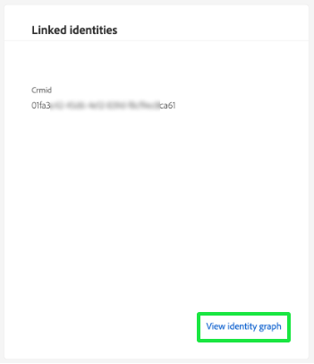
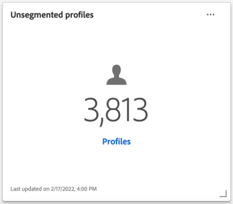

# Kontrollpanel för [!UICONTROL Profiles]

Adobe Experience Platform användargränssnitt (UI) tillhandahåller en kontrollpanel där du kan visa viktig information om dina [!DNL Real-Time Customer Profile]-data, som de har fångats in under en daglig ögonblicksbild. I den här handboken beskrivs hur du kommer åt och arbetar med profilkontrollpanelen i användargränssnittet, och den innehåller information om de mått som visas på kontrollpanelen.

Se [Användargränssnittsguiden för kundprofil i realtid](../../profile/ui/user-guide.md) för en översikt över profilfunktionerna i användargränssnittet i Experience Platform.

## Data för kontrollpanel för profil

På kontrollpanelen Profiler visas en ögonblicksbild av attributdata (postdata) som din organisation har i profilarkivet i Experience Platform. Ögonblicksbilden innehåller inga händelsedata (tidsserier).

Attributdata i ögonblicksbilden visar data exakt som de visas vid den specifika tidpunkten när ögonblicksbilden togs. Ögonblicksbilden är alltså inte en uppskattning eller ett urval av data och kontrollpanelen för profiler uppdateras inte i realtid.

>[!NOTE]
>
>Ändringar eller uppdateringar som gjorts i data sedan ögonblicksbilden togs kommer inte att visas på kontrollpanelen förrän nästa ögonblicksbild tas.

## Utforska instrumentpanelen för profiler {#explore-dashboard}

Om du vill navigera till profilkontrollpanelen i plattformsgränssnittet väljer du **[!UICONTROL Profiles]** i den vänstra listen och sedan fliken **[!UICONTROL Overview]** för att visa instrumentpanelen.

>[!NOTE]
>
>Om din organisation inte har använt plattformen tidigare och ännu inte har några aktiva profildatauppsättningar eller sammanslagningsprinciper skapade, visas inte instrumentpanelen för profiler. Istället visar fliken [!UICONTROL Overview] länkar och dokumentation som hjälper dig att komma igång med kundprofilen i realtid.

### Ändra instrumentpanelen för profiler {#modify-dashboard}

Du kan ändra utseendet på profilkontrollpanelen genom att välja **[!UICONTROL Modify dashboard]**. Du kan flytta, lägga till, ändra storlek på och ta bort widgetar från instrumentpanelen, samt få tillgång till **[!UICONTROL Widget library]** för att utforska tillgängliga widgetar och skapa anpassade widgetar för din organisation.

Mer information finns i dokumentationen om [att ändra kontrollpaneler](../customize/modify.md) och [översikt över widgetbiblioteket](../customize/widget-library.md).

### Lägg till widgetar {#add-widget}

Välj **[!UICONTROL Add widget]** om du vill navigera till widgetbiblioteket och visa en lista över tillgängliga widgetar att lägga till på din instrumentpanel.

I widgetbiblioteket kan du bläddra bland alla standardwidgetar och anpassade målgruppswidgetar. Mer information om hur du lägger till widgetar finns i dokumentationen för widgetbiblioteket om hur du [lägger till en widget](../customize/widget-library.md#add-widgets).

### Visa SQL {#view-sql}

Du kan visa den SQL som genererar de insikter som visualiserats på din instrumentpanel med en växlingsknapp på arbetsytan för [!UICONTROL Overview]. Ni kan få inspiration från SQL:s av era befintliga insikter för att skapa nya frågor som bygger på unika insikter från plattformsdata baserat på era affärsbehov. Mer information om den här funktionen finns i [Visa gränssnittshandboken för SQL](../view-sql.md).

<!-- ## (Beta) Profile efficacy insights {#profile-efficacy-insights}

>[!IMPORTANT]
>
>The profile efficacy insight functionality is currently in beta and are not available to all users. The documentation and the functionality are subject to change.

The [!UICONTROL Efficacy] tab provides metrics on the quality and completeness of your profile data through the use of profile efficacy widgets. These widgets illustrate at a glance the composition of your profiles, trends in completeness over time, and assessments on the quality of your profile data.

See the [profile efficacy widgets section](#profile-efficacy-widgets) for more information on the widgets currently available.

The layout of this dashboard is also customizable by selecting [**[!UICONTROL Modify dashboard]**](../customize/modify.md) from the [!UICONTROL Overview] tab. -->

## Bläddra bland profiler {#browse-profiles}

På fliken [!UICONTROL Browse] kan du söka efter och visa de skrivskyddade profiler som är inkapslade i din organisation. Härifrån kan du se viktig information som hör till profilen om deras inställningar, tidigare händelser, interaktioner och målgrupper.

## Profilinformation {#profile-details}

Om du vill öppna arbetsytan [!UICONTROL Profiles] [!UICONTROL Detail] väljer du [!UICONTROL Profile ID] i listan.

Arbetsytan [!UICONTROL Profiles] [!UICONTROL Detail] visar flera förkonfigurerade widgetar som förmedlar information som är specifik för den profilen. Med den här informationen kan du snabbt förstå viktiga attribut för profilen. Du kan också anpassa arbetsytan för [!UICONTROL Profiles] [!UICONTROL Detail] genom att skapa egna widgetar. Mer information finns i avsnittet [Lägga till widgetar](#add-widgets).

![Arbetsytan [!UICONTROL Profiles] [!UICONTROL Detail] med fliken [!UICONTROL Detail] markerad.](../images/profiles/profile-details-workspace.png)

### Profilinformationswidgetar {#widgets}

De förkonfigurerade profilinformationswidgetarna är följande:

#### Kundprofil {#customer-profile}

Widgeten [!UICONTROL Customer profile] visar för- och efternamnet för användaren som är associerad med profilen samt deras [!UICONTROL Profile ID]. Ett profil-ID är en automatiskt genererad identifierare som är associerad med en identitetstyp och representerar en profil. Mer information om identiteter och identitetsnamnutrymmen finns i [identitetöversikten](../../rtcdp/profile/identities-overview.md).

#### Grundläggande attribut {#basic-attributes}

Widgeten [!UICONTROL Basic attributes] visar de vanligaste attributen som används för att definiera en enskild profil.

#### Länkade identiteter {#linked-identities}

Widgeten [!UICONTROL Linked identities] visar alla andra identiteter som är associerade med profilen.

Om du vill visa profilens identitetsinformation mer ingående och navigera till arbetsytan [!UICONTROL Identities] väljer du **[!UICONTROL View identity graph]**.

#### Kanalinställningar {#channel-preferences}

Widgeten [!UICONTROL Channel preferences] visar de kommunikationskanaler som användaren har godkänt för att ta emot kommunikation från. En bock markerar varje kanal som användaren har godkänt för att ta emot kommunikation från.

<!-- image needs a blue tick added below -->

Kundens samtycke och kontaktpreferenser är komplexa ämnen. Om du vill veta hur samtycke och sammanhangsinställningar kan samlas in, bearbetas och filtreras i Experience Platform rekommenderar vi att du läser följande dokument:

* Mer information om schemafältgrupper som krävs för att [samla in medgivandedata enligt Adobe-standarden](../../landing/governance-privacy-security/consent/adobe/overview.md) finns i dokumentationen för dessa profilaktiverade schemafältgrupper.
   * [[!UICONTROL Consent and Preference Details]](../../xdm/field-groups/profile/consents.md)
   * [[!UICONTROL IdentityMap]](../../xdm/field-groups/profile/identitymap.md) (krävs om du använder Platform Web eller Mobile SDK för att skicka medgivandesignaler)
* Mer information om hur du bearbetar kundens samtycke och inställningsdata med hjälp av Adobe-standarden finns i översikten över [godkännandebearbetning i Experience Platform](../../landing/governance-privacy-security/consent/adobe/overview.md).
* En kombinerad policy för datastyrning och samtycke kan användas för att filtrera profiler för segmentering baserat på deras samtycke och dina etablerade organisationsregler. Om du vill veta mer om hur du skapar och använder dessa kombinerade principer läser du i användarhandboken om [hantering av dataanvändningsprinciper](../../data-governance/policies/user-guide.md#combine-policies).

### Lägg till widgetar {#add-widgets}

Om du vill lägga till anpassade widgetar på din [!UICONTROL Profiles] [!UICONTROL Detail] -arbetsyta väljer du **[!UICONTROL Customize profile details]**.

![Arbetsytan Profilinformation med [!UICONTROL Customize profile details] markerat.](../images/profiles/customize-profile-details.png)

Nu kan du redigera arbetsytan genom att ändra storlek på eller flytta widgetarna. Välj **[!UICONTROL Add widget]** om du vill skapa en widget med anpassade attribut.

![Arbetsytan Profiler [!UICONTROL Detail] med [!UICONTROL Add widget] markerat.](../images/profiles/add-widget.png)

Widgetskaparen visas. Ange ett beskrivande namn för widgeten i textfältet [!UICONTROL Card title] och välj **[!UICONTROL Add attributes]**.

![Widgetens skapararbetsyta med fältet [!UICONTROL Card title] och [!UICONTROL Add attributes] markerat.](../images/profiles/widget-creator.png)

En dialogruta visas som innehåller en visualisering av profilens unionsschema. Använd sökfältet eller rullningen för att hitta de attribut du vill rapportera om med widgeten. Markera kryssrutan för de attribut du vill ta med. Välj **[!UICONTROL Select]** om du vill fortsätta skapa arbetsflödet.

>[!TIP]
>
>En markering av kryssrutan på den översta nivån innehåller underordnade element.

![Unionsschemat med kryssrutan för lojalitetsattribut och [!UICONTROL Select] markerat.](../images/profiles/union-schema-attributes.png)

En förhandsvisning av den färdiga widgeten visas på arbetsytan. När du är nöjd med de valda attributen väljer du **[!UICONTROL Save]** för att bekräfta dina val och återgå till arbetsytan för [!UICONTROL Profiles] [!UICONTROL Detail]. Den nya widgeten visas nu på arbetsytan.

## Sammanfoga profiler {#merge-policies}

De mätvärden som visas på profilkontrollpanelen baseras på sammanslagningsprinciper som tillämpas på dina kundprofildata i realtid. När data samlas in från flera källor för att skapa kundprofilen kan data innehålla värden som är i konflikt. En datauppsättning kan till exempel visa en kund som&quot;enkel&quot; medan en annan datauppsättning kan visa kunden som&quot;gift&quot;. Det är huvudsyftet med sammanfogningsprincipen att avgöra vilka data som ska prioriteras och visas som en del av profilen.

Mer information om sammanfogningsprinciper, inklusive hur du skapar, redigerar och deklarerar en standardsammanfogningsprincip för din organisation, finns i [översikten över sammanfogningsprinciper](../../profile/merge-policies/overview.md).

Kontrollpanelen väljer automatiskt vilken sammanfogningsprincip som ska användas. Den tillämpade sammanfogningsprincipen kan ändras med hjälp av listrutan bredvid sammanfogningsprincipens namn.

>[!NOTE]
>
>I listrutan visas bara sammanfogningsprinciper som använder schemat `_xdm.context.profile`. Om din organisation har skapat flera sammanfogningsprinciper kan det dock innebära att du måste rulla för att kunna visa den fullständiga listan över tillgängliga sammanfogningsprinciper.

## Unionens system

Kontrollpanelen [!UICONTROL Union Schema] visar unionsschemat för en specifik XDM-klass. Genom att välja listrutan **[!UICONTROL Class]** kan du visa föreningsscheman för olika XDM-klasser.

Unionsscheman består av flera scheman som delar samma klass och har aktiverats för profilen. Med dem kan du i en enda vy se en sammanslagning av alla fält i varje schema som delar samma klass.

Mer information om hur du [visar unionsscheman i plattformsgränssnittet](../../profile/ui/union-schema.md#view-union-schemas) finns i gränssnittsguiden för unionsscheman.

## Widgetar och mätvärden

Kontrollpanelen består av widgetar, som är skrivskyddade mått som ger viktig information om dina profildata.

Datum och tid för den senaste ögonblicksbilden visas högst upp på fliken [!UICONTROL Overview] bredvid listrutan för sammanslagningsprinciper. Alla widgetdata är korrekta från och med det datumet och den tidpunkten. Tidsstämpeln för ögonblicksbilden anges i UTC. Den finns inte i tidszonen för den enskilda användaren eller organisationen.

## Standardwidgetar {#default-widgets}

En standardinläsning av widgetar tillhandahålls för alla nya instanser av Adobe Experience Platform som visar de senaste tillgängliga insikterna från dina data. Följande widgetar är förkonfigurerade i segmentvyn från början. Mer information om widgetarnas syfte och funktion finns nedan.

* [[!UICONTROL Profile count]](#profile-count)
* [[!UICONTROL Profile count change]](#profile-count-change)
* [[!UICONTROL Profiles count change trend]](#profiles-count-change-trend)
* [[!UICONTROL Profiles by identity]](#profiles-by-identity)
* [[!UICONTROL Identity overlap]](#identity-overlap)

>[!NOTE]
>
>Från och med den 26 juli 2023 har kontrollpanelerna [!UICONTROL Profiles], [!UICONTROL Audiences] och [!UICONTROL Destinations] för översikt återställts till en ny standardwidget för inläsning av alla användare som inte ändrade sina vyer under de senaste sex månaderna. Mer information om vilka widgetar som ingår som en del av standardwidgeten finns i dokumentationen för [Målen](./destinations.md#default-widgets) och [Målgrupperna](./audiences.md#default-widgets) . Du kan fortsätta att anpassa dina instrumentpanelswidgetar som tidigare.

## AI-widgetar för kunder {#customer-ai-profiles-widgets}

Kund-AI används för att generera anpassade benägenhetspoäng som omsättning och konvertering för enskilda profiler i stor skala. Kunds-AI gör detta genom att analysera befintliga kundupplevelsedata för att förutsäga **bortfall eller konverteringsbenägenhetspoäng**. Dessa högkvalitativa kundbenägenhetsmodeller möjliggör mer exakt segmentering och målinriktning. Distributionen [av poängen](#customer-ai-distribution-of-scores) och [poängsammanfattningen](#customer-ai-scoring-summary) visar hur er målgrupp är uppdelad. Panelerna sätter fokus på vilka profiler som är de höga/låga/medelstora och hur de fördelas över dina profilantal.

* [[!UICONTROL Customer AI scoring summary]](#customer-ai-scoring-summary)
* [[!UICONTROL Customer AI distribution of scores]](#customer-ai-distribution-of-scores)

### [!UICONTROL Customer AI distribution of scores] {#customer-ai-distribution-of-scores}

>[!CONTEXTUALHELP]
>id="platform_dashboards_profiles_distributionOfScores"
>title="Fördelning av poäng"
>abstract="Den här widgeten visar fördelningen av det totala antalet profiler utifrån deras benägenhetspoäng i steg om fem procent. Distributionen av profilantalet bestäms av AI-modellen och den valda sammanfogningsprincipen. Du kan ändra AI-modellen i listrutan under widgettiteln."

Widgeten [!UICONTROL Customer AI distribution of scores] kategoriserar det totala antalet profiler utifrån deras benägenhetspoäng. Fördelningen av profilantalet bestäms av AI-modellen och den valda sammanfogningspolicyn och visualiseras sedan i steg om fem procent som anger deras benägenhet. Antalet profiler anges längs Y-axeln och benägenhetspoängen anges längs X-axeln.

>[!NOTE]
>
>Om visualiseringen är en konverteringsbenägenhetspoäng visas de höga poängen i grönt och de låga poängen i rött. Om du förutser kurvbenägenheten att detta vänds är de höga poängen röda och de låga poängen gröna. Mediefiltret förblir gult oavsett vilken typ av benägenhet du väljer.

Den AI-modell som avgör graden av benägenhet väljs i listruteväljaren under widgetens titel. Listrutan innehåller en lista över alla konfigurerade AI-modeller för kunder. Välj lämplig AI-modell för analysen i listan över tillgängliga modeller. Om det inte finns någon AI-modell för kunden instruerar ett meddelande i widgeten dig att konfigurera minst en AI-modell för kunden och tillhandahåller en hyperlänk till konfigurationssidan för kundens AI-modell. I dokumentationen finns instruktioner om [hur du konfigurerar en AI-instans för kunder](../../intelligent-services/customer-ai/user-guide/configure.md).

>[!NOTE]
>
>Välj listrutan direkt under fliken Översikt om du vill ändra den sammanfogningsprincip som avgör vilka profiler som tas med i analysen. Mer information finns i avsnittet [sammanfogningsprinciper](#merge-policies) om du vill ha en kort beskrivning eller i översikten för [sammanfogningsprincipen](../../profile/merge-policies/overview.md).

Om du vill navigera till sidan med detaljerad information för den valda kundens AI-modell väljer du **[!UICONTROL View model details]**.

![Kontrollpanelen Experience Platform Publiker med widgeten [!UICONTROL Customer AI distribution of scores] och [!UICONTROL View model details] markerad.](../images/segments/customer-ai-distribution-of-scores.png)

Sidan med detaljerad modellinformation visas.

Mer information om kunds-AI finns i [gränssnittsguiden för upptäckt](../../intelligent-services/customer-ai/user-guide/discover-insights.md).

### [!UICONTROL Customer AI scoring summary] {#customer-ai-scoring-summary}

>[!CONTEXTUALHELP]
>id="platform_dashboards_profiles_scoringSummary"
>title="Sammanfattning av poäng"
>abstract="Den här widgeten visar det totala antalet poängsatta profiler och kategoriserar dem i grupper som innehåller hög, medelhög och låg benägenhet. Nutdiagrammet visar den proportionella sammansättningen av de totala profilerna över hög, medel och låg benägenhet."

Den här widgeten visar det totala antalet profiler som har poängterats och kategoriserar dem i grupper som innehåller hög, medelhög och låg benägenhet som grön, gul respektive röd. Ett mundiagram visar den proportionella sammansättningen av profiler mellan hög, medel och låg egenskap. En profil ger hög benägenhet vid över 75, medelhög intensitet mellan 25 och 74 och låg benägenhet under 24. En teckenförklaring anger färgkoden och egenskapernas tröskelvärden. Profilantal för de höga, medelstora och låga egenskaperna visas i en dialogruta när markören hålls över respektive avsnitt i mundiagrammet.

>[!NOTE]
>
>Om visualiseringen är en konverteringsbenägenhetspoäng visas de höga poängen i grönt och de låga poängen i rött. Om du förutser kurvbenägenheten att detta vänds är de höga poängen röda och de låga poängen gröna. Mediefiltret förblir gult oavsett vilken typ av benägenhet du väljer.

I listrutan under widgetens rubrik finns en lista med alla konfigurerade AI-modeller för kunder. Välj lämplig AI-modell för analysen i listan över tillgängliga modeller. Om det inte finns någon AI-modell för kunden instruerar ett meddelande i widgeten dig att konfigurera minst en AI-modell för kunden och tillhandahåller en hyperlänk till konfigurationssidan för kundens AI-modell. Mer information finns i dokumentationen om [hur du konfigurerar en AI-instans](../../intelligent-services/customer-ai/user-guide/configure.md) för kunder.

>[!NOTE]
>
>Det totala antalet beräknade profiler beror på den valda sammanfogningsprincipen. Om du vill ändra den sammanfogningsprincip som används väljer du listrutan direkt under fliken Översikt. Mer information finns i avsnittet [sammanfogningsprinciper](#merge-policies) om du vill ha en kort beskrivning eller i översikten för [sammanfogningsprincipen](../../profile/merge-policies/overview.md).

Om du vill navigera till sidan med detaljerad information för den valda kundens AI-modell väljer du **[!UICONTROL View model details]**. Mer information om kunds-AI finns i [gränssnittsguiden för upptäckt](../../intelligent-services/customer-ai/user-guide/discover-insights.md).

## Standardwidgetar {#standard-widgets}

Adobe tillhandahåller flera standardwidgetar som du kan använda för att visualisera olika mått som relaterar till dina profildata. Du kan också skapa anpassade widgetar som ska delas med din organisation med [!UICONTROL Widget library]. Om du vill veta mer om hur du skapar anpassade widgetar börjar du med att läsa översikten för [widgetbiblioteket](../customize/widget-library.md).

Om du vill veta mer om de tillgängliga standardwidgetarna väljer du namnet på en widget i följande lista:

* [[!UICONTROL Profile count]](#profile-count)
* [[!UICONTROL Profile count trend]](#profile-count-trend)
* [[!UICONTROL Profile count change]](#profile-count-change)
* [[!UICONTROL Profiles count change trend]](#profiles-count-change-trend)
* [[!UICONTROL Profiles count change trend by identity]](#profiles-count-change-trend-by-identity)
* [[!UICONTROL Profiles by identity]](#profiles-by-identity)
* [[!UICONTROL Identity overlap]](#identity-overlap)
* [[!UICONTROL Single identity profiles]](#single-identity-profiles)
* [[!UICONTROL Single identity profiles by identity]](#single-identity-profiles-by-identity)
* [[!UICONTROL Unsegmented profiles]](#unsegmented-profiles)
* [[!UICONTROL Unsegmented profiles change trend]](#unsegmented-profiles-change-trend)
* [[!UICONTROL Unsegmented profiles by identity]](#unsegmented-profiles-by-identity)
* [[!UICONTROL Audiences]](#audiences)
* [[!UICONTROL Audiences mapped to destination status]](#audiences-mapped-to-destination-status)
* [[!UICONTROL Audiences size]](#audiences-size)
* [[!UICONTROL Audience overlap by merge policy]](#audience-overlap-by-merge-policy)
* [[!UICONTROL Audience overlap report]](#audience-overlap-report)

### [!UICONTROL Profile count] {#profile-count}

>[!CONTEXTUALHELP]
>id="platform_dashboards_profiles_profilecount"
>title="Profilantal"
>abstract="Den här widgeten visar det totala antalet sammanfogade profiler i profilarkivet när ögonblicksbilden togs. Numret beror på den valda sammanfogningsprincipen som tillämpas på dina profildata."

Widgeten **[!UICONTROL Profile count]** visar det totala antalet sammanfogade profiler i profilarkivet när ögonblicksbilden togs. Det här numret är resultatet av att den valda sammanfogningsprincipen tillämpas på dina profildata för att sammanfoga profilfragment till en enda profil för varje enskild person.

Mer information finns i avsnittet [om sammanfogningsprinciper tidigare i det här dokumentet](#merge-policies).

>[!NOTE]
>
>Widgeten [!UICONTROL Profile count] kan visa ett annat nummer än det antal profiler som visas på fliken [!UICONTROL Browse] i avsnittet [!UICONTROL Profiles] i användargränssnittet av flera anledningar. Den vanligaste orsaken till den här skillnaden är att fliken [!UICONTROL Browse] refererar till det totala antalet sammanfogade profiler baserat på organisationens standardprincip för sammanfogning, medan widgeten [!UICONTROL Profile count] refererar till det totala antalet sammanfogade profiler baserat på den sammanfogningsprincip som du har valt att visa på kontrollpanelen.
>
>En annan vanlig orsak är att det finns skillnader mellan tidpunkten när instrumentpanelsögonblicksbilden tas och tidpunkten när exempeljobbet körs för fliken [!UICONTROL Browse]. Du kan se när widgeten [!UICONTROL Profile count] senast uppdaterades genom att titta på tidsstämpeln i widgeten. Mer information om hur exempeljobbet utlöses på fliken [!UICONTROL Browse] finns i avsnittet [antal profiler i gränssnittsguiden för kundprofiler i realtid](../../profile/ui/user-guide.md#profile-count).

### [!UICONTROL Profile count trend] {#profile-count-trend}

Widgeten [!UICONTROL Profile count trend] använder ett linjediagram för att illustrera trenden i det totala antalet profiler som finns i systemet över tiden. Det totala antalet inkluderar alla profiler som importerats till systemet sedan den senaste ögonblicksbilden. Data kan visualiseras under 30 dagar, 90 dagar och 12 månader. Tidsperioden väljs i en listruta i widgeten.

### [!UICONTROL Profile count change] {#profile-count-change}

>[!CONTEXTUALHELP]
>id="platform_dashboards_profiles_profilescountchange"
>title="Ändring av antal profiler"
>abstract="Den här widgeten visar det totala antalet sammanfogade profiler **som lagts till** i profilarkivet vid tidpunkten för den senaste ögonblicksbilden. Numret beror på den valda sammanfogningsprincipen som tillämpas på dina profildata."

Widgeten **[!UICONTROL Profile count change]** visar antalet sammanfogade profiler som lagts till i profilarkivet sedan föregående ögonblicksbild. Det här numret är resultatet av att den valda sammanfogningsprincipen tillämpas på dina profildata för att sammanfoga profilfragment till en enda profil för varje enskild person. Du kan använda listruteväljaren för att visa antalet profiler som lagts till under de senaste 30 dagarna, 90 dagarna eller 12 månaderna.

>[!NOTE]
>
>Widgeten [!UICONTROL Profile count change] visar antalet profiler som har lagts till **efter** det första profilintaget och konfigurationen för profilarkivet. Med andra ord: om din organisation konfigurerade profilarkivet och importerade 4 000 000 Dag 1 är kontrollpanelen tillgänglig inom 24 timmar, men [!UICONTROL Profile count change]-widgeten är inställd på 0. Den här beräkningsmetoden görs för att undvika en spik som är kopplad till det initiala intaget av profiler i systemet. Under de närmaste 30 dagarna har din organisation importerat ytterligare 1 000 000 profiler till profilbutiken. När nästa ögonblicksbild har tagits visar widgeten [!UICONTROL Profile count change] totalt 1 000 000 profiler tillagda, medan [!UICONTROL Profile count]-widgeten visar totalt 5 000 000 profiler.

### [!UICONTROL Profiles count change trend] {#profiles-count-change-trend}

>[!CONTEXTUALHELP]
>id="platform_dashboards_profiles_profilesaddedtrend"
>title="trender för antal ändringar av profiler"
>abstract="Den här widgeten visar antalet sammanfogade profiler som har lagts till i profilbutiken dagligen under de senaste 30 dagarna, 90 dagar eller 12 månaderna. Talet beror också på vilken sammanfogningsprincip som används för profildata."

Widgeten **[!UICONTROL Profiles count change trend]** visar det totala antalet sammanfogade profiler som har lagts till i profilbutiken dagligen under de senaste 30 dagarna, 90 dagar eller 12 månaderna. Detta nummer uppdateras varje dag som ögonblicksbilden tas, och om du vill importera profiler till Platform kommer antalet profiler inte att visas förrän nästa ögonblicksbild tas. Antalet tillagda profiler är resultatet av att den valda sammanfogningsprincipen tillämpas på dina profildata för att sammanfoga profilfragment till en enda profil för varje enskild person.

Mer information finns i avsnittet [om sammanfogningsprinciper tidigare i det här dokumentet](#merge-policies).

Widgeten **[!UICONTROL Profiles count change trend]** visar en bildtextknapp i det övre högra hörnet av widgeten. Om du vill öppna dialogrutan med automatiska bildtexter väljer du **[!UICONTROL Captions]**.

En maskininlärningsmodell genererar automatiskt beskrivningar av viktiga trender och viktiga händelser genom att analysera diagrammet och data. Anteckningar läggs till i diagrammet baserat på bildtexterna. Välj en bildtext som ska fokuseras på motsvarande anteckning.

### [!UICONTROL Profiles count change trend by identity] {#profiles-count-change-trend-by-identity}

<!-- This widget uses a line graph to illustrate the change in number of profiles filtered by a chosen source identity and merge policy. -->

Den här widgeten filtrerar profilantalet baserat på en vald källidentitet och sammanfogningspolicy, och visar sedan ändringen av antalet för olika perioder med hjälp av ett linjediagram. Sammanslagningsprincipen väljs i översiktslistrutan högst upp på sidan, källans identitet och tidsperioden väljs i widgetens listruta. Trenden kan visualiseras under 30 dagar, 90 dagar och 12 månader.

Denna widget hjälper dig att hantera dina behov av målaktivering genom att visa tillväxtmönstret för profiler som filtrerats med en obligatorisk identitet.

### [!UICONTROL Profiles by identity] {#profiles-by-identity}

>[!CONTEXTUALHELP]
>id="platform_dashboards_profiles_profilesbyidentity"
>title="Profiler efter identitet"
>abstract="Den här widgeten visar en uppdelning av alla sammanfogade profiler i din profilbutik efter identiteter."

Widgeten **[!UICONTROL Profiles by identity]** visar uppdelningen av identiteter för alla sammanfogade profiler i din profilbutik. Det totala antalet profiler per identitet (med andra ord, om de värden som visas för varje namnutrymme läggs ihop) kan vara högre än det totala antalet sammanfogade profiler, eftersom en profil kan ha flera namnutrymmen kopplade till sig. Om en kund till exempel interagerar med varumärket i mer än en kanal, skulle flera namnutrymmen kopplas till den enskilda kunden.

Mer information finns i avsnittet [om sammanfogningsprinciper tidigare i det här dokumentet](#merge-policies).

Om du vill öppna dialogrutan med automatiska bildtexter väljer du **[!UICONTROL Captions]**.

En maskininlärningsmodell genererar automatiskt datainsikter genom att analysera den övergripande fördelningen och de viktigaste dimensionerna av data.

Mer information om identiteter finns i [dokumentationen för Adobe Experience Platform Identity Service](../../identity-service/home.md).

### [!UICONTROL Identity overlap] {#identity-overlap}

>[!CONTEXTUALHELP]
>id="platform_dashboards_profiles_identityoverlap"
>title="Identitetsöverlappning"
>abstract="Den här widgeten använder ett Venndiagram för att visa överlappningen mellan profiler i din profilbutik som innehåller de två valda identiteterna."

Widgeten **[!UICONTROL Identity overlap]** använder ett Venndiagram, eller ett uppsättningsdiagram, för att visa överlappningen mellan profiler i din profilbutik som innehåller de två valda identiteterna.

Använd widgetens listrutor för att välja de identiteter som du vill jämföra. Cirklar visar det relativa totala antalet profiler som innehåller varje identitet. Antalet profiler som innehåller båda identiteterna representeras av storleken på överlappningen mellan cirklarna. Om en kund interagerar med ert varumärke i mer än en kanal skulle flera identiteter vara kopplade till den enskilda kunden. I den här situationen är det troligt att din organisation har flera profiler som innehåller fragment från mer än en identitet.

Mer information om profilfragment finns i avsnittet [profilfragment kontra sammanfogade profiler](../../profile/home.md#profile-fragments-vs-merged-profiles) i realtidsöversikten över kundprofiler.

Mer information om identiteter finns i [dokumentationen för Adobe Experience Platform Identity Service](../../identity-service/home.md).

### [!UICONTROL Single identity profiles] {#single-identity-profiles}

>[!CONTEXTUALHELP]
>id="platform_dashboards_profiles_singleidentityprofiles"
>title="Enstaka identitetsprofiler"
>abstract="Den här widgeten innehåller ett antal profiler för din organisation som bara har en typ av ID som skapar deras identitet. Den här ID-typen kan antingen vara ett e-postmeddelande eller ett ECID."

Widgeten [!UICONTROL Single Identity Profiles] visar antalet profiler i din organisation som bara har en typ av ID som skapar deras identitet. Den här ID-typen kan antingen vara ett e-postmeddelande eller ett ECID. Profilantalet genereras från data i den senaste ögonblicksbilden.

### [!UICONTROL Single identity profiles by identity] {#single-identity-profiles-by-identity}

Den här widgeten använder ett stapeldiagram för att illustrera det totala antalet profiler som identifieras med endast en unik identifierare. Widgeten stöder upp till fem av de vanligaste identiteterna.

Om du vill visa en dialogruta med information om det totala antalet profiler för en identitet använder du markören för att hovra över enskilda fält.

### [!UICONTROL Unsegmented profiles] {#unsegmented-profiles}

>[!CONTEXTUALHELP]
>id="platform_dashboards_profiles_unsegmentedprofiles"
>title="Osegmenterade profiler"
>abstract="Den här widgeten visar det totala antalet profiler som inte är kopplade till någon målgrupp och representerar möjligheten till profilaktivering i hela organisationen."

Widgeten [!UICONTROL Unsegmented Profiles] innehåller det totala antalet profiler som inte är kopplade till någon målgrupp. Det genererade numret är korrekt vid den senaste ögonblicksbilden och representerar möjligheten till profilaktivering i hela organisationen. Det visar också möjligheten att utvinna profiler som inte ger tillräcklig avkastning.

### [!UICONTROL Unsegmented profiles change trend] {#unsegmented-profiles-change-trend}

>[!CONTEXTUALHELP]
>id="platform_dashboards_profiles_unsegmentedprofilestrend"
>title="Trend för osegmenterade profiler"
>abstract="Den här widgeten innehåller en illustration av linjediagram för antalet profiler som inte är kopplade till någon målgrupp under en viss tidsperiod. Trenden för profiler som inte är kopplade till en viss målgrupp kan visas under perioderna 30 dagar, 90 dagar och 12 månader."

Widgeten [!UICONTROL Unsegmented profiles change trend] använder ett linjediagram för att illustrera antalet profiler som har lagts till sedan den senaste ögonblicksbilden som inte är kopplade till någon målgrupp. Den föränderliga trenden för profiler som inte är kopplade till någon målgrupp kan visualiseras under 30 dagar, 90 dagar och 12 månader. Tidsperioden väljs i en listruta i widgeten. Profilantalet återspeglas på y-axeln och tiden på x-axeln.

### [!UICONTROL Unsegmented profiles by identity] {#unsegmented-profiles-by-identity}

>[!NOTE]
>
>De osegmenterade profilerna efter identitetswidget har tagits bort från oktober 2022 och är inte längre tillgängliga.

<!-- 

>[!CONTEXTUALHELP]
>id="platform_dashboards_profiles_unsegmentedprofilesbyidentity"
>title="Unsegmented profiles by identity"
>abstract="This widget categorizes the total number of unsegmented profiles by their unique identifier."

The [!UICONTROL Unsegmented Profiles by Identity] widget categorizes the total number of unsegmented profiles by their unique identifier. The data is visualized in a bar chart for ease of comparison. 

 -->

### [!UICONTROL Audiences] {#audiences}

Den här widgeten innehåller det totala antalet målgrupper som är klara att aktiveras enligt den valda sammanfogningsprincipen som tillämpas på dina profildata.

Välj **[!UICONTROL Audiences]** om du vill navigera till fliken [!UICONTROL Audiences] dashboard [!UICONTROL Browse] . Därifrån visas en lista med alla segmentdefinitioner för din organisation.

<!-- https://jira.corp.adobe.com/browse/PLAT-115291 -->

<!-- * [[!UICONTROL Audiences change trend]](#audiences-change-trend) -->
<!-- ### [!UICONTROL Audiences change trend] {#audiences-change-trend}

This line graph widget visualizes the change in the total number of audiences each day, trending over time. The change in the number of audiences is dependent on the selected merge policy being applied to your profile data. The period of analysis is selected from the widget dropdown menu. The bar chart can be visualized over 30 days, 90 days, and 12-month periods.

The visualization allows you to monitor the overall health of audiences within Adobe Experience Platform by understanding trends in the growth or decline of the total number of audiences. -->

<!--  -->

### [!UICONTROL Audience overlap report] {#audience-overlap-report}

Den här widgeten gör att data överlappar alla tillgängliga målgrupper som filtreras efter sammanfogningsprincip. En lista med fem målgrupper som rangordnas mellan de högsta och de lägsta procentsatserna för överlappning finns för den sammanslagningsprincip som väljs i listrutan högst upp på skärmen. De två analyserade målgrupperna listas i kolumnerna [!UICONTROL AUDIENCE A NAME] och [!UICONTROL AUDIENCE B NAME]. Procentöverlappningen anges i den tredje kolumnen med 12 decimaler.

Rapporten om publiköverlappning hjälper er att skapa nya högpresterande målgrupper. Genom att observera hög procentuell överlappning kan ni hindra målgrupper och förhindra att samma målgrupp skickas till olika destinationer. De hjälper er också att identifiera dolda insikter som kan bidra till bättre segmentering. Låg procentuell överlappning hjälper till att hitta unika profiler som ska eftersökas.

Välj **[!UICONTROL View more]** om du vill öppna en dialogruta i helskärmsläge som innehåller fler data om publiköverlappning.

Dialogrutan [!UICONTROL Audience overlap report] visas. Den här dialogrutan kan innehålla upp till 50 rader med målgrupper som överlappar analyser uppdelade i sex kolumner. Om du vill ta bort eller lägga till kolumner från tabellen väljer du inställningsikonen ().

>[!NOTE]
>
>Välj kolumnrubriken **[!UICONTROL Overlapping]** om du vill ändra resultatrankningen mellan högsta, lägsta eller högsta.

Om du vill hämta hela rapporten i PDF-format väljer du Alternativ-menyn (**`...`**) följt av **[!UICONTROL Download]**.

Om du vill öppna ett Venndiagram över överlappningsanalysen väljer du en rad i rapporten. Om du vill visa antalet profiler i en dialogruta håller du pekaren över ett avsnitt i Venndiagrammet.

Välj **[!UICONTROL Close]** om du vill gå tillbaka till kontrollpanelen [!UICONTROL Profiles].

### [!UICONTROL Audiences mapped to destination status] {#audiences-mapped-to-destination-status}

Widgeten [!UICONTROL Audiences mapped to destination status] visar det totala antalet både mappade och omappade målgrupper i ett enskilt mätresultat och använder ett donutdiagram för att illustrera den proportionella skillnaden mellan deras summor. Beräknade tal är beroende av den valda sammanfogningsprincipen.

Individuella värden för antingen mappade eller omappade målgrupper visas i en dialogruta när markören hålls över respektive avsnitt i donatdiagrammet.

### [!UICONTROL Audiences size] {#audiences-size}

Widgeten [!UICONTROL Audiences size] innehåller en tabell med två kolumner som visar namnen på upp till 20 målgrupper och det totala antalet profiler i varje målgrupp. Listan ordnas från hög till låg enligt det totala antalet profiler inom målgruppen. Det totala antalet målgruppsstorlekar beror på vilken sammanfogningsprincip som används.

Om du vill visa omfattande information om en målgrupp väljer du ett målgruppsnamn i listan som visas för att navigera till sidan [!UICONTROL Audiences] [!UICONTROL Detail]. Om du väljer **[!UICONTROL View all audiences]** i slutet av widgeten kan du navigera till fliken [!UICONTROL Audiences] [!UICONTROL Browse] för att hitta en befintlig målgrupp.

Mer information om målgruppsinformation finns i dokumentationen för [målportalen](../../segmentation/ui/audience-portal.md).

### [!UICONTROL Audience overlap by merge policy] {#audience-overlap-by-merge-policy}

Den här widgeten använder ett Venndiagram för att visa överlappningen mellan två valda målgrupper. Sammanslagningsprincipen väljs i översiktslistrutan högst upp på sidan och målgrupperna för analys väljs från två listrutor i widgeten. Det totala antalet profiler i den relevanta segmentdefinitionen kan du se genom att hålla markören över en cirkel eller skärningspunkten.

När widgeten visar den visuella överlappningen av segmentdefinitioner kan du optimera segmenteringsstrategin genom att studera likheter mellan segmentdefinitionerna.

<!-- ## (Beta) Profile efficacy widgets {#profile-efficacy-widgets}

>[!IMPORTANT]
>
>The profile efficacy widgets are currently in Beta and are not available to all users. The documentation and the functionality are subject to change.

Adobe provides multiple widgets to assess the completeness of the ingested profiles available for your data analysis. Each of the profile efficacy widgets can be filtered by the merge policy. To change the merge policy filter, select the[!UICONTROL Profiles using merge policy] dropdown and choose the appropriate policy from the available list.

To learn more about each of the profile efficacy widgets, select the name of a widget from the following list:

* [[!UICONTROL Attribute quality assessment]](#attributes-quality-assessment)
* [[!UICONTROL Profiles by completeness]](#profiles-by-completeness)
* [[!UICONTROL Profiles completeness trend]](#profiles-completeness-trend)

### (Beta) [!UICONTROL Attributes quality assessment] {#attributes-quality-assessment}

>[!CONTEXTUALHELP]
>id="platform_dashboards_profiles_attributesqualityassessment"
>title="Attributes quality assessment"
>abstract="This widget shows the completeness and cardinality of all profiles according to their attributes. Each row describes one attribute. The **Profiles** column provides the number of profiles that have this attribute and are filled with non-null values. The **Completeness** percentage is determined by the total number of profiles that have this attribute and are filled with non-null values divided by the total number of non-empty values in the profiles for that attribute. **Cardinality** provides the total number of unique non-null values of this attribute across all attributes."

The [!UICONTROL Attribute quality assessment] widget shows the completeness and cardinality of all profiles according to their attributes. The data is accurate to the last processing date. This information is presented as a table with four columns where each row in the table represents a single attribute.

| Column  | Description  |
|---|---|
| Attribute  | The name of the attribute.  |
| Profiles  | The number of profiles that have this attribute and are filled with non-null values.  |
| Completeness  | This percentage is determined by the total number of profiles that have this attribute and are filled with non-null values. The number is calculated by dividing the total number of profiles by the total number of non-empty values in the profiles for that attribute.  |
| Cardinality  | The total number of **unique** non-null values of this attribute. It is measured across all profiles. |

### (Beta) [!UICONTROL Profiles by completeness] {#profiles-by-completeness}

>[!CONTEXTUALHELP]
>id="platform_dashboards_profiles_profilesbycompleteness"
>title="Profiles by completeness"
>abstract="The donut chart displays the percentage of profile attributes that are filled with non-null values among all observed attributes. It illustrates the proportion of profiles that are of high, medium, or low completeness. High completeness profiles have more than 70% of their attributes filled. Medium completeness profiles have between 30% and 70% of their attributes filled. Low completeness profiles have less than 30% of their attributes filled."

The [!UICONTROL Profiles by completeness] widget creates a donut chart of profile completeness since the last processing date. The completeness of a profile is measured by the percentage of attributes that are filled with non-null values among all observed attributes.

This widget shows the proportion of profiles that are of high, medium, or low completeness. By default, there are three levels of completeness configured: 

* High completeness: Profiles have more than 70% of their attributes filled. 
* Medium completeness: Profiles have between 30% and 70% of their attributes filled. 
* Low completeness: Profiles have less than 30% of their attributes filled. 

### (Beta) [!UICONTROL Profiles completeness trend] {#profiles-completeness-trend}

>[!CONTEXTUALHELP]
>id="platform_dashboards_profiles_profilescompletenesstrend"
>title="Profiles completeness trend"
>abstract="This widget creates a stacked area chart to depict the trend of profile completeness over time. Completeness is measured by the percentage of attributes that are filled with non-null values among all observed attributes."

This widget creates a stacked area chart to depict the trend of profile completeness over time. Completeness is measured by the percentage of attributes filled with non-null values among all observed attributes. It categorizes the profile completeness as high, medium, or low completeness since the last processing date.

The x-axis represents time, the y-axis represents the number of profiles, and the colors represent the three levels of profile completeness. 

The three levels of completeness are:

* High completeness: Profiles have more than 70% of attributes filled. 
* Medium completeness: Profiles have less than 70% and more than 30% of attributes filled. 
* Low completeness: Profiles have less than 30% of attributes filled.

 -->

## Nästa steg

Genom att följa det här dokumentet bör du nu kunna hitta profilkontrollpanelen och förstå mätvärdena som visas i de tillgängliga widgetarna. Mer information om hur du arbetar med [!DNL Profile]-data i användargränssnittet för Experience Platform finns i [Användargränssnittshandboken för kundprofiler i realtid](../../profile/ui/user-guide.md).
