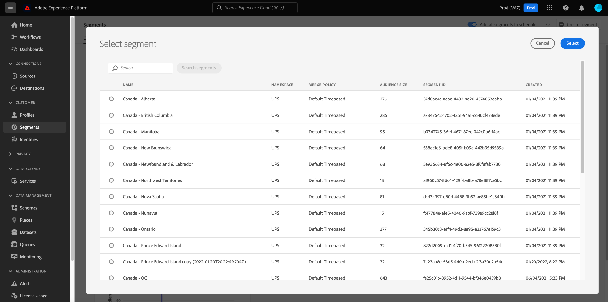
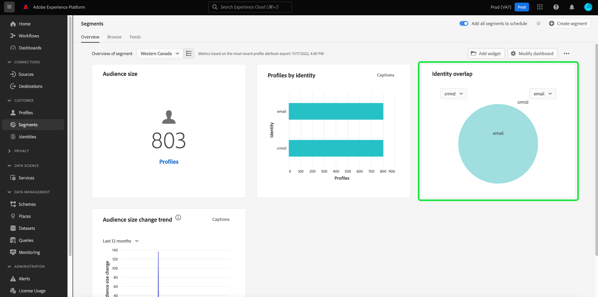

# Kontrollpanel för segment {#segment-dashboard}

Adobe Experience Platform användargränssnitt (UI) är en kontrollpanel där du kan visa viktig information om dina segment, som de tagits under en daglig ögonblicksbild. I den här handboken beskrivs hur du kommer åt och arbetar med segmentkontrollpanelen i användargränssnittet och den innehåller mer information om de visualiseringar som visas på kontrollpanelen.

En översikt över alla funktioner i Adobe Experience Platform Segmentation Service i användargränssnittet finns på [Användargränssnittsguide för segmenteringstjänst](../../segmentation/ui/overview.md).

## Instrumentpanelsdata för segment

På segmentkontrollpanelen visas en ögonblicksbild av de attributdata (postdata) som din organisation har i profilarkivet i Experience Platform. Ögonblicksbilden innehåller inga händelsedata (tidsserier).

Attributdata i ögonblicksbilden visar data exakt som de visas vid den specifika tidpunkten när ögonblicksbilden togs. Ögonblicksbilden är alltså inte en uppskattning eller ett urval av data och segmentkontrollpanelen uppdateras inte i realtid.

>[!NOTE]
>
>Ändringar eller uppdateringar som gjorts i data sedan ögonblicksbilden togs kommer inte att visas på kontrollpanelen förrän nästa ögonblicksbild tas.

## Utforska segmentkontrollpanelen

Navigera till [!UICONTROL Segments] kontrollpanelen i plattformsgränssnittet väljer du **[!UICONTROL Segments]** i den vänstra listen väljer du **[!UICONTROL Overview]** för att visa kontrollpanelen.

>[!NOTE]
>
>Om din organisation inte har använt Platform tidigare och ännu inte har några aktiva profildatauppsättningar eller sammanfogningsprinciper har skapats kan [!UICONTROL Segments] Kontrollpanelen visas inte. I stället [!UICONTROL Overview] På -fliken visas länkar och dokumentation som hjälper dig att komma igång med segmentering.

### Ändra [!UICONTROL Segments] kontrollpanel

Du kan ändra utseendet på [!UICONTROL Segments] kontrollpanel genom att välja **[!UICONTROL Modify dashboard]**. Detta gör att du kan flytta, lägga till och ta bort widgetar från kontrollpanelen samt få tillgång till **[!UICONTROL Widget library]** för att utforska tillgängliga widgetar och skapa anpassade widgetar för din organisation.

Se [ändra kontrollpaneler](../customize/modify.md) och [Översikt över widgetbiblioteket](../customize/widget-library.md) dokumentation som lär dig mer.

## Markera ett segment

Kontrollpanelen markerar automatiskt ett segment som ska visas, men du kan ändra segmentet med hjälp av listrutemenyn eller segmentväljaren.

Om du vill välja ett annat segment markerar du listrutan bredvid segmentnamnet eller använder segmentväljaren för att öppna segmentmarkeringsdialogrutan.

## Widgetar och mätvärden

Kontrollpanelen för segment består av widgetar, som är skrivskyddade mått som ger viktig information om det valda segmentet.

Datum och tid för den senaste ögonblicksbilden visas högst upp i [!UICONTROL Overview] bredvid segmentlistrutan. Alla widgetdata är korrekta från och med det datumet och den tidpunkten. Tidsstämpeln för ögonblicksbilden anges i UTC. det ligger inte i den enskilda användarens eller organisationens tidszon.

## Standardwidgetar {#standard-widgets}

Adobe tillhandahåller flera standardwidgetar som du kan använda för att visualisera olika mätvärden för dina segment. Du kan också skapa anpassade widgetar som ska delas med din organisation med hjälp av [!UICONTROL Widget library]. Om du vill veta mer om hur du skapar anpassade widgetar börjar du med att läsa [Översikt över widgetbiblioteket](../customize/widget-library.md).

Om du vill veta mer om de tillgängliga standardwidgetarna väljer du namnet på en widget i följande lista:

* [[!UICONTROL Audience size]](#audience-size)
* [[!UICONTROL Audience activation order]](#audience-activation-order)
* [[!UICONTROL Audience size trend]](#audience-size-trend)
* [[!UICONTROL Audience size change trend]](#audience-size-change-trend)
* [[!UICONTROL Audience size trend by identity]](#audience-size-trend-by-identity)
* [[!UICONTROL Audience overlap]](#audience-overlap)
* [[!UICONTROL Identity overlap]](#identity-overlap)
* [[!UICONTROL Profiles by identity]](#profiles-by-identity)

### [!UICONTROL Audience size] {#audience-size}

>[!CONTEXTUALHELP]
>id="platform_dashboards_segments_audiencesize"
>title="Målgruppsstorlek"
>abstract="Den här widgeten visar det totala antalet sammanfogade profiler i det valda segmentet. Det här numret beror på den sammanfogningsprincip som används för dina data och är korrekt vid tidpunkten för den senaste ögonblicksbilden."
>additional-url="https://experienceleague.adobe.com/docs/experience-platform/dashboards/guides/segments.html#audience-size" text="Läs mer i dokumentationen"

The **[!UICONTROL Audience size]** visar det totala antalet sammanfogade profiler i det markerade segmentet när ögonblicksbilden togs. Det här numret är resultatet av att du har tillämpat segmentsammanfogningsprincipen på dina profildata för att sammanfoga profilfragment till en enda profil för varje enskild person i segmentet.

Mer information om fragment och sammanfogade profiler får du om du börjar med att läsa [Översikt över kundprofiler i realtid](../../profile/home.md).

### [!UICONTROL Audience size trend] {#audience-size-trend}

>[!CONTEXTUALHELP]
>id="platform_dashboards_segments_audiencesizetrend"
>title="Trend för målgruppsstorlek"
>abstract="Den här widgeten innehåller information om det totala antalet profiler som uppfyller villkoren i **alla** segmentdefinition, som den tagits under den dagliga ögonblicksbilden, för de senaste 30 dagarna, 90 dagarna eller 12 månaderna."
>additional-url="https://experienceleague.adobe.com/docs/experience-platform/dashboards/guides/segments.html#audience-size-trend" text="Läs mer i dokumentationen"

The **[!UICONTROL Audience size trend]** widgeten innehåller en illustration av linjediagram för det totala antalet profiler som uppfyller villkoren i **alla** segmentdefinition under en viss tidsperiod. Trenden för målgruppens storlek kan visas under 30 dagar, 90 dagar och 12 månader. Tidsperioden väljs i en listruta i widgeten. Publiken visas på y-axeln och tiden på x-axeln.

Den här widgeten innehåller även den automatiska [!UICONTROL Captions] där en maskininlärningsmodell analyserar diagram- och segmentdata och automatiskt genererar bildtexter som beskriver viktiga trender och viktiga händelser. Välj **[!UICONTROL Captions]** för att öppna dialogrutan med automatiska bildtexter.

Dialogrutan med automatiska bildtexter öppnas och innehåller information om dina data.

Mer information om segmentutvärdering och hur profiler kvalificerar sig och avslutar segment finns i [Dokumentation för segmenteringstjänst](../../segmentation/home.md).

### [!UICONTROL Audience size change trend] {#audience-size-change-trend}

Den här widgeten innehåller ett linjediagram som illustrerar skillnaden i det totala antalet profiler som är kvalificerade för ett visst segment mellan de senaste ögonblicksbilderna. Det segment som valts för analys väljs i listrutan Översikt. Perioden för trendanalys kan visualiseras under 30 dagar, 90 dagar och 12 månader. Tidsperioden väljs i en listruta i widgeten. Publiken visas på y-axeln och tiden på x-axeln.

### [!UICONTROL Audience size trend by identity] {#audience-size-trend-by-identity}

Den här widgeten visar trenden för målgruppens storlek för ett visst segment baserat på identitetstypen som valts i widgetens listruta. Det segment som används för analys väljs i listrutan Översikt. Perioden för trendanalys kan visualiseras under 30 dagar, 90 dagar och 12 månader. Tidsperioden väljs i en listruta i widgeten.

### [!UICONTROL Audience activation order] {#audience-activation-order}

The [!UICONTROL Audience activation order] widgeten innehåller en tabell med tre kolumner som visar [!UICONTROL destination name], [!UICONTROL platform]och aktiveringen [!UICONTROL date] av publiken. Listan ordnas från hög till låg enligt senaste och kan innehålla upp till 10 rader.

### [!UICONTROL Audience overlap] {#audience-overlap}

Den här widgeten representerar antalet profiler från två segment som uppfyller kriterierna för båda segmentdefinitionerna. Segmenten som används för jämförelsen markeras på menyerna i widgeten. Det totala antalet profiler i den relevanta segmentdefinitionen kan du se genom att hålla markören över en cirkel eller skärningspunkten i Venndiagrammet.

Med den här widgeten kan du optimera din segmenteringsstrategi genom att visualisera likheterna i resultaten av segmentdefinitionerna.

<!-- * [[!UICONTROL Audience overlap report]](#audience-overlap-report) -->
<!-- ### [!UICONTROL Audience overlap report] {#audience-overlap-report} -->

<!-- View an ordered list of audiences by Highest or Lowest overlap percentages. -->

<!--  -->

<!-- https://jira.corp.adobe.com/browse/PLAT-125511 -->

### [!UICONTROL Identity overlap] {#identity-overlap}

>[!CONTEXTUALHELP]
>id="platform_dashboards_segments_identityoverlap"
>title="Identitetsöverlappning"
>abstract="Den här widgeten visar överlappningen av profiler i ditt segment som innehåller båda valda identiteter. Cirklarna visar den relativa storleken för varje identitet. Antalet profiler som innehåller båda namnutrymmena representeras av överlappningen mellan cirklarna."
>additional-url="https://experienceleague.adobe.com/docs/experience-platform/dashboards/guides/segments.html#identity-overlap" text="Läs mer i dokumentationen"

The **[!UICONTROL Identity overlap]** widgeten visar ett Venndiagram, eller ett uppsättningsdiagram, som visar överlappningen mellan profiler i segmentet som innehåller flera identiteter.

Använd listrutemenyerna i widgeten för att välja de identiteter som du vill jämföra. Cirklarna visar den relativa storleken för varje vald identitet, där antalet profiler som innehåller båda namnutrymmena representeras av storleken på överlappningen mellan cirklarna.

Om en kund interagerar med ert varumärke i mer än en kanal kopplas flera identiteter till den enskilda kunden, och därför är det troligt att organisationen har flera profiler som innehåller fragment från mer än en identitet.

Läs mer om identiteter på [Dokumentation för Adobe Experience Platform Identity Service](../../identity-service/home.md).

### [!UICONTROL Profiles by identity] {#profiles-by-identity}

>[!CONTEXTUALHELP]
>id="platform_dashboards_segments_profilesbyidentity"
>title="Profiler efter identitet"
>abstract="Den här widgeten visar hur identiteterna fördelar sig för alla sammanslagna profiler i det valda segmentet."
>additional-url="https://experienceleague.adobe.com/docs/experience-platform/dashboards/guides/segments.html#profiles-by-identity" text="Läs mer i dokumentationen"

The **[!UICONTROL Profiles by identity]** widgeten visar uppdelningen av identiteter i alla sammanfogade profiler i det valda segmentet. Det totala antalet profiler efter identitet kan vara högre än det totala antalet profiler i segmentet eftersom en profil kan ha flera associerade identiteter. Med andra ord kan de värden som visas för varje identitet tillsammans bli större än den totala målgruppsstorleken i segmentet, eftersom om en kund interagerar med varumärket i mer än en kanal kan flera identiteter kopplas till den enskilda kunden.

Välj **[!UICONTROL Captions]** för att öppna dialogrutan med automatiska bildtexter.

En maskininlärningsmodell genererar automatiskt datainsikter genom att analysera den övergripande fördelningen och de viktigaste dimensionerna av data.

Läs mer om identiteter på [Dokumentation för Adobe Experience Platform Identity Service](../../identity-service/home.md).

## Nästa steg

Genom att följa det här dokumentet bör du nu kunna hitta segmentkontrollpanelen och välja ett segment att visa. Du bör också förstå mätvärdena som visas i de tillgängliga widgetarna. Mer information om hur du arbetar med segment i användargränssnittet för Experience Platform finns i [Användargränssnittsguide för segmenteringstjänst](../../segmentation/ui/overview.md).
