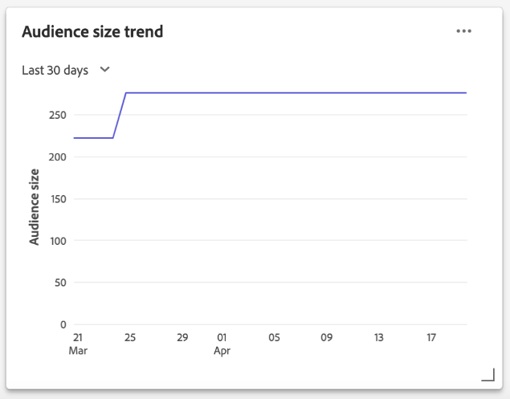

# Kontrollpanel för segment {#segment-dashboard}

Adobe Experience Platform användargränssnitt (UI) är en kontrollpanel där du kan visa viktig information om dina segment, som de tagits under en daglig ögonblicksbild. I den här handboken beskrivs hur du kommer åt och arbetar med segmentkontrollpanelen i användargränssnittet och den innehåller mer information om de visualiseringar som visas på kontrollpanelen.

En översikt över alla funktioner i Adobe Experience Platform Segmentation Service i användargränssnittet för plattformen finns i [gränssnittshandboken för segmenteringstjänsten](../../segmentation/ui/overview.md).

## Instrumentpanelsdata för segment

På segmentkontrollpanelen visas en ögonblicksbild av de attributdata (postdata) som din organisation har i profilarkivet i Experience Platform. Ögonblicksbilden innehåller inga händelsedata (tidsserier).

Attributdata i ögonblicksbilden visar data exakt som de visas vid den specifika tidpunkten när ögonblicksbilden togs. Ögonblicksbilden är alltså inte en uppskattning eller ett urval av data och segmentkontrollpanelen uppdateras inte i realtid.

>[!NOTE]
>
>Ändringar eller uppdateringar som gjorts i data sedan ögonblicksbilden togs kommer inte att visas på kontrollpanelen förrän nästa ögonblicksbild tas.

## Utforska segmentkontrollpanelen

Om du vill navigera till segmentkontrollpanelen i plattformsgränssnittet väljer du **[!UICONTROL Segments]** i den vänstra listen och sedan fliken **[!UICONTROL Overview]** för att visa kontrollpanelen.

### Ändra kontrollpanelen [!UICONTROL Segments]

Du kan ändra utseendet på kontrollpanelen [!UICONTROL Segments] genom att välja **[!UICONTROL Modify dashboard]**. Detta gör att du kan flytta, lägga till och ta bort widgetar från kontrollpanelen samt komma åt [!UICONTROL Widget library] för att utforska tillgängliga widgetar och skapa anpassade widgetar för din organisation.

Mer information finns i [dokumentationen för att ändra kontrollpanelerna](../modify.md) och [widgetbiblioteket](../widget-library.md).

## Markera ett segment

Kontrollpanelen markerar automatiskt ett segment som ska visas, men du kan ändra segmentet med hjälp av den nedrullningsbara menyn eller segmentväljaren.

Om du vill välja ett annat segment markerar du listrutan bredvid segmentnamnet eller använder segmentväljaren för att öppna segmentmarkeringsdialogrutan.

## Widgetar och mätvärden

Kontrollpanelen för segment består av widgetar, som är skrivskyddade mått som ger viktig information om det valda segmentet.

Datum och tid för den senaste uppdateringen av en widget visar när den senaste ögonblicksbilden av data togs. Datum och tid för ögonblicksbilden anges i UTC. den inte finns i den enskilda användarens eller IMS-organisationens tidszon.

## Tillgängliga widgetar

Experience Platform tillhandahåller flera widgetar som du kan använda för att visualisera olika mätvärden för ditt segment. Välj namnet på en widget nedan om du vill veta mer:

* [[!UICONTROL Audience size]](#audience-size)
* [[!UICONTROL Audience size trend]](#audience-size-trend)
* [[!UICONTROL Identity overlap]](#identity-overlap)
* [[!UICONTROL Profiles by identity]](#profiles-by-identity)

### [!UICONTROL Audience size] {#audience-size}

Widgeten **[!UICONTROL Audience size]** visar det totala antalet sammanslagna profiler i det valda segmentet när ögonblicksbilden togs. Det här numret är resultatet av att du har tillämpat segmentsammanfogningsprincipen på dina profildata för att sammanfoga profilfragment till en enda profil för varje enskild person i segmentet.

Mer information om fragment och sammanfogade profiler får du om du börjar med att läsa [Kundprofilöversikt i realtid](../../profile/home.md).

### [!UICONTROL Audience size trend] {#audience-size-trend}

Widgeten **[!UICONTROL Audience size trend]** ger information om det totala antalet profiler i segmentet som tagits under den dagliga ögonblicksbilden under de senaste 30 dagarna, 90 dagar eller 12 månaderna. Den här widgeten visar hur segmentstorleken kan ha ändrats över tiden när nya profiler kvalificerar sig för eller avslutar segmentet.

Mer information om segmentutvärdering och hur profiler kvalificerar sig och avslutar segment finns i [dokumentationen för segmenteringstjänsten](../../segmentation/home.md).

### [!UICONTROL Identity overlap] {#identity-overlap}

Widgeten **[!UICONTROL Identity overlap]** visar ett Venndiagram, eller ett uppsättningsdiagram, som visar överlappningen av profiler i segmentet som innehåller flera identiteter.

När du har använt listrutemenyerna i widgeten för att markera de identiteter som du vill jämföra, visas cirklar med den relativa storleken för varje identitet. Antalet profiler som innehåller båda namnutrymmena representeras av storleken på överlappningen mellan cirklarna.

Om en kund interagerar med ert varumärke i mer än en kanal kopplas flera identiteter till den enskilda kunden, och därför är det troligt att organisationen har flera profiler som innehåller fragment från mer än en identitet.

Mer information om identiteter finns i [Adobe Experience Platform Identity Service-dokumentationen](../../identity-service/home.md).

### [!UICONTROL Profiles by identity] {#profiles-by-identity}

Widgeten **[!UICONTROL Profiles by identity]** visar uppdelningen av identiteter för alla sammanfogade profiler i det valda segmentet. Det totala antalet profiler efter identitet kan vara högre än det totala antalet profiler i segmentet eftersom en profil kan ha flera associerade identiteter. Med andra ord kan de värden som visas för varje identitet tillsammans bli större än den totala målgruppsstorleken i segmentet, eftersom om en kund interagerar med varumärket i mer än en kanal kan flera identiteter kopplas till den enskilda kunden.

Mer information om identiteter finns i [Adobe Experience Platform Identity Service-dokumentationen](../../identity-service/home.md).

## Nästa steg

Genom att följa det här dokumentet bör du nu kunna hitta segmentkontrollpanelen och välja ett segment att visa. Du bör också förstå mätvärdena som visas i de tillgängliga widgetarna. Mer information om hur du arbetar med segment i användargränssnittet för Experience Platform finns i [Användargränssnittshandboken för segmenteringstjänster](../../segmentation/ui/overview.md).
